# 020：REST API与HTTP请求（上）🌐

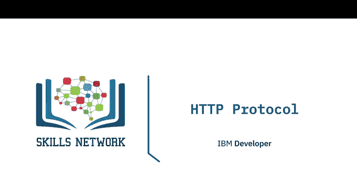

在本节课中，我们将要学习HTTP协议的基础知识，包括统一资源定位符（URL）、HTTP请求与响应的结构，以及常见的HTTP方法和状态码。理解这些概念是使用REST API进行网络通信的关键。

## 概述：HTTP协议与网络通信

HTTP协议可以被视为通过网络传输信息的通用协议。它支持多种类型的REST API。回忆上一节内容，REST API的工作原理是发送请求，而该请求通过HTTP消息进行通信。HTTP消息通常包含一个JSON文件。

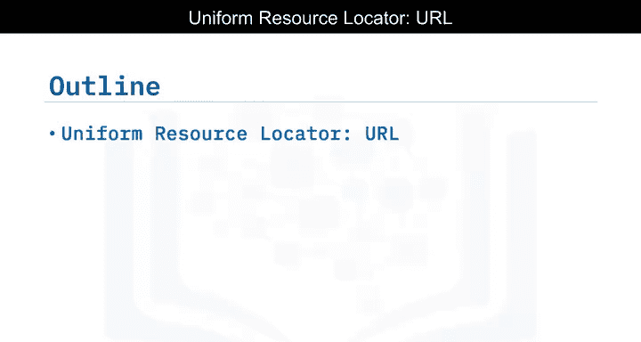

当您（客户端）访问一个网页时，您的浏览器会向托管该页面的服务器发送一个HTTP请求。服务器默认尝试查找索引文件（如index.html）来定位所需资源。如果请求成功，服务器将在HTTP响应中将对象发送给客户端，其中包含资源类型、长度等信息。

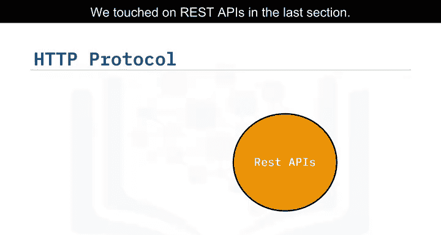

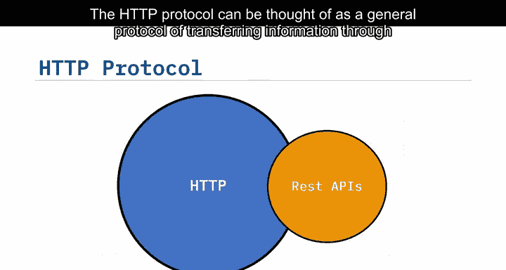

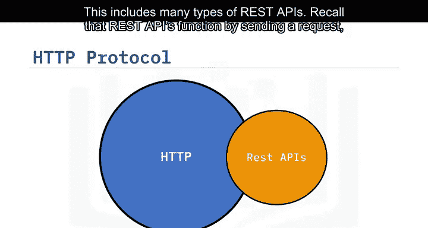

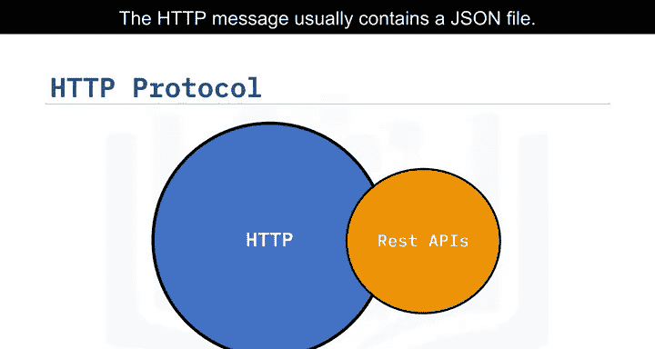

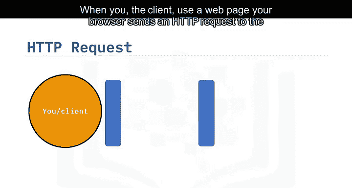

## URL的组成部分

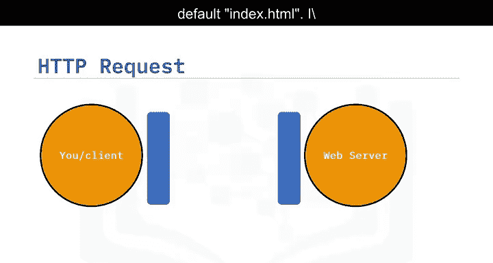

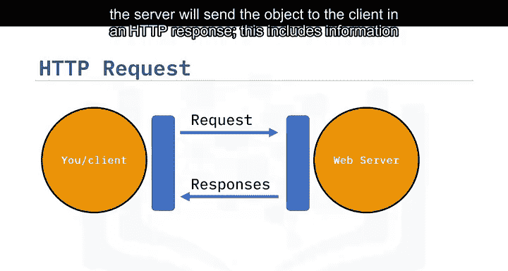

统一资源定位符（URL）是在网络上查找资源最常用的方式。我们可以将URL分解为三个部分。

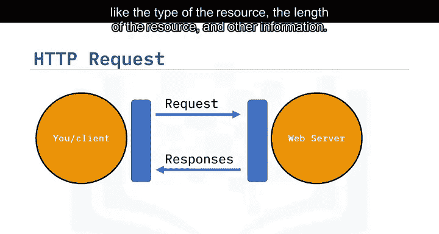

以下是URL的三个核心组成部分：

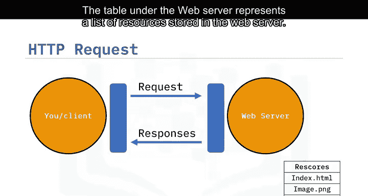

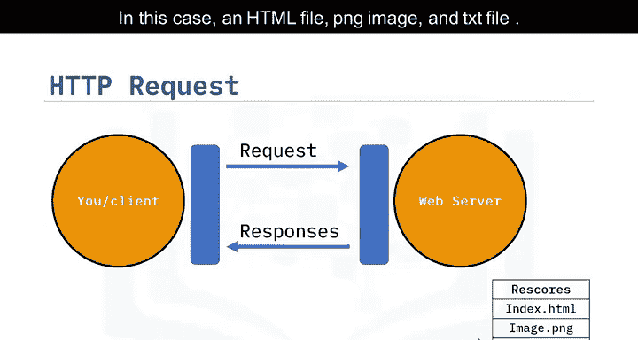

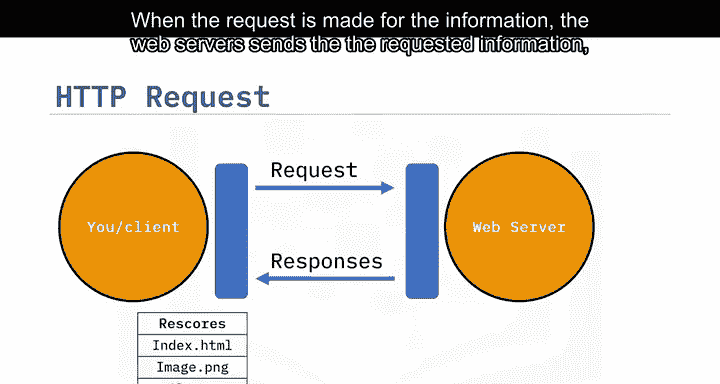

1.  **协议**： 这是通信协议。在本实验中，它始终是 `http://`。
2.  **网络地址或基础URL**： 用于定位资源的位置。例如 `www.ibm.com` 或 `www.gitlab.com`。
3.  **路径**： 资源在Web服务器上的具体位置。例如 `/images/ibm-logo.png`。

## HTTP请求与响应过程

让我们回顾一下请求和响应的过程。以下是一个使用GET请求方法的请求消息示例。HTTP还有其他方法可用。

在起始行中，我们有GET方法，这是一种HTTP方法。在这个例子中，它请求文件 `index.html`。请求头用于传递HTTP请求的附加信息。对于GET方法，请求头通常是空的。某些请求包含一个请求体，我们稍后会看到一个示例。

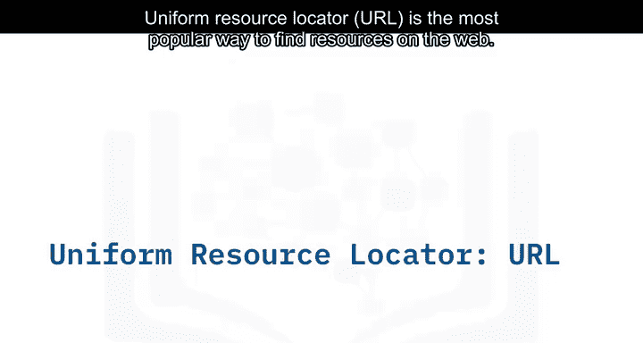

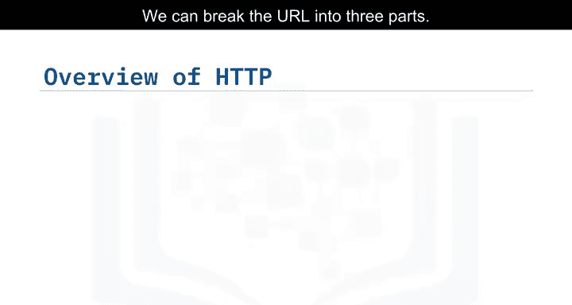

下表展示了响应消息的结构。响应起始行包含版本号，后跟一个描述性短语。在这个例子中，是 `HTTP/1.0`，状态码 `200`（表示成功），以及描述短语 `OK`。响应头包含额外信息。最后，响应体包含请求的文件，在这个例子中是一个HTML文档。

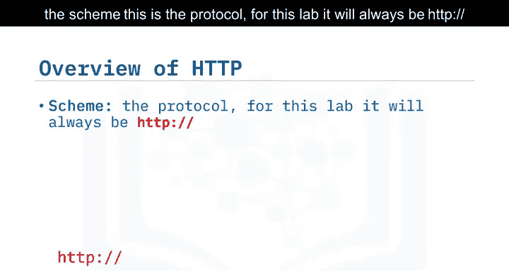

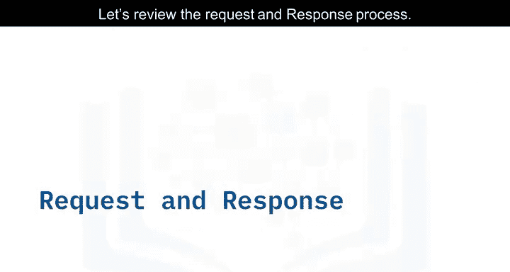

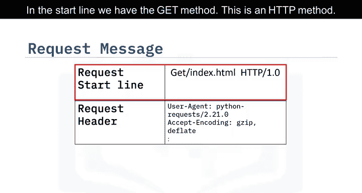

## HTTP状态码

让我们看看其他的状态码。

以下表格展示了一些状态码示例。状态码的前缀表示其类别。

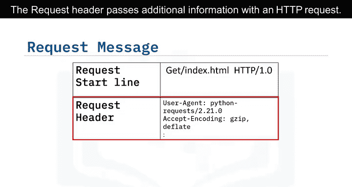

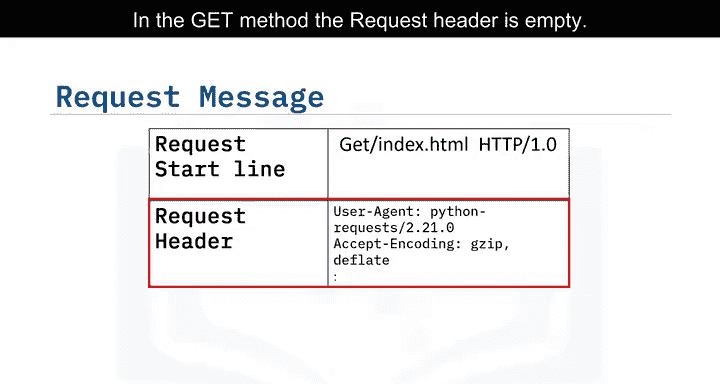

以下是常见的HTTP状态码类别和示例：

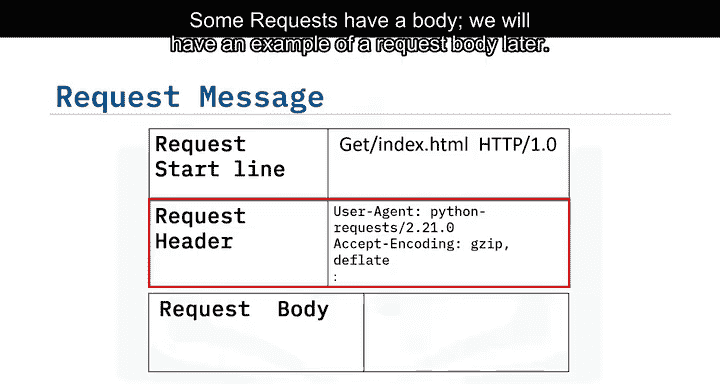

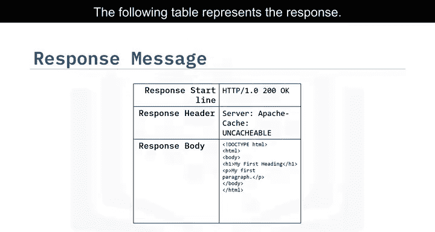

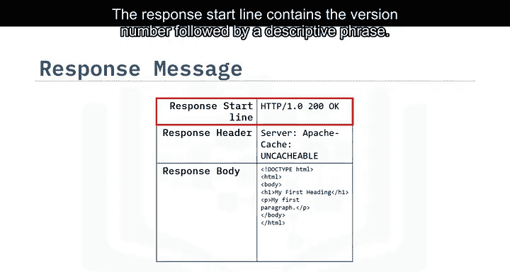

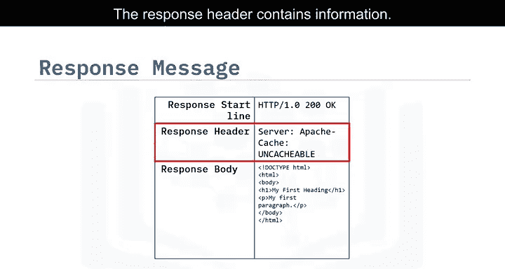

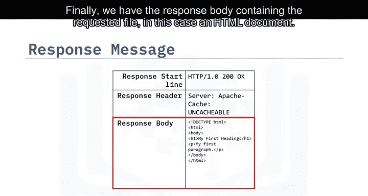

*   **1xx（信息响应）**： 例如 `100`，表示到目前为止一切正常。
*   **2xx（成功响应）**： 例如 `200`，表示请求已成功。
*   **4xx（客户端错误）**： 表示请求有问题。例如 `401` 表示请求未经授权。
*   **5xx（服务器错误）**： 例如 `501` 表示服务器不支持请求的功能。

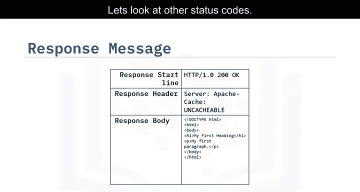

## HTTP方法

当发起一个HTTP请求时，会发送一个HTTP方法，它告诉服务器要执行什么操作。

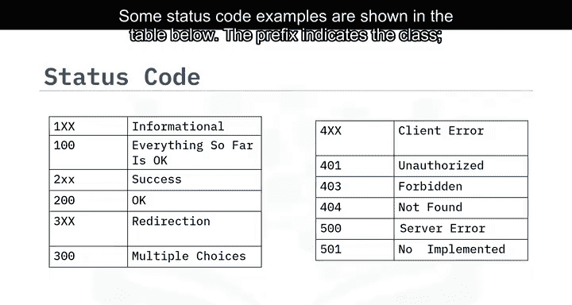

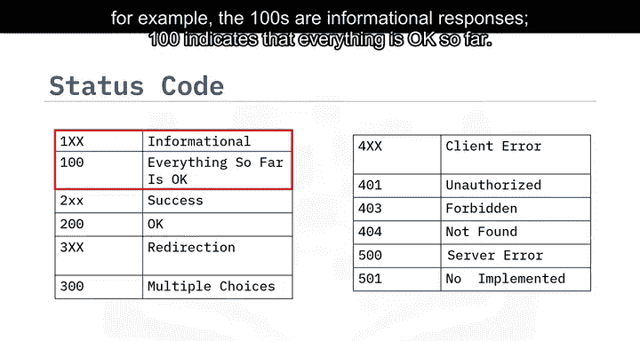

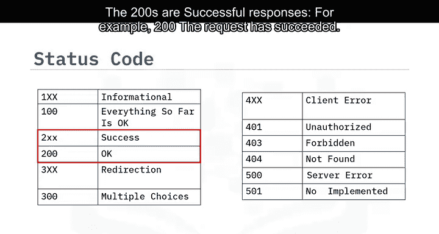

以下是几种常见的HTTP方法：

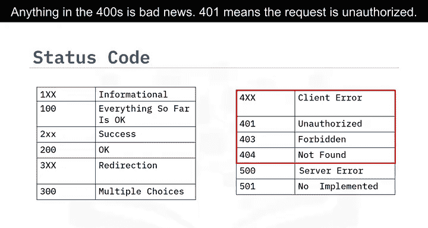

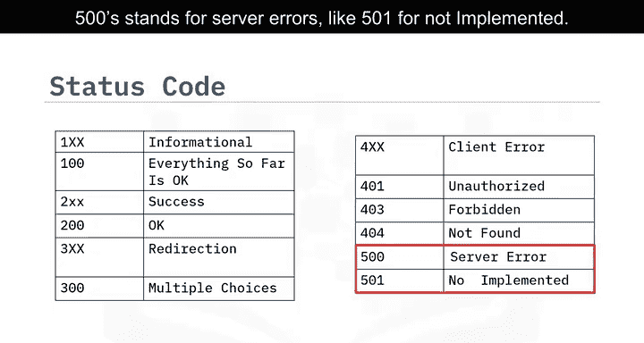

*   **GET**： 从服务器检索数据。
*   **POST**： 向服务器发送数据。
*   **PUT**： 更新服务器上的数据。
*   **DELETE**： 删除服务器上的数据。

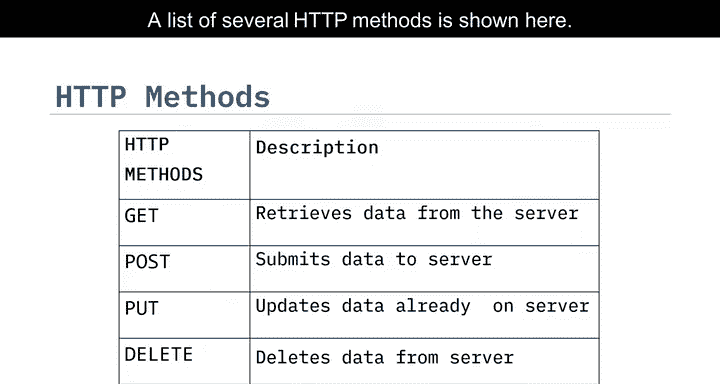

## 总结

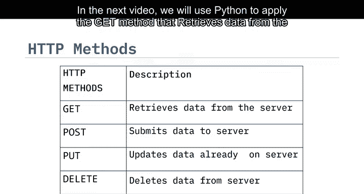

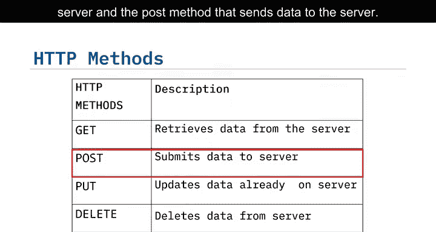

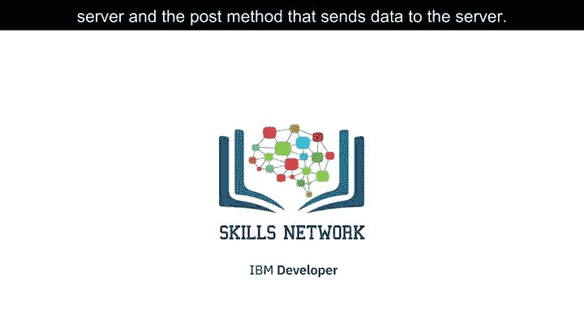

本节课中，我们一起学习了HTTP协议的基础。我们了解了URL的结构、HTTP请求与响应的组成部分，以及状态码和HTTP方法的含义。在下一个视频中，我们将使用Python来实践GET方法（从服务器检索数据）和POST方法（向服务器发送数据）。