# 002：网络数据采集 🌐


在本节课中，我们将要学习**网络数据采集**。这是一种自动从网站提取信息的技术，能够帮助我们在几分钟内完成原本需要数小时的手动数据收集工作。

## 概述 📋

网络数据采集是一个用于自动从网站提取信息的过程。想象一下，如果你需要分析一个体育队数百名球员的数据以找出最佳球员，手动从不同网站复制粘贴信息到电子表格中会非常耗时且容易让人放弃。网络数据采集可以解决这个问题。

## 什么是网络数据采集？ 🤔

网络数据采集是一种利用代码自动从网页中提取所需数据的技术。它通常借助Python中的 `requests` 和 `Beautiful Soup` 等模块来实现。

## 开始之前：所需工具 🛠️

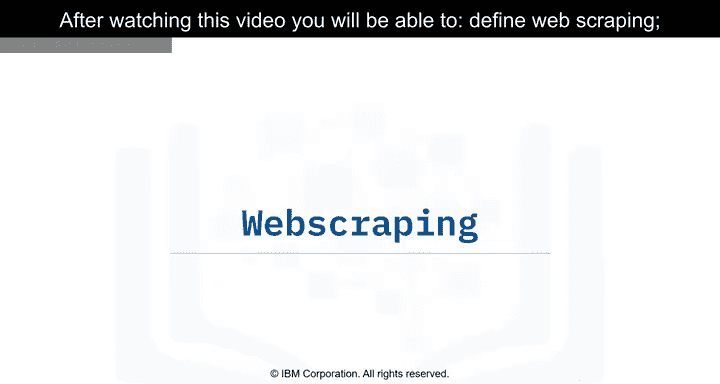

要开始网络数据采集，我们只需要一些Python代码以及两个模块的帮助：`requests` 和 `Beautiful Soup`。

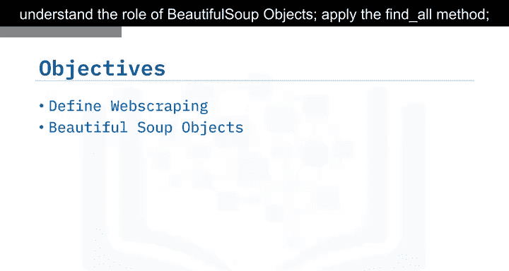

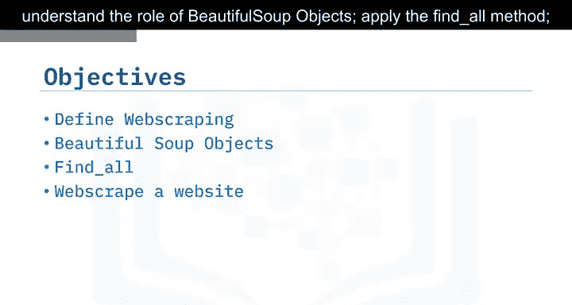

假设你需要从一个网页中找出国家篮球联赛球员的姓名和薪水。

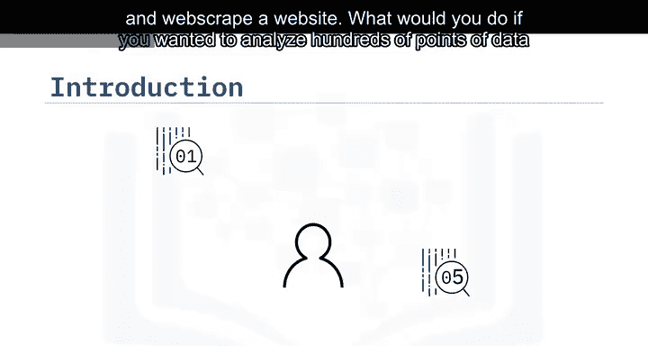

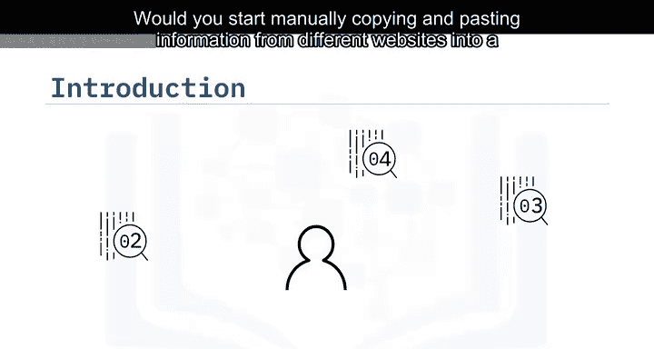


## Beautiful Soup 对象解析 🌳

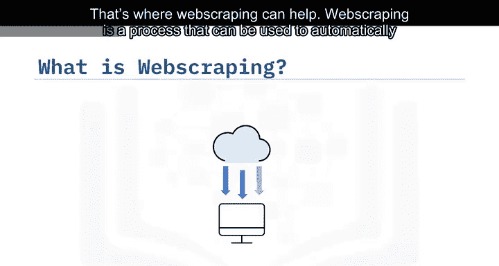

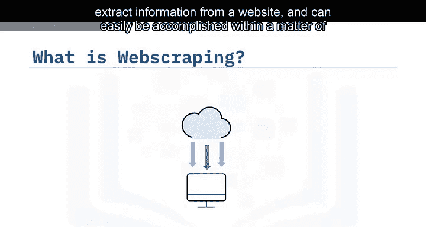

首先，我们导入Beautiful Soup。我们可以将网页HTML作为字符串存储在变量 `html` 中。为了解析这个文档，我们将其传递给Beautiful Soup的构造函数。

```python
from bs4 import BeautifulSoup
soup = BeautifulSoup(html, 'html.parser')
```

这样我们就得到了一个Beautiful Soup对象 `soup`，它将文档表示为一个嵌套的数据结构。这个对象将HTML表示为一组树状对象，并提供了用于解析HTML的方法。

### 理解Tag对象

使用我们创建的Beautiful Soup对象 `soup`，`Tag` 对象对应于原始文档中的一个HTML标签。例如，`title` 标签。

考虑 `h3` 标签。如果文档中有多个相同名称的标签，默认会选择第一个具有该标签的元素。例如，第一个 `h3` 标签可能包含“勒布朗·詹姆斯”这个名字，并且这个名字被包裹在加粗属性 `<b>` 中。

为了提取它，我们需要使用树状表示法来导航。

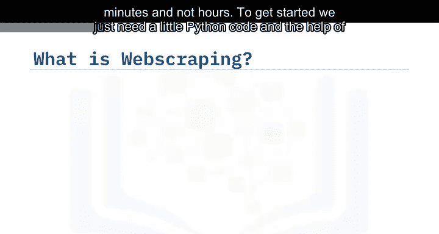

## 在HTML树中导航 🧭

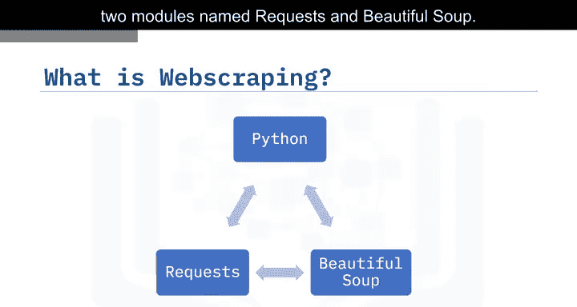

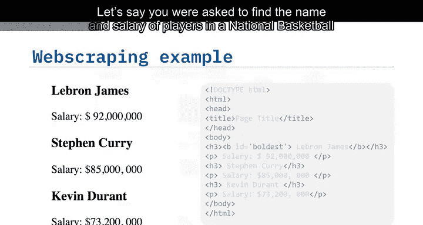

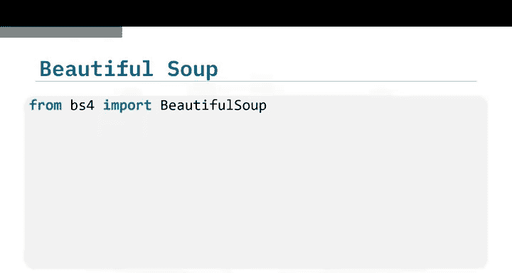

上一节我们介绍了Tag对象，本节中我们来看看如何在HTML的树状结构中移动。

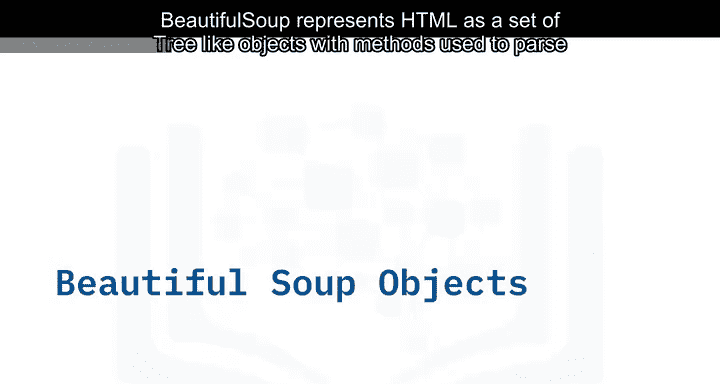

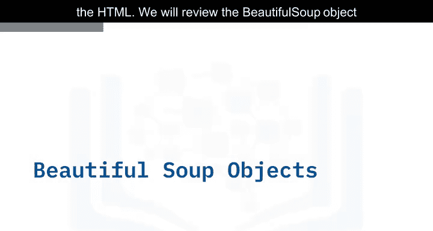

### 访问子节点

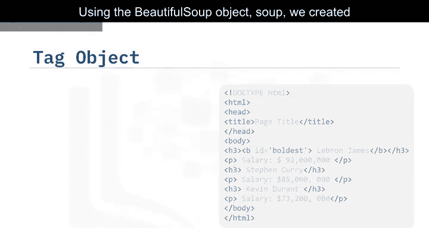

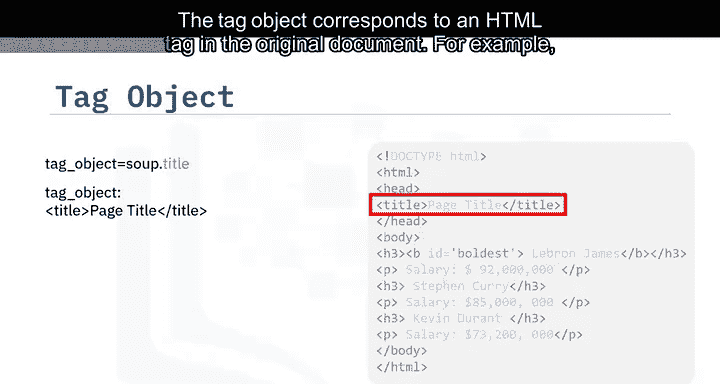

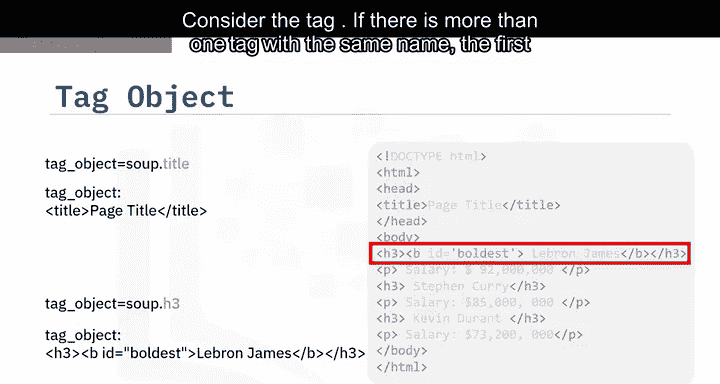

变量 `tag_object` 位于树的某个位置。我们可以像下面这样访问该标签的子节点，或者向下导航到分支：

```python
tag_child = tag_object.b
```

### 访问父节点

你可以使用 `.parent` 属性向上导航树。变量 `tag_child` 位于这里，我们可以访问它的父节点，这就是原始的 `tag_object`。

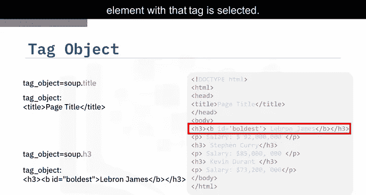

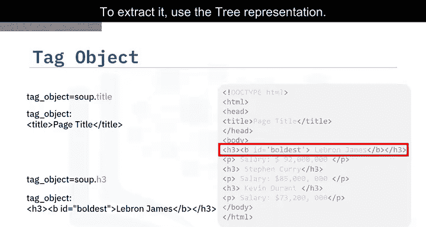

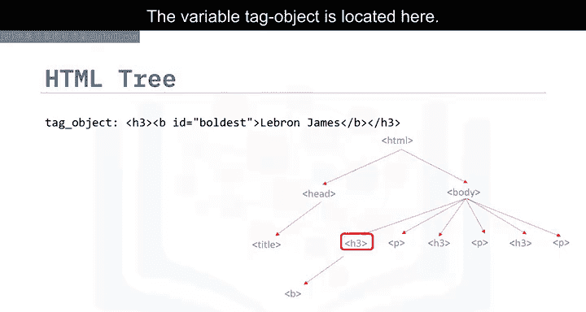

```python
parent_tag = tag_child.parent
```

### 访问兄弟节点

我们还可以找到Tag对象的兄弟节点。我们只需使用 `.next_sibling` 属性。

我们可以找到 `sibling1` 的兄弟节点。我们只需使用 `.next_sibling` 属性。

考虑 `tag_child` 对象。你可以像字典中的键值对一样访问其属性名称和值：

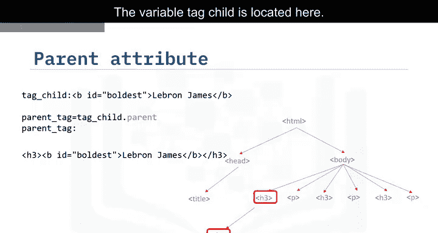

```python
tag_child['some_attribute']
```

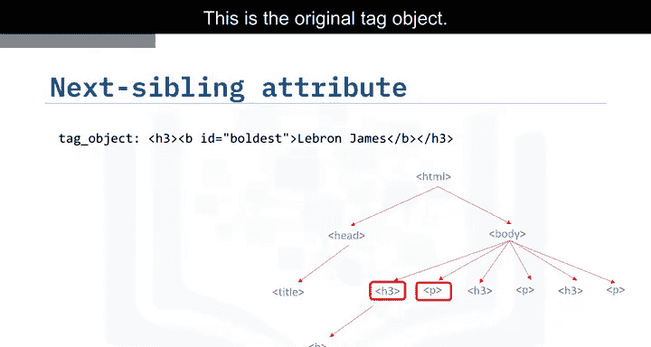

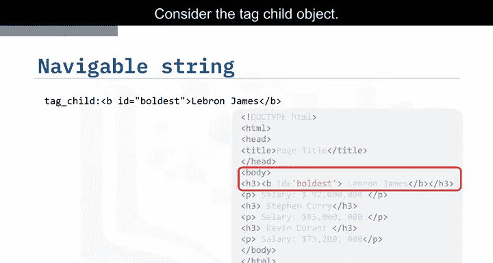

你可以将内容作为可导航字符串返回。这类似于支持Beautiful Soup功能的Python字符串。

## 使用 `find_all` 方法进行过滤 🔍

现在，让我们回顾一下 `find_all` 方法。这是一个过滤器。

你可以使用过滤器基于标签的名称、其属性、字符串的文本或这些条件的组合来进行过滤。

考虑一个披萨店的列表。像之前一样，创建一个Beautiful Soup对象，但这次将其命名为 `table`。

`find_all` 方法会遍历一个标签的所有后代，并检索所有符合你过滤条件的后代。将其应用于标签为 `tr` 的表格：

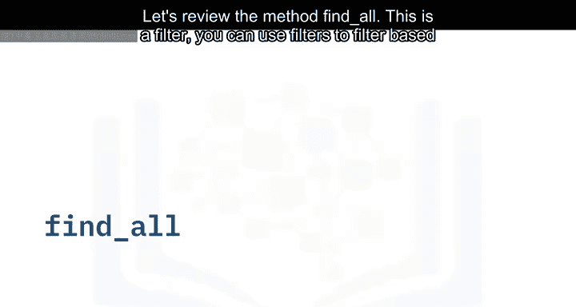


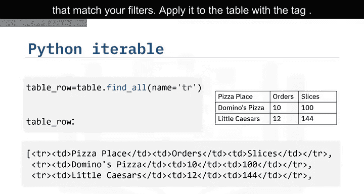

```python
rows = table.find_all('tr')
```

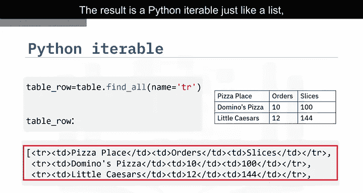

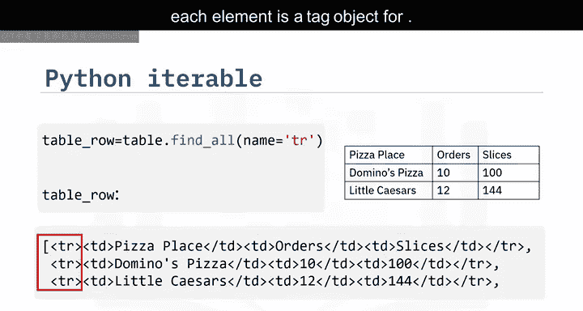

结果是一个类似列表的Python可迭代对象。每个元素都是一个 `tr` 的Tag对象，对应列表中的每一行，包括表头。

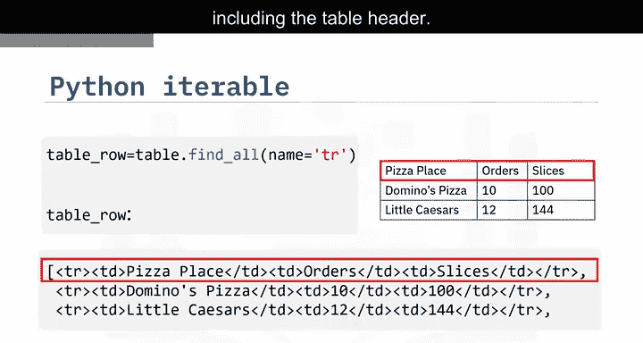

每个元素都是一个Tag对象。以第一行为例，我们可以提取第一个表格单元格：

```python
first_cell = rows[0].td
```

我们也可以遍历每个表格单元格。首先，我们通过变量 `row` 遍历列表 `rows`。每个元素对应表格中的一行。

我们可以应用 `find_all` 方法来查找所有的表格单元格。然后，我们可以为每一行遍历变量 `cells`。

在每次迭代中，变量 `cell` 对应特定行中表格的一个元素，我们继续遍历每个元素，并为每一行重复这个过程。

## 应用Beautiful Soup采集网页 🌍

为了采集一个网页，我们还需要 `requests` 库。

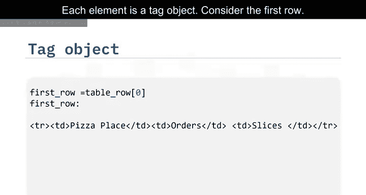

第一步是导入所需的模块。使用 `requests` 库的 `get` 方法来下载网页，输入是URL。使用 `.text` 属性来获取文本。

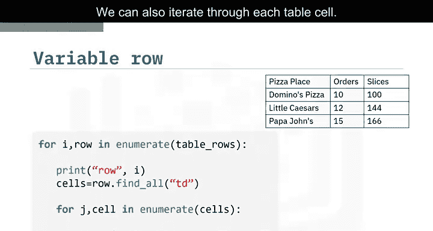

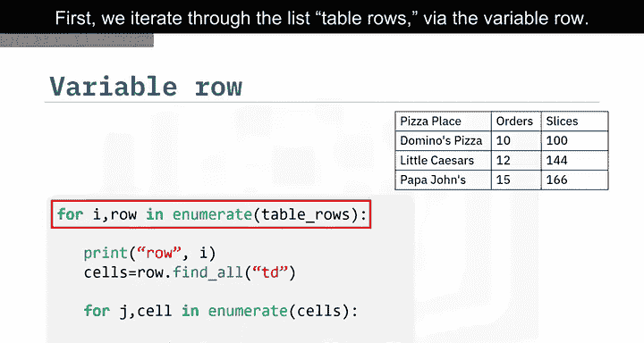

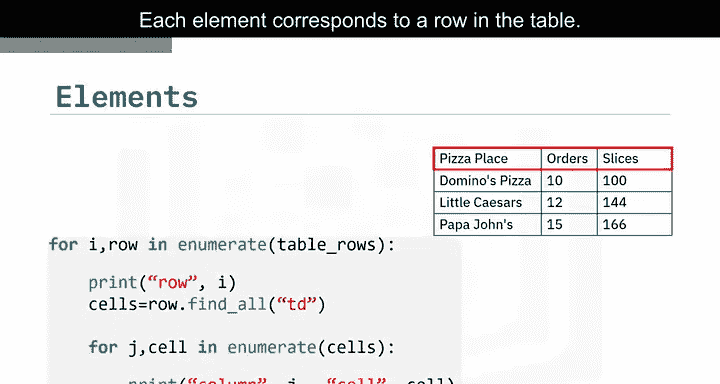

以下是具体步骤：

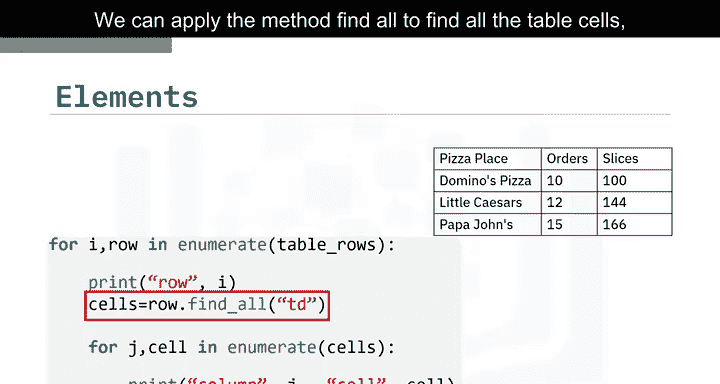

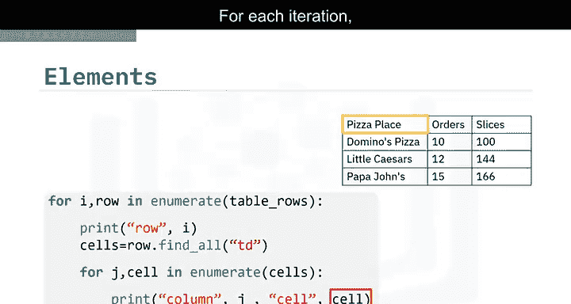

1.  导入必要的模块。
2.  使用 `requests.get()` 下载网页。
3.  将响应文本赋值给变量 `page`。
4.  从变量 `page` 创建一个Beautiful Soup对象 `soup`。

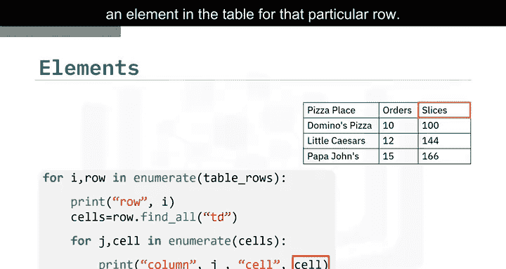

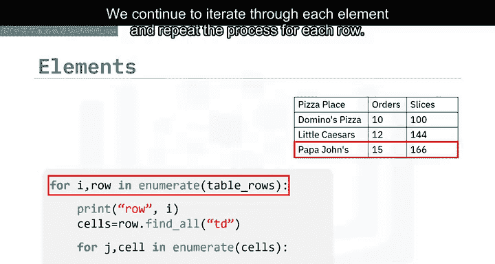

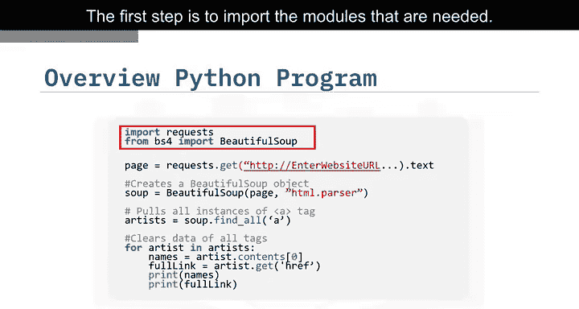

```python
import requests
from bs4 import BeautifulSoup

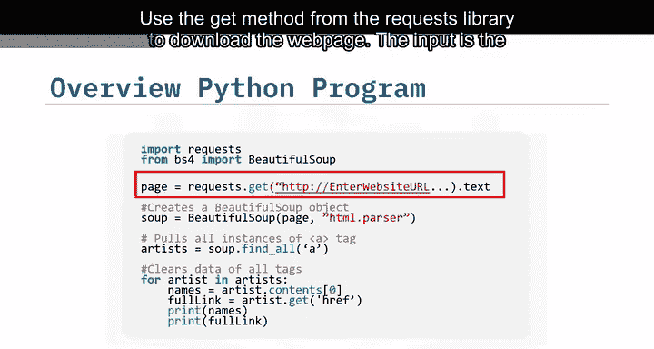


url = ‘https://example.com‘
response = requests.get(url)
page = response.text
soup = BeautifulSoup(page, ‘html.parser‘)
```

这将允许你解析HTML页面，现在你就可以开始采集页面了。请查看实验部分以了解更多。

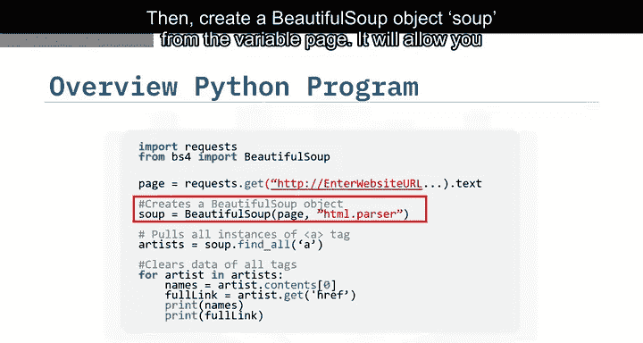

## 总结 📝

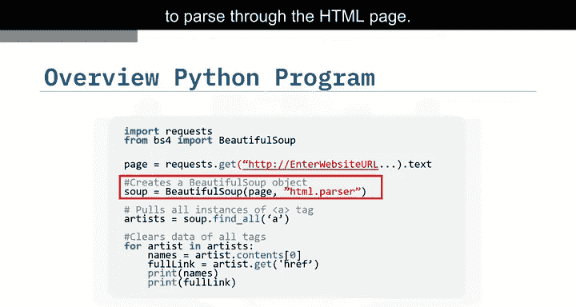

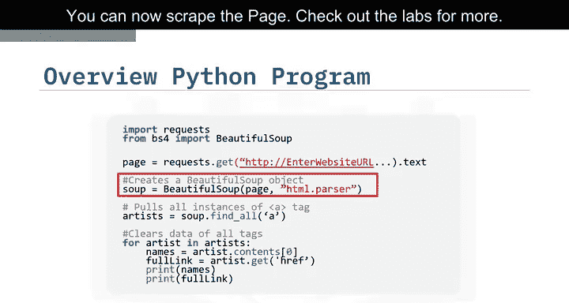

本节课中我们一起学习了网络数据采集。我们定义了网络数据采集，了解了Beautiful Soup对象的作用，学习了如何应用 `find_all` 方法，并掌握了使用Python采集一个网站的基本流程。通过结合 `requests` 库获取网页内容，再利用 `Beautiful Soup` 解析和提取HTML结构中的数据，我们可以高效地自动化数据收集任务。