# 001：SQL数据科学入门 🚀

在本节课中，我们将要学习SQL在数据科学领域的重要性、基础概念以及本课程的整体结构。SQL是数据科学家必备的核心技能之一，掌握它将帮助你更好地与数据库交互，从而高效地分析和处理数据。

---

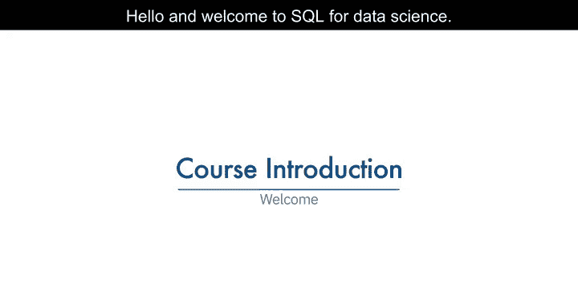

## 数据科学家的市场需求 💼

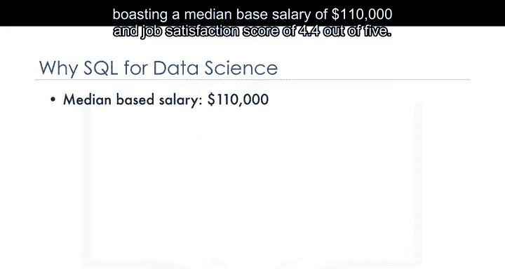

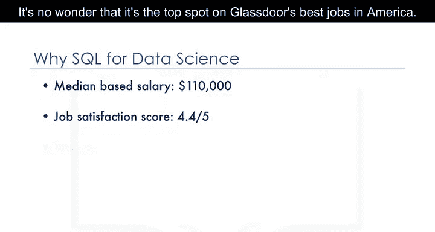

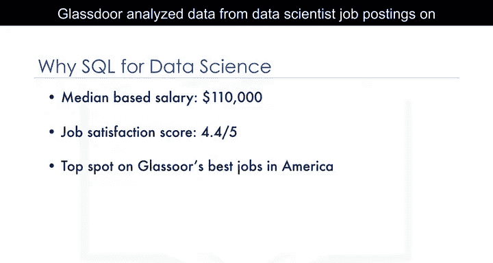

数据科学家的需求很高。数据科学家的中位年薪为11万美元，工作满意度评分为4.4分（满分5分）。数据科学家在Glassdoor的美国最佳工作中排名第一。

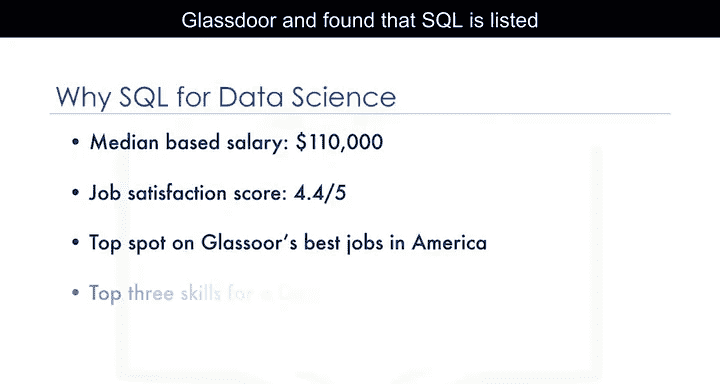

Glassdoor分析了其网站上数据科学家职位发布的数据，发现SQL被列为数据科学家最重要的三项技能之一。

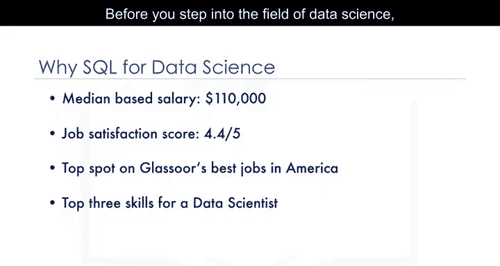

---

## 掌握数据科学基础技能的重要性 🛠️

在进入数据科学领域之前，掌握该领域的基础知识至关重要。这将帮助你在竞争中脱颖而出。

SQL是你需要掌握的基础技能之一。SQL是一种强大的语言，用于与数据库进行通信。任何处理数据的应用程序都需要将数据存储在某个地方，无论是大数据、政府或小型初创公司的简单表格，还是跨多个服务器的大型数据库，甚至是运行自己小型数据库的手机。

---

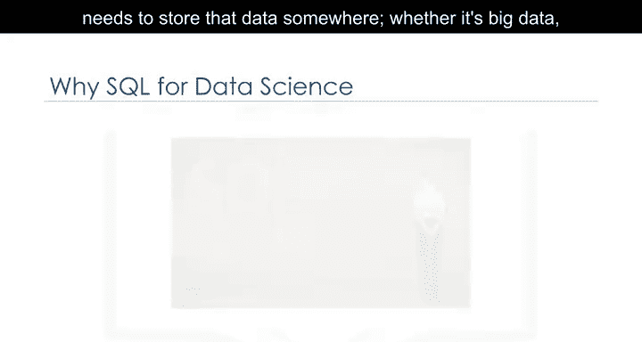

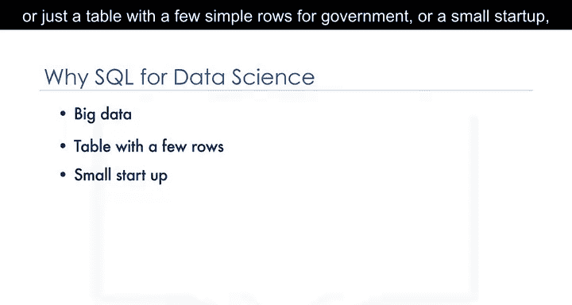

## 学习SQL对数据科学家的优势 📈

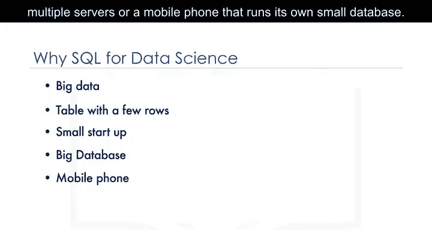

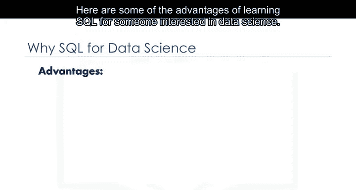

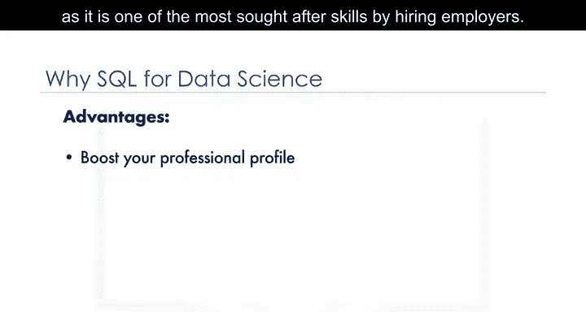

以下是学习SQL对有志于数据科学的人士的一些优势。

SQL将提升你作为数据科学家的专业形象，因为它是雇主最需要的技能之一。

学习SQL将使你更好地理解关系型数据库。获取所有这些信息需要能够与存储数据的数据库进行通信。

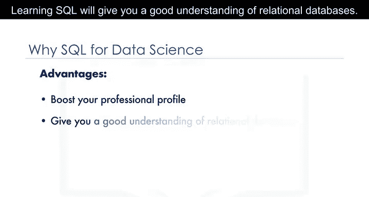

即使你使用生成SQL查询的报告工具，编写自己的SQL语句也可能很有用，这样你就不必等待其他团队成员为你创建SQL语句。

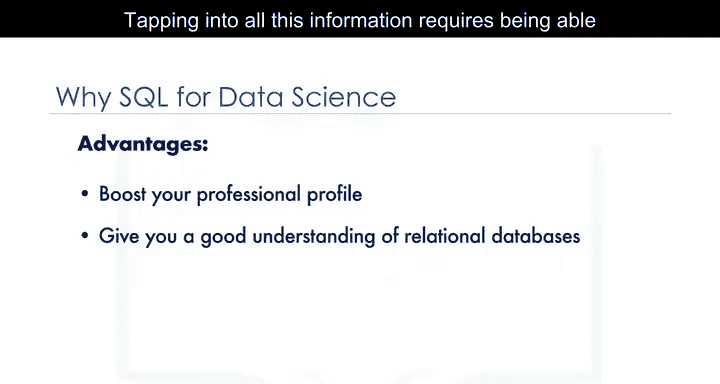

---

## 本课程内容概述 📚

在本课程中，你将学习SQL语言和关系型数据库的基础知识。课程包括有趣的测验和动手实验作业，你可以在其中获得使用数据库的经验。

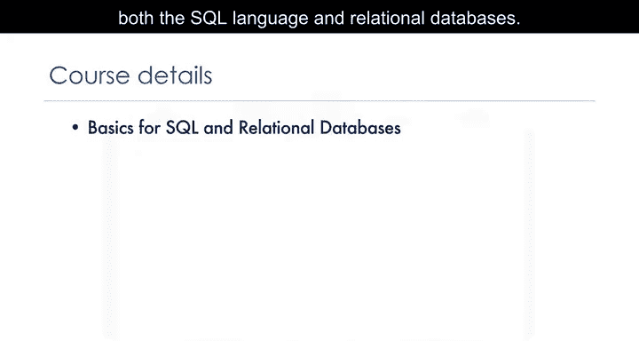

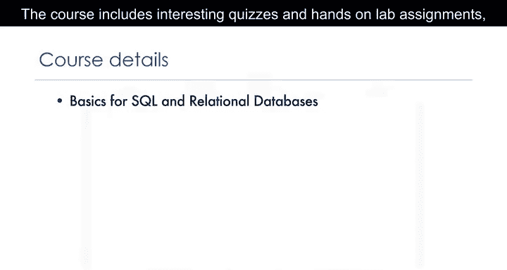

在前几个模块中，你将直接与数据库合作，并发展SQL的实际应用知识。

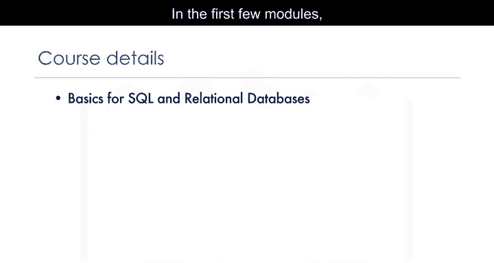

然后，你将像数据科学家通常所做的那样，连接到数据库并运行SQL查询。你将使用Python和Jupyter笔记本连接到关系型数据库，以访问和分析数据。

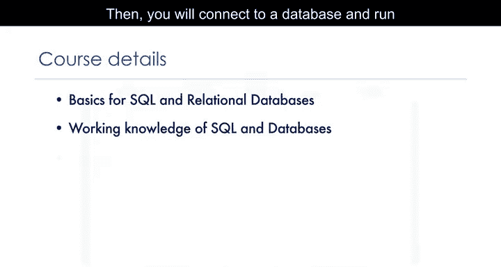

课程末尾还包括一个作业，你将有机会应用所学的概念。

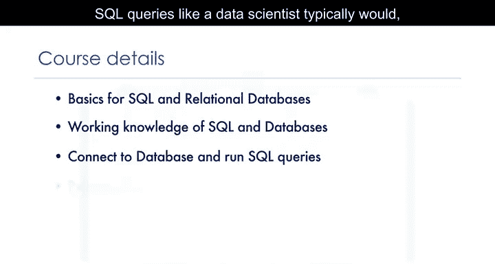

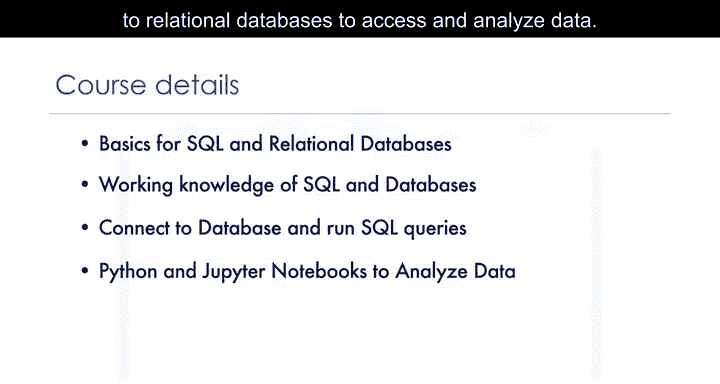

---

## 总结 🎯

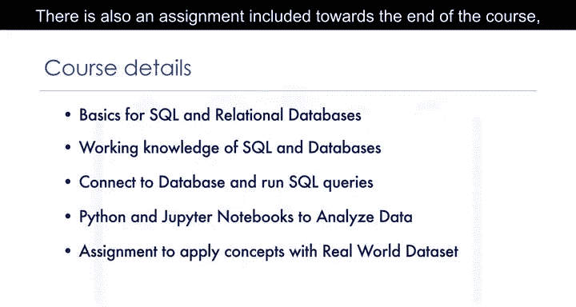

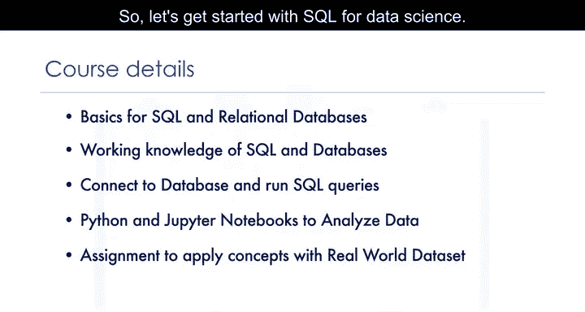

本节课中我们一起学习了SQL在数据科学中的关键作用、学习SQL的优势以及本课程的整体安排。SQL是与数据库交互的核心工具，掌握它将为你的数据科学职业生涯奠定坚实基础。接下来，我们将开始深入学习SQL的具体语法和操作。