# 002：数据库系统导论 🗄️

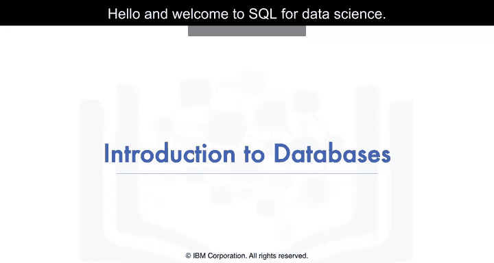

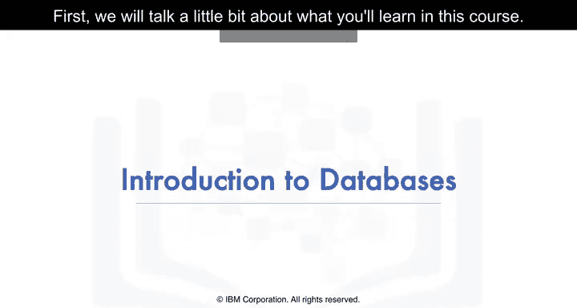

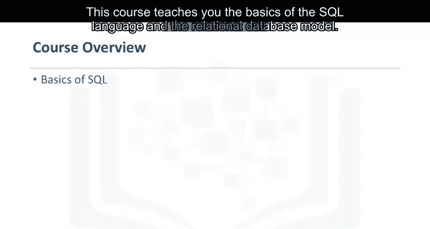

在本节课中，我们将学习SQL和关系型数据库的基础概念。我们将了解什么是数据、数据库、关系型数据库以及SQL语言的基本作用。课程结束时，你将能够描述这些核心概念，并列举出五个基本的SQL命令。

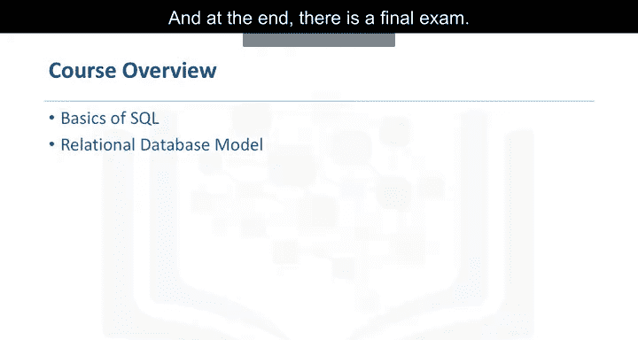

## 什么是SQL？🔍

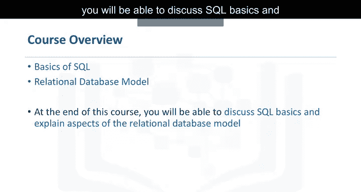

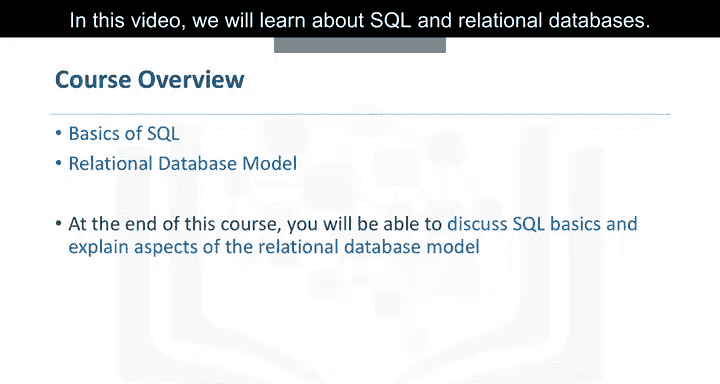

SQL是一种用于关系型数据库的语言，用于查询或从数据库中获取数据。SQL是其原名“结构化查询语言”的缩写。

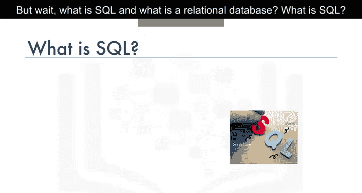

**代码示例：** `SELECT * FROM table_name;`

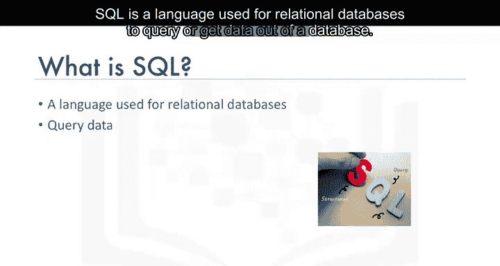

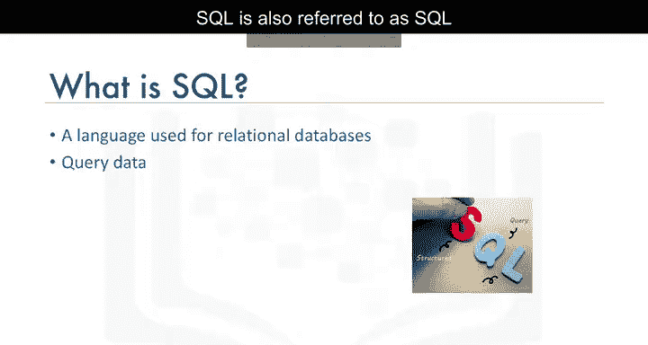

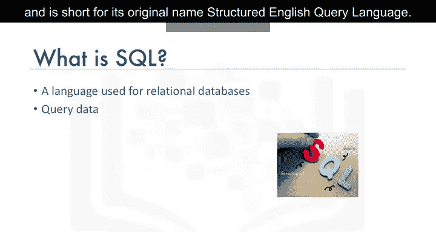

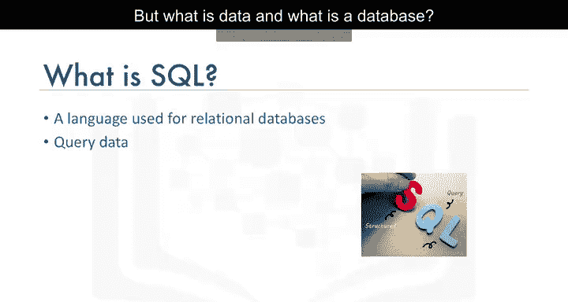

## 什么是数据？📊

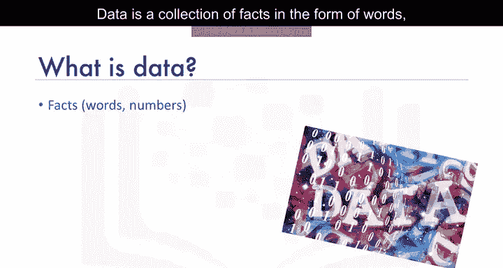

数据是以文字、数字甚至图片形式存在的事实集合。数据是任何企业最关键的资产之一，几乎无处不在。例如，你的银行存储你的姓名、地址、电话号码和账号等数据。

## 什么是数据库？💾

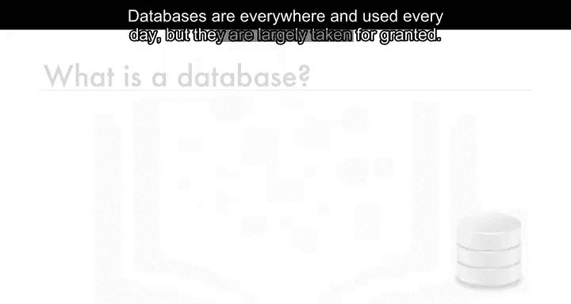

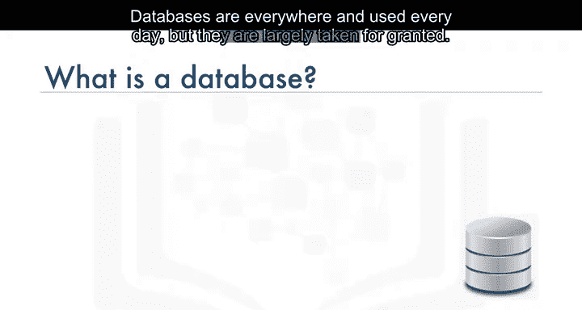

数据库是数据的存储库。它是一个存储数据的程序。数据库还提供了添加、修改和查询数据的功能。根据不同的需求，存在不同类型的数据库，数据可以以各种形式存储。

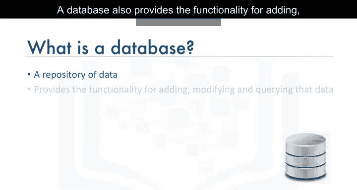

## 什么是关系型数据库？🔗

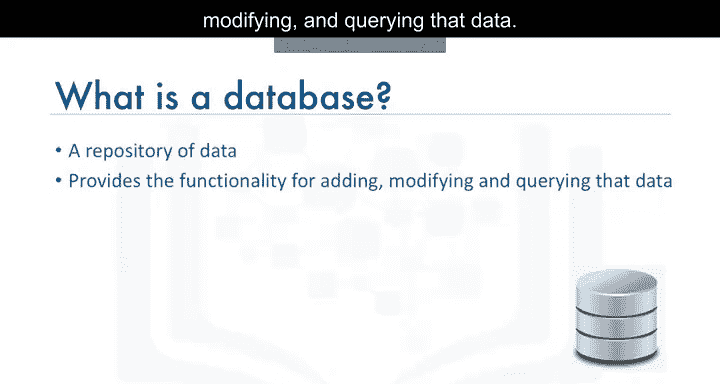

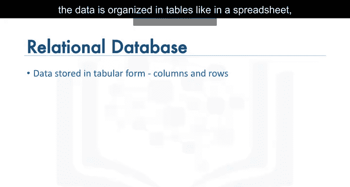

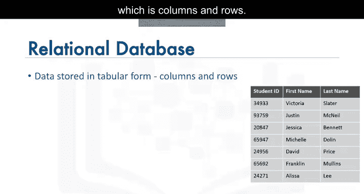

当数据以表格形式存储时，数据被组织成行和列，就像电子表格一样，这就是关系型数据库。在关系型数据库中，你可以在表之间建立关系。

**公式表示：** `表 = 行（记录） + 列（属性）`

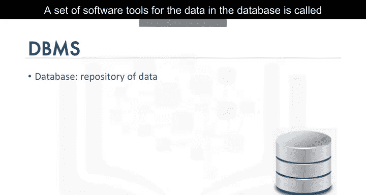

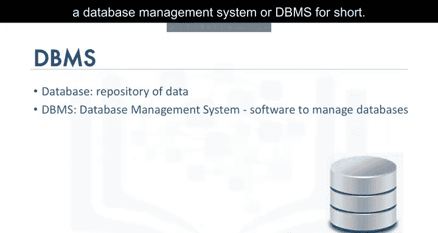

## 数据库管理系统（DBMS）🛠️

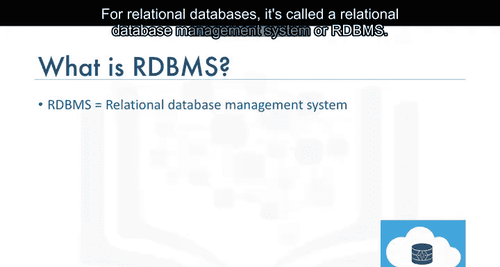

用于管理数据库中数据的一组软件工具称为数据库管理系统。对于关系型数据库，它被称为关系型数据库管理系统。RDBMS控制着数据的访问、组织和存储，是许多行业应用的支柱。

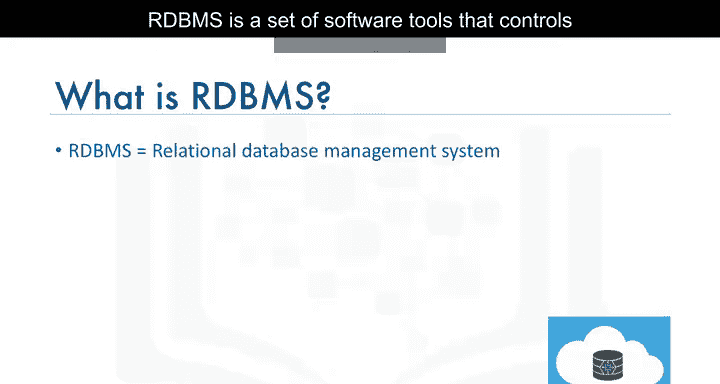

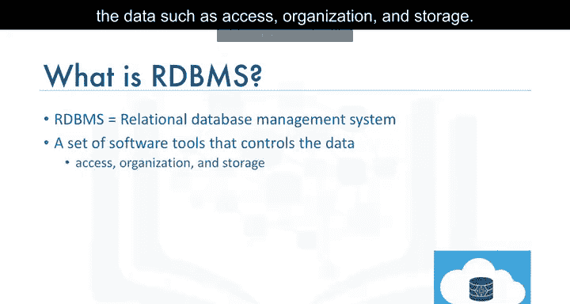

以下是常见的关系型数据库管理系统示例：
*   MySQL
*   Oracle Database
*   DB2 Warehouse
*   DB2 on Cloud

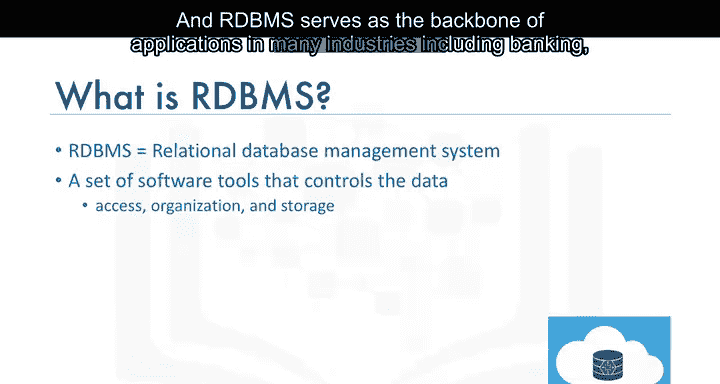

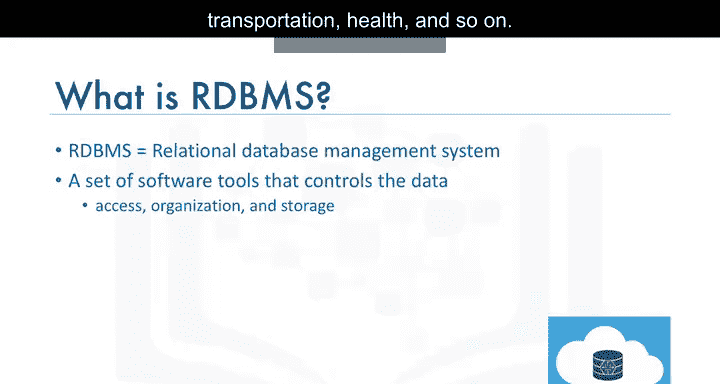

## 五个基本SQL命令 ⚙️

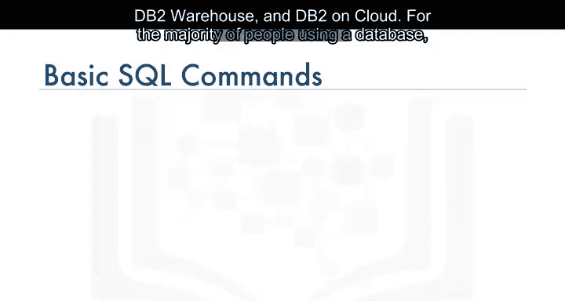

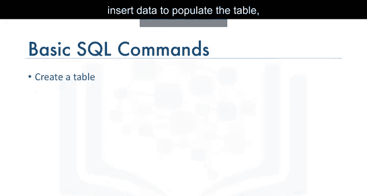

对于大多数使用数据库的人来说，有五个简单的命令构成了SQL操作的基础。

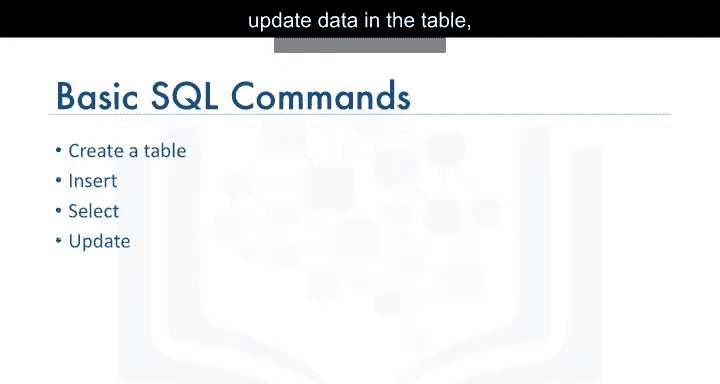

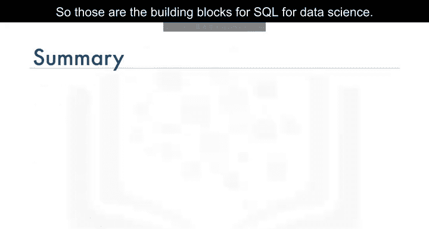

以下是五个核心的SQL命令：
1.  **CREATE** - 用于创建新表。
2.  **INSERT** - 用于向表中插入新数据。
3.  **SELECT** - 用于从表中查询数据。
4.  **UPDATE** - 用于更新表中已有的数据。
5.  **DELETE** - 用于从表中删除数据。

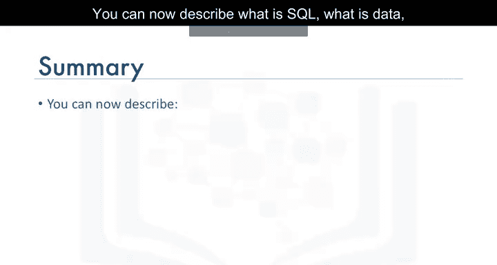

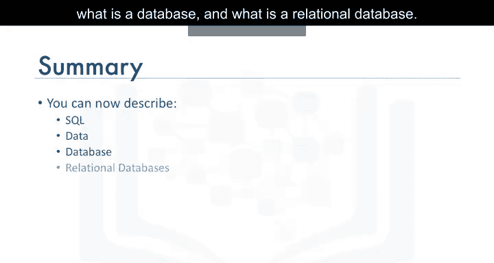

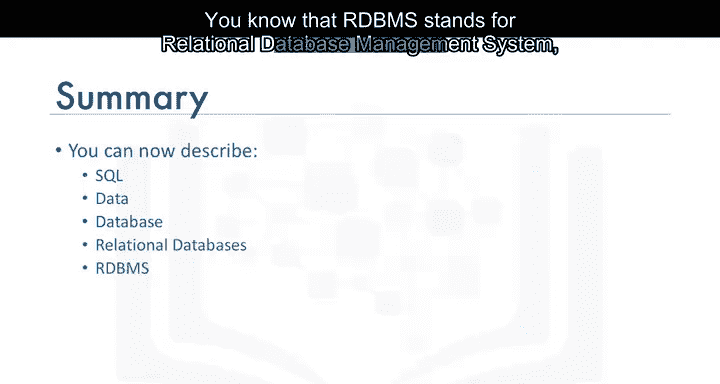

## 总结 📝

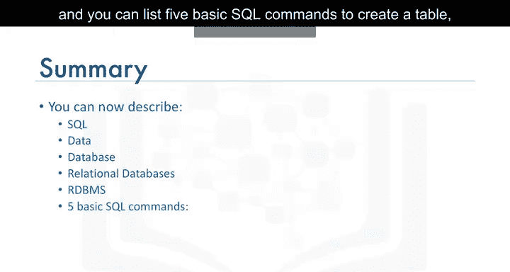

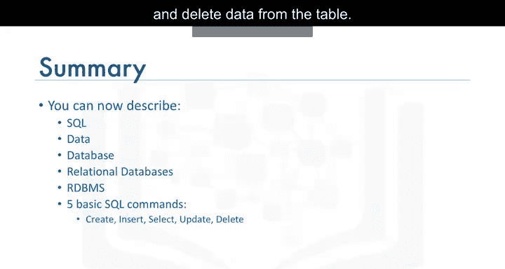

本节课中，我们一起学习了SQL和关系型数据库的基础知识。你现在可以描述SQL、数据、数据库以及关系型数据库的概念。你知道了RDBMS代表关系型数据库管理系统，并且能够列出创建表、插入数据、查询数据、更新数据和删除数据这五个基本的SQL命令。这些是进行数据科学SQL操作的基石。