# 003：使用SELECT语句检索数据 📊

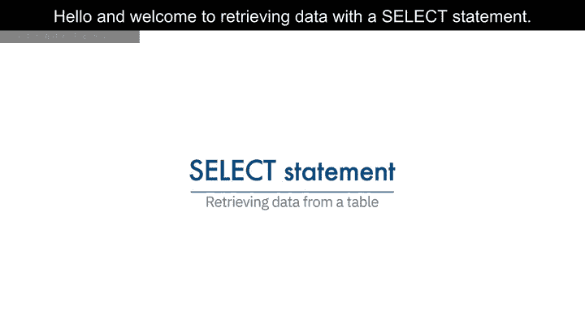

在本节课中，我们将学习如何从关系数据库表中检索数据，具体是通过选择表中的列来实现。课程结束时，你将能够从关系数据库表中检索数据，理解谓词的作用，识别使用WHERE子句的SELECT语句语法，并列出关系数据库管理系统支持的比较运算符。

---

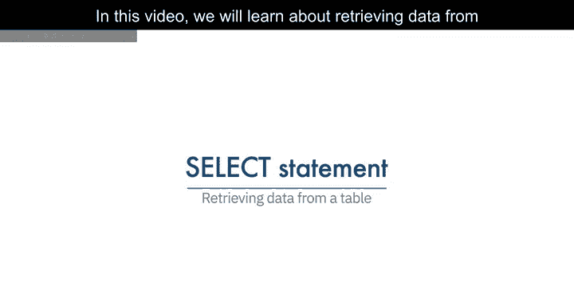

数据库管理系统的主要目的不仅是存储数据，还要便于数据的检索。

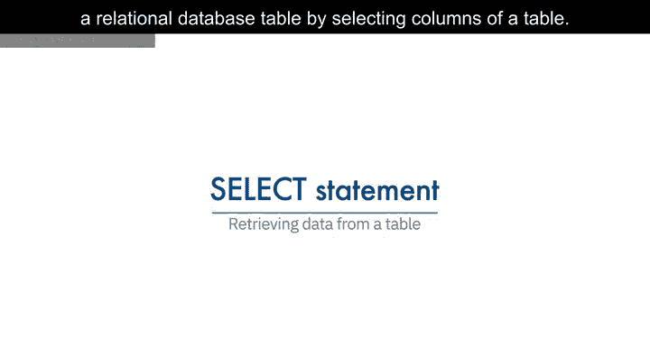

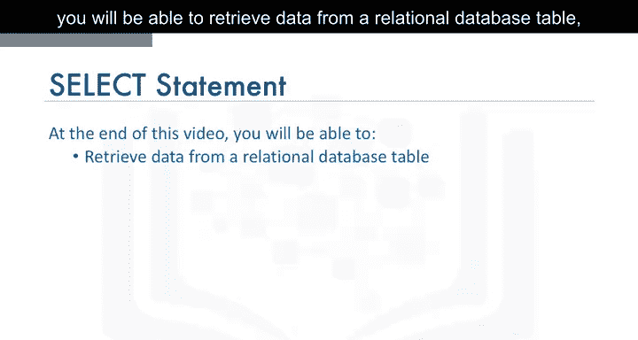

在创建关系数据库表并向表中插入数据后，我们通常需要查看这些数据。

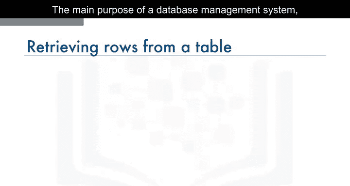

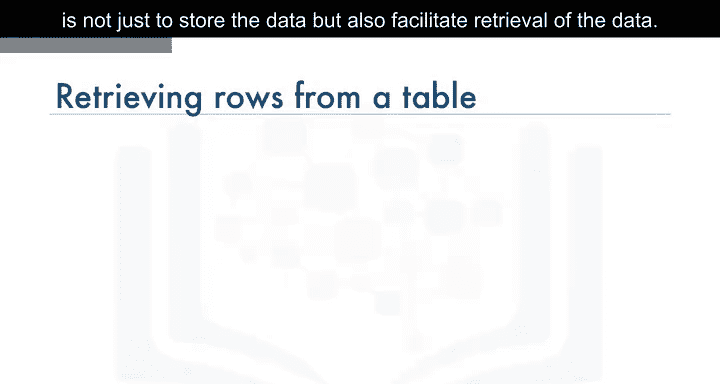

为了查看数据，我们使用SELECT语句。

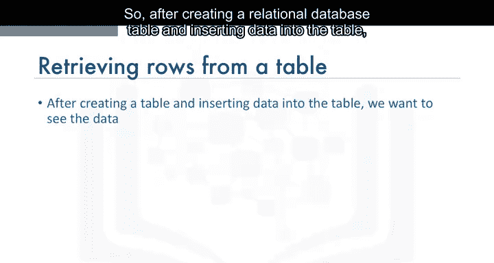

SELECT语句是一种数据操作语言（DML）语句。数据操作语言语句用于读取和修改数据。SELECT语句通常被称为查询，执行此查询得到的输出称为结果集或结果表。

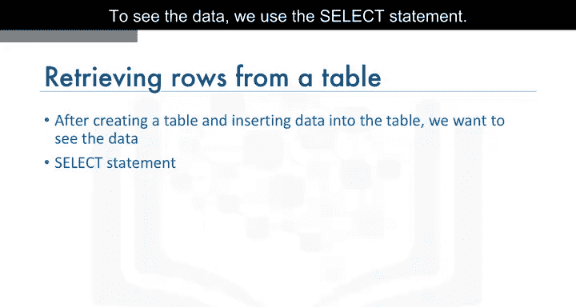

最简单的SELECT语句形式是：`SELECT * FROM table_name`。

以书籍实体为例，我们使用实体名“book”和实体属性作为表的列来创建表。通过INSERT语句向book表添加行来插入数据。执行`SELECT * FROM book`会得到一个包含四行的结果集，显示book表中所有列的所有数据行。

此外，你也可以通过在SELECT语句中单独指定列名来检索所有行的所有列。

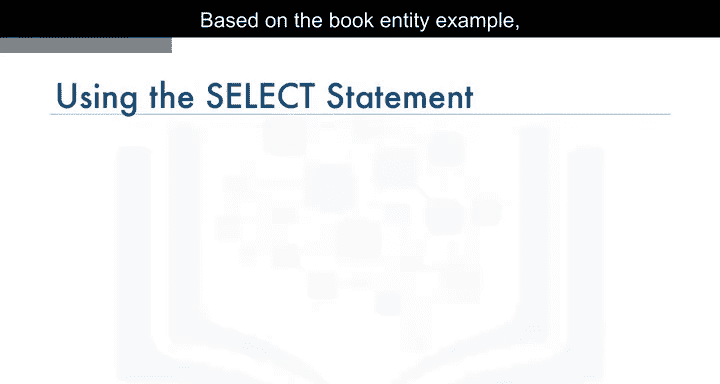

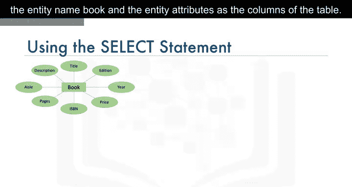

---

你并不总是需要检索表中的所有列。你可以只检索列的子集。

例如，如果你只想从book表中检索两列，比如`book_id`和`title`。

在这种情况下，SELECT语句是：`SELECT book_id, title FROM book`。此时，只会为四行中的每一行显示这两列。同时请注意，显示的列顺序始终与SELECT语句中指定的顺序一致。

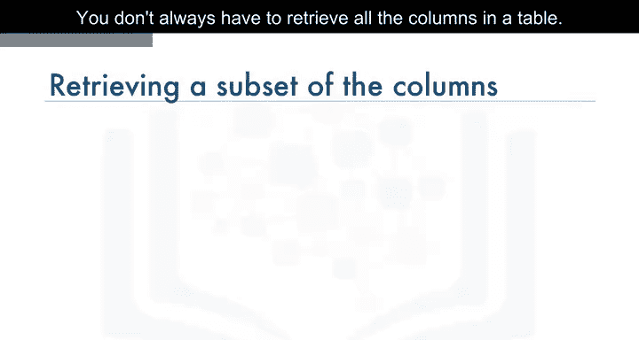

---

然而，如果我们想知道`book_id`为“B1”的书籍的标题，该怎么办呢？

关系操作通过允许我们使用WHERE子句来帮助我们限制结果集。WHERE子句总是需要一个谓词。谓词是评估为真、假或未知的条件。谓词用于WHERE子句的搜索条件中。

因此，如果我们需要知道`book_id`为“B1”的书籍标题，我们使用WHERE子句和谓词`book_id = 'B1'`。

语句为：`SELECT book_id, title FROM book WHERE book_id = 'B1'`。

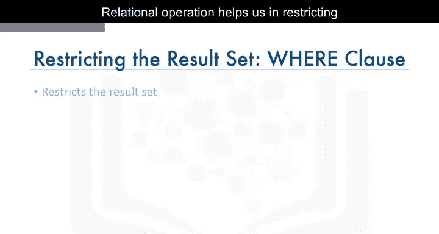

请注意，结果集现在被限制为仅有一行，该行的条件评估为真。

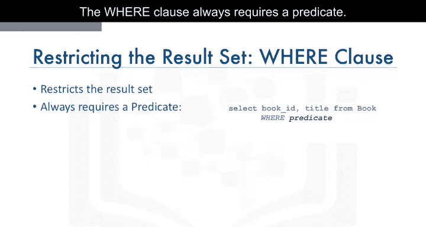

---

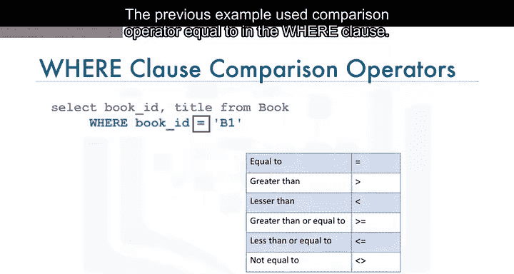

上一个例子在WHERE子句中使用了比较运算符“等于”。

关系数据库管理系统还支持其他比较运算符。

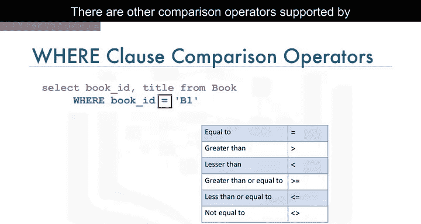

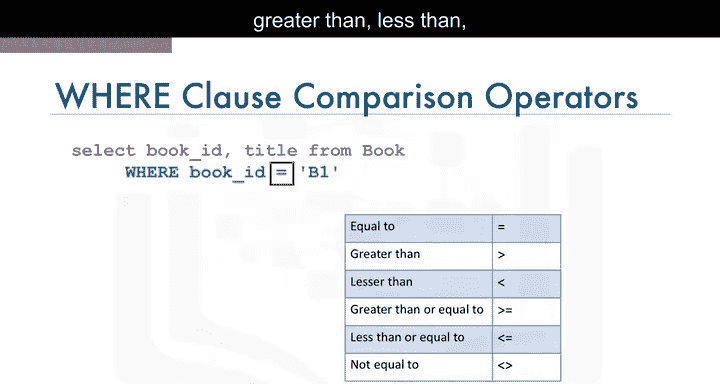

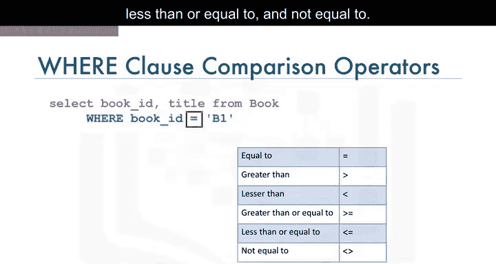

以下是支持的比较运算符列表：
*   等于 (`=`)
*   大于 (`>`)
*   小于 (`<`)
*   大于或等于 (`>=`)
*   小于或等于 (`<=`)
*   不等于 (`<>` 或 `!=`)

---

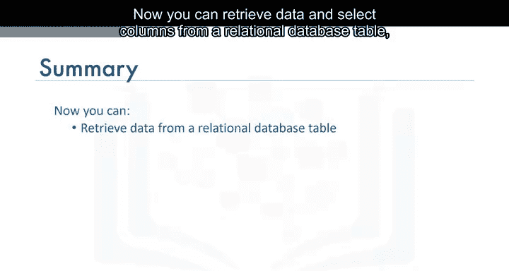

现在，你已经能够从关系数据库表中检索数据和选择列，理解了谓词的作用，识别了使用WHERE子句的SELECT语句语法，并了解了关系数据库管理系统支持的比较运算符。

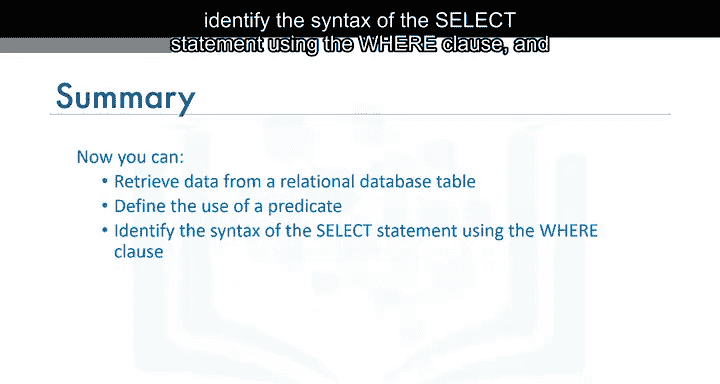

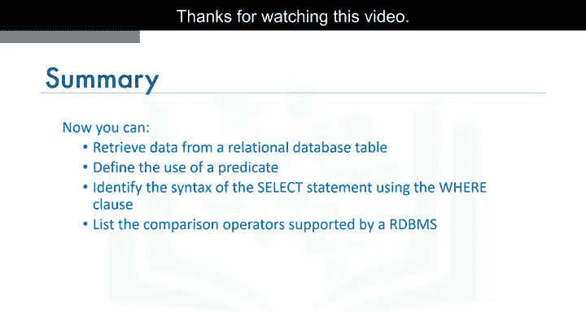

在本节课中，我们一起学习了如何使用SELECT语句的基本形式检索所有数据，如何选择特定的列，以及如何使用WHERE子句和比较运算符来过滤和精确检索所需的数据行。