# 004：COUNT、DISTINCT与LIMIT语句 🎯

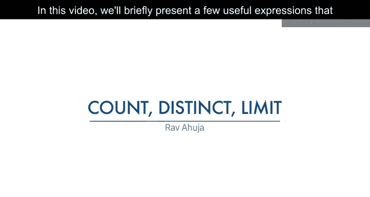

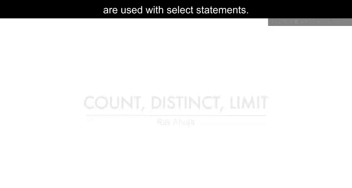

在本节课中，我们将学习三个与`SELECT`语句配合使用的实用表达式：`COUNT`、`DISTINCT`和`LIMIT`。这些功能对于数据汇总、去重和结果集控制至关重要，是数据科学工作中处理和分析数据库信息的基础工具。

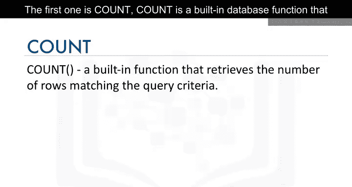

## 1. COUNT函数：统计行数 📊

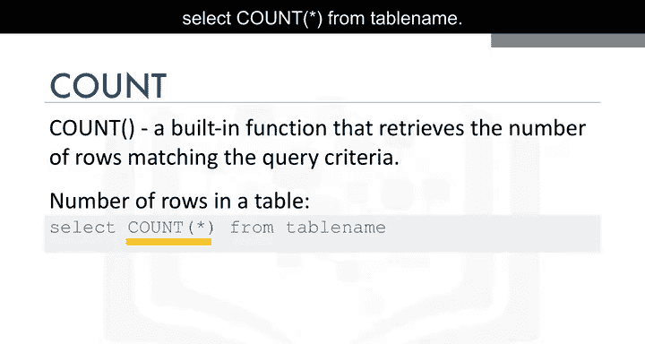

上一节我们介绍了基础的`SELECT`查询，本节中我们来看看如何对数据进行计数。`COUNT`是一个内置的数据库函数，用于检索符合查询条件的行数。

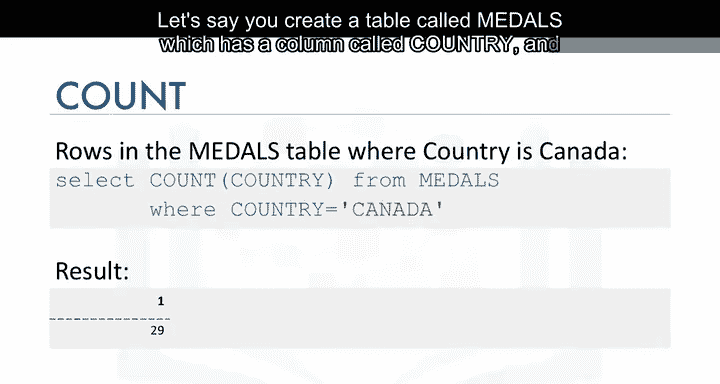

以下是`COUNT`函数的基本语法和示例：

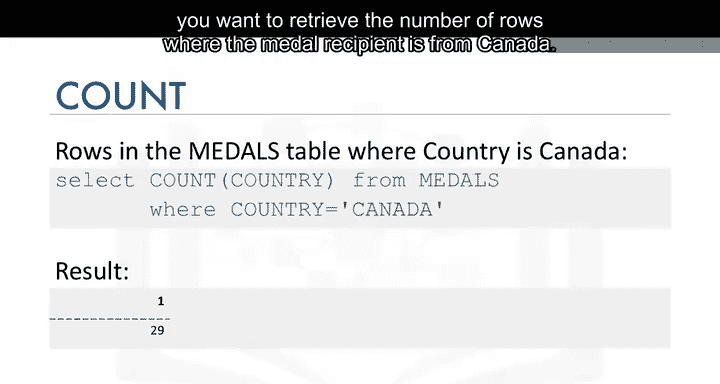

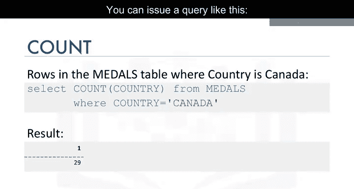

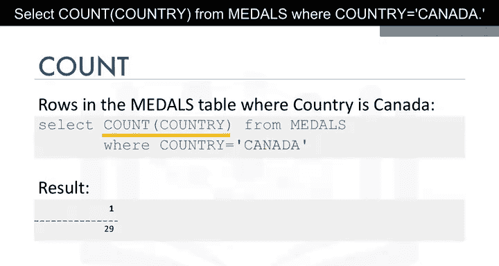

*   **统计表中总行数**：`SELECT COUNT(*) FROM table_name;`
*   **统计特定条件下的行数**：例如，假设有一个名为`Medals`的表，其中包含`country`列。要检索奖牌获得者为加拿大的行数，可以使用以下查询：`SELECT COUNT(country) FROM Medals WHERE country = 'Canada';`

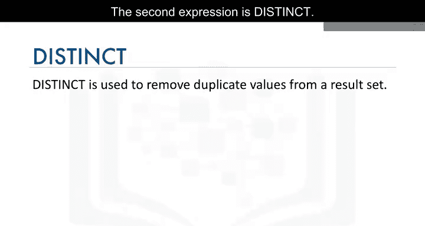

## 2. DISTINCT关键字：获取唯一值 🔍

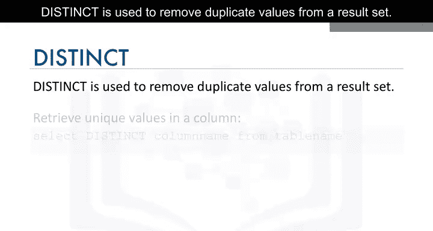

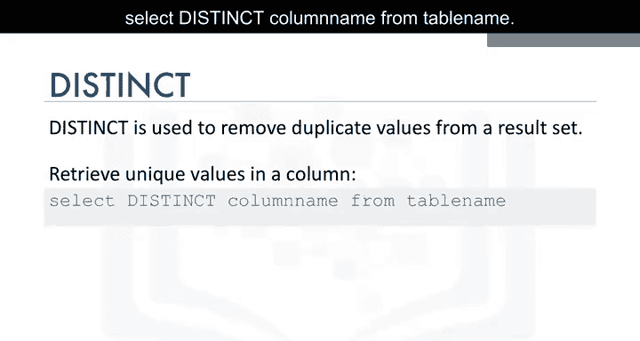

了解了如何计数后，我们来看看如何从结果集中移除重复值。`DISTINCT`关键字用于消除结果集中的重复值，返回唯一的记录。

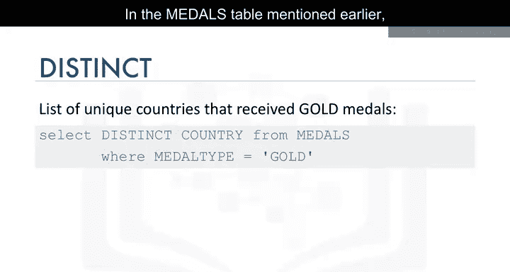

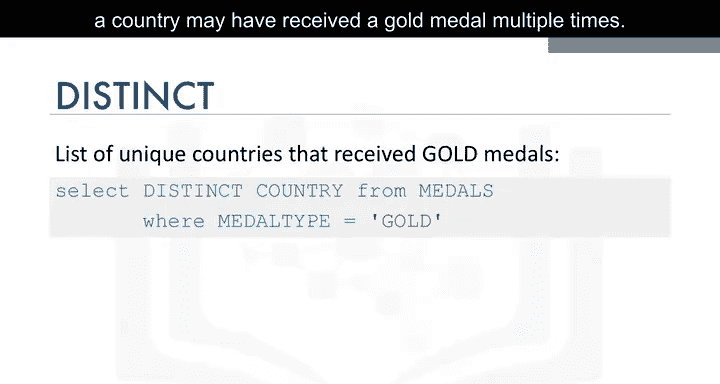

以下是`DISTINCT`关键字的基本用法和示例：

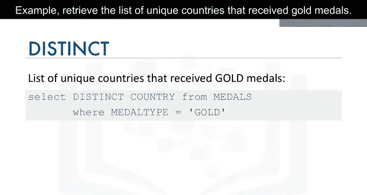

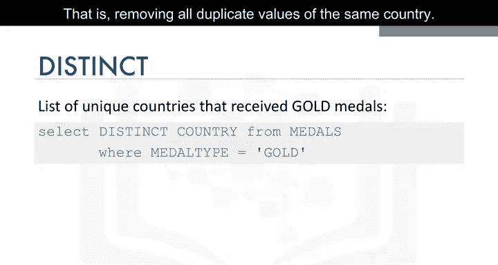

*   **获取列中的唯一值**：`SELECT DISTINCT column_name FROM table_name;`
*   **获取特定条件下的唯一值**：在之前提到的`Medals`表中，一个国家可能多次获得金牌。要检索获得金牌的唯一国家列表（即去除同一国家的所有重复值），可以使用：`SELECT DISTINCT country FROM Medals WHERE medal_type = ‘gold’;`

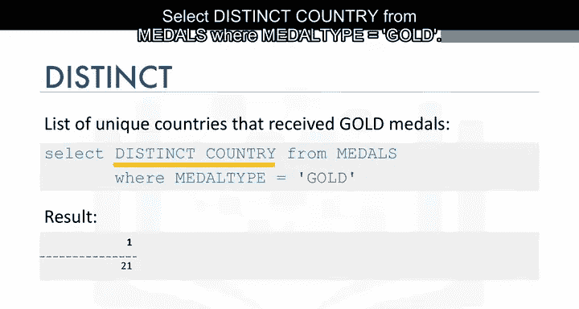

## 3. LIMIT子句：限制返回行数 ⏹️

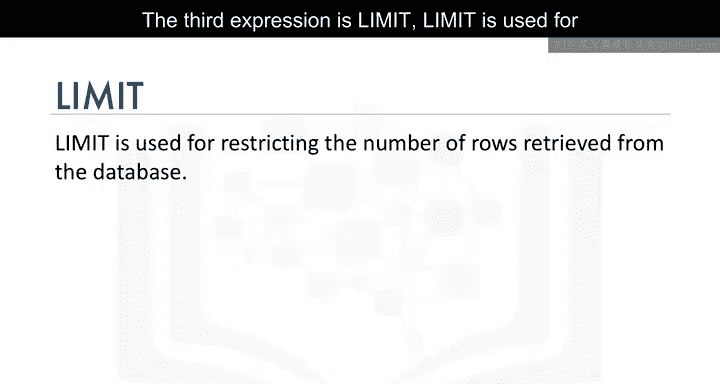

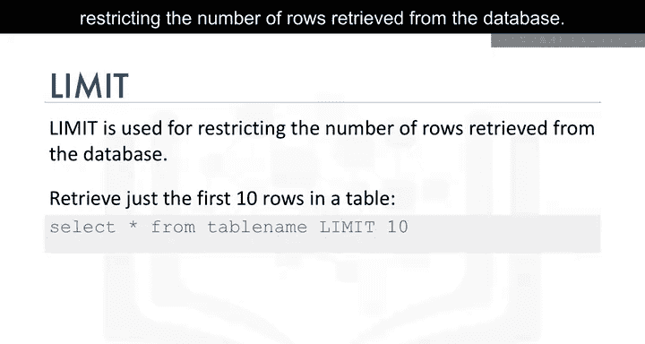

最后，我们学习如何控制查询结果返回的数据量。`LIMIT`子句用于限制从数据库检索的行数。

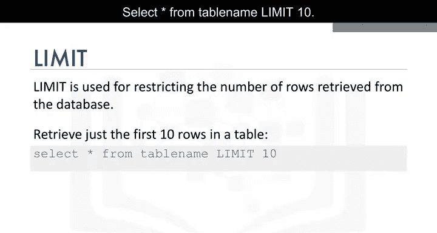

以下是`LIMIT`子句的基本用法和示例：

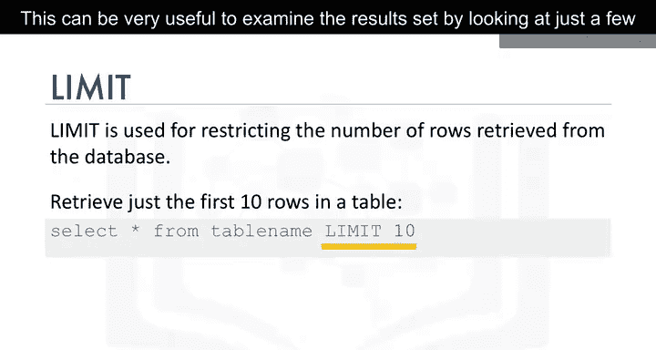

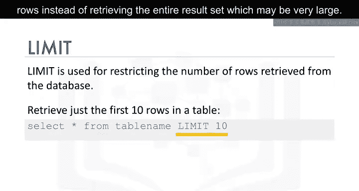

*   **仅检索表中的前N行**：`SELECT * FROM table_name LIMIT N;`。例如，`SELECT * FROM table_name LIMIT 10;` 将只返回前10行。
*   **在特定查询中限制行数**：这对于仅查看几行数据来检查结果集非常有用，尤其是在结果集可能非常大的情况下。例如，仅检索`Medals`表中特定年份的前几行：`SELECT * FROM Medals WHERE year = 2018 LIMIT 5;`

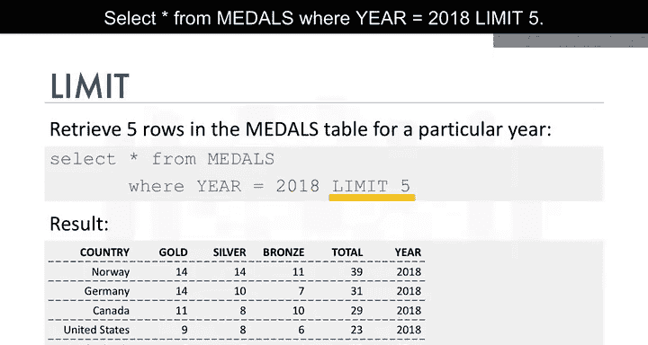

## 总结 📝

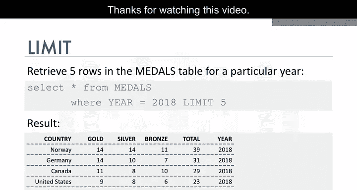

本节课中我们一起学习了三个与`SELECT`语句结合使用的核心功能：用于统计行数的`COUNT`函数、用于获取唯一值的`DISTINCT`关键字，以及用于限制返回行数的`LIMIT`子句。掌握这些表达式将帮助您更高效地从数据库中提取和初步分析数据。