# 005：INSERT插入语句 📝

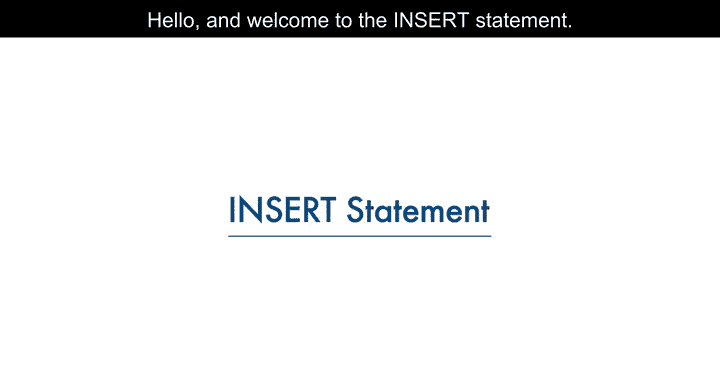

在本节课中，我们将学习如何向关系数据库表中填充数据。具体来说，我们将了解INSERT语句的语法，并掌握向表中添加数据的两种方法。

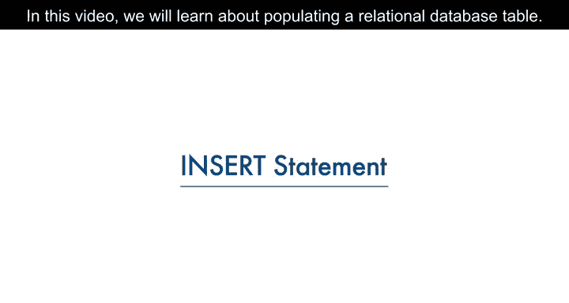


---

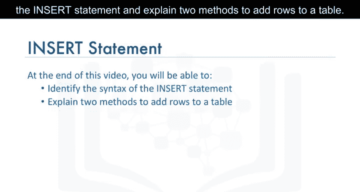

创建表之后，需要向表中填充数据。为了向表中插入数据，我们使用INSERT语句。INSERT语句用于向表中添加新行，它是数据操作语言（DML）语句之一。DML语句用于读取和修改数据。

上一节我们介绍了表的创建，本节中我们来看看如何向已创建的表中添加数据。

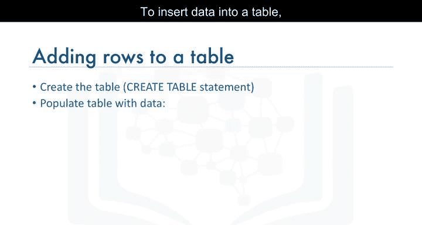

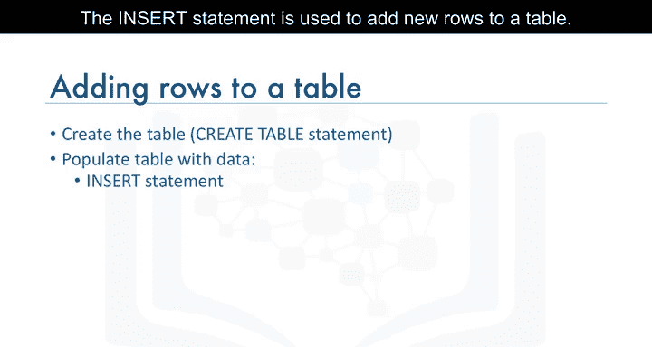

基于作者实体的例子，我们使用实体名称“author”及其属性作为表的列创建了表。现在，我们将通过向表中添加行来填充作者表的数据。

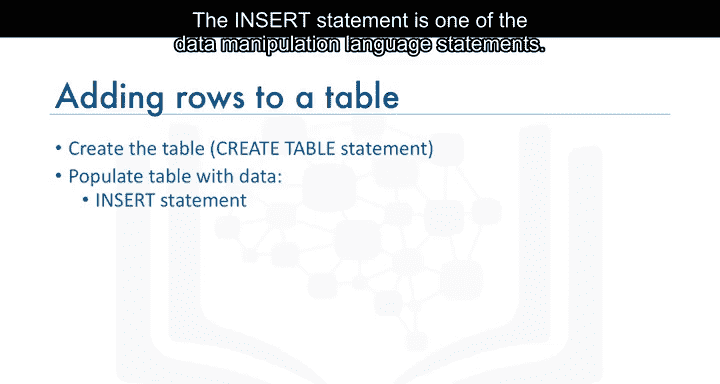

为了向作者表添加数据，我们使用INSERT语句。INSERT语句的语法如下：

```sql
INSERT INTO table_name (column_name1, column_name2, ...)
VALUES (value1, value2, ...);
```


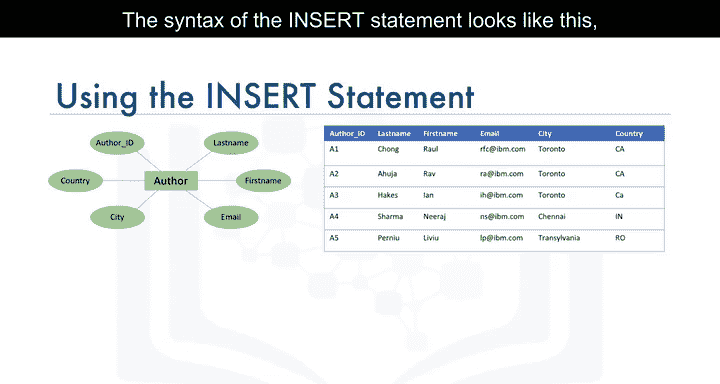

在这个语句中，`table_name` 标识目标表。`column_name` 列表标识表中的每一列。`VALUES` 子句指定要添加到表中各列的数据值。

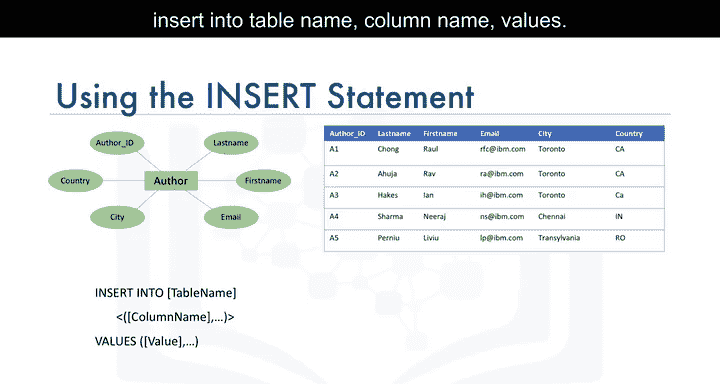

例如，要添加一行关于Raoul Chong的数据，我们插入一行数据，其中作者ID为`A1`，姓氏为`Chong`，名字为`Raoul`，电子邮件为`RFC@IBM.com`，城市为`Toronto`，国家为`CA`（代表加拿大）。作者表有六列，因此INSERT语句列出了六个用逗号分隔的列名，后面跟着同样用逗号分隔的每个列的值。

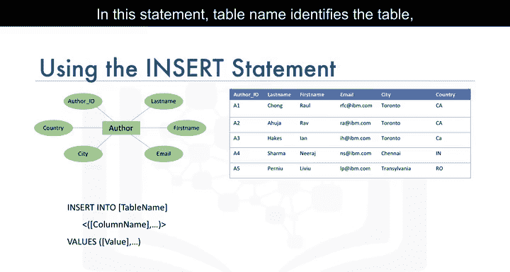

必须确保`VALUES`子句中提供的值的数量与`column_name`列表中指定的列名数量相等。这保证了每一列都有一个对应的值。

以下是向表中插入单行数据的示例：

```sql
INSERT INTO author (author_id, last_name, first_name, email, city, country)
VALUES ('A1', 'Chong', 'Raoul', 'RFC@IBM.com', 'Toronto', 'CA');
```

表不需要一次只填充一行。通过在`VALUES`子句中指定每一行，可以一次性插入多行数据。在`VALUES`子句中，每一行数据用逗号分隔。

以下是向表中插入多行数据的示例：

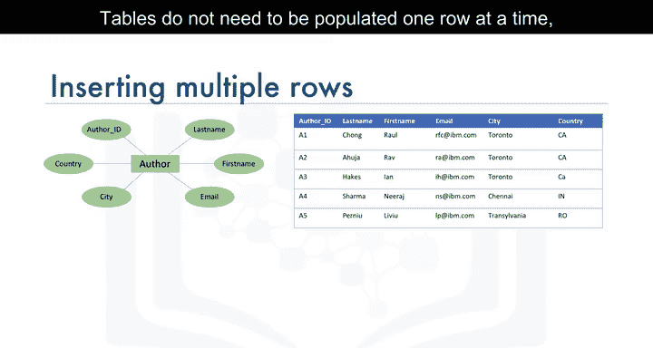

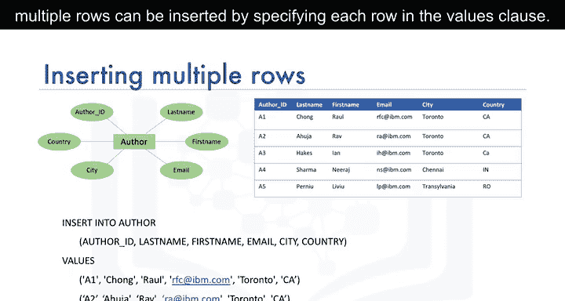

```sql
INSERT INTO author (author_id, last_name, first_name, email, city, country)
VALUES ('A1', 'Chong', 'Raoul', 'RFC@IBM.com', 'Toronto', 'CA'),
       ('A2', 'Ahuja', 'Rav', 'RA@IBM.com', 'Toronto', 'CA');
```

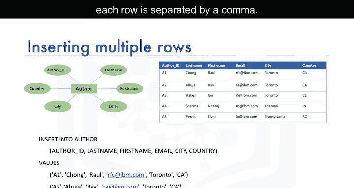

例如，在这个INSERT语句中，我们插入了两行数据，一行用于Raoul Chong，另一行用于Rav Ahuja。

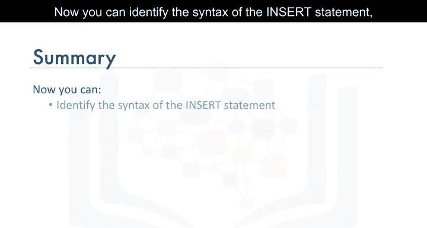

---

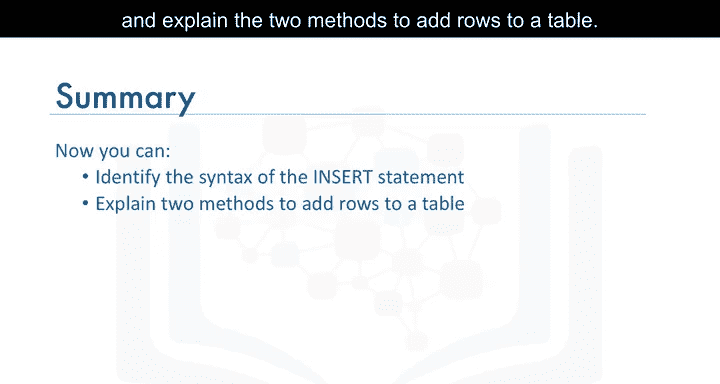

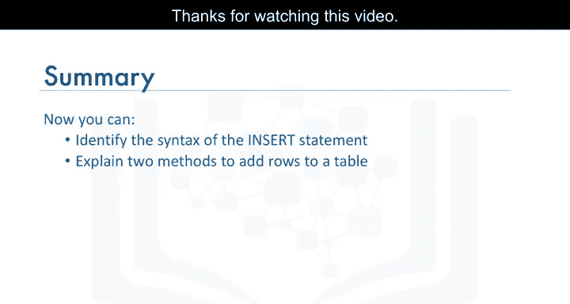

本节课中我们一起学习了INSERT语句的语法，并解释了向表中添加数据的两种方法：一次添加一行或一次添加多行。掌握INSERT语句是操作数据库数据的基础。