# 006：UPDATE与DELETE语句 📝

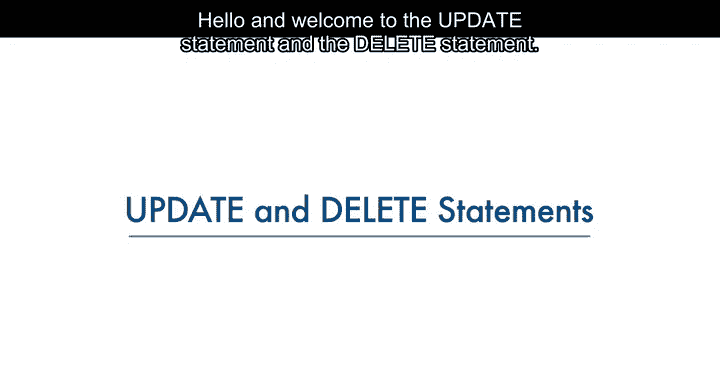

在本节课中，我们将学习如何在关系数据库表中修改和删除数据。具体来说，我们将了解UPDATE语句和DELETE语句的语法，并解释WHERE子句在这两个语句中的重要性。

---

## 修改数据：UPDATE语句

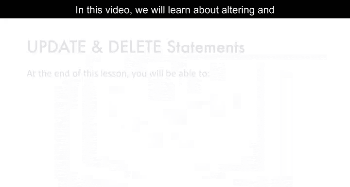

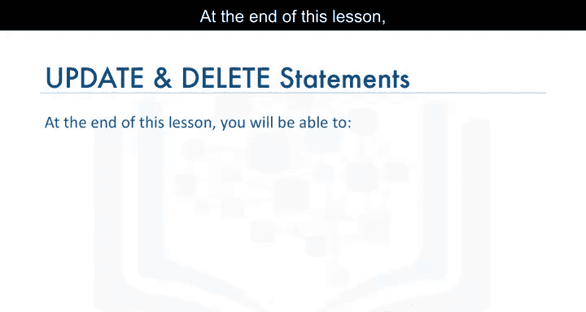

上一节我们介绍了如何向表中插入数据。本节中，我们来看看如何修改表中已有的数据。

在表被创建并填充数据之后，可以使用UPDATE语句来修改表中的数据。UPDATE语句是数据操作语言（DML）语句之一。DML语句用于读取和修改数据。

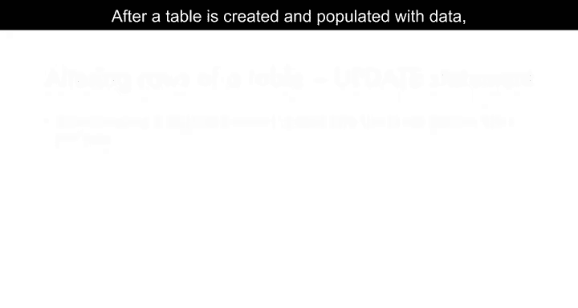

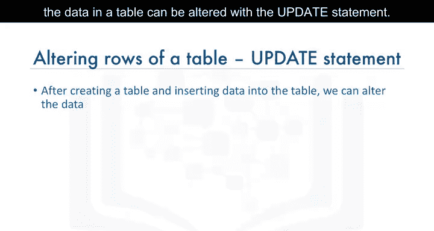

基于之前创建的作者实体示例，我们使用实体名称`author`和实体属性作为表的列创建了表，并向`author`表添加了行以填充数据。之后，若想修改表中的数据，就需要使用UPDATE语句。

UPDATE语句的语法如下：

```sql
UPDATE table_name
SET column_name = value
WHERE condition;
```

在这个语句中：
*   `table_name` 指定要修改的表。
*   `column_name` 指定要更改的列。
*   `value` 是要设置的新值。
*   `WHERE condition` 用于指定哪些行需要被更新。

让我们看一个例子。假设你想将作者ID为`A2`的作者姓名从`Raav Ahuja`改为`Lakshmi Kata`。

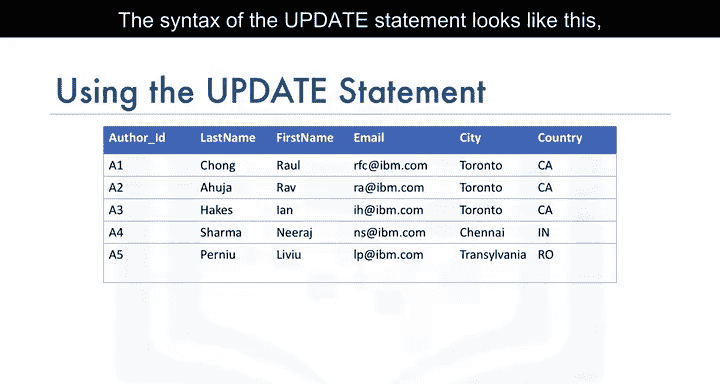

以下是操作步骤：

首先，执行一个SELECT语句查看`author`表中的所有数据，以了解当前值。

```sql
SELECT * FROM author;
```

然后，执行UPDATE语句来修改数据。

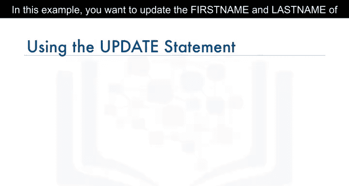


```sql
UPDATE author
SET last_name = 'Kata', first_name = 'Lakshmi'
WHERE author_id = 'A2';
```

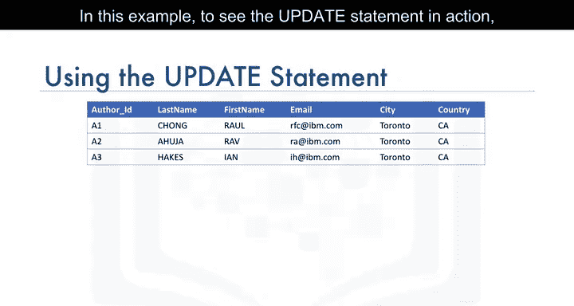

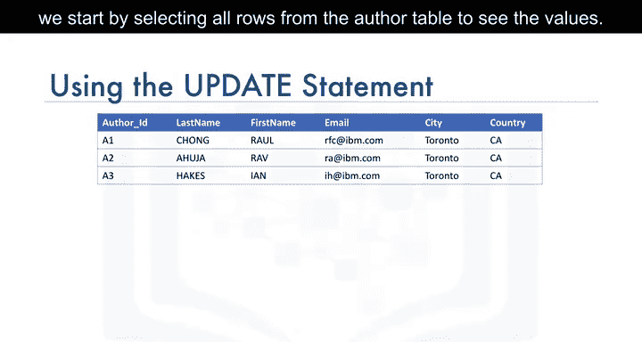

现在，为了查看更新结果，再次执行SELECT语句查询`author`表的所有行。你将看到第二行的姓名已从`Raav Ahuja`变为`Lakshmi Kata`。

**重要提示**：如果不指定WHERE子句，表中的**所有**行都将被更新。例如，在上述例子中若不使用WHERE子句，表中所有作者的名字都会被改为`Lakshmi Kata`。

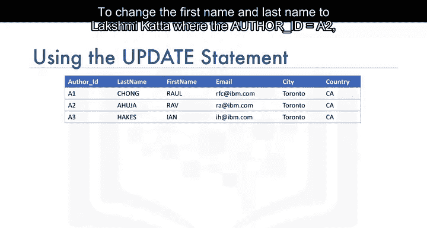

---

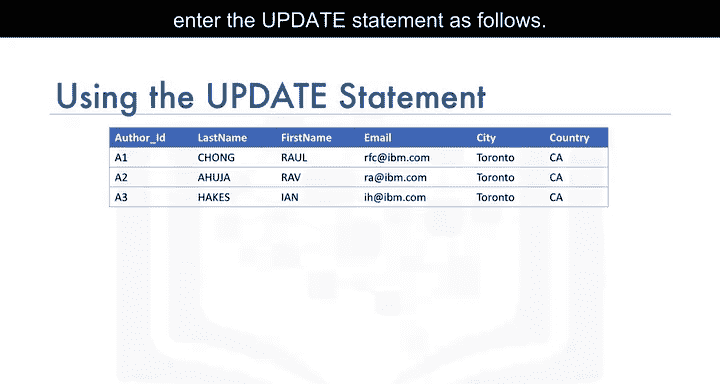

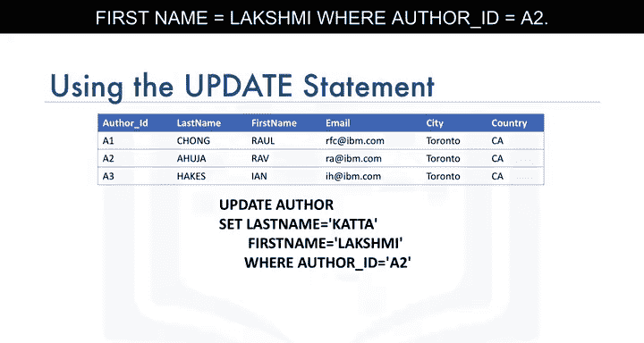

## 删除数据：DELETE语句

学会了如何更新数据后，接下来我们学习如何从表中删除数据。

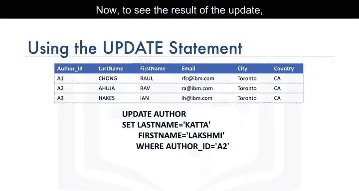


有时可能需要从表中删除一行或多行数据，这时可以使用DELETE语句。DELETE语句同样是数据操作语言（DML）语句，用于读取和修改数据。

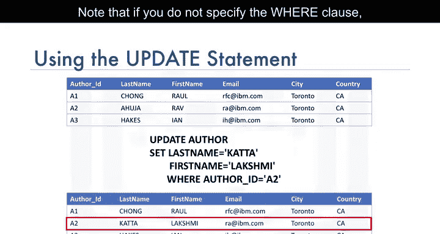

DELETE语句的语法如下：

```sql
DELETE FROM table_name
WHERE condition;
```

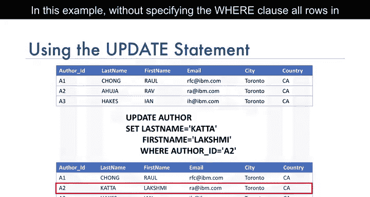

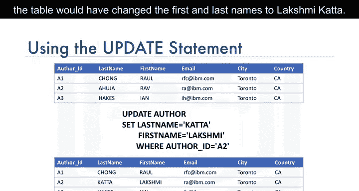

需要删除的行由`WHERE condition`指定。

基于作者实体示例，假设我们想删除作者ID为`A2`和`A3`的行。

以下是操作示例：

```sql
DELETE FROM author
WHERE author_id IN ('A2', 'A3');
```

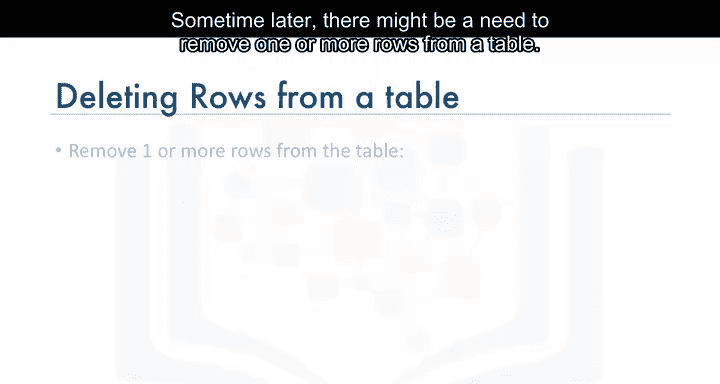

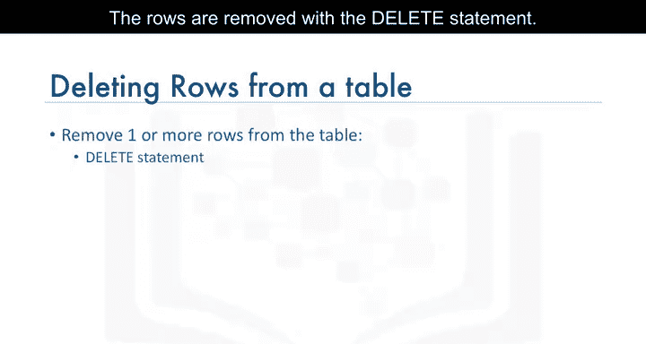

执行此语句后，`author`表中`author_id`为`A2`和`A3`的行将被删除。

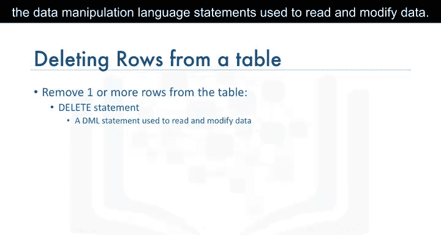

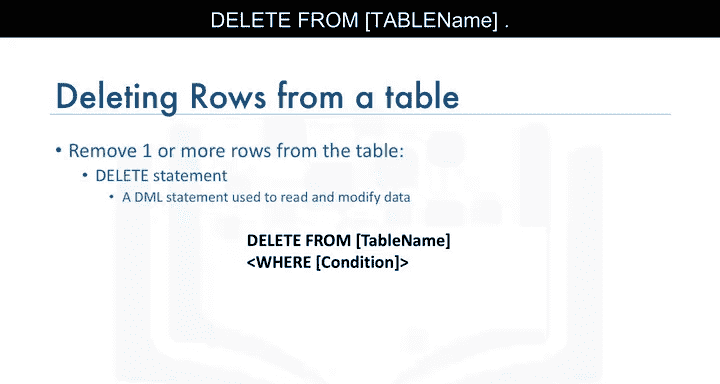

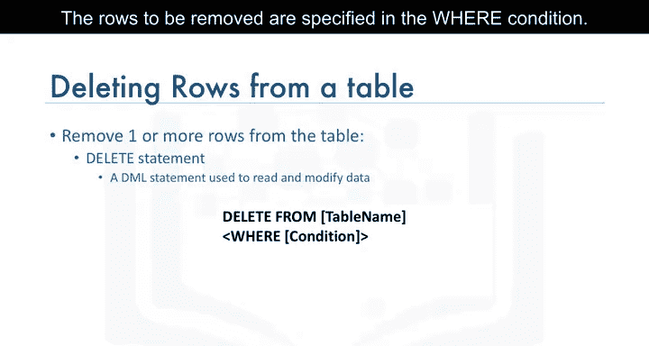

**重要提示**：与UPDATE语句类似，如果在DELETE语句中**不指定WHERE子句**，表中的**所有**行都将被删除。

---

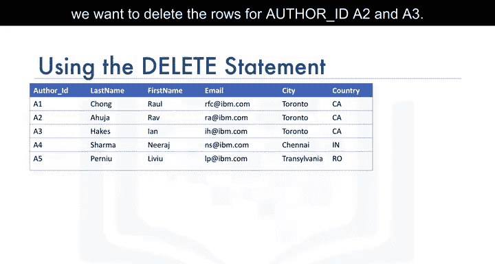

## 总结

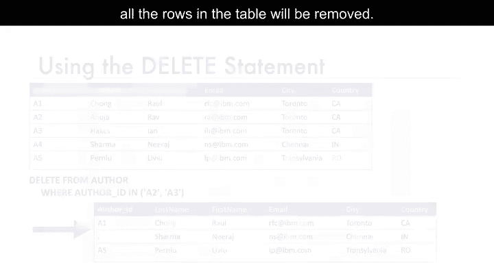

本节课中我们一起学习了两个重要的数据操作语句：UPDATE和DELETE。

我们掌握了UPDATE语句的语法，它用于修改表中现有数据的值。我们也掌握了DELETE语句的语法，它用于从表中移除行。最重要的是，我们理解了WHERE子句在这两个语句中的关键作用——它精确地指定了需要更新或删除哪些行，从而避免意外地修改或清空整个表。

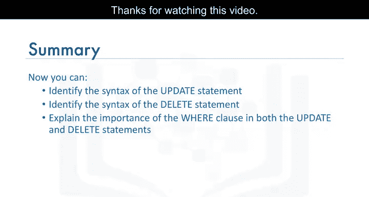

记住，在执行UPDATE或DELETE操作时，务必谨慎使用WHERE子句。