# 008：SQL 语句分类（DDL vs DML）🏷️


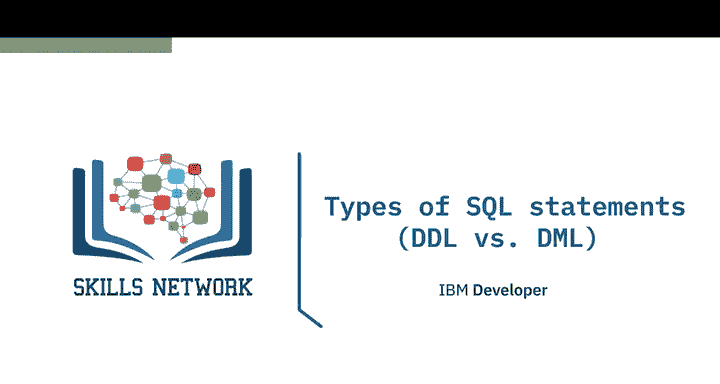

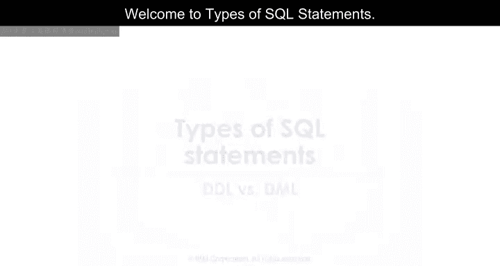

在本节课中，我们将学习 SQL 语句的两大主要分类：数据定义语言（DDL）和数据操作语言（DML）。理解这两者的区别是掌握 SQL 数据库操作的基础。

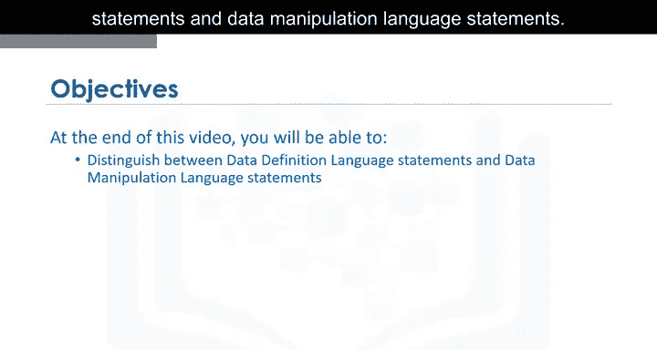

SQL 语句用于与关系型数据库中的实体（如表）、属性（即列）以及包含数据值的元组（即行）进行交互。

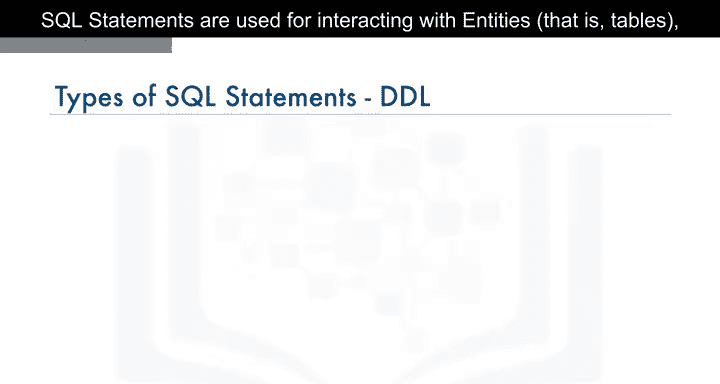

SQL 语句主要分为两个不同的类别：数据定义语言（DDL）语句和数据操作语言（DML）语句。

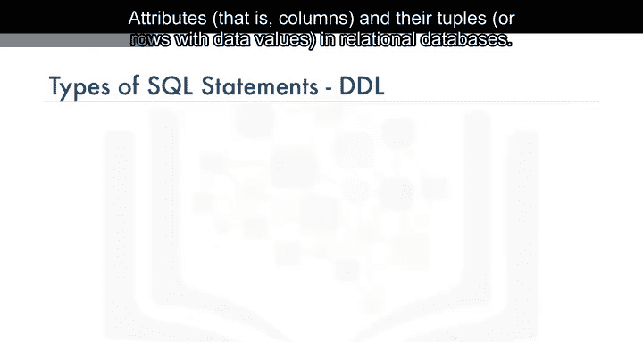

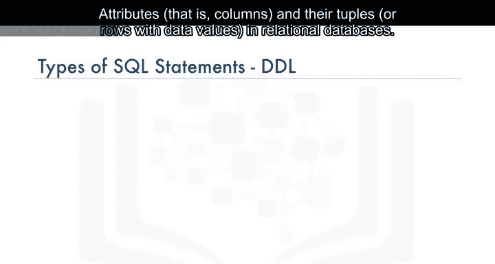

## 🏗️ 数据定义语言（DDL）

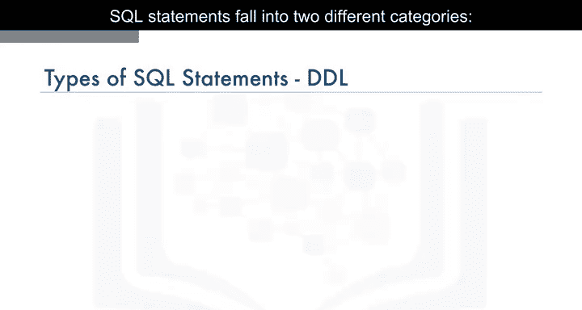

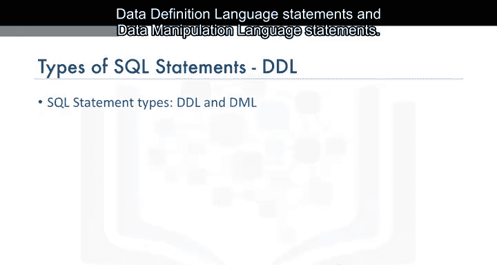

上一节我们了解了 SQL 语句的分类，本节中我们来看看数据定义语言（DDL）。

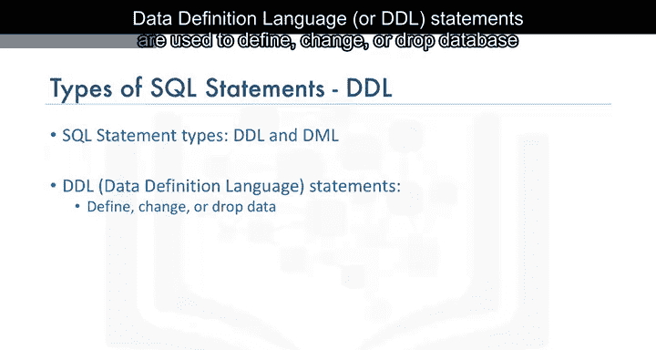

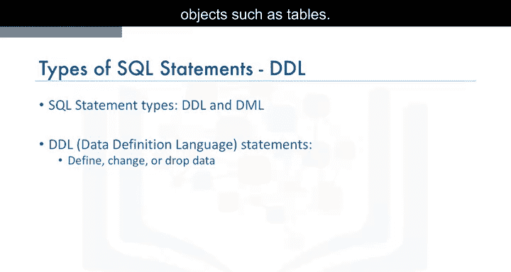

数据定义语言（DDL）语句用于定义、更改或删除数据库对象，例如表。

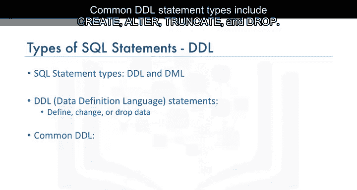

以下是常见的 DDL 语句类型：

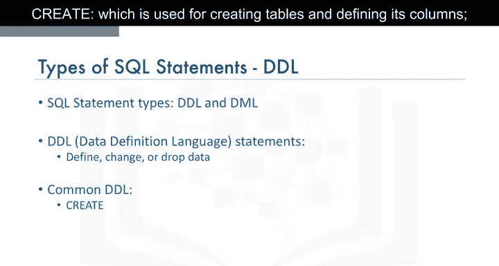

*   **CREATE**：用于创建表并定义其列。
    ```sql
    CREATE TABLE 表名 (列名 数据类型, ...);
    ```
*   **ALTER**：用于修改表结构，包括添加和删除列，以及修改列的数据类型。
    ```sql
    ALTER TABLE 表名 ADD 列名 数据类型;
    ```
*   **TRUNCATE**：用于删除表中的所有数据，但保留表本身的结构。
    ```sql
    TRUNCATE TABLE 表名;
    ```
*   **DROP**：用于删除整个表。
    ```sql
    DROP TABLE 表名;
    ```

## 🔧 数据操作语言（DML）

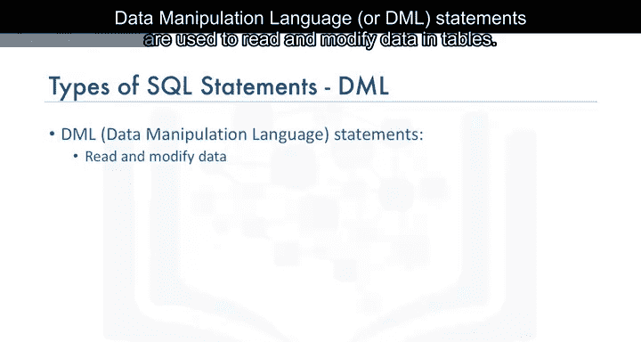

了解了如何定义和修改数据库结构后，我们接下来学习如何操作其中的数据。

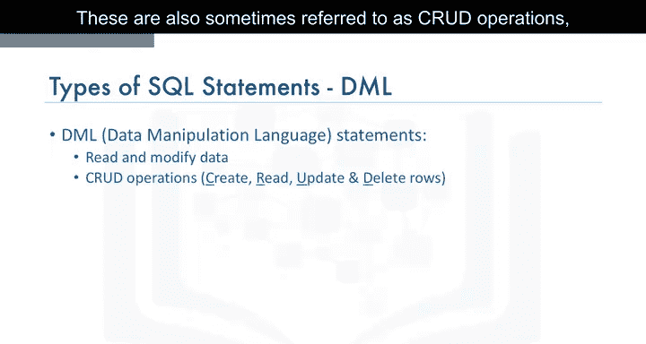

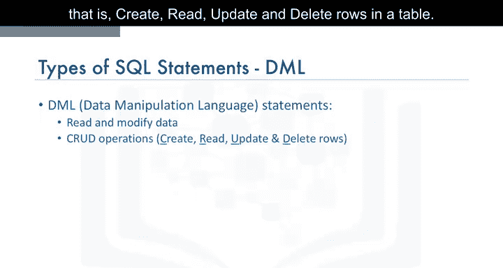

数据操作语言（DML）语句用于读取和修改表中的数据。这些操作有时也被称为 CRUD 操作，即对表中的行进行创建（Create）、读取（Read）、更新（Update）和删除（Delete）。

以下是常见的 DML 语句类型：

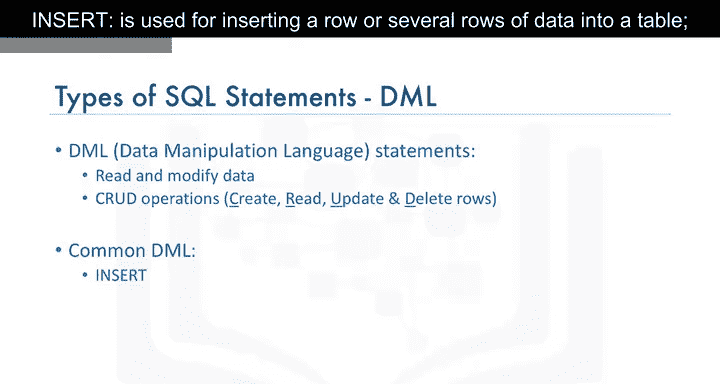

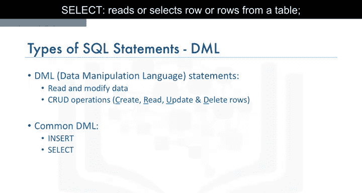

*   **INSERT**：用于向表中插入一行或多行数据。
    ```sql
    INSERT INTO 表名 (列1, 列2) VALUES (值1, 值2);
    ```
*   **SELECT**：用于从表中读取或选择一行或多行数据。
    ```sql
    SELECT 列名 FROM 表名;
    ```
*   **UPDATE**：用于编辑表中的一行或多行数据。
    ```sql
    UPDATE 表名 SET 列名 = 新值 WHERE 条件;
    ```
*   **DELETE**：用于从表中删除一行或多行数据。
    ```sql
    DELETE FROM 表名 WHERE 条件;
    ```

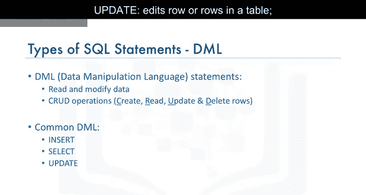

## 📝 课程总结

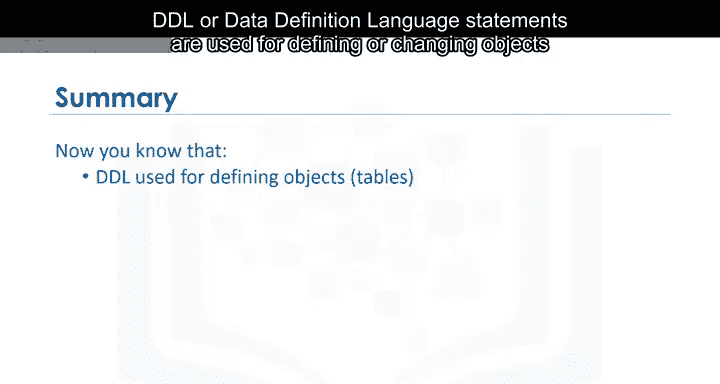

本节课中，我们一起学习了 SQL 语句的两大核心分类。

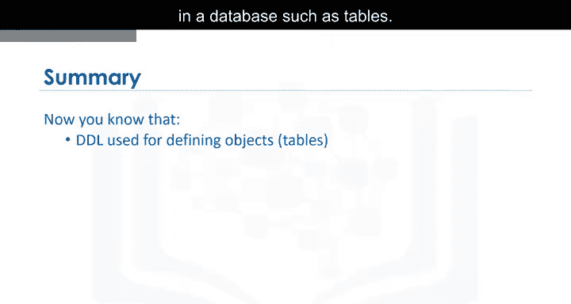

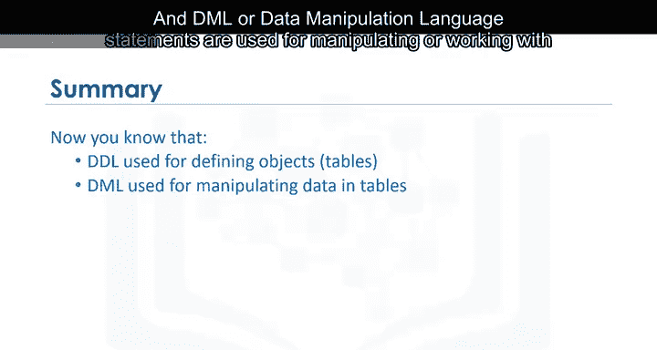

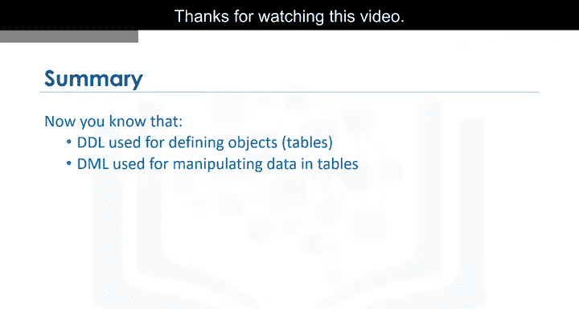

你现在已经知道，**DDL（数据定义语言）** 语句用于定义或更改数据库中的对象（如表），而 **DML（数据操作语言）** 语句用于操作或处理表中的数据。掌握这两者的区别和用法，是进行有效数据库管理的关键。