# 009：CREATE TABLE建表语句 📝


在本节课中，我们将学习如何使用SQL的`CREATE TABLE`语句来创建数据库表。你将了解如何将实体名称和属性转换为关系数据库中的表结构，并掌握定义列名、数据类型和约束（如主键和`NOT NULL`）的方法。


## 理解CREATE TABLE语句

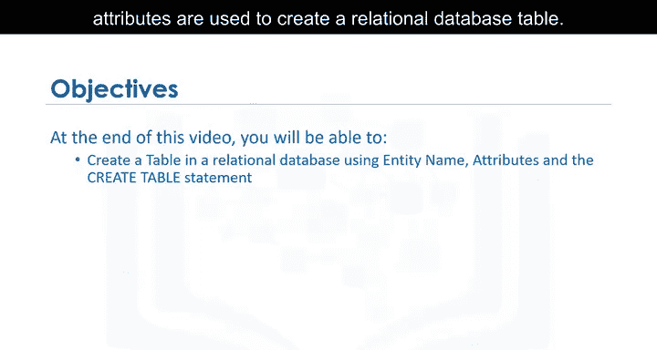

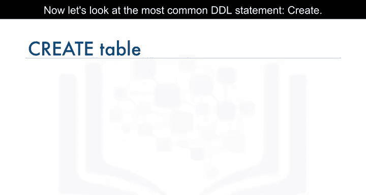

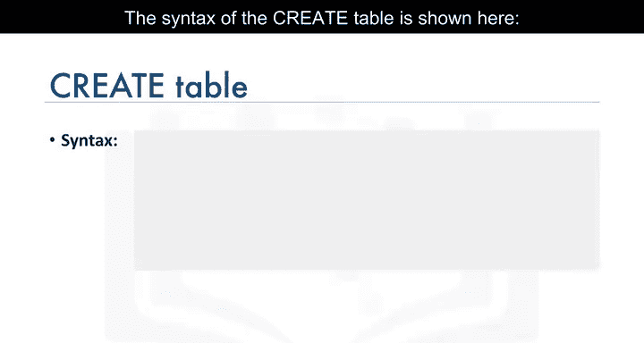

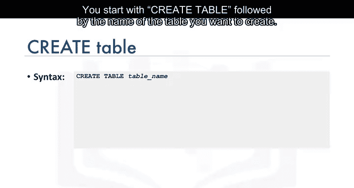

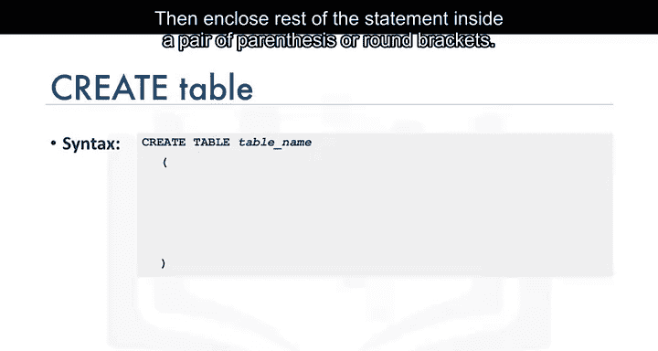

上一节我们介绍了数据定义语言（DDL）的基本概念。本节中，我们来看看最常用的DDL语句——`CREATE TABLE`。

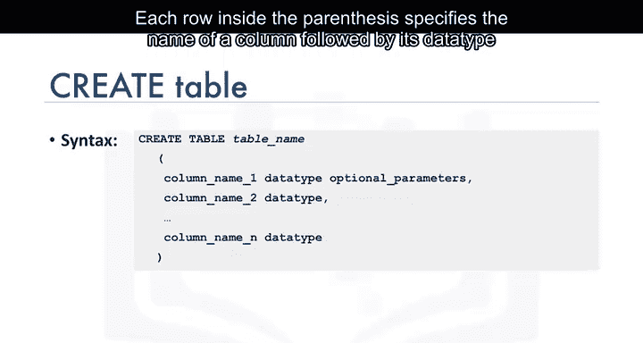

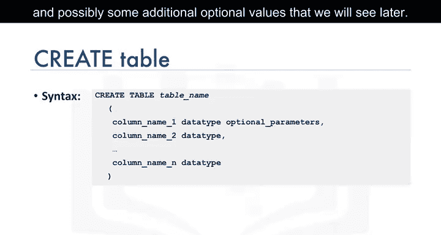

`CREATE TABLE`语句的基本语法如下：

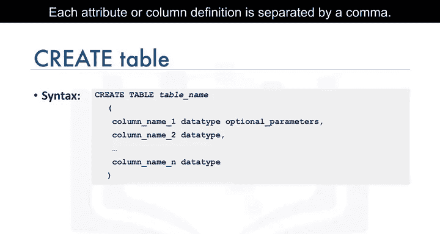

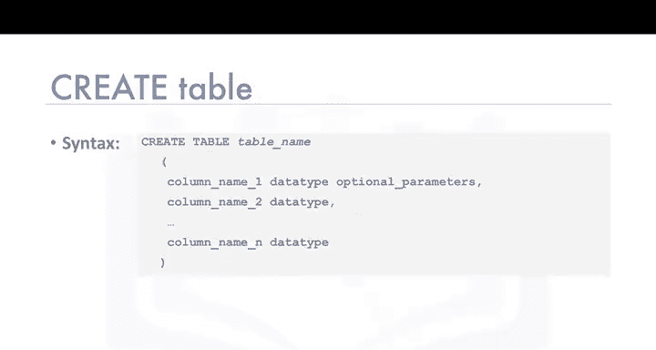

```sql
CREATE TABLE table_name (
    column1 datatype constraint,
    column2 datatype constraint,
    ...
);
```

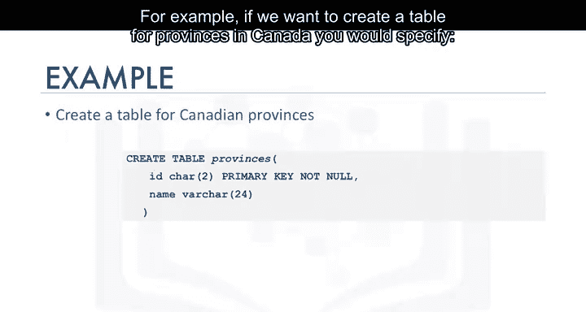

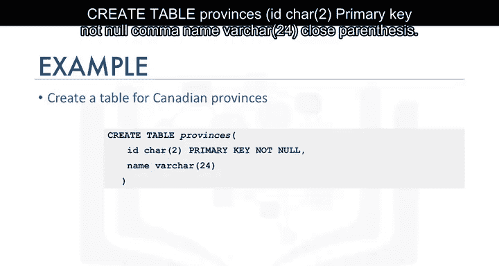

语句以`CREATE TABLE`开始，后跟要创建的表名。语句的其余部分用一对圆括号括起来。括号内的每一行指定一个列的名称、其数据类型以及一些可选的约束值。每个属性或列的定义用逗号分隔。

## 一个简单的建表示例

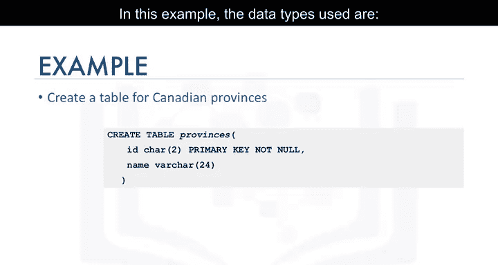

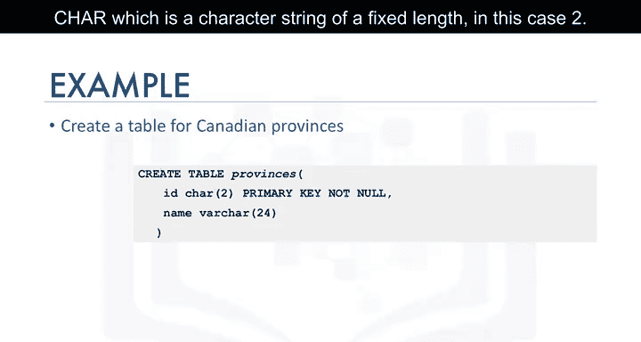

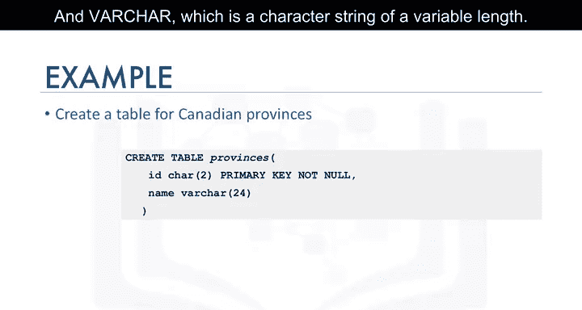


为了更好地理解语法，让我们看一个创建加拿大省份表的例子。

```sql
CREATE TABLE provinces (
    ID CHAR(2) PRIMARY KEY NOT NULL,
    name VARCHAR(24)
);
```

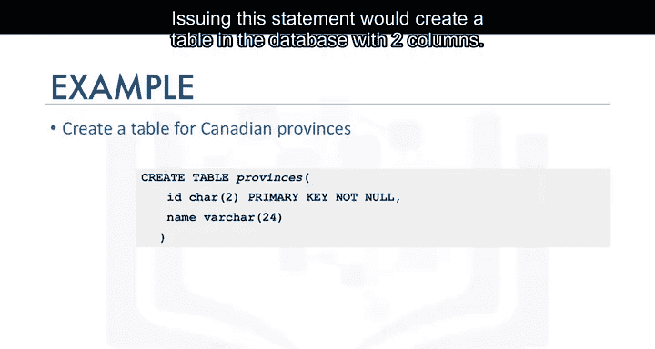

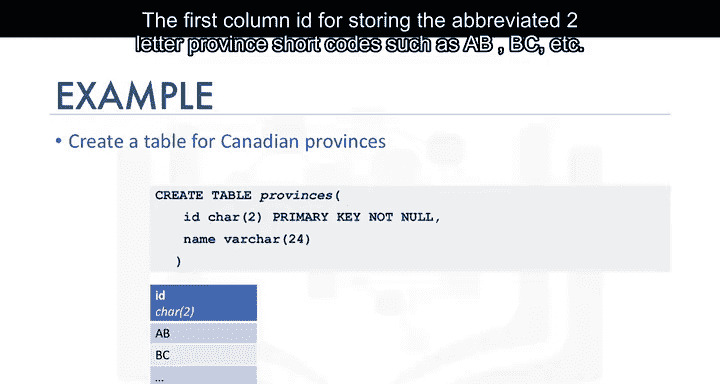

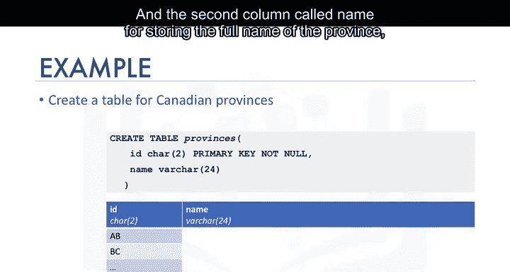

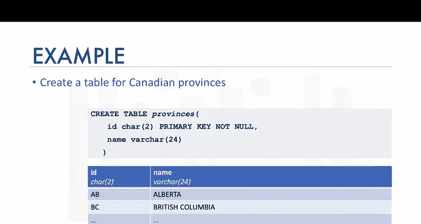

在这个例子中，我们使用了两种数据类型：
*   `CHAR(2)`：这是一个固定长度的字符串，长度为2个字符。
*   `VARCHAR(24)`：这是一个可变长度的字符串，最大长度可达24个字符。

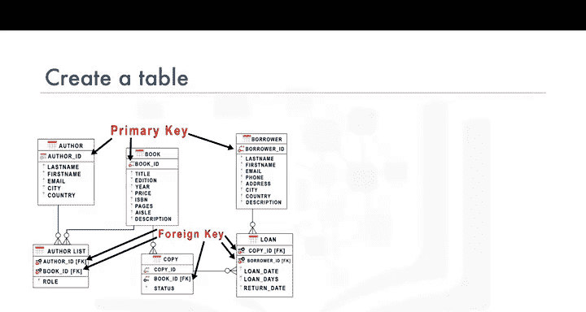

执行此语句将在数据库中创建一个包含两列的表：
*   第一列`ID`用于存储两个字母的省份缩写代码，例如`AB`（阿尔伯塔省）、`BC`（不列颠哥伦比亚省）。
*   第二列`name`用于存储省份的全名，例如`Alberta`、`British Columbia`。

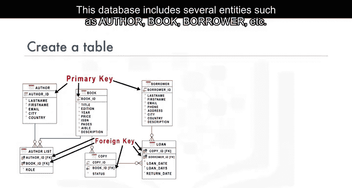

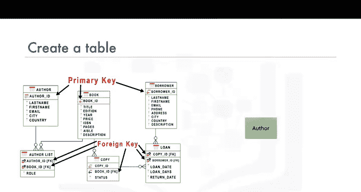

## 一个更复杂的示例：图书馆数据库

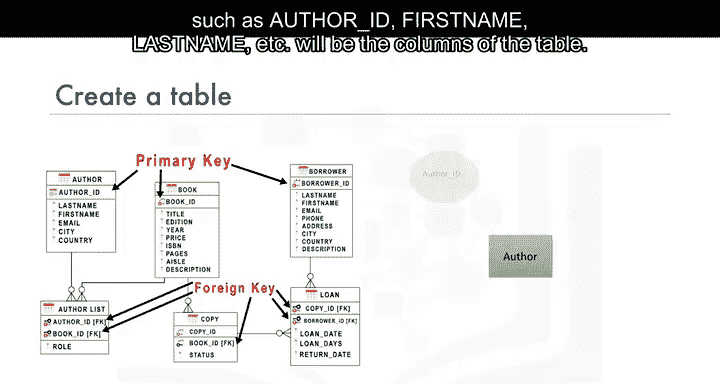

现在，让我们看一个基于图书馆数据库的更详细的例子。这个数据库包含多个实体，如作者、书籍、借阅者等。我们首先为作者实体创建表。

表名将是`author`，其实体属性（如`author_id`、`first_name`、`last_name`等）将成为表的列。在这个表中，我们还将把`author_id`属性指定为主键，以确保表中没有重复的值。关系表的主键唯一地标识表中的每个元组或行。

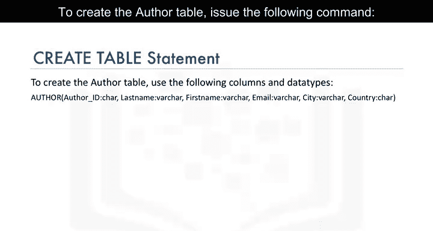

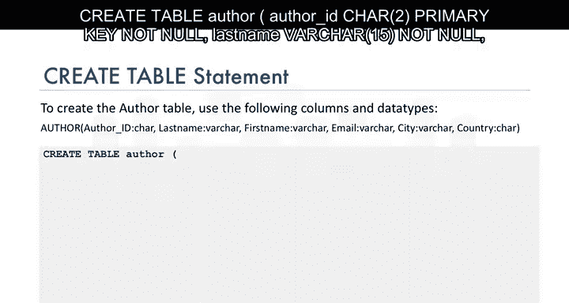

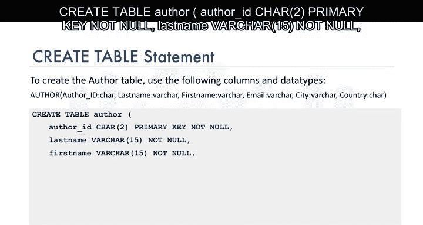

以下是创建作者表的命令：

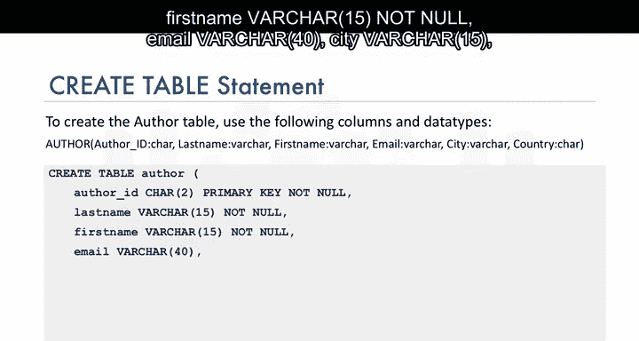

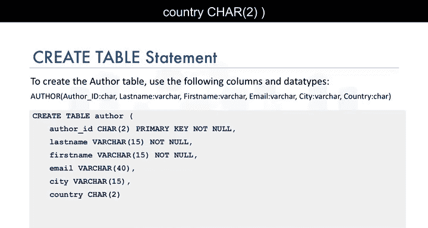

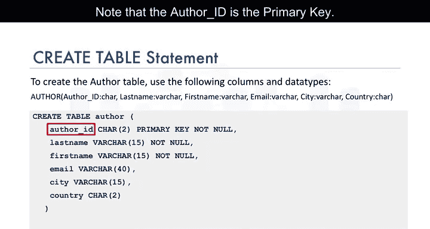

```sql
CREATE TABLE author (
    author_id CHAR(2) PRIMARY KEY NOT NULL,
    last_name VARCHAR(15) NOT NULL,
    first_name VARCHAR(15) NOT NULL,
    email VARCHAR(40),
    city VARCHAR(15),
    country CHAR(2)
);
```

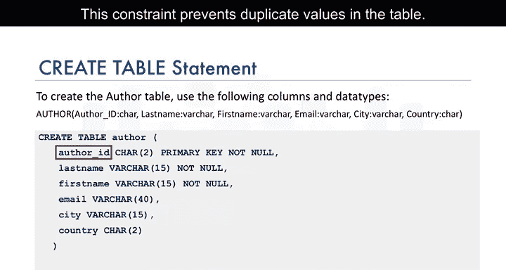

请注意以下几点：
*   `author_id`被定义为主键。这个约束防止表中出现重复的值。
*   `last_name`和`first_name`列有`NOT NULL`约束。这确保了这些字段不能包含空值，因为作者必须有一个名字。

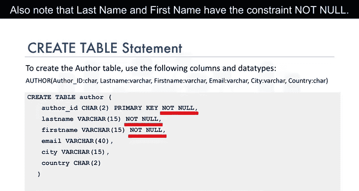

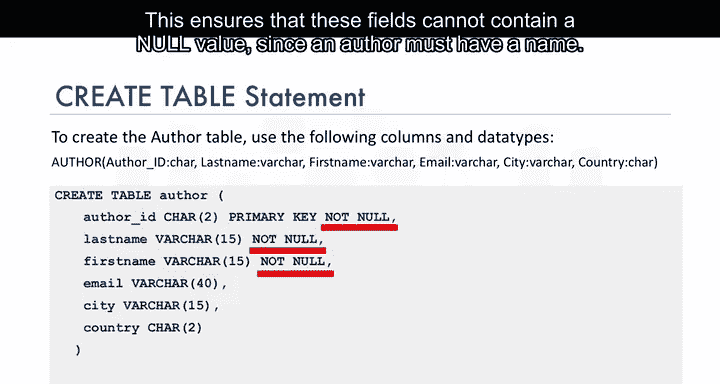

## 总结


本节课中，我们一起学习了`CREATE TABLE`语句。你现在知道：
*   `CREATE TABLE`是一种用于在数据库中创建实体或表的DDL语句。
*   `CREATE TABLE`语句包含了表中列（属性）的定义，包括列名、列的数据类型以及所需的可选约束（如主键约束）。

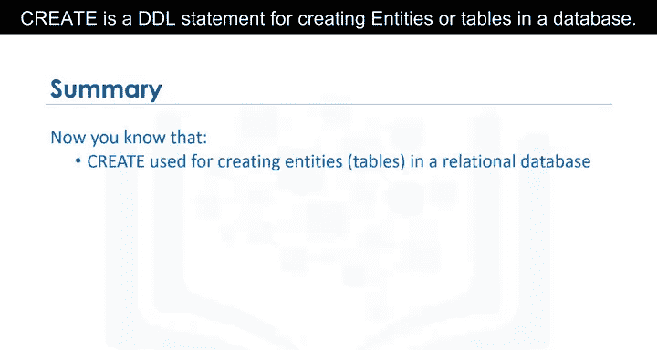

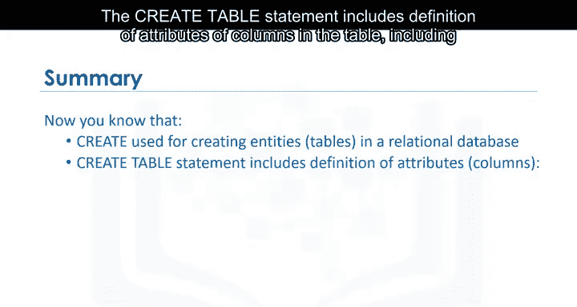

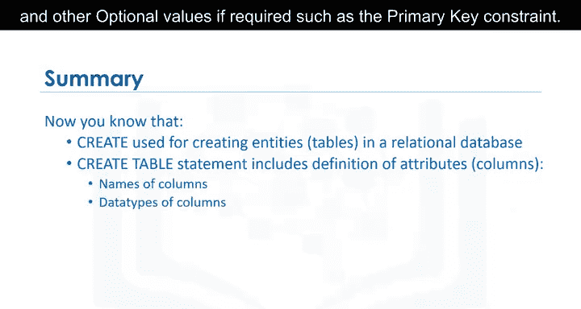


通过掌握`CREATE TABLE`语句，你已经迈出了构建自己数据库结构的第一步。