# 011：云端数据库实例创建 🚀

在本节课中，我们将学习云端数据库的核心概念，并演示如何在IBM Cloud上创建一个DB2数据库服务实例，以便为后续的SQL学习与实践提供环境。

---

## 概述

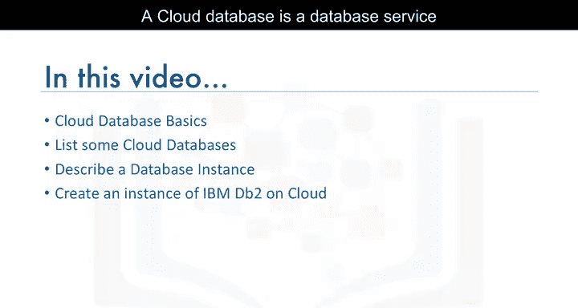

学习SQL前，需要一个可供练习查询的数据库。在云端创建数据库实例是一种便捷的方法。完成本课后，你将能够理解云端数据库的基本概念，列举几种云端数据库，描述数据库服务实例，并掌握在IBM DB2 on Cloud上创建服务实例的步骤。

---

## 什么是云端数据库？ ☁️

云端数据库是通过云平台构建和访问的数据库服务。它具备传统数据库的多数功能，并增加了云计算的灵活性。

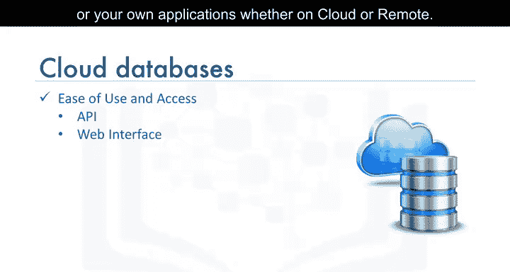

使用云端数据库的优势包括：

*   **易于使用**：用户几乎可以从任何地方，通过供应商的API、Web界面或自己的应用程序（无论是在云端还是远程）访问云端数据库。
*   **可扩展性**：云端数据库可以在运行时动态扩展或收缩其存储和计算能力，以适应不断变化的需求和使用情况，因此组织只需为实际使用的资源付费。
*   **灾难恢复**：在发生自然灾害、设备故障或停电时，数据通过备份保存在云端地理分布式区域的远程服务器上，从而确保安全。

---

## 云端关系型数据库示例

上一节我们介绍了云端数据库的概念，本节中我们来看看一些具体的例子。以下是几种常见的云端关系型数据库服务：

*   IBM DB2 on Cloud
*   IBM Cloud上的Databases for PostgreSQL
*   Oracle Database Cloud Service
*   Microsoft Azure SQL Database
*   Amazon Relational Database Service (RDS)

这些云端数据库可以作为虚拟机运行（由用户自行管理），也可以作为托管服务提供，具体取决于供应商。数据库服务根据服务计划的不同，可以是单租户或多租户模式。

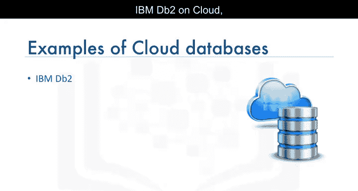

---

## 数据库服务实例

要在云端运行数据库，首先必须在所选云平台上配置一个数据库服务实例。

数据库即服务实例为用户提供了对云端数据库资源的访问，而无需设置底层硬件、安装数据库软件或管理数据库。该服务实例将以相关表格的形式存储你的数据。

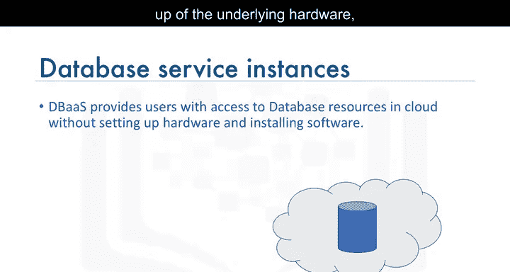

数据加载到数据库实例后，你可以通过Web界面或应用程序中的API连接到该实例。

连接建立后，你的应用程序可以向数据库实例发送SQL查询。数据库实例随后将SQL语句解析为对数据库中数据和对象的操作，并将检索到的任何数据作为结果集返回给应用程序。

---

## 在IBM Cloud上创建DB2实例 🛠️

现在，让我们看看如何在IBM Cloud上为DB2创建一个数据库实例。

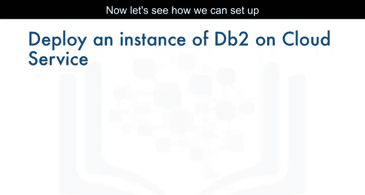

IBM DB2 on Cloud是在云端为你提供的SQL数据库。你可以像使用任何数据库软件一样使用它，但无需承担昂贵的硬件设置、软件安装和维护开销。

以下是设置DB2服务实例的步骤：

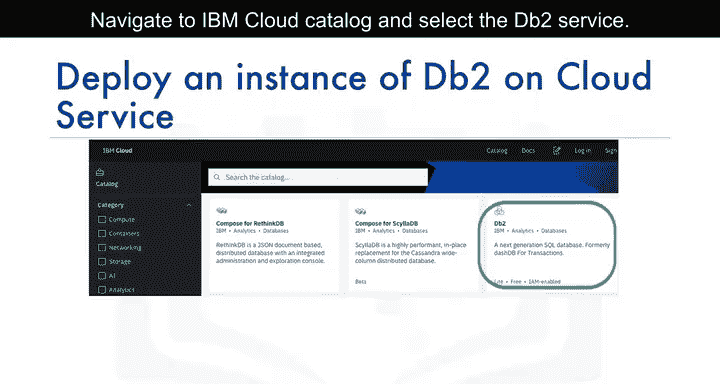

1.  **导航到IBM Cloud目录**：访问IBM Cloud控制台，进入目录。
2.  **选择DB2服务**：在目录中搜索并选择“DB2”服务。请注意，DB2服务有多个变体，包括DB2 Hosted和DB2 Warehouse。出于我们的学习目的，我们将选择提供免费轻量计划的“Db2”服务。
3.  **选择服务计划**：选择“Lite”（免费）计划。如果需要，可以修改默认设置，例如输入服务实例名称、选择部署区域以及为该服务选择组织和空间。
4.  **创建实例**：点击“创建”按钮。

创建完成后，你可以从IBM Cloud仪表板的“服务”列表中查看已创建的IBM DB2服务。

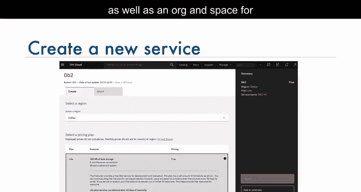

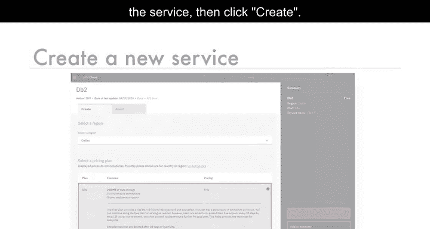

---

## 管理数据库实例

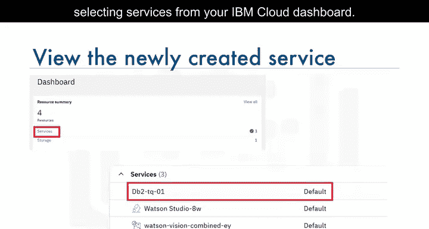

从服务仪表板，你可以管理你的数据库实例。例如，点击“打开控制台”按钮可以启动数据库实例的Web控制台。

Web控制台允许你执行以下操作：

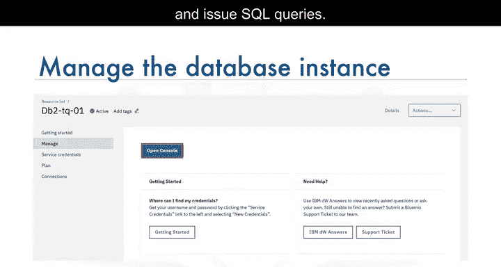

*   创建表格
*   加载数据
*   浏览表格中的数据
*   执行SQL查询

---

## 获取连接凭证 🔑

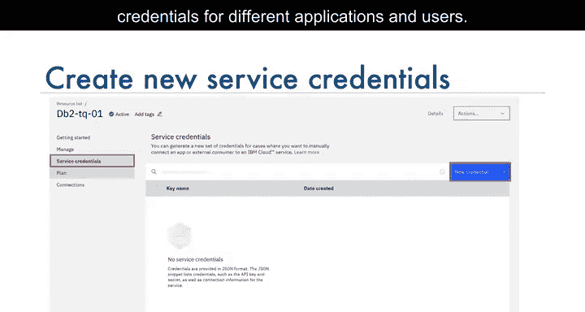

为了从你的应用程序访问数据库实例，你需要服务凭证。首次使用时，你需要创建一组新的凭证。你也可以选择为不同的应用程序和用户创建多组凭证。

创建一组服务凭证后，你可以将其视为一个JSON代码片段查看。凭证包含建立数据库连接所需的详细信息，主要包括：

*   **数据库名称** (`database`)
*   **端口号** (`port`)
*   **主机名** (`hostname`): 这是你的数据库实例所在的云端服务器名称。
*   **用户名** (`username`): 用于连接的用户ID，默认情况下也是你的表将被创建于其中的模式名称。
*   **密码** (`password`)

---

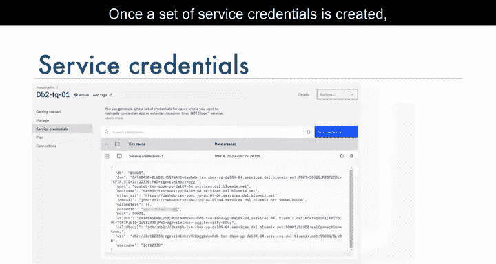

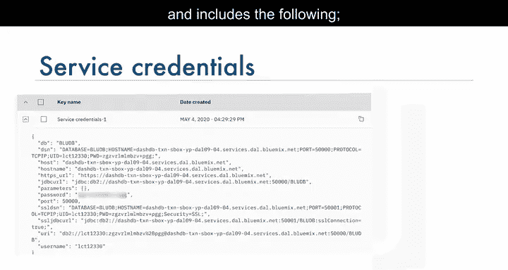

## 总结

本节课中，我们一起学习了云端数据库的基本概念及其优势，了解了几种流行的云端关系型数据库服务。我们重点演示了如何在IBM Cloud上创建并配置一个DB2数据库服务实例，包括选择计划、创建实例、使用Web控制台进行管理以及获取必要的连接凭证。现在，你已经掌握了创建个人云端数据库环境的方法，可以开始进行SQL查询的实践了。