# 012：使用SELECT语句检索数据 - 字符串模式与范围查询 📊

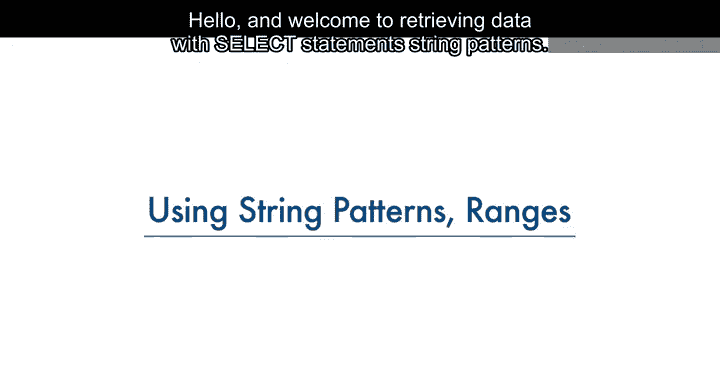

在本节课中，我们将学习从关系数据库表中检索数据的一些高级技巧。具体来说，我们将了解如何通过使用字符串模式、数值范围或值集合来简化SELECT语句。

---


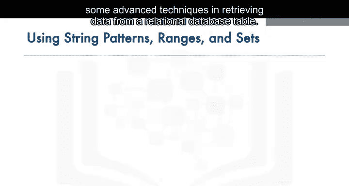

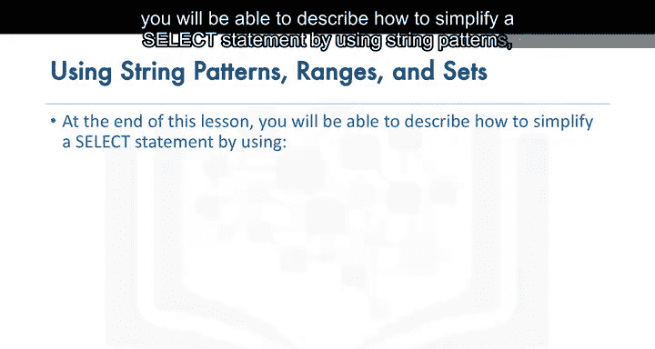

## 数据库检索的基本目的

数据库管理系统的主要目的不仅是存储数据，还要便于以最简单的形式检索数据。

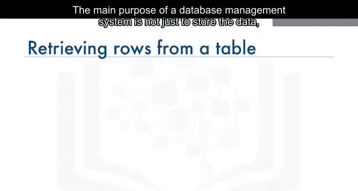

最基本的SELECT语句是：
```sql
SELECT * FROM table_name;
```

基于简化的图书馆数据库模型和`book`表，执行`SELECT * FROM book;`会返回一个包含四行的结果集。该语句会显示`book`表中所有列的所有数据行。

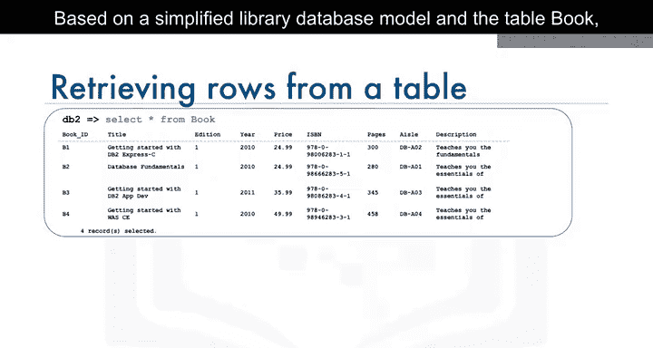

或者，也可以只检索表中列的子集。例如，仅从`book`表中选择两列，比如`book_id`和`title`。

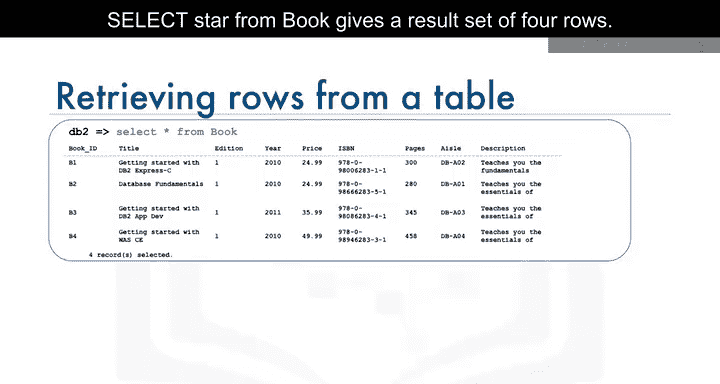

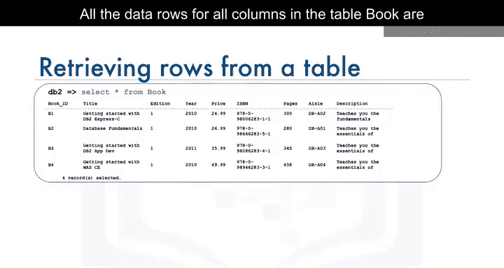

---

## 使用WHERE子句限制结果集


可以通过使用WHERE子句来限制结果集。例如，可以选择`book_id`为`B1`的图书标题：
```sql
SELECT title FROM book WHERE book_id = 'B1';
```

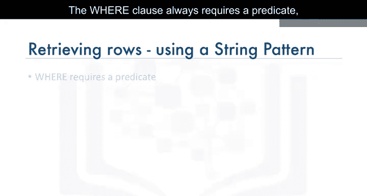

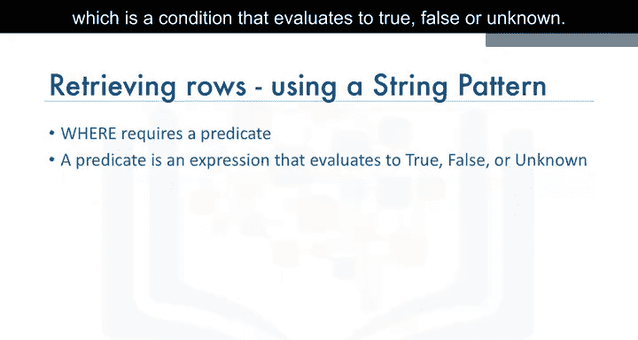

但是，如果我们不完全知道在WHERE子句中指定什么值，该怎么办？

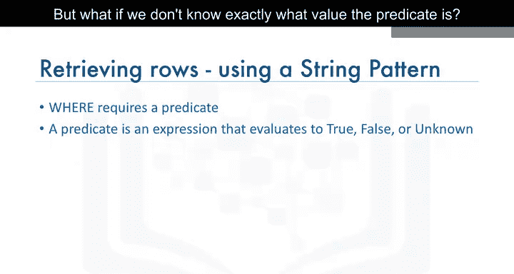

WHERE子句总是需要一个谓词，即一个评估为真、假或未知的条件。

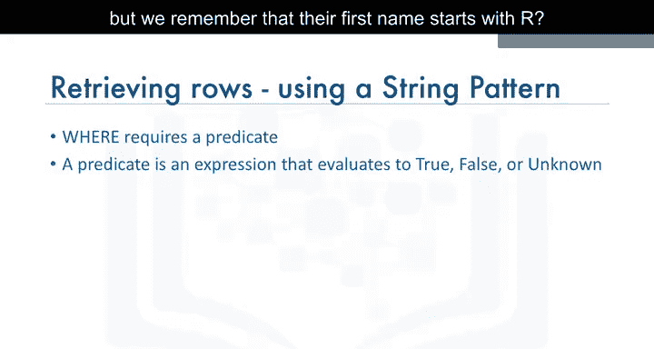

---

## 使用字符串模式进行模糊查询

如果我们记不清作者的确切名字，但记得他们的名字以字母`R`开头，该怎么办？

在关系数据库中，我们可以使用字符串模式来搜索符合此条件的数据行。

让我们看一些使用字符串模式的例子。如果我们记不清作者的名字，但记得他们的名字以`R`开头，我们可以在WHERE子句中使用`LIKE`谓词。

`LIKE`谓词用于在WHERE子句中搜索列中的模式。百分号`%`用于定义缺失的字母。百分号可以放在模式之前、之后或前后都有。在这个例子中，我们在模式（字母`R`）后面使用百分号。

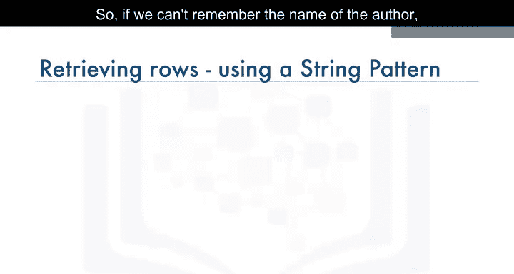

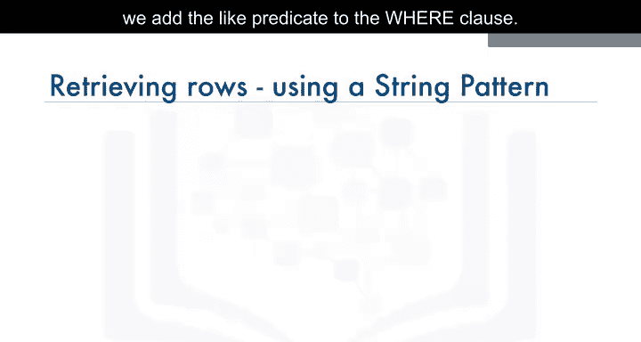

百分号被称为通配符。通配符用于替代其他字符。

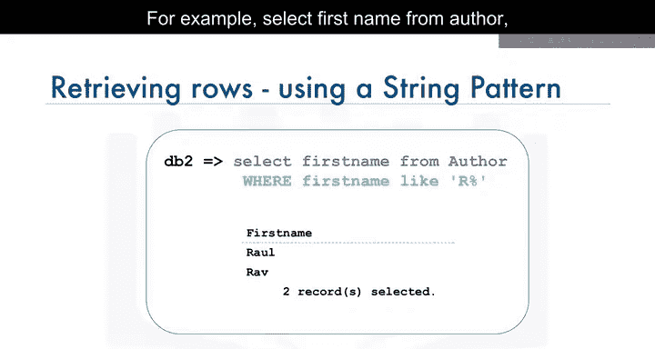

因此，如果我们记不清作者的名字，但记得他们的名字以字母`R`开头，我们可以在WHERE子句中添加`LIKE`谓词。

例如：
```sql
SELECT first_name FROM author WHERE first_name LIKE 'R%';
```

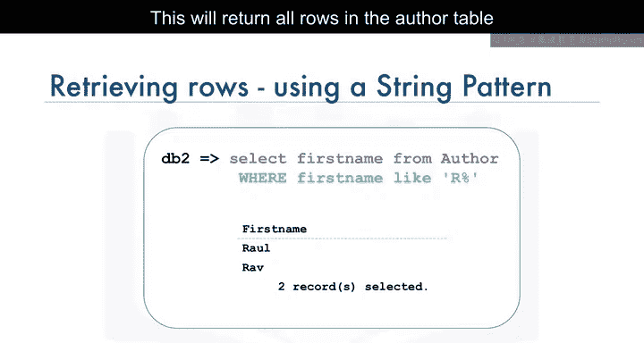

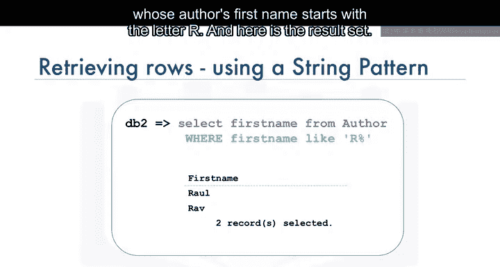

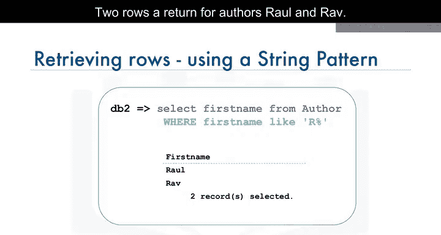

这将返回`author`表中所有作者名字以字母`R`开头的行。结果集将返回两行：`Raoul`和`Rph`。

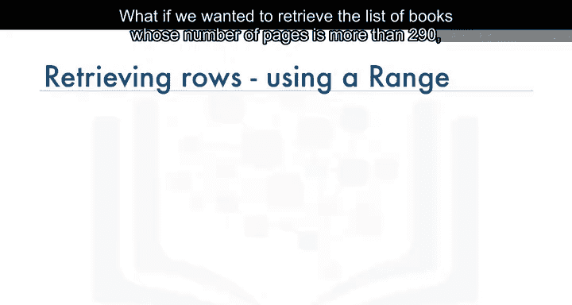

---

## 使用范围进行查询

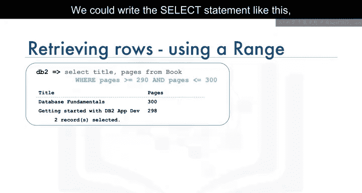

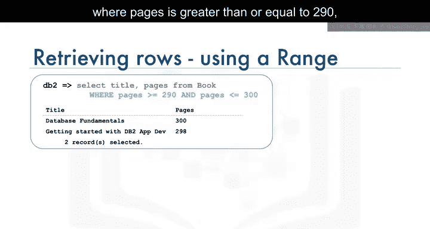

如果我们想检索页数大于290但小于300的图书列表，该怎么办？

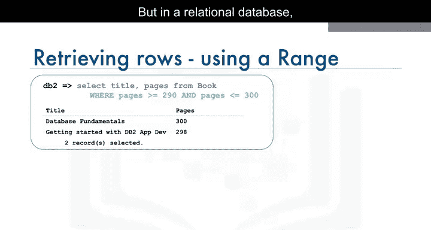

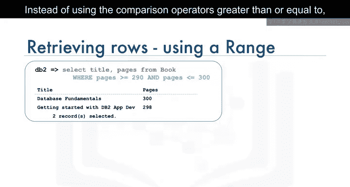

我们可以这样编写SELECT语句，将WHERE子句指定为`WHERE pages >= 290 AND pages <= 300;`。

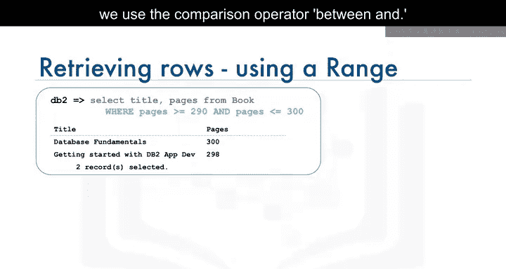

但在关系数据库中，我们可以使用数值范围来指定相同的条件。

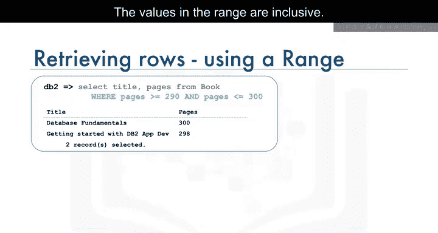

我们可以使用比较运算符`BETWEEN AND`，而不是使用大于等于运算符。`BETWEEN AND`比较两个值，范围中的值是包含在内的。

在这种情况下，我们重写查询，将WHERE子句指定为`WHERE pages BETWEEN 290 AND 300;`。结果集是相同的，但SELECT语句编写起来更容易、更快捷。

---

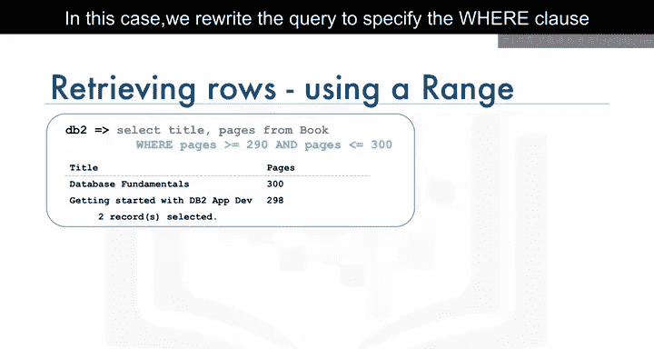

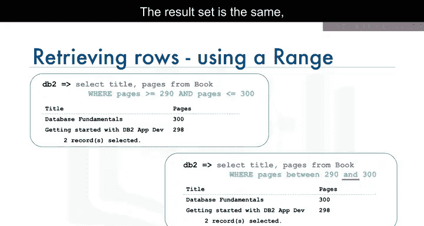

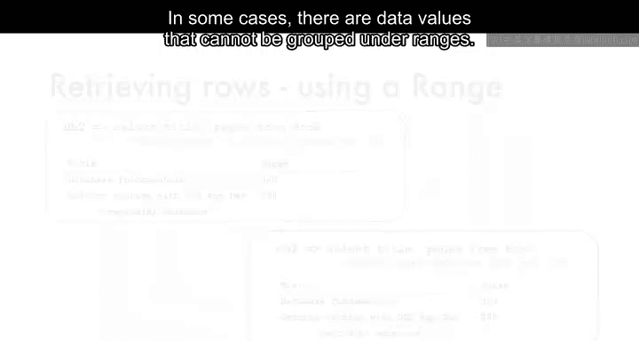

## 使用值集合进行查询

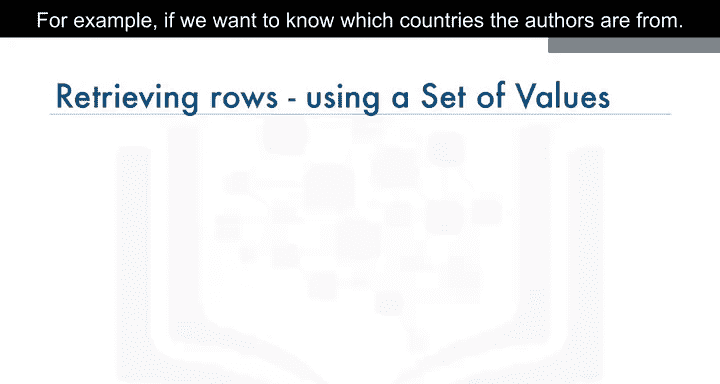

在某些情况下，有些数据值无法按范围分组。例如，如果我们想知道作者来自哪些国家。

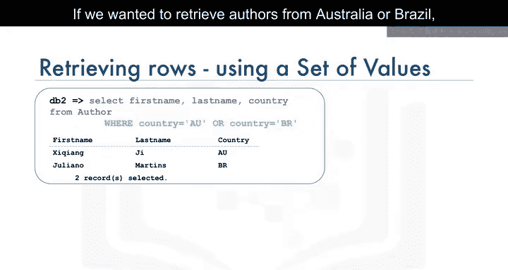

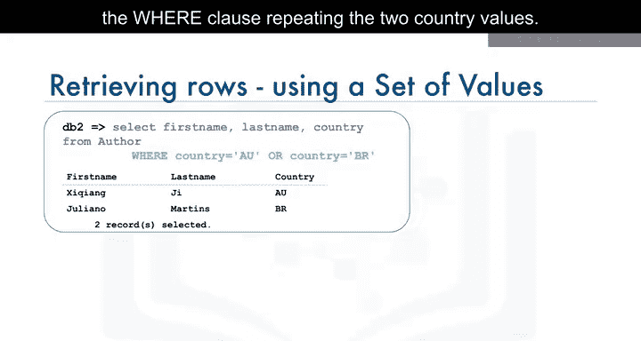

如果我们想检索来自澳大利亚或巴西的作者，可以编写带有WHERE子句的SELECT语句，重复列出这两个国家值。

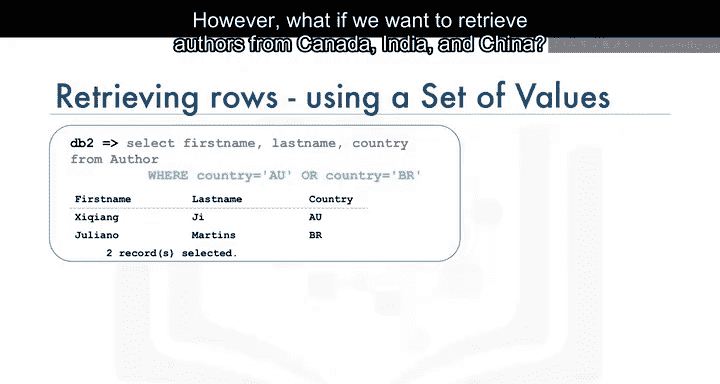

但是，如果我们想检索来自加拿大、印度和中国的作者，WHERE子句会变得非常长，需要重复列出所需的国家条件。

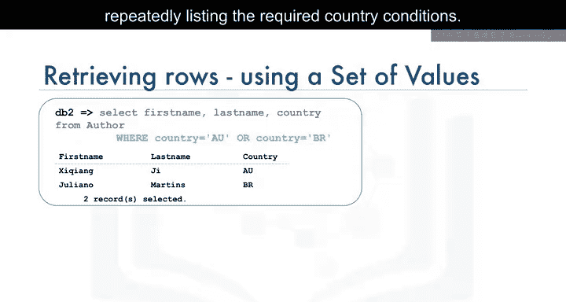

相反，我们可以使用`IN`运算符。`IN`运算符允许我们在WHERE子句中指定一组值。该运算符接受一个表达式列表进行比较。在这种情况下，国家是澳大利亚或巴西。

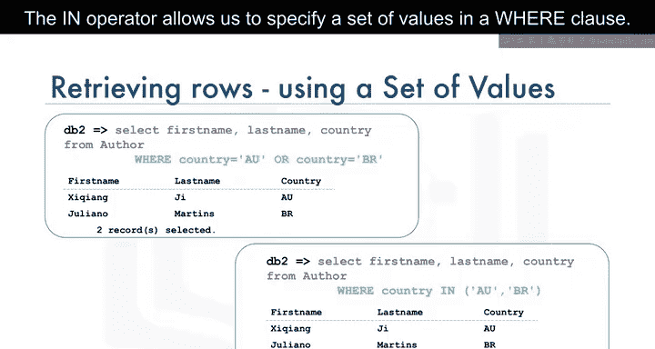

---

## 总结

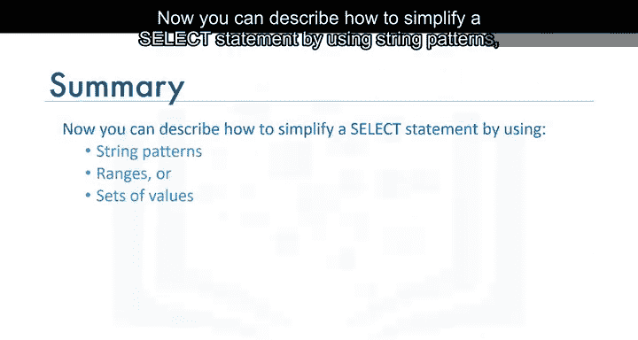

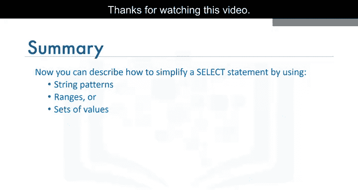

本节课中，我们一起学习了如何通过使用字符串模式、数值范围或值集合来简化SELECT语句。这些技巧能帮助我们更灵活、高效地从数据库中检索所需数据。