# 013：结果集排序 📊

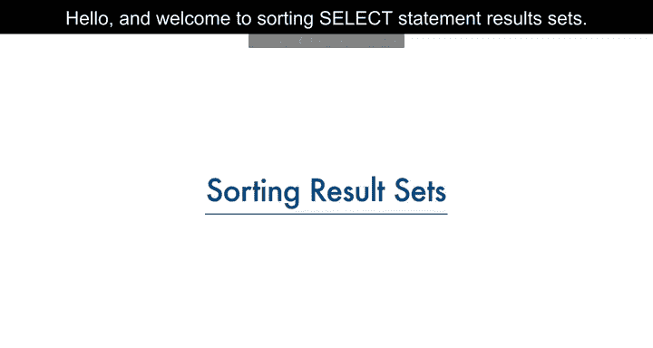

在本节课中，我们将学习如何从关系数据库表中检索数据，并掌握对结果集进行排序的高级技巧。排序功能能让查询结果更有序、更易于分析。

---

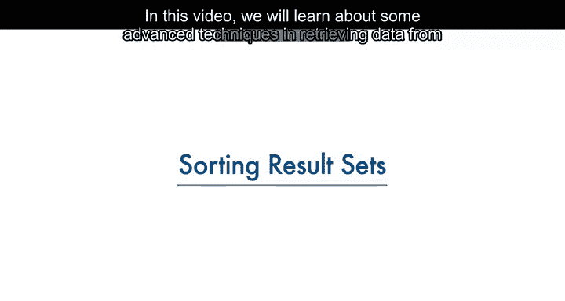

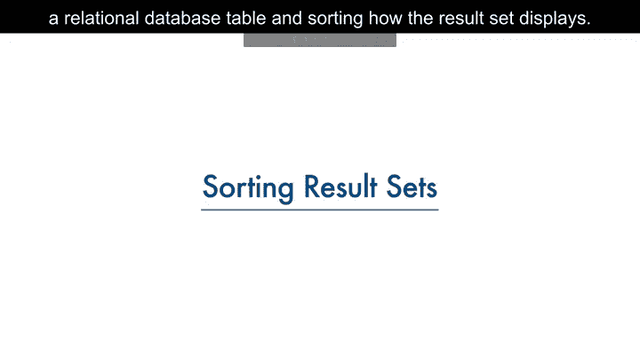

## 概述

数据库管理系统的主要目的不仅是存储数据，还要便于数据的检索。最基本的 `SELECT` 语句是 `SELECT * FROM table_name`。然而，查询出的结果集默认可能没有特定的顺序。为了使结果更清晰、更有用，我们需要学习如何使用 `ORDER BY` 子句对结果进行排序。

上一节我们介绍了基本的 `SELECT` 语句，本节中我们来看看如何使用 `ORDER BY` 子句对查询结果进行排序。

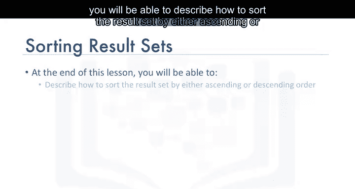

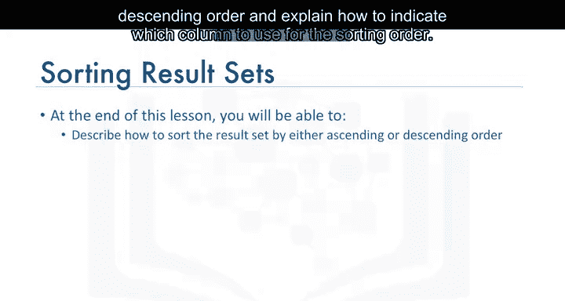

---

## 使用 `ORDER BY` 子句排序


`ORDER BY` 子句用于在查询中根据指定的列对结果集进行排序。默认情况下，排序是升序的。

### 基本语法

```sql
SELECT column_name
FROM table_name
ORDER BY column_name;
```

例如，从一个简化的图书馆数据库 `book` 表中查询所有书名：

```sql
SELECT title FROM book;
```

结果可能没有特定顺序。为了按书名字母顺序显示，我们添加 `ORDER BY` 子句：

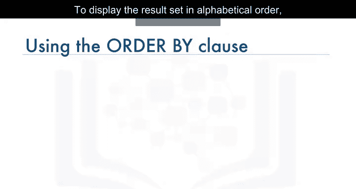

```sql
SELECT title FROM book ORDER BY title;
```

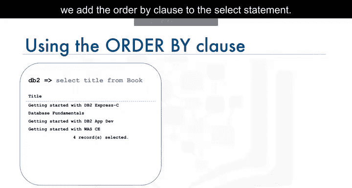

结果集现在按书名的字母升序排列。

---

## 指定排序方向：升序与降序

默认排序是升序（`ASC`）。若要按降序排序，需使用 `DESC` 关键字。

### 降序排序示例

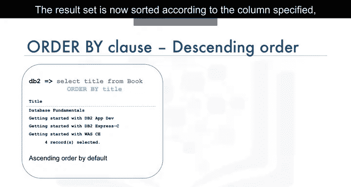

```sql
SELECT title FROM book ORDER BY title DESC;
```

结果集将按书名的字母降序排列。注意，当书名开头字符相同时，排序会从第一个不同的字符开始比较。

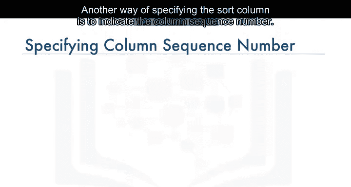

---

## 按列序号排序

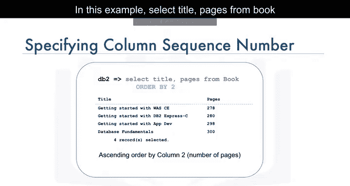

除了使用列名，还可以使用列在 `SELECT` 列表中的序号来指定排序列。

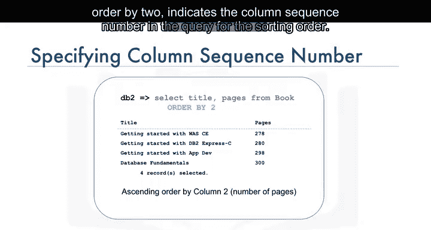

以下是按列序号排序的方法：

```sql
SELECT title, pages FROM book ORDER BY 2;
```

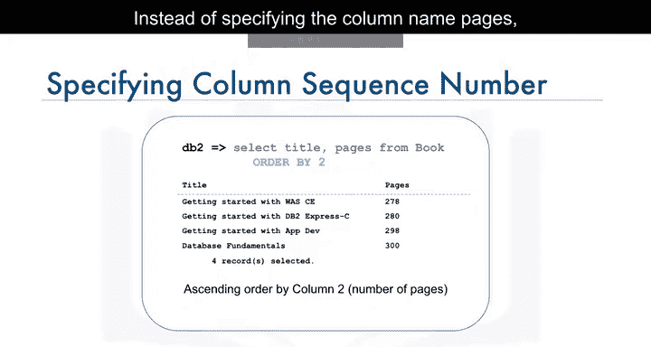

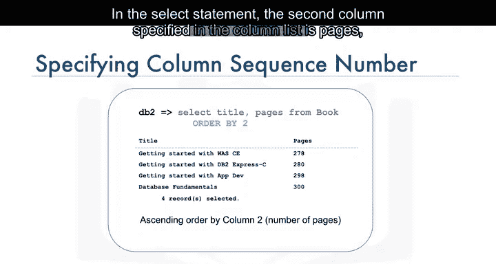

在这个例子中，数字 `2` 代表 `SELECT` 语句中列出的第二列，即 `pages` 列。因此，结果集将根据 `pages` 列的值进行升序排序。

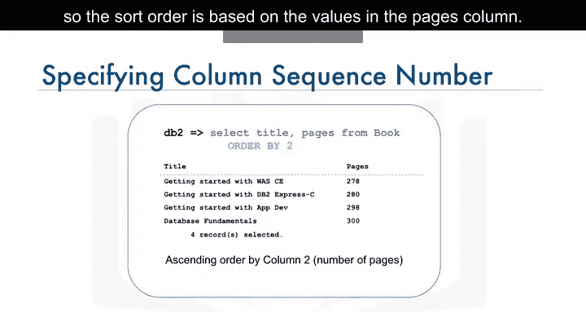

结果集会按照书籍的页数从少到多显示。

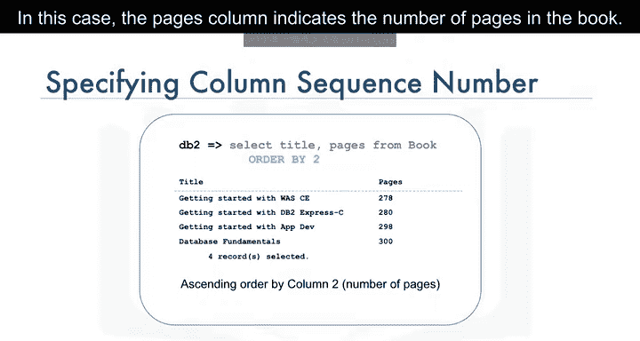

---

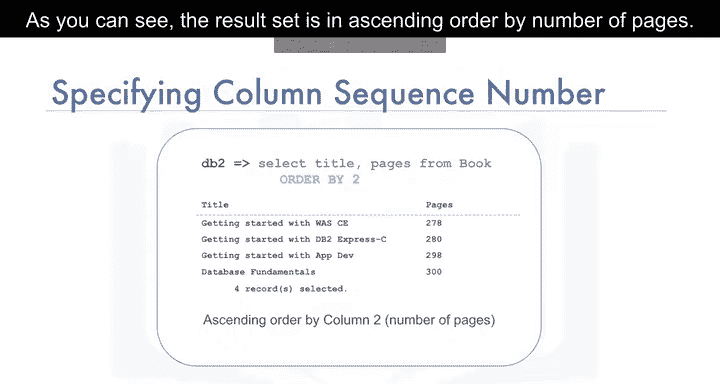

## 总结

本节课中我们一起学习了如何使用 `ORDER BY` 子句对 SQL 查询结果进行排序。我们掌握了如何按升序或降序排列结果，并了解了可以通过列名或列在查询中的序号来指定排序列。这些技巧能帮助你更有效地组织和分析从数据库中检索出的数据。

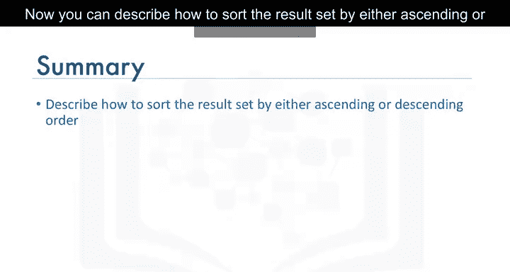

---

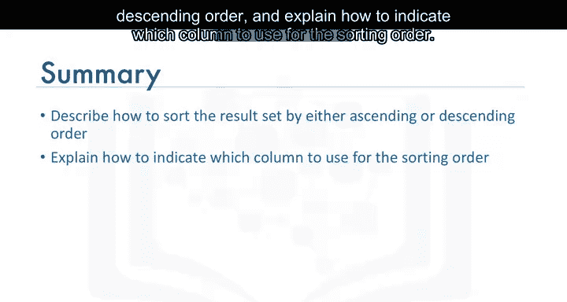

感谢观看本视频。