# 016：SQL日期与时间函数详解

在本节课中，我们将学习SQL中内置的日期与时间函数。这些函数能帮助我们处理和提取日期、时间数据，进行日期计算，从而更好地分析和操作数据库中的时间相关信息。


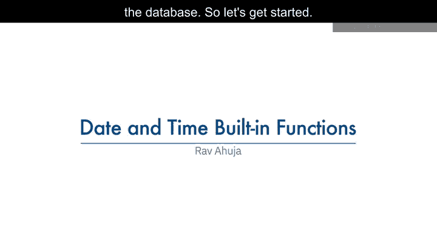

---

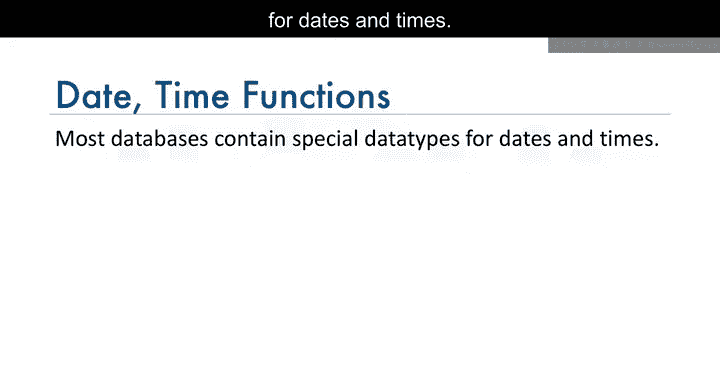

大多数数据库都包含用于存储日期和时间的特殊数据类型。

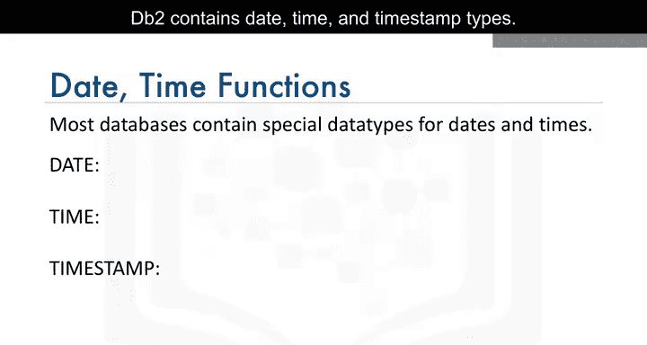

在DB2数据库中，主要包含三种时间相关的数据类型：**DATE**、**TIME**和**TIMESTAMP**。

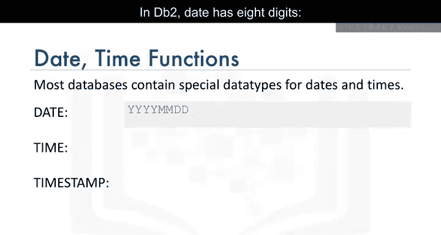

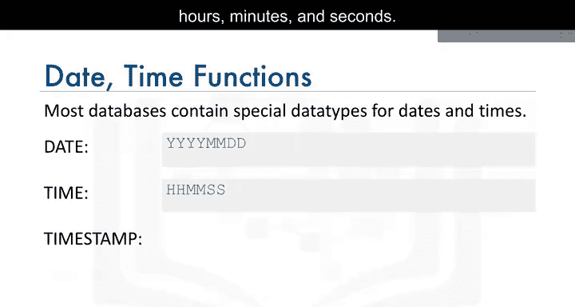

*   **DATE**类型：使用8位数字表示，格式为**年-月-日**。
*   **TIME**类型：使用6位数字表示，格式为**时:分:秒**。
*   **TIMESTAMP**类型：使用20位数字表示，格式为**年-月-日 时:分:秒.微秒**。其中，`XX`代表月份，`ZZZZZZ`代表微秒。

---

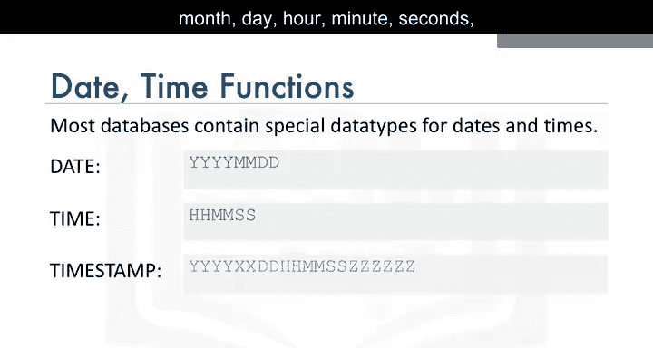

上一节我们介绍了日期和时间的数据类型，本节中我们来看看SQL提供了哪些函数来操作这些数据。

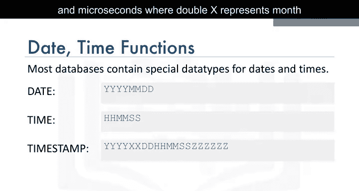

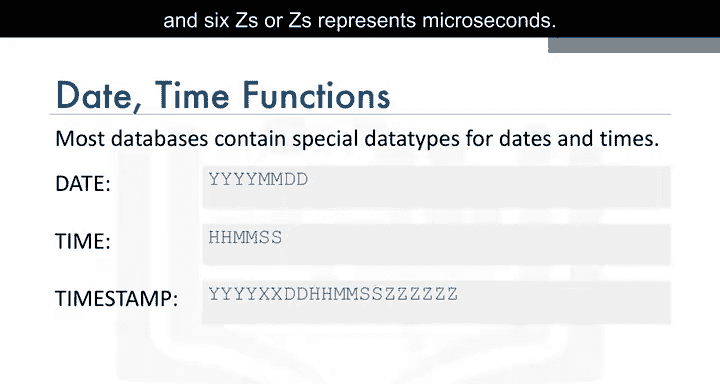

SQL内置了多种函数，用于从日期或时间值中提取特定部分。以下是常用的提取函数：

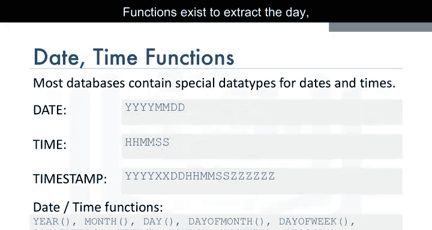

*   **DAY**：提取日期中的“日”部分。
*   **MONTH**：提取日期中的“月”部分。
*   **DAYOFMONTH**：提取日期是该月中的第几天。
*   **DAYOFWEEK**：提取日期是该周中的第几天。
*   **DAYOFYEAR**：提取日期是该年中的第几天。
*   **WEEK**：提取日期是该年中的第几周。
*   **HOUR**：提取时间中的“小时”部分。
*   **MINUTE**：提取时间中的“分钟”部分。
*   **SECOND**：提取时间中的“秒”部分。

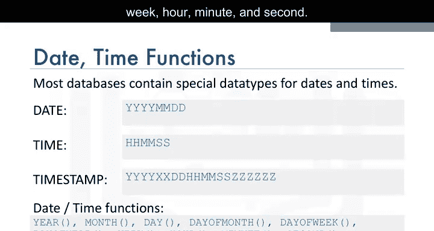

---

了解了基本函数后，让我们通过一些查询示例来具体看看如何使用这些日期和时间函数。

**示例1：提取日期部分**
`DAY`函数可用于从日期中提取“日”的部分。例如，要查询所有涉及猫的救援记录中的救援日期是当月的第几天，可以使用以下SQL语句：

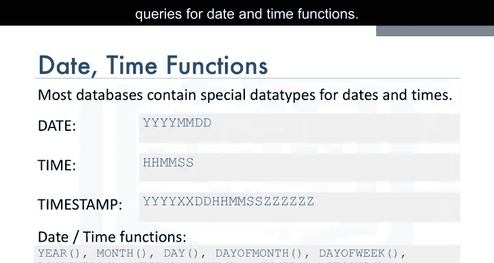

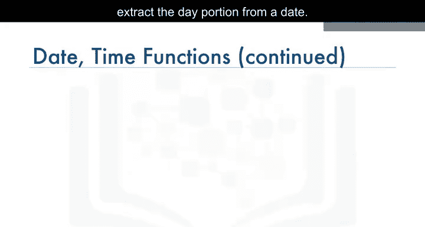

```sql
SELECT DAY(RESCUE_DATE) FROM PETRESCUE WHERE ANIMAL = 'Cat';
```

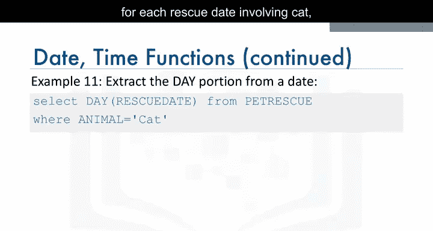

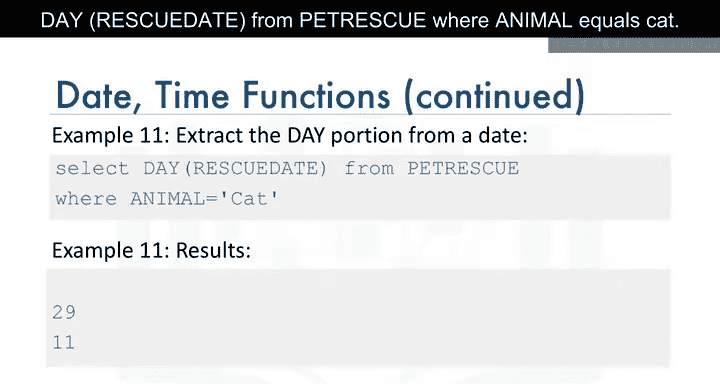

**示例2：在WHERE子句中使用日期函数**
日期和时间函数也可以用在`WHERE`子句中进行条件过滤。例如，要统计五月份（5月）发生的救援次数，可以这样写：

```sql
SELECT COUNT(*) FROM PETRESCUE WHERE MONTH(RESCUE_DATE) = 05;
```

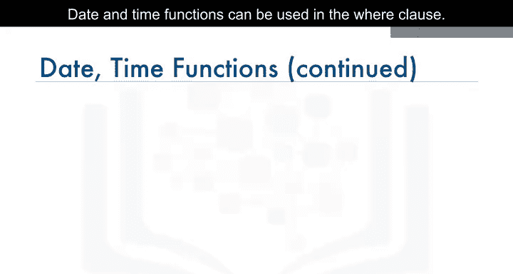

---

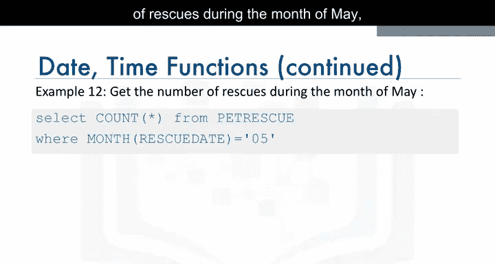

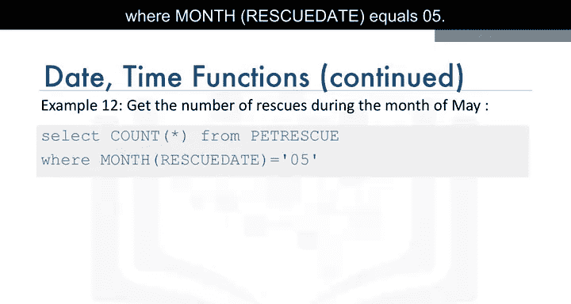

除了提取信息，SQL还支持对日期和时间进行算术运算。

**示例3：日期加法**
例如，如果我们想知道每次救援日期之后三天的日期（可能因为救援需要在三天内处理完毕），可以使用加法运算：

```sql
SELECT RESCUE_DATE + 3 DAYS FROM PETRESCUE;
```


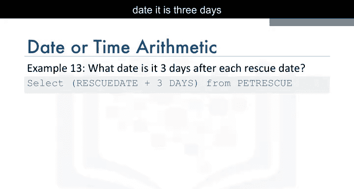

---

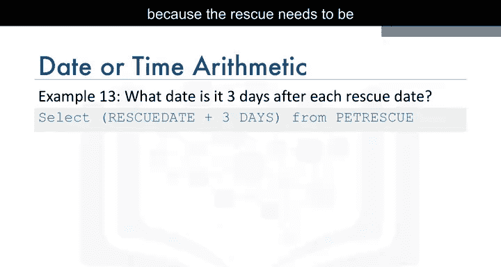

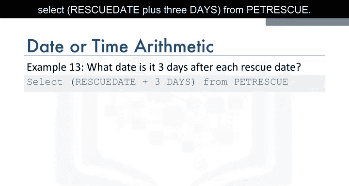

数据库还提供了特殊的寄存器来获取当前时间。

**示例4：计算时间间隔**
`CURRENT_DATE`和`CURRENT_TIME`是用于获取当前日期和时间的特殊寄存器。例如，要计算从每次救援日期到今天已经过去了多少天，可以使用减法：

```sql
SELECT CURRENT_DATE - RESCUE_DATE FROM PETRESCUE;
```
请注意，这种运算的结果通常以**年、月、日**的格式返回。

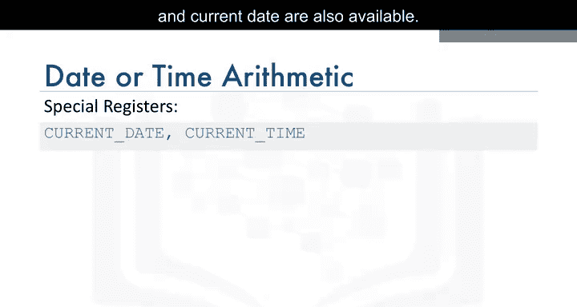

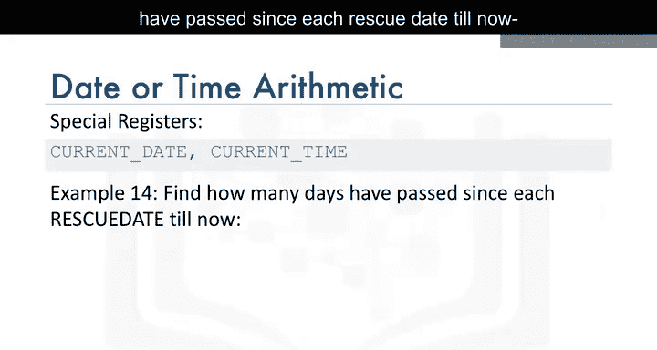

---

本节课中我们一起学习了SQL中处理日期和时间的内置功能。我们首先了解了`DATE`、`TIME`、`TIMESTAMP`等数据类型，然后学习了如何使用`DAY`、`MONTH`、`HOUR`等函数提取日期时间的特定部分，并看到了如何在`SELECT`和`WHERE`子句中应用它们。接着，我们探索了如何对日期进行加减运算，以及如何使用`CURRENT_DATE`等特殊寄存器进行基于当前时间的计算。掌握这些函数对于进行时间序列分析和数据清洗至关重要。