# 017：子查询与嵌套查询 🧩

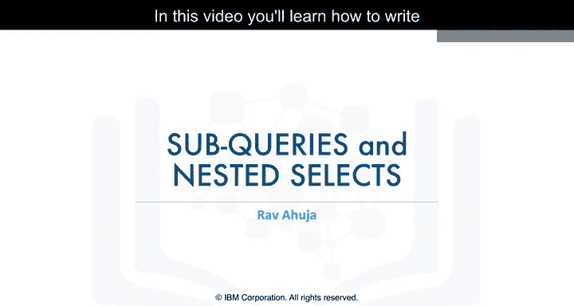

在本节课中，我们将要学习如何使用子查询或嵌套的SELECT语句来构建更强大的SQL查询。子查询允许我们将一个查询的结果作为另一个查询的条件或数据源，从而克服聚合函数在`WHERE`子句中的使用限制，并实现更复杂的数据分析。

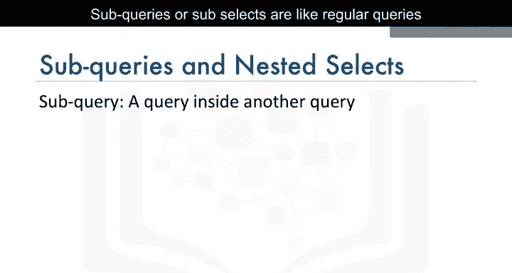

---

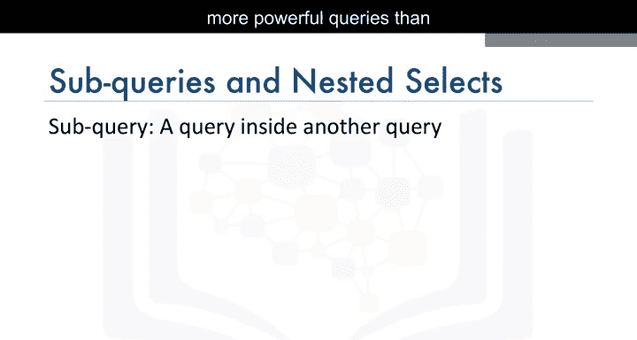

## 什么是子查询？ 🤔

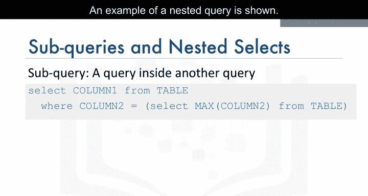

子查询，也称为嵌套查询，是放置在括号内并嵌套在另一个查询中的常规查询。其基本形式如下：

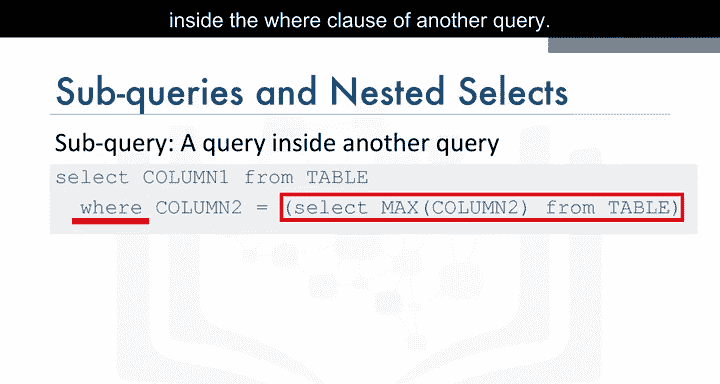

```sql
SELECT column1, column2
FROM table1
WHERE column1 = (SELECT column1 FROM table2 WHERE condition);
```

这使你能够构建比单独使用更强大的查询。

---

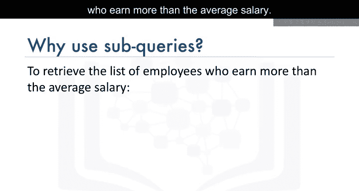

## 在 `WHERE` 子句中使用子查询

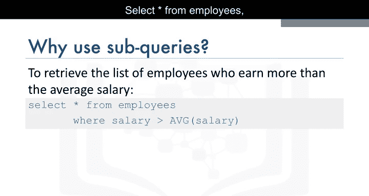

上一节我们介绍了子查询的基本概念，本节中我们来看看如何在`WHERE`子句中使用它来筛选数据。

考虑一个名为`employees`的表，它包含`employee_id`、`first_name`、`last_name`、`salary`等列。假设我们想找出薪水高于平均薪水的所有员工。

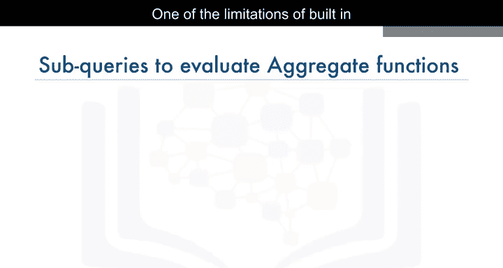

直接尝试以下查询会导致错误，因为聚合函数`AVG()`不能直接在`WHERE`子句中使用：

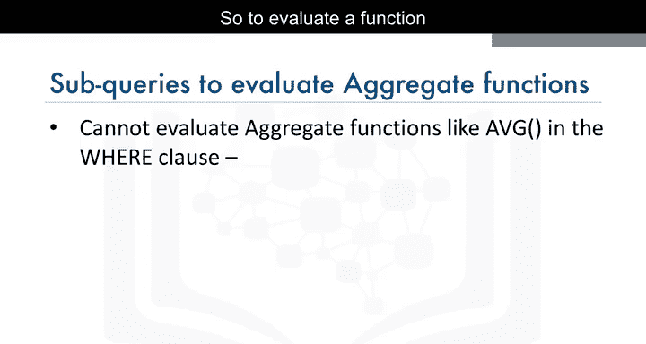

```sql
-- 错误示例
SELECT * FROM employees WHERE salary > AVG(salary);
```

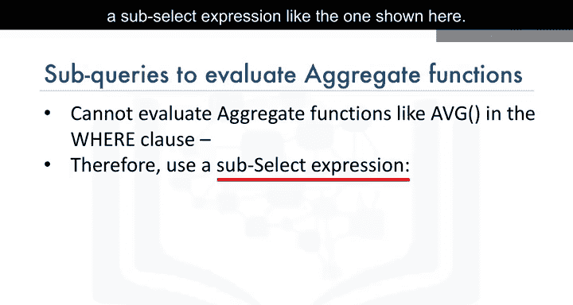

为了在`WHERE`子句中计算平均值，我们可以使用子查询：

```sql
SELECT employee_id, first_name, last_name, salary
FROM employees
WHERE salary > (SELECT AVG(salary) FROM employees);
```

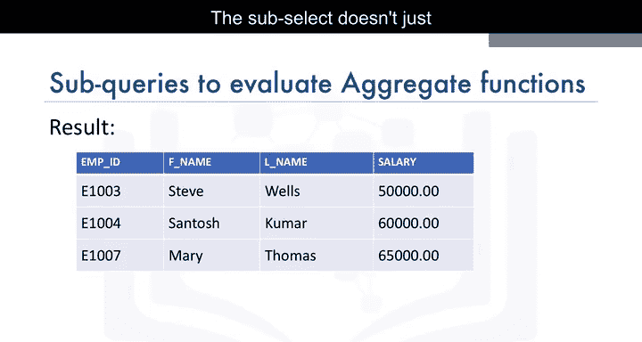

在这个例子中，子查询`(SELECT AVG(salary) FROM employees)`首先计算出平均薪水，然后外层查询使用这个结果来筛选员工。

---

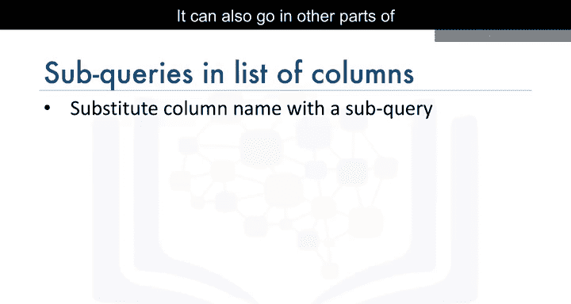

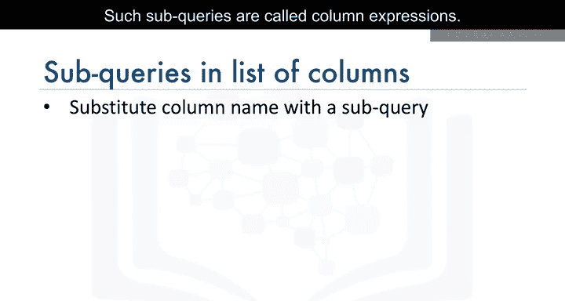

## 在列选择列表中使用子查询（列表达式）

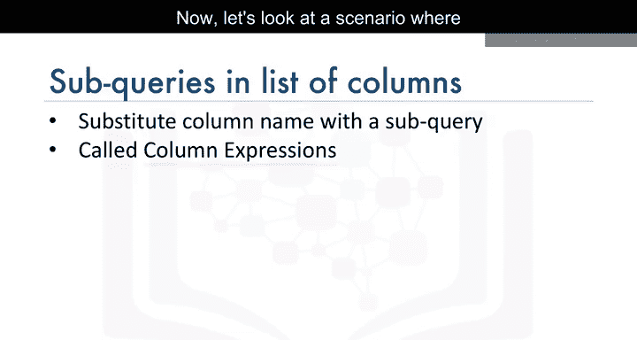

子查询不仅可以放在`WHERE`子句中，还可以放在查询的其他部分，例如要选择的列列表中。这种子查询被称为列表达式。

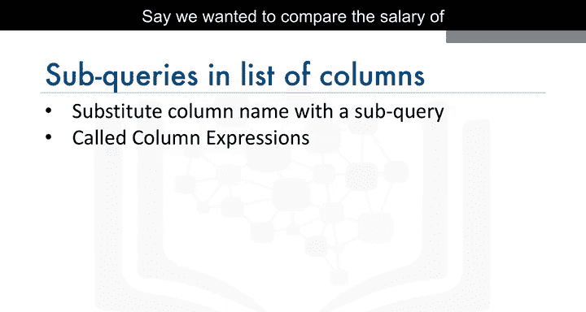

现在，让我们看一个使用列表达式的场景。假设我们想比较每位员工的薪水与公司平均薪水。


直接使用`AVG()`函数而不使用`GROUP BY`子句会导致错误：

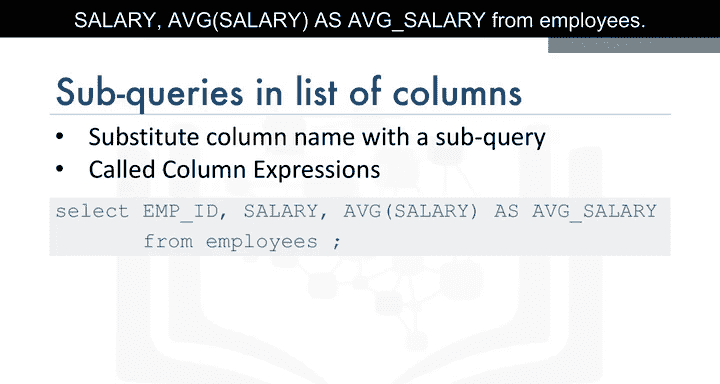

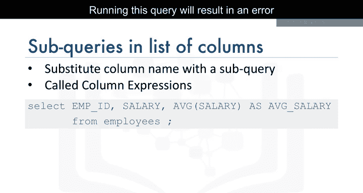

```sql
-- 错误示例
SELECT employee_id, salary, AVG(salary) AS avg_salary FROM employees;
```

我们可以通过在列列表中使用子查询来避免这个错误：


```sql
SELECT employee_id,
       salary,
       (SELECT AVG(salary) FROM employees) AS avg_salary
FROM employees;
```

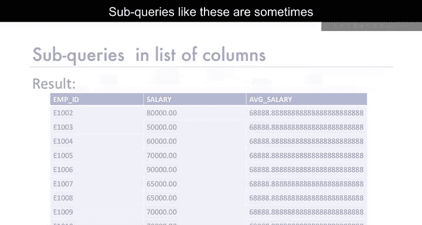

这样，子查询会为结果集中的每一行都计算并返回相同的平均薪水值。

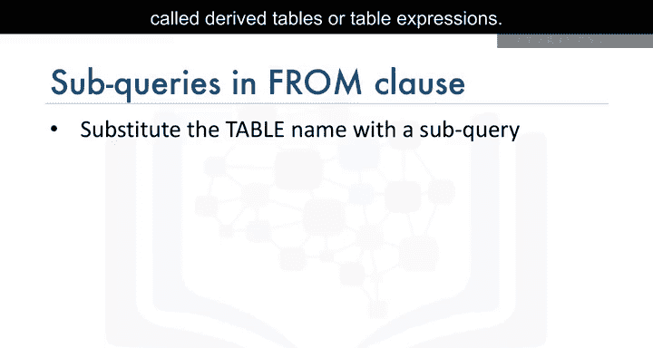

---

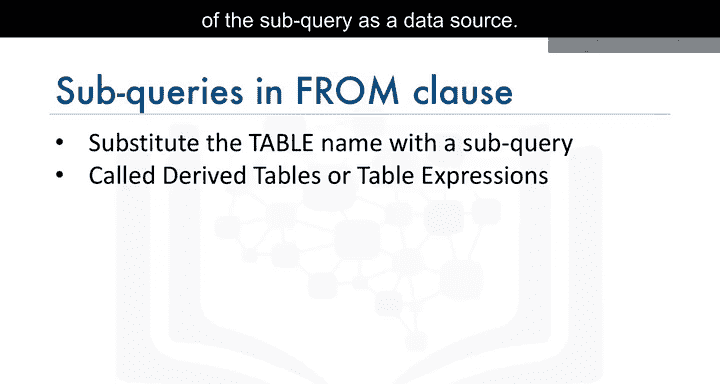

## 在 `FROM` 子句中使用子查询（派生表/表表达式）

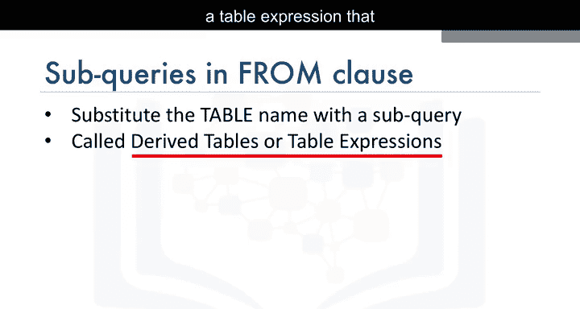

另一种选择是让子查询成为`FROM`子句的一部分。这类子查询有时被称为派生表或表表达式，因为外层查询将子查询的结果用作数据源。

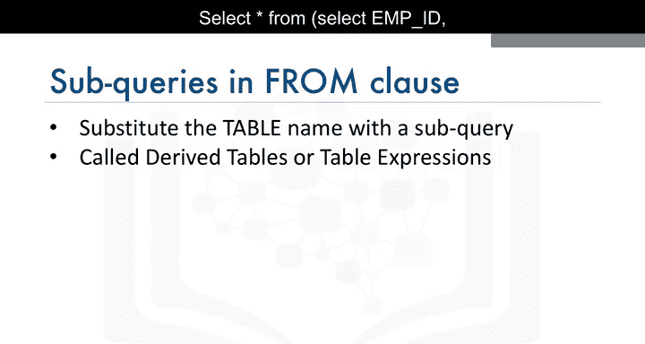

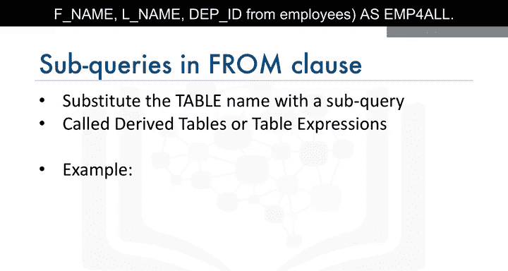

以下是创建派生表的示例，该表包含非敏感的雇员信息：

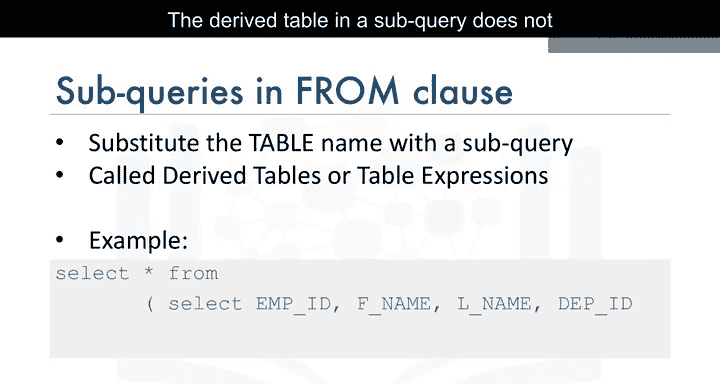

```sql
SELECT *
FROM (SELECT employee_id, first_name, last_name, department_id FROM employees) AS emp_info_all;
```

在这个例子中，子查询中的派生表不包含敏感的字段，如出生日期或薪水。虽然这个例子很简单，但在处理多表连接等更复杂的情况时，这种派生表会非常有用。

---

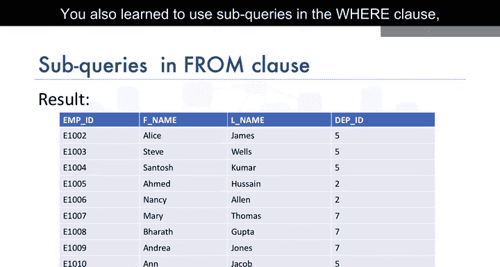

## 总结 📝

本节课中我们一起学习了子查询和嵌套查询的用法。你看到了如何利用它们来构建更丰富的查询，以及它们如何克服聚合函数的一些使用限制。

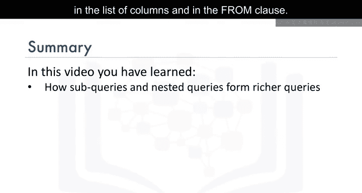

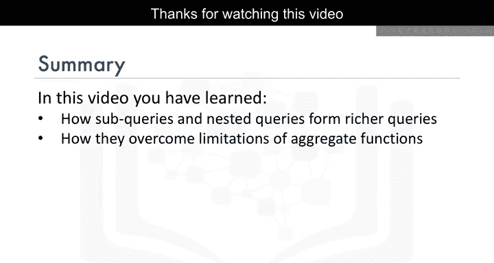

具体来说，我们学习了：
*   在`WHERE`子句中使用子查询来基于聚合结果进行筛选。
*   在列选择列表中使用子查询作为列表达式。
*   在`FROM`子句中使用子查询来创建派生表或表表达式。

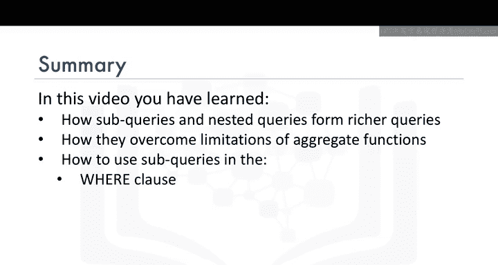

掌握子查询是编写高效、灵活SQL语句的关键一步，它将帮助你在数据科学项目中处理更复杂的数据检索需求。