# 018：多表联合操作 📊

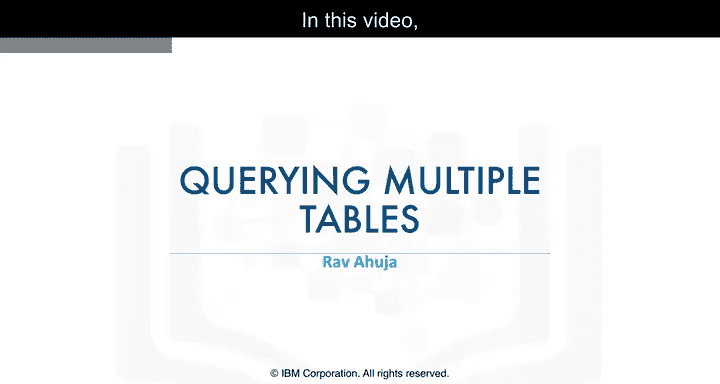

在本节课中，我们将学习如何编写查询以访问多个数据库表。我们将重点介绍两种方法：子查询和隐式连接。这些技术能帮助我们从多个表中提取和组合数据，是数据科学中处理复杂查询的基础。

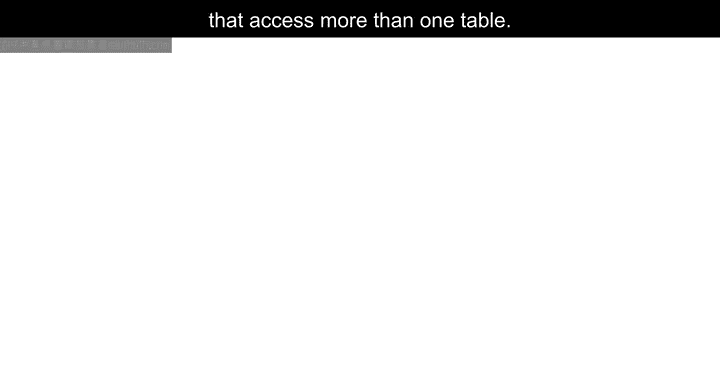

---

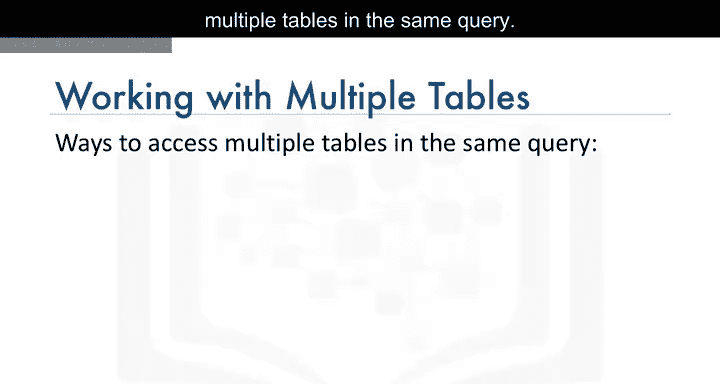

## 概述

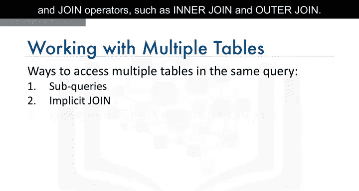

在之前的课程中，我们学习了如何从单个表中查询数据。然而，实际应用中，数据通常分布在多个表中。本节将介绍两种访问多表数据的方法：子查询和隐式连接。通过掌握这些技巧，你将能够执行更复杂的数据检索操作。

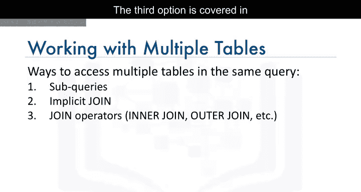

---

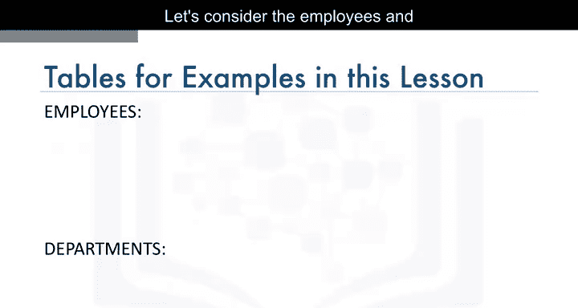

## 使用子查询访问多表

上一节我们介绍了子查询的基本概念，本节中我们来看看如何利用子查询处理多个表。

子查询允许我们将一个查询的结果作为另一个查询的输入。以下是使用子查询的几个示例。

### 示例1：检索存在于部门表中的员工记录

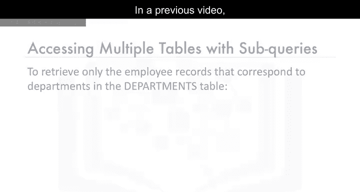

假设我们有一个`employees`表和一个`departments`表。我们只想检索那些部门ID存在于`departments`表中的员工记录。

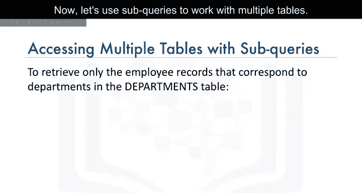

以下是实现此目标的SQL代码：

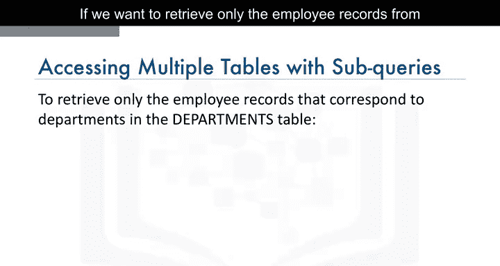

```sql
SELECT * FROM employees
WHERE DepartmentID IN (SELECT DepartmentID FROM departments);
```

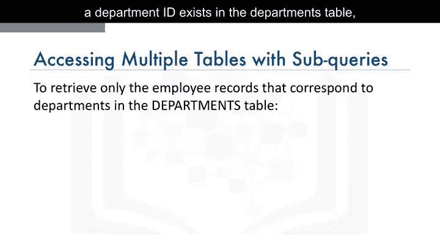

在这个查询中，外部查询访问`employees`表，而子查询从`departments`表中获取部门ID列表，用于过滤外部查询的结果集。

### 示例2：根据地点检索员工

如果我们想检索特定地点（例如`L0002`）的员工，但`employees`表中没有地点信息，而`departments`表中有`LocationID`列，我们可以使用子查询。

以下是相应的SQL代码：

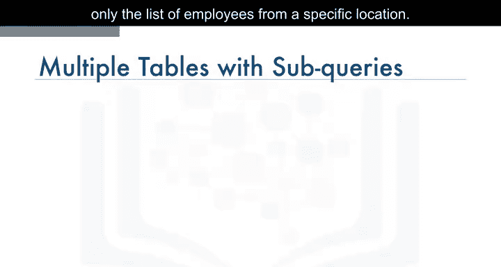

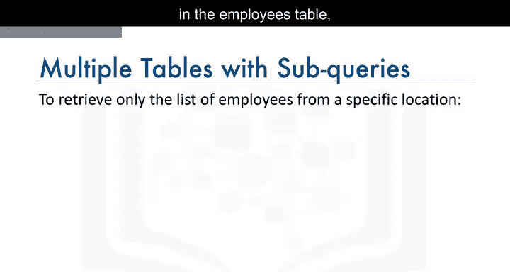

```sql
SELECT * FROM employees
WHERE DepartmentID IN (
    SELECT DepartmentID FROM departments
    WHERE LocationID = 'L0002'
);
```

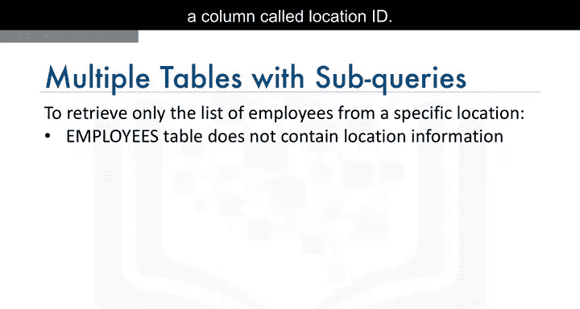

### 示例3：检索高薪员工的部门信息

现在，假设我们需要获取薪水超过70,000美元的员工的部门ID和部门名称。这需要结合`employees`表和`departments`表的数据。

以下是实现此目标的SQL代码：

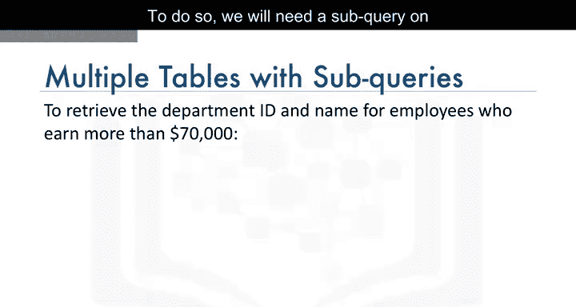

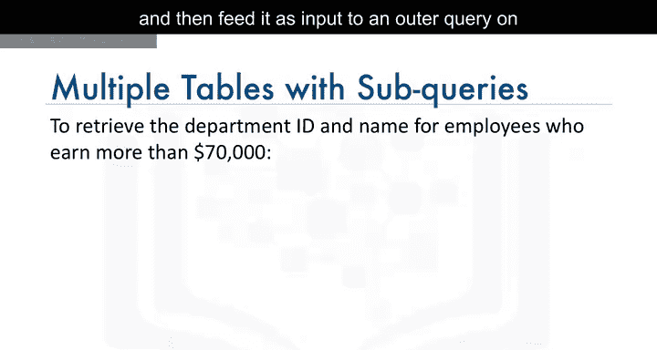

```sql
SELECT DepartmentID, DepartmentName FROM departments
WHERE DepartmentID IN (
    SELECT DepartmentID FROM employees
    WHERE Salary > 70000
);
```

在这个例子中，子查询从`employees`表中筛选出薪水符合条件的员工，然后外部查询从`departments`表中获取匹配的部门信息。

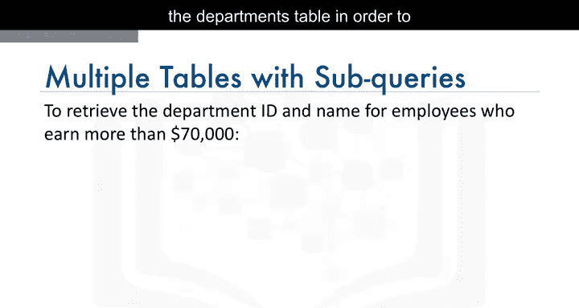

---

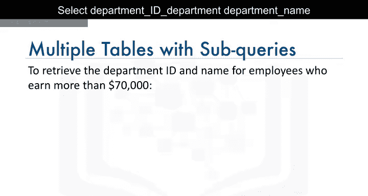

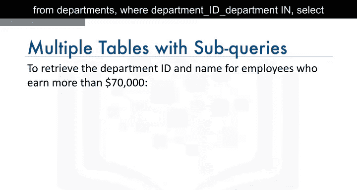

## 使用隐式连接访问多表

除了子查询，我们还可以通过在`FROM`子句中指定多个表来访问它们。这种方法称为隐式连接。

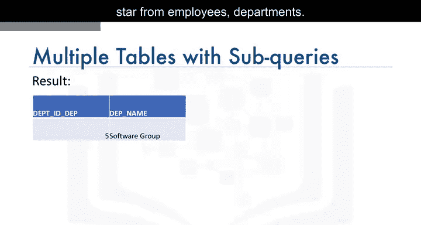

### 示例4：全连接（笛卡尔积）

考虑以下查询：

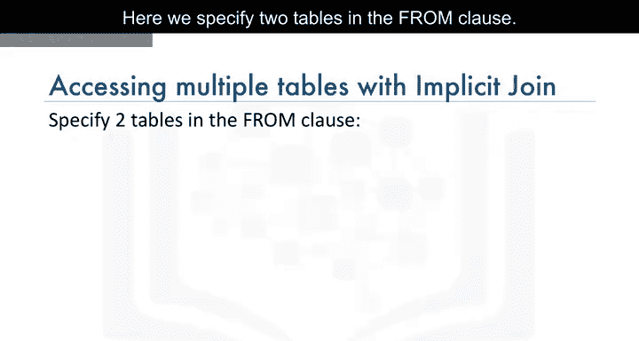

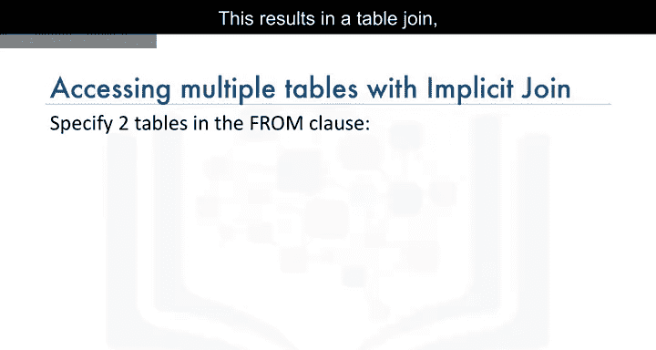

```sql
SELECT * FROM employees, departments;
```

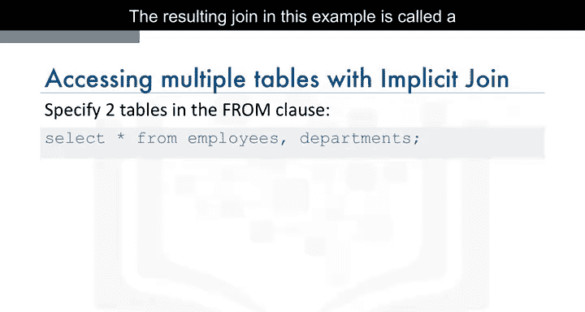

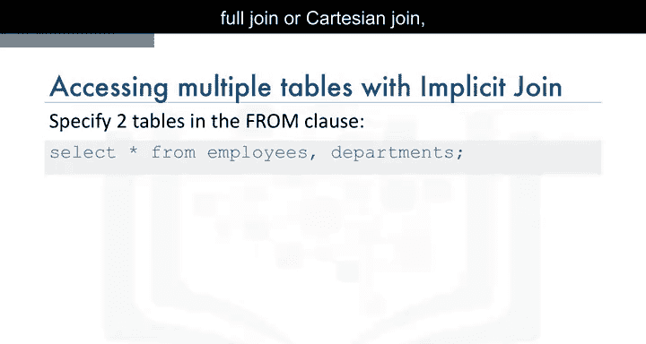

这个查询将`employees`表的每一行与`departments`表的每一行进行组合，生成一个全连接（也称为笛卡尔积）。结果集中的行数会远多于两个表单独的行数。

### 示例5：限制结果集为匹配的部门ID

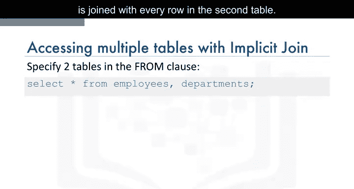

为了限制结果集，我们可以在`WHERE`子句中添加条件，只返回部门ID匹配的行。

以下是相应的SQL代码：

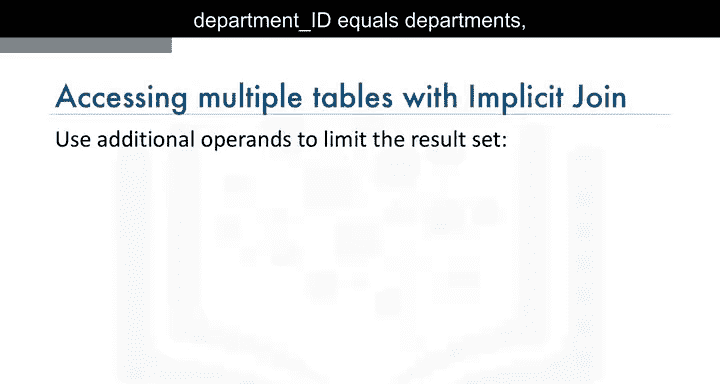

```sql
SELECT * FROM employees, departments
WHERE employees.DepartmentID = departments.DepartmentID;
```

注意，在`WHERE`子句中，我们使用表名作为列名的前缀，以完全限定列名。这是因为不同的表可能有相同的列名。

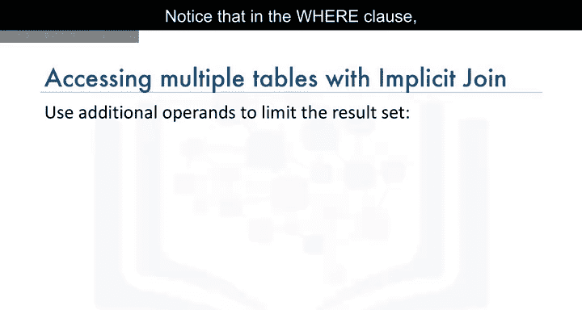

### 示例6：使用表别名

为了简化查询，我们可以使用表别名。例如，将`employees`表别名为`E`，`departments`表别名为`D`。

以下是使用别名的SQL代码：

```sql
SELECT * FROM employees E, departments D
WHERE E.DepartmentID = D.DepartmentID;
```

### 示例7：显示每位员工的部门名称

如果我们想查看每位员工的部门名称，可以编写如下查询：

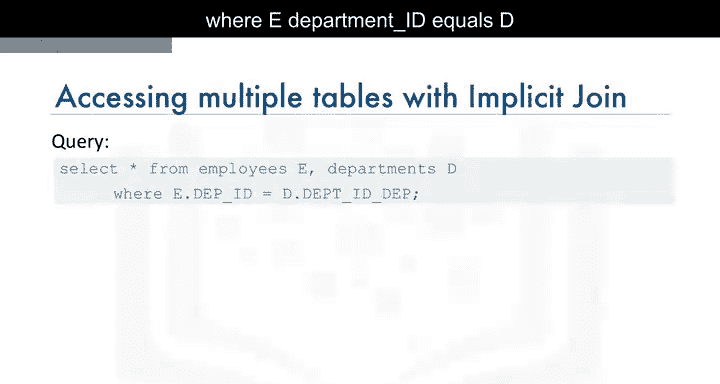

```sql
SELECT E.EmployeeID, D.DepartmentName
FROM employees E, departments D
WHERE E.DepartmentID = D.DepartmentID;
```

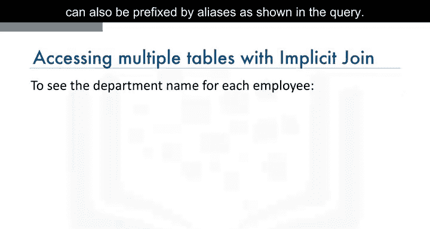

同样，`SELECT`子句中的列名也可以使用别名：

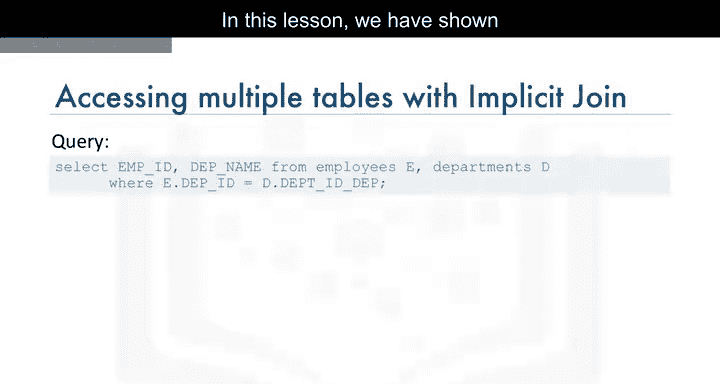

```sql
SELECT E.EmployeeID, D.DepartmentID
FROM employees E, departments D
WHERE E.DepartmentID = D.DepartmentID;
```

---

## 总结

本节课中，我们一起学习了如何使用子查询和隐式连接访问多个数据库表。子查询通过嵌套查询实现数据过滤，而隐式连接通过在`FROM`子句中指定多个表并添加条件来组合数据。掌握这些技巧将为后续学习更复杂的连接操作（如内连接和外连接）打下坚实基础。