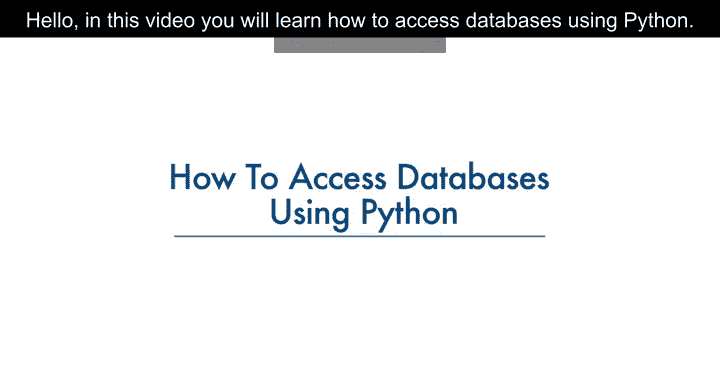
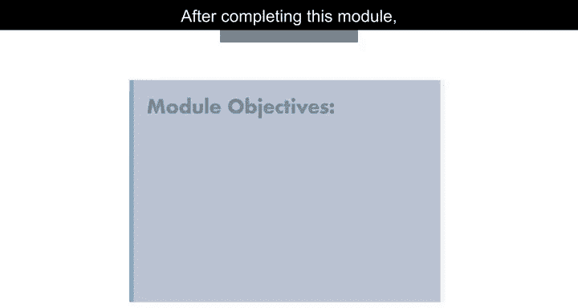
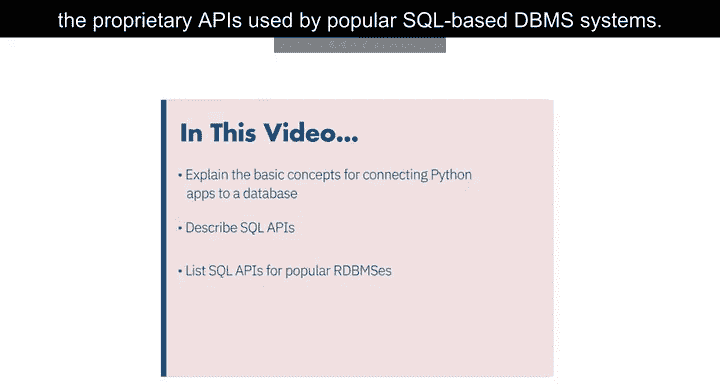
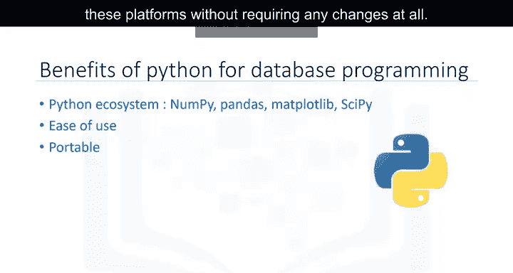
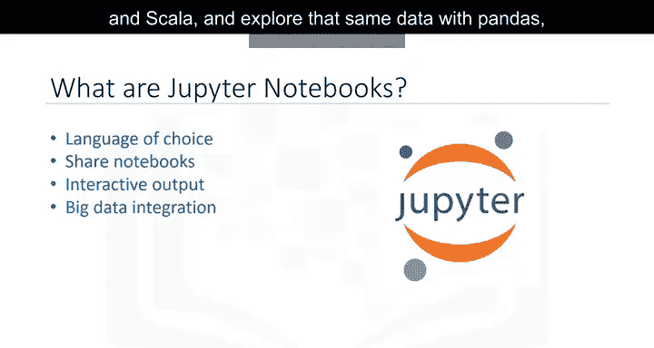
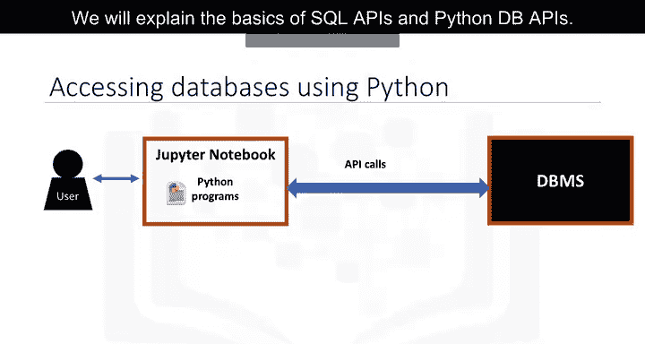
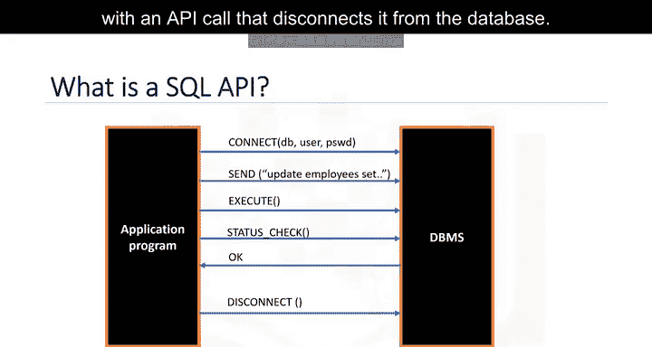
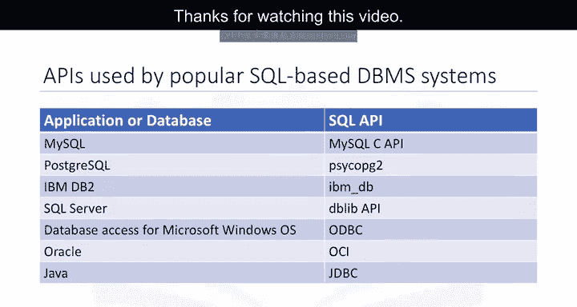

# 019：Python数据库访问方法 🐍

在本节课中，我们将学习如何使用Python访问数据库。数据库是数据科学家的重要工具。完成本模块后，你将能够解释使用Python连接数据库的基本概念，然后使用Jupyter Notebook创建表、加载数据、执行SQL查询，并最终分析数据。

---

## Python连接数据库的优势

上一节我们介绍了课程目标，本节中我们来看看使用Python连接数据库的一些好处。Python是一种流行的脚本语言，其生态系统非常丰富，为数据科学提供了易于使用的工具。

以下是Python的一些主要优势：

*   Python生态系统提供了许多流行的数据科学包，例如 **`numpy`**、**`pandas`**、**`matplotlib`** 和 **`scipy`**。
*   Python语法简单，易于学习。
*   由于其开源特性，Python已被移植到许多平台。只要避免使用系统依赖特性，你的Python程序可以在任何这些平台上运行而无需修改。
*   Python支持关系型数据库系统。Python数据库API（通常称为DB-API）的存在使得编写访问数据库的代码更加容易。
*   与Python相关的详细文档很容易获取。

---

## Jupyter Notebook简介

了解了Python的优势后，我们来看看数据科学中另一个非常流行的工具：Jupyter Notebook。Notebook运行在一个允许创建和共享包含实时代码、公式、可视化和说明性文本的文档的环境中。

Notebook界面是一种用于编程的虚拟笔记本环境。其示例包括Mathematica Notebook、Maple Worksheet、MATLAB Notebook、IPython/Jupyter、R Markdown、Apache Zeppelin、Apache Spark Notebook和Databricks Cloud。

在本模块中，我们将使用Jupyter Notebook。Jupyter Notebook是一个开源Web应用程序，允许你创建和共享包含实时代码、公式、可视化和叙述性文本的文档。

以下是使用Jupyter Notebook的一些优点：

*   支持超过40种编程语言，包括Python、R、Julia和Scala。
*   可以通过电子邮件、Dropbox、GitHub和Jupyter Notebook Viewer与他人共享笔记本。
*   你的代码可以产生丰富的交互式输出，例如图像、视频、LaTeX和自定义MIME类型。
*   你可以利用大数据工具（如从Python、R和Scala中使用Apache Spark），并使用pandas、scikit-learn、ggplot2和TensorFlow探索相同的数据。

---

## Python访问数据库的典型流程

现在，让我们了解用户如何通过Jupyter Notebook（一个基于Web的编辑器）上编写的Python代码访问数据库。

Python程序通过一种机制与数据库管理系统（DBMS）通信。Python代码使用API调用来连接数据库。接下来，我们将解释SQL API和Python DB-API的基础知识。

---

## SQL API基础

应用程序编程接口（API）是一组你可以调用的函数，用于获取某种服务的访问权限。SQL API由库函数调用组成，作为DBMS的应用程序编程接口。

要将SQL语句传递给DBMS，应用程序会调用API中的函数，并调用其他函数从DBMS检索查询结果和状态信息。

下图展示了一个典型SQL API的基本操作流程：

1.  应用程序通过一个或多个API调用开始其数据库访问，这些调用将程序连接到DBMS。
2.  为了向DBMS发送SQL语句，程序在缓冲区中将语句构建为文本字符串，然后进行API调用以将缓冲区内容传递给DBMS。
3.  应用程序进行API调用来检查其DBMS请求的状态并处理错误。
4.  应用程序通过一个API调用结束其数据库访问，该调用将其与数据库断开连接。

---

## 流行的SQL DBMS专有API

上一节我们介绍了SQL API的基本概念，本节中我们来看看一些流行的基于SQL的数据库管理系统所使用的专有API。

每个数据库系统都有自己的库。下表列出了一些应用程序及其对应的SQL API：

*   **MySQL C API**：提供对MySQL客户端/服务器协议的低级访问，使C程序能够访问数据库内容。
*   **Psycopg2 API**：用于连接Python应用程序与PostgreSQL数据库。
*   **IBM_DB API**：用于将Python应用程序连接到IBM DB2数据库。
*   **pyodbc API**：用于连接到SQL Server数据库。
*   **ODBC**：用于Microsoft Windows操作系统的数据库访问。
*   **OCI**：由Oracle数据库使用。
*   **JDBC**：由Java应用程序使用。

---

## 总结

本节课中，我们一起学习了使用Python访问数据库的核心方法。我们首先探讨了Python在数据科学和数据库连接方面的优势，然后介绍了Jupyter Notebook这一强大的交互式编程环境。接着，我们理解了Python程序通过SQL API与数据库通信的基本流程，并列举了不同数据库系统（如MySQL、PostgreSQL、DB2、SQL Server等）对应的专有Python API。掌握这些基础知识是后续在云端创建实例、连接数据库、执行SQL查询并使用Python进行数据分析的重要前提。