# 020：使用DB API编写代码 📝

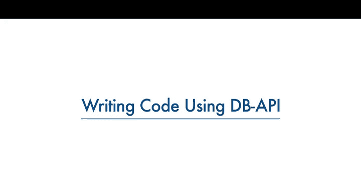

在本节课中，我们将要学习Python DB API的基本概念以及如何使用它来连接和操作数据库。我们将重点介绍连接对象和游标对象，并通过一个简单的示例来演示如何编写代码与数据库进行交互。

---

## Python DB API简介 🔗

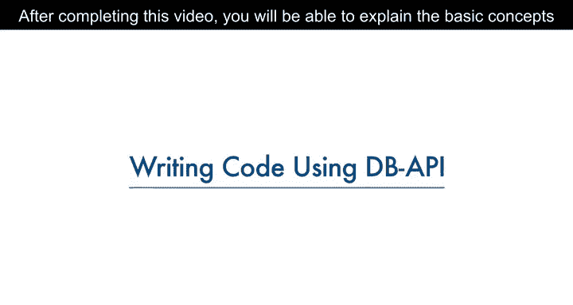

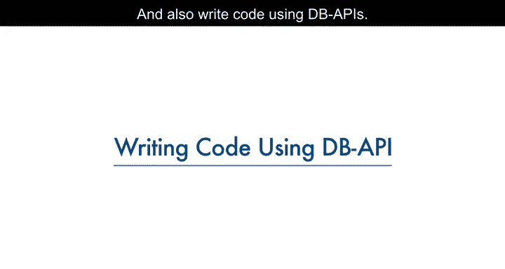

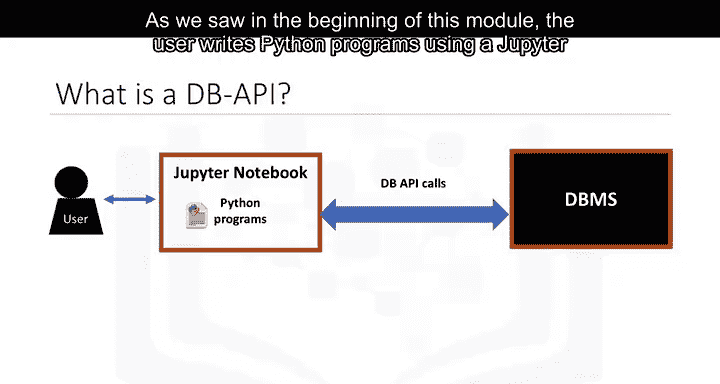

上一节我们介绍了Python程序如何通过DB API与数据库管理系统（DBMS）进行通信。本节中，我们来看看DB API的具体定义和优势。

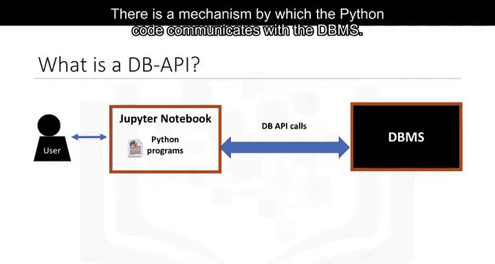

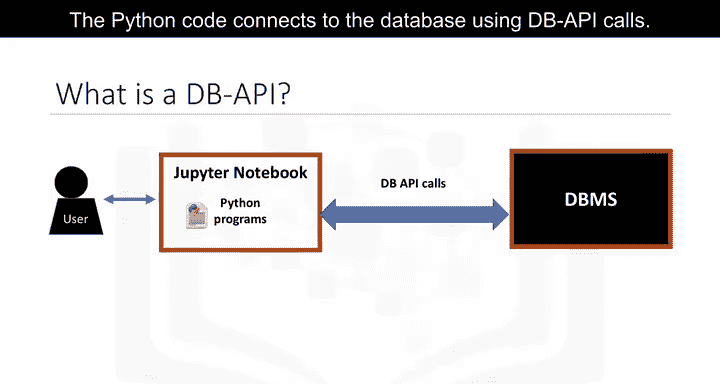

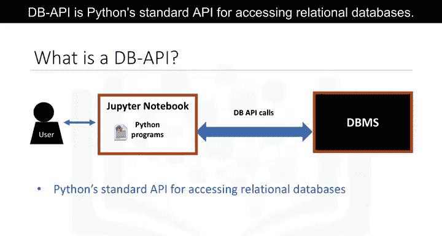

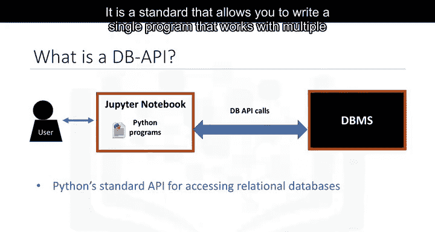

DB API是Python访问关系型数据库的标准应用程序编程接口（API）。它允许开发者编写一个程序，即可与多种关系型数据库进行交互，而无需为每种数据库编写独立的程序。

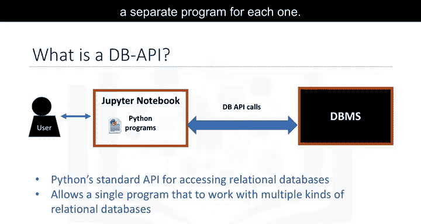

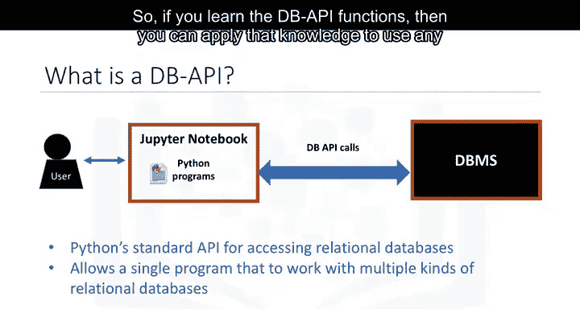

**公式**：`DB API = Python标准接口 + 多数据库支持`

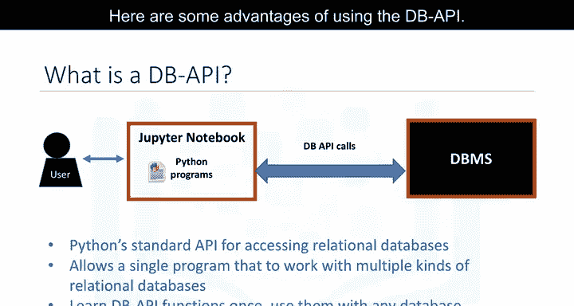

使用DB API的主要优势包括：
*   易于实现和理解。
*   鼓励不同数据库访问模块之间保持一致性。
*   代码在不同数据库间具有更好的可移植性。
*   扩展了Python连接数据库的范围。

---

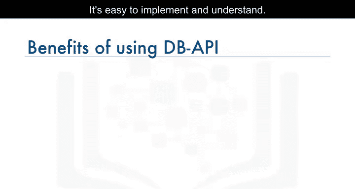

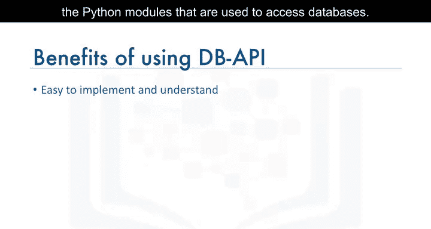

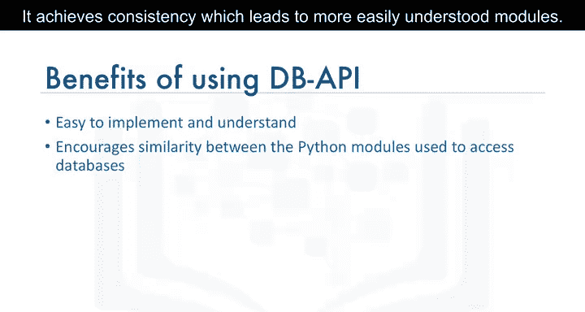

## 连接对象与游标对象 🎯

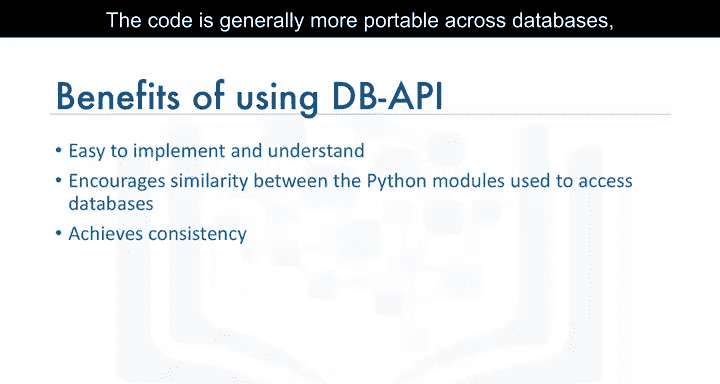

理解了DB API的总体概念后，接下来我们需要掌握其两个核心组件：连接对象和游标对象。

连接对象用于建立与数据库的连接并管理事务。游标对象则用于执行查询和获取结果。你可以将游标想象成文本处理系统中的光标，它可以在结果集中滚动，并将数据提取到应用程序中。

以下是连接对象的主要方法：
*   `cursor()`：通过连接返回一个新的游标对象。
*   `commit()`：提交任何待处理的事务到数据库。
*   `rollback()`：使数据库回滚到任何待处理事务的开始状态。
*   `close()`：关闭数据库连接。

**代码示例**：创建连接
```python
connection = dbapi.connect(database='mydb', user='username', password='password')
```

---

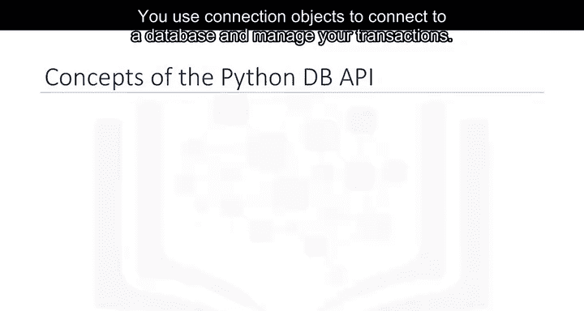

## 理解数据库游标 📍

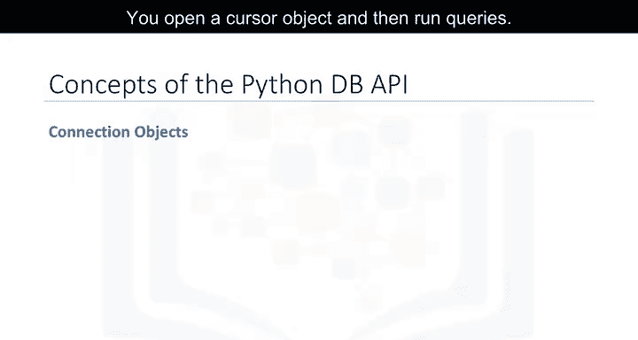

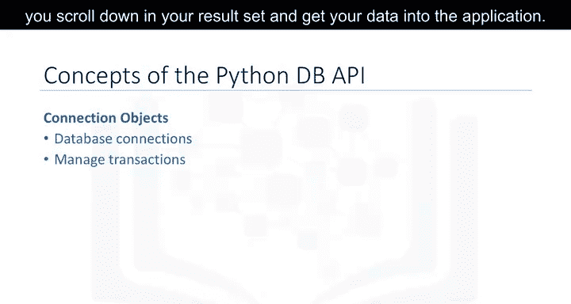

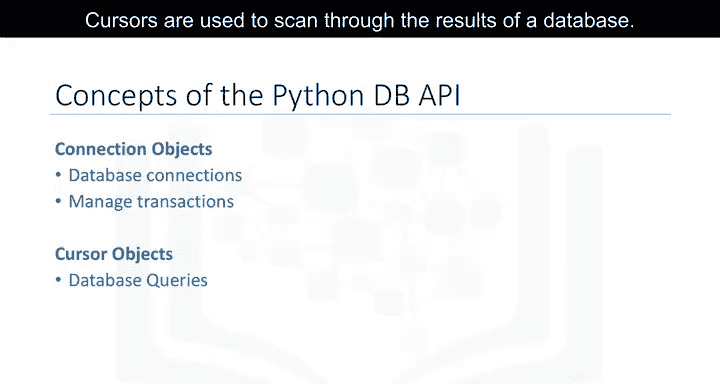

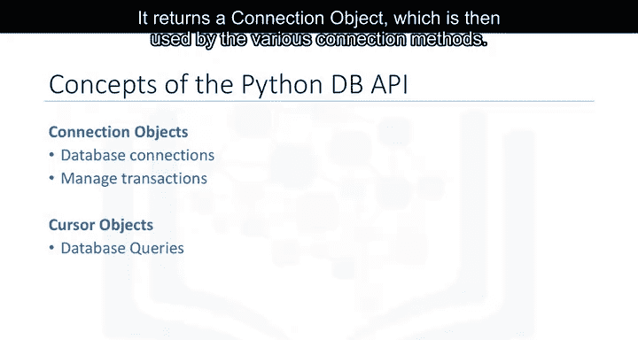

我们已经知道游标用于执行查询。本节中，我们更深入地探讨游标的工作原理。

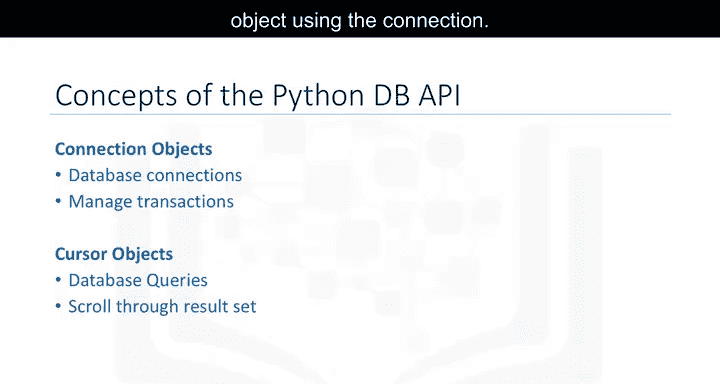

数据库游标是一种控制结构，用于遍历数据库中的记录。它的行为类似于编程语言中的文件名或文件句柄。

游标与文件操作的相似之处：
1.  程序打开文件以访问其内容，同样，程序打开游标以访问查询结果。
2.  程序关闭文件以结束访问，同样，程序关闭游标以结束对查询结果的访问。
3.  文件句柄跟踪程序在打开文件中的当前位置，游标则跟踪程序在查询结果中的当前位置。

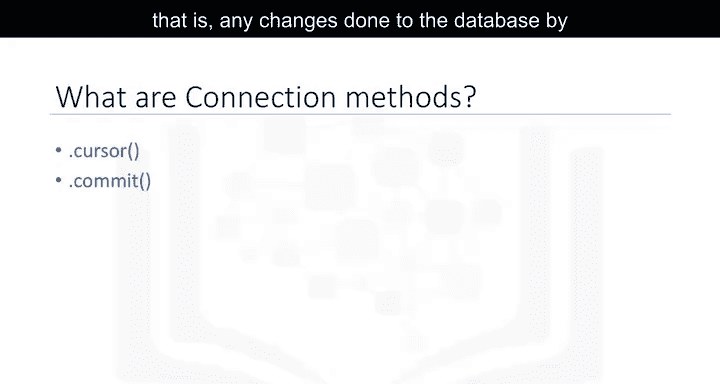


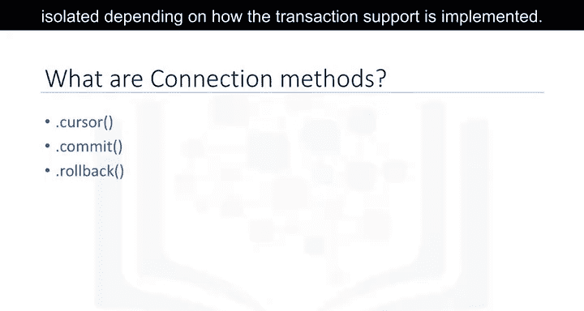

**重要提示**：从同一连接创建的游标不是隔离的。一个游标对数据库所做的任何更改，其他游标可以立即看到。

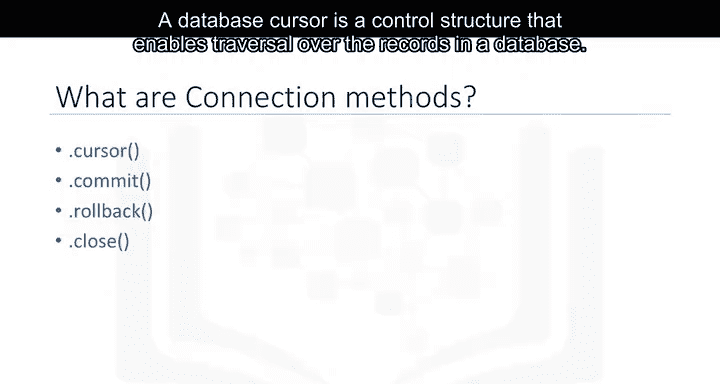

---

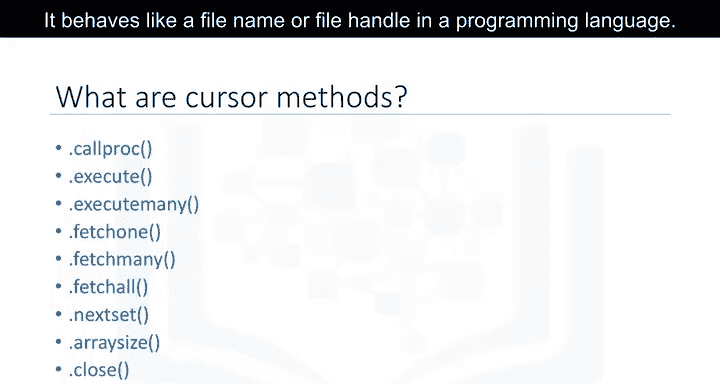

## 编写DB API代码：步骤详解 💻


现在，让我们通过一个完整的流程，来看看如何使用DB API编写Python应用程序来查询数据库。

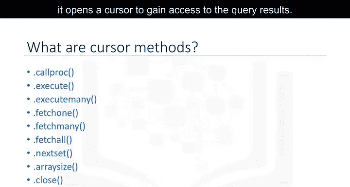

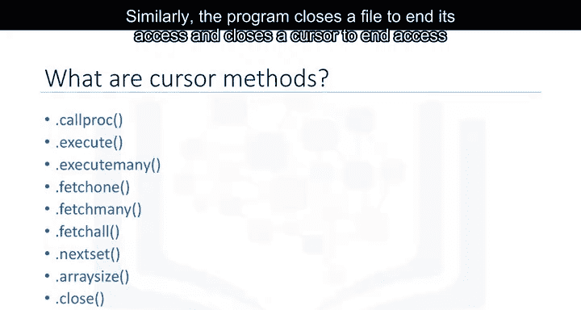

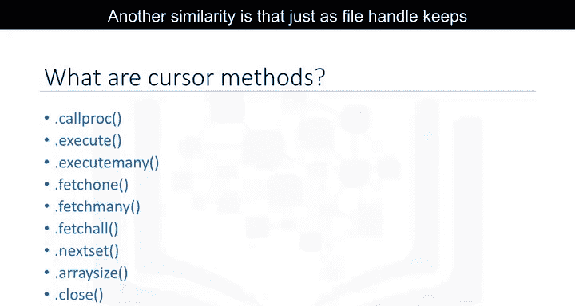

以下是使用DB API查询数据库的基本步骤：


1.  **导入数据库模块**：首先，导入你将要使用的特定数据库的DB API模块。
2.  **建立连接**：使用该模块的`connect()`构造函数，传入数据库名、用户名和密码等参数来打开一个数据库连接。该函数返回一个连接对象。
3.  **创建游标**：在连接对象上创建一个游标对象。这个游标将用于运行查询和获取结果。
4.  **执行查询与获取结果**：使用游标执行SQL查询语句，然后使用游标的方法（如`fetchall()`）来获取查询结果。
5.  **关闭连接**：当所有查询执行完毕后，通过关闭连接来释放所有资源。记住，始终关闭连接以避免未使用的连接占用资源至关重要。


**代码示例**：完整流程
```python
# 1. 导入模块
import ibm_db

# 2. 建立连接
conn = ibm_db.connect("DATABASE=mydb;HOSTNAME=myhost;PORT=port;PROTOCOL=TCPIP;UID=username;PWD=password;", "", "")

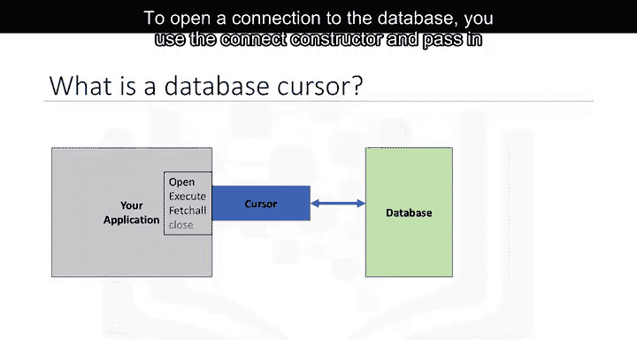


# 3. 创建游标（在DB2的ibm_db中，通常直接执行SQL）
stmt = ibm_db.exec_immediate(conn, "SELECT * FROM employees")

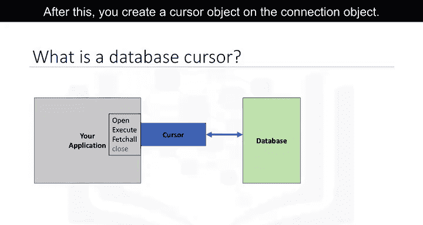

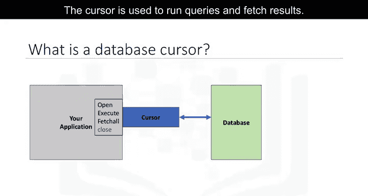


# 4. 获取结果
row = ibm_db.fetch_assoc(stmt)
while row:
    print(row)
    row = ibm_db.fetch_assoc(stmt)

# 5. 关闭连接
ibm_db.close(conn)
```

---

## 总结 📚

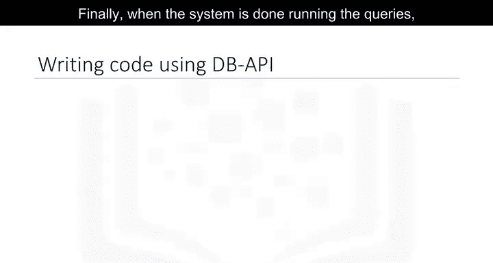

本节课中，我们一起学习了Python DB API的核心知识。我们首先了解了DB API作为Python标准数据库接口的作用和优势。然后，我们深入探讨了两个关键概念：用于管理数据库连接的**连接对象**和用于执行查询的**游标对象**。最后，我们通过一个清晰的步骤分解和代码示例，演示了如何使用DB API编写程序来连接数据库、执行查询并安全地释放资源。

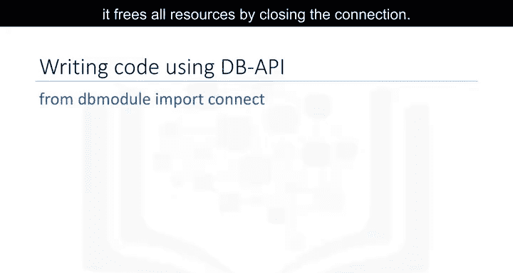

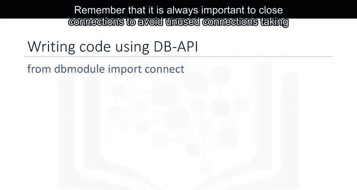

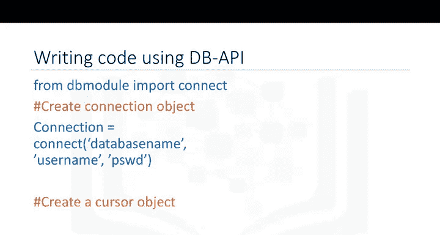

掌握这些基础知识，是使用Python进行数据科学中数据库操作的重要第一步。