# 021：使用IBM DB API连接数据库 🗄️➡️🐍

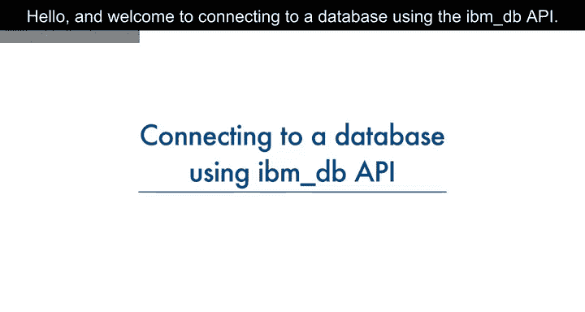

在本节课中，我们将学习如何使用IBM DB API，通过Python代码连接到IBM DB2数据库。我们将了解连接所需的凭证，并演示在Jupyter Notebook中建立连接的具体步骤。

---

## 理解IBM DB API

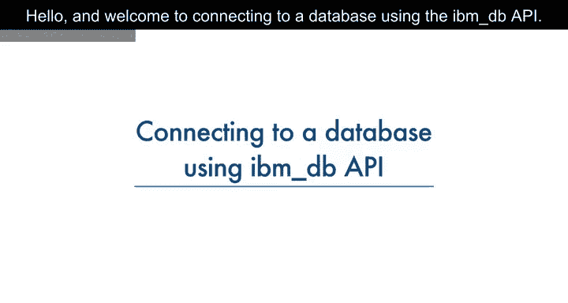

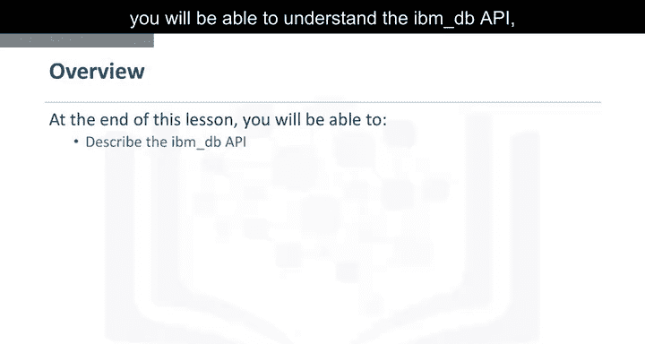

上一节我们介绍了数据库连接的基本概念，本节中我们来看看连接数据库的具体工具——IBM DB API。

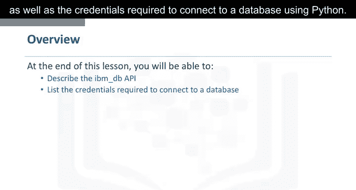

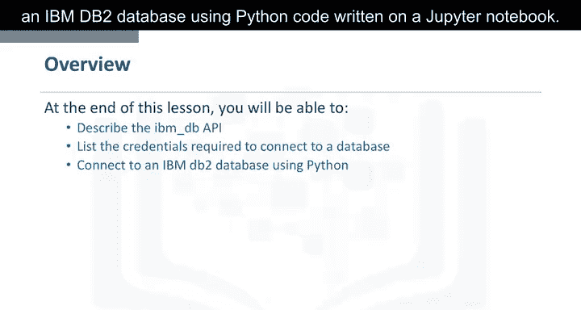

IBM DB API提供了一系列有用的Python函数，用于访问和操作IBM数据服务器数据库中的数据。其核心功能包括：
*   连接到数据库。
*   准备和执行SQL语句。
*   从结果集中获取行数据。
*   调用存储过程。
*   提交和回滚事务。
*   处理错误和检索元数据。

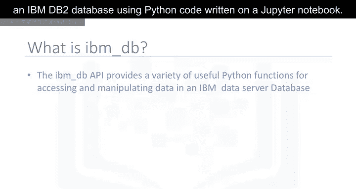

---

## 连接数据库的凭证

了解了API的功能后，要成功建立连接，我们还需要知道需要哪些信息。

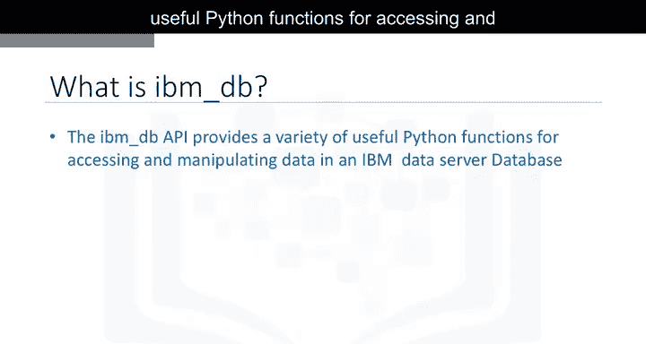

IBM DB API使用IBM Data Server Driver for ODBC and CLI APIs来连接IBM DB2和Informix数据库。我们需要将`ibm_db`库导入Python应用程序。

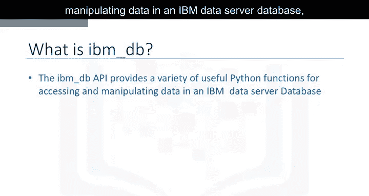

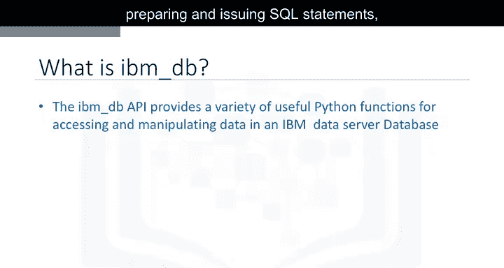

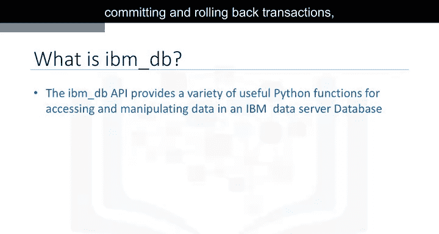

连接到DB2数据库需要以下信息：
*   **驱动程序名称** (`DRIVER`)
*   **数据库名称** (`DATABASE`)
*   **主机DNS名称或IP地址** (`HOSTNAME`)
*   **主机端口** (`PORT`)
*   **连接协议** (`PROTOCOL`)
*   **用户ID** (`UID`)
*   **用户密码** (`PWD`)

---

## 在Python中建立连接

掌握了必要的凭证信息后，现在我们可以动手编写代码来建立连接了。

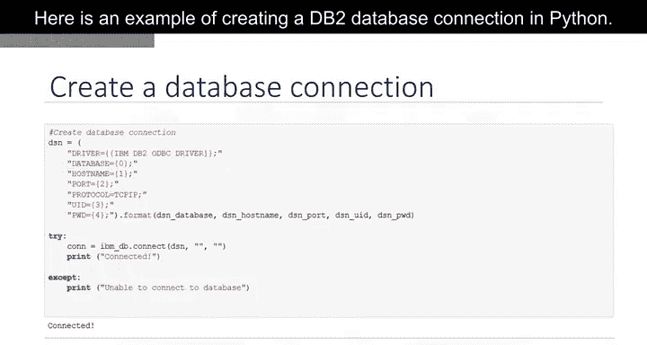

以下是一个在Python中创建DB2数据库连接的示例：

```python
import ibm_db

# 1. 创建存储连接凭证的DSN对象
dsn_driver = "{IBM DB2 ODBC DRIVER}"
dsn_database = "BLUDB"
dsn_hostname = "dashdb-txn-sbox-yp-lon02-01.services.eu-gb.bluemix.net"
dsn_port = "50000"
dsn_protocol = "TCPIP"
dsn_uid = "abc12345"
dsn_pwd = "7dBZ3wWt9XNq$s0J"

dsn = (
    "DRIVER={0};"
    "DATABASE={1};"
    "HOSTNAME={2};"
    "PORT={3};"
    "PROTOCOL={4};"
    "UID={5};"
    "PWD={6};").format(dsn_driver, dsn_database, dsn_hostname, dsn_port, dsn_protocol, dsn_uid, dsn_pwd)

# 2. 使用ibm_db.connect函数建立非持久连接
try:
    conn = ibm_db.connect(dsn, "", "")
    print("Connected to database!")
except:
    print("Unable to connect to database.")

# 3. 关闭连接，释放资源
ibm_db.close(conn)
```

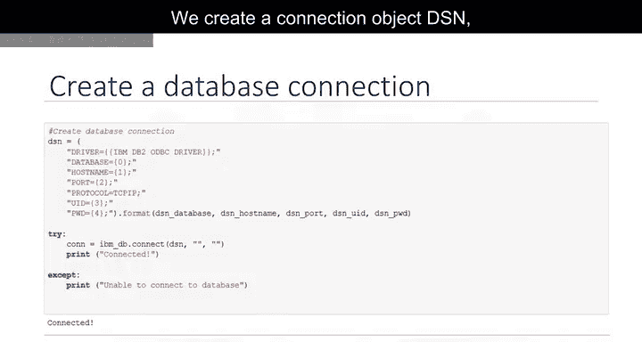

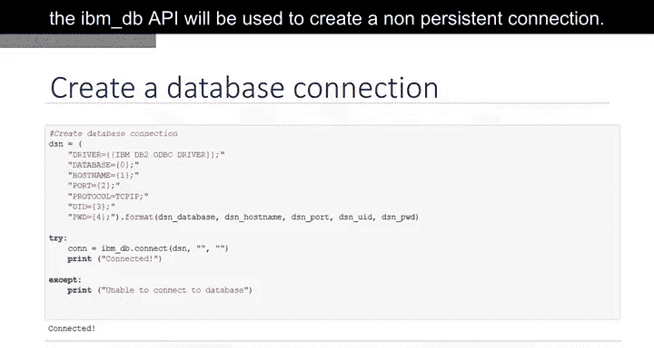

**代码解析：**
1.  我们首先创建一个连接对象`dsn`，它存储了所有连接凭证。
2.  IBM DB API的`connect`函数用于创建一个非持久连接。`dsn`对象作为参数传递给该函数。
3.  如果成功与数据库建立连接，则代码输出“Connected to database!”，否则输出“Unable to connect to database.”。
4.  最后，我们通过`close`函数关闭连接以释放所有资源。**请务必记住，关闭连接非常重要，这样可以避免未使用的连接占用系统资源。**

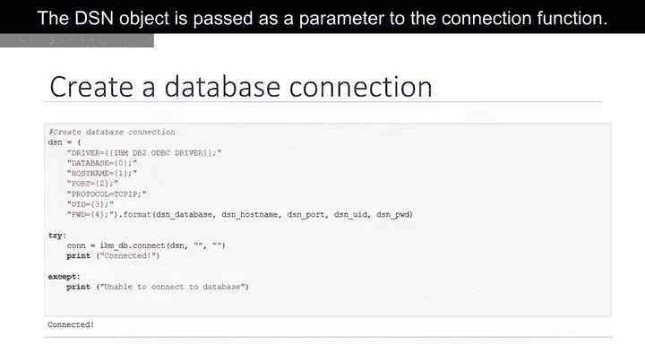

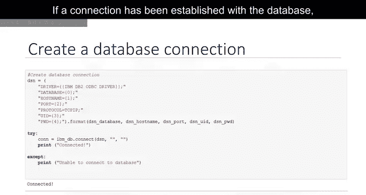

---

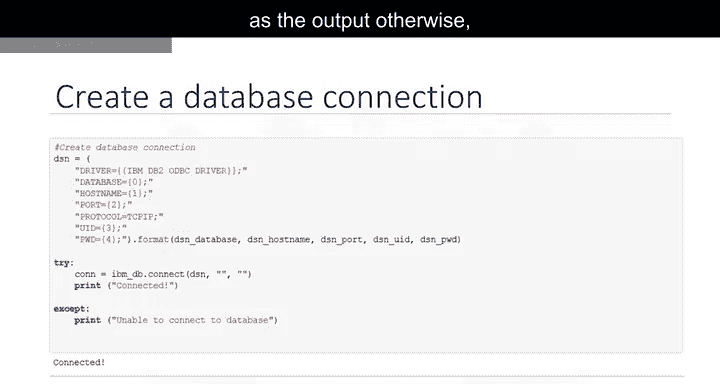

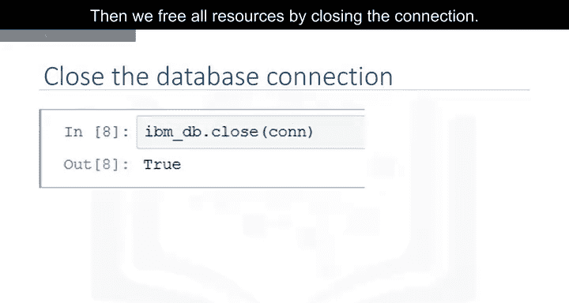

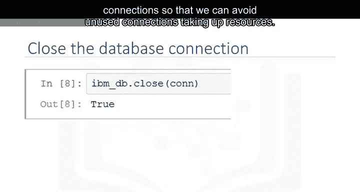

## 总结

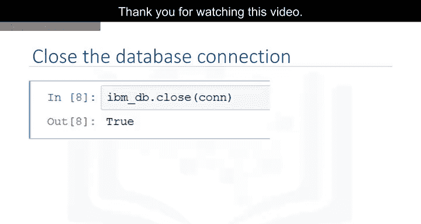

本节课中，我们一起学习了如何使用IBM DB API连接数据库。我们首先了解了IBM DB API的核心功能，然后明确了建立连接所需的各项凭证，最后通过一个完整的Python代码示例，演示了在Jupyter Notebook中连接IBM DB2数据库、检查连接状态以及关闭连接的全过程。掌握这些步骤是使用Python进行数据库操作的基础。