# 022：表创建、数据加载与查询


在本节课中，我们将学习使用Python创建数据库表、向表中加载数据以及查询数据的基本概念。我们将以IBM DB2 on Cloud数据库和Jupyter Notebooks为例，演示如何执行这些任务。

完成本课程后，你将能够理解与创建表、加载数据和查询数据相关的基础知识，并掌握使用Python操作IBM DB2数据库的基本方法。

---

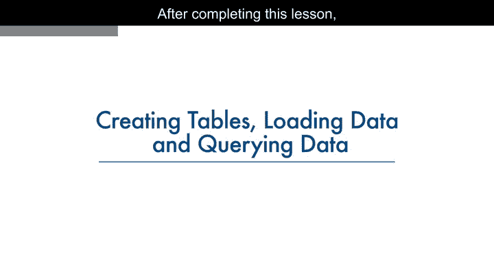

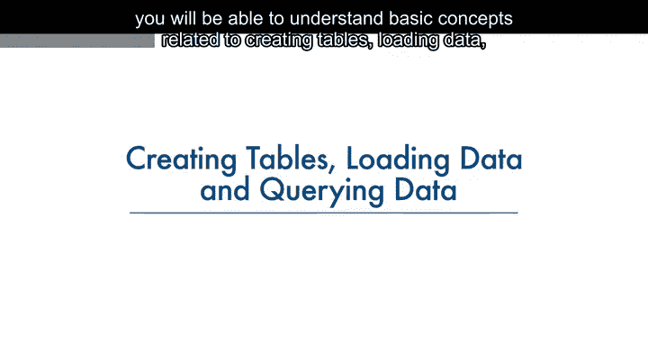

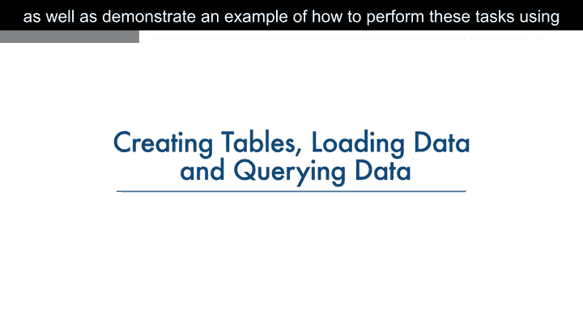

## 🔗 连接到数据库

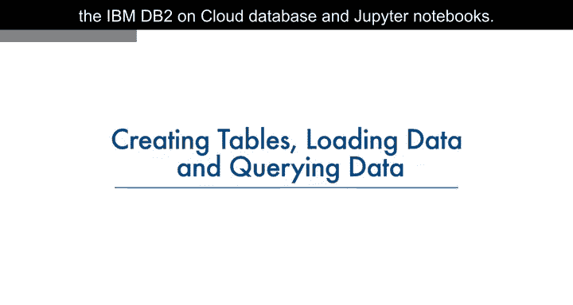

首先，我们需要建立与数据库的连接。我们使用`ibm_db` API的`connect`方法来获取一个连接资源。

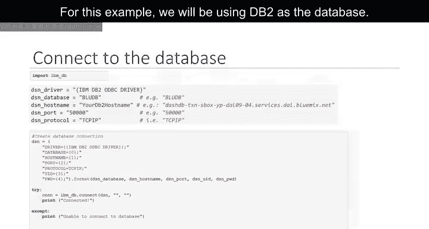

以下是连接数据库的示例代码：

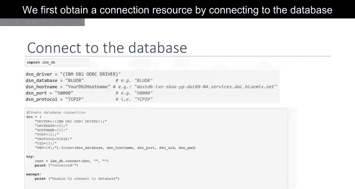

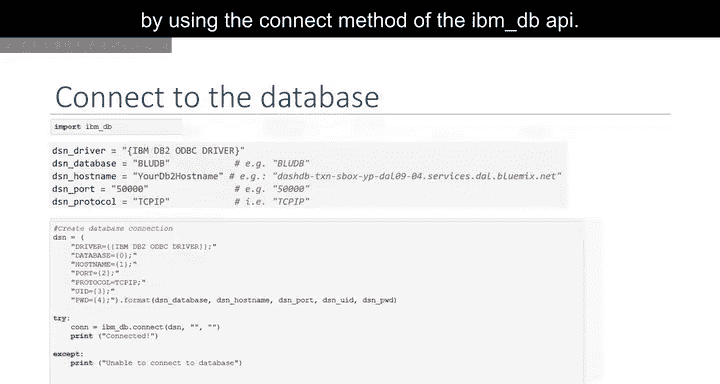

```python
import ibm_db
conn = ibm_db.connect("DATABASE=<dbname>;HOSTNAME=<hostname>;PORT=<port>;PROTOCOL=TCPIP;UID=<username>;PWD=<password>;", "", "")
```

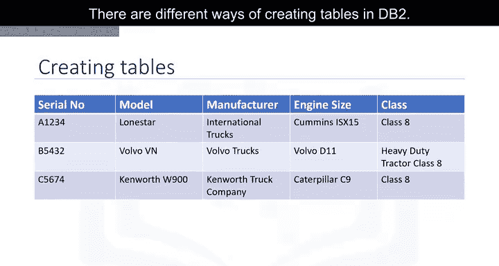

这段代码创建了一个到DB2数据库的连接，后续操作都将基于这个连接资源进行。

---

## 🏗️ 创建表

在DB2中创建表有多种方式，例如使用DB2提供的Web控制台，或者从任何SQL、R或Python环境中创建。本节我们将学习如何在Python应用程序中创建表。

假设我们需要为商用卡车数据库创建一个名为`TRUCKS`的表。以下是该表的结构示例：

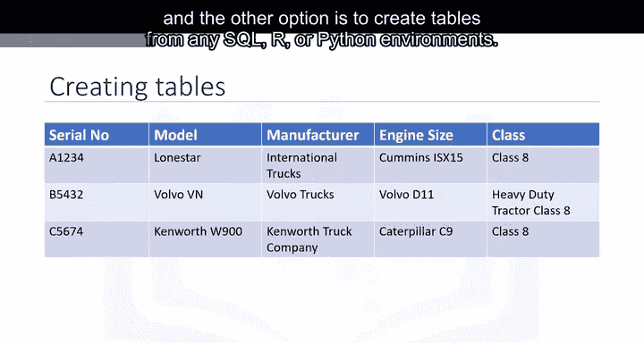

| 列名 | 数据类型 | 约束 |
| :--- | :--- | :--- |
| SERIAL_NO | VARCHAR(20) | PRIMARY KEY |
| MODEL | VARCHAR(20) | |
| MANUFACTURER | VARCHAR(20) | |
| ENGINE_SIZE | INT | |
| WEIGHT | INT | |

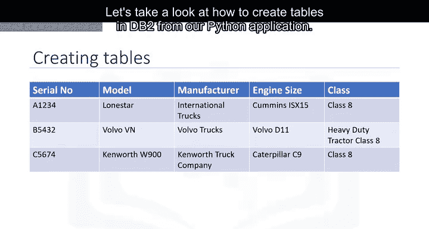

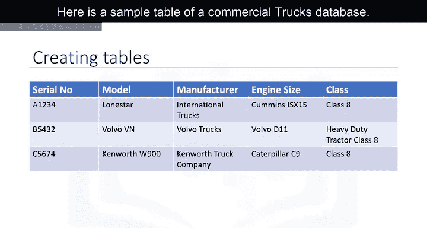

我们将使用`ibm_db.exec_immediate`函数来执行创建表的SQL语句。该函数的参数如下：
*   `connection`: 一个有效的数据库连接资源，由`ibm_db.connect`函数返回。
*   `statement`: 包含SQL语句的字符串。
*   `options`: 可选参数，是一个指定返回结果集游标类型的字典。

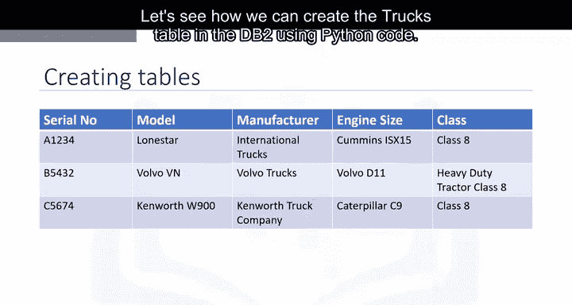

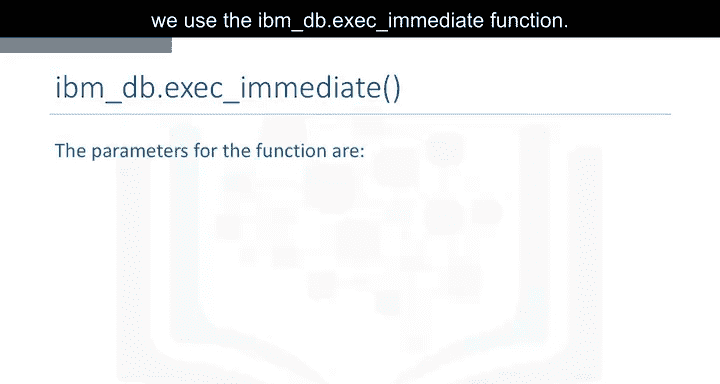

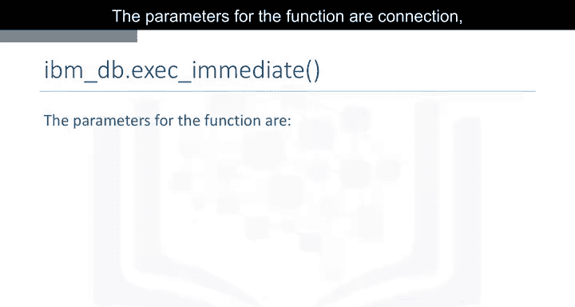

以下是创建`TRUCKS`表的Python代码：

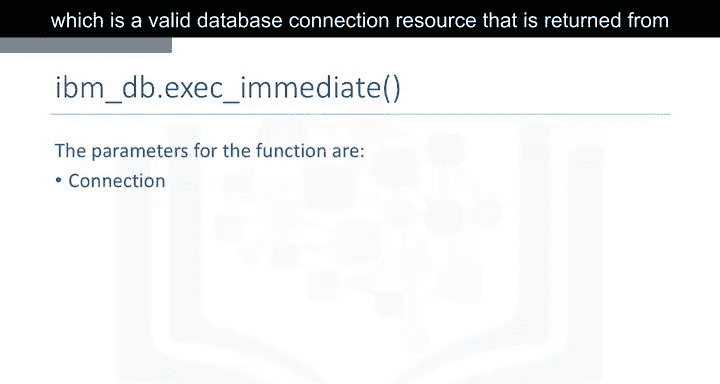

```python
create_table_sql = """
CREATE TABLE TRUCKS (
    SERIAL_NO VARCHAR(20) PRIMARY KEY NOT NULL,
    MODEL VARCHAR(20) NOT NULL,
    MANUFACTURER VARCHAR(20) NOT NULL,
    ENGINE_SIZE INT NOT NULL,
    WEIGHT INT NOT NULL
)
"""
ibm_db.exec_immediate(conn, create_table_sql)
```

这段代码执行后，数据库中就会创建一个包含五列的新表，其中`SERIAL_NO`被定义为主键。

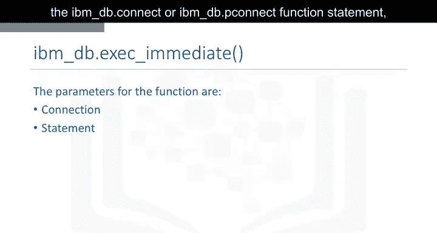

---

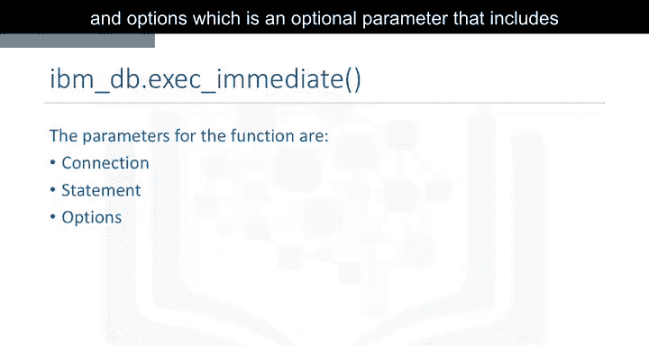

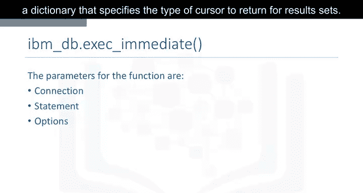

## 📥 加载数据

表创建完成后，下一步是向表中插入数据。我们同样使用`ibm_db.exec_immediate`函数来执行`INSERT`语句。

以下是如何向`TRUCKS`表插入一行数据的示例：

```python
insert_sql = "INSERT INTO TRUCKS VALUES ('ABC123', 'Model X', 'Manufacturer A', 5000, 15000)"
ibm_db.exec_immediate(conn, insert_sql)
```

执行此代码后，一行新的数据就被添加到了`TRUCKS`表中。你可以通过重复执行类似的`INSERT`语句来添加更多数据行。

---

## 🔍 查询数据

现在，我们的数据库表已经创建并填充了数据。接下来，我们看看如何从DB2的`TRUCKS`表中查询数据。

我们继续使用`ibm_db.exec_immediate`函数，但这次执行的是`SELECT`查询语句。


```python
select_sql = "SELECT * FROM TRUCKS"
stmt = ibm_db.exec_immediate(conn, select_sql)
result = ibm_db.fetch_both(stmt)
while result:
    print(result)
    result = ibm_db.fetch_both(stmt)
```

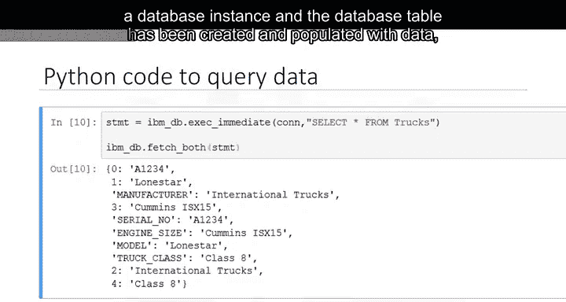

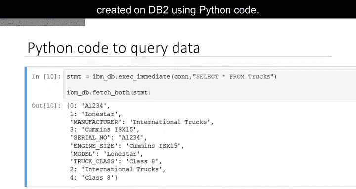

这段Python代码会执行查询，并逐行打印出`TRUCKS`表中所有数据字段的内容。你可以通过对比DB2控制台中的数据来验证查询结果的正确性。

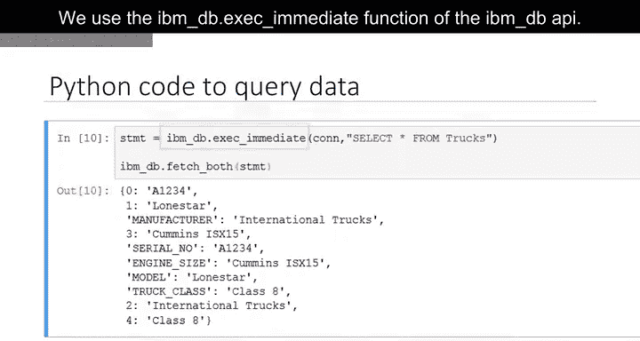

---

## 🐼 使用Pandas处理数据

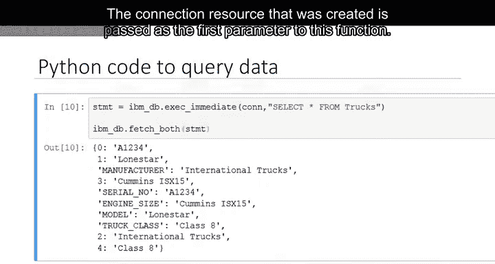

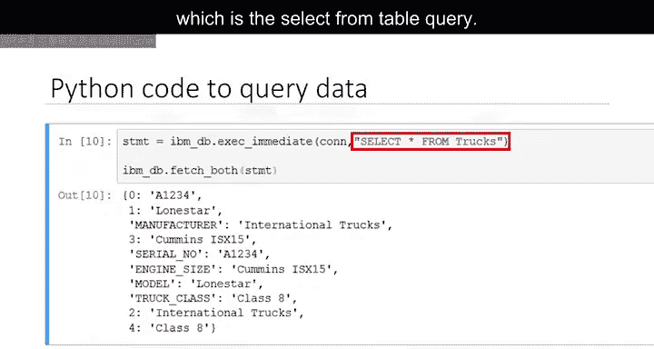

除了直接使用`ibm_db`，我们还可以利用Pandas库来更高效地检索和处理数据库中的数据。Pandas是一个强大的Python数据分析库，提供了高级数据结构和操作工具。

以下是如何将`TRUCKS`表中的数据加载到一个Pandas DataFrame中：

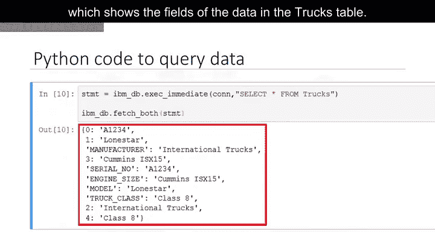

```python
import pandas as pd
import ibm_db_dbi

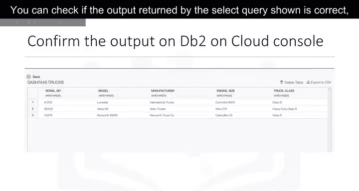

# 将ibm_db连接转换为符合DBI-2.0标准的连接
pconn = ibm_db_dbi.Connection(conn)

# 使用pandas的read_sql函数执行查询并加载到DataFrame
df = pd.read_sql("SELECT * FROM TRUCKS", pconn)
print(df.head())
```


DataFrame是一种类似电子表格的表格型数据结构，包含有序的列集合，每列可以是不同的值类型。使用Pandas可以方便地对数据进行后续的分析和处理。

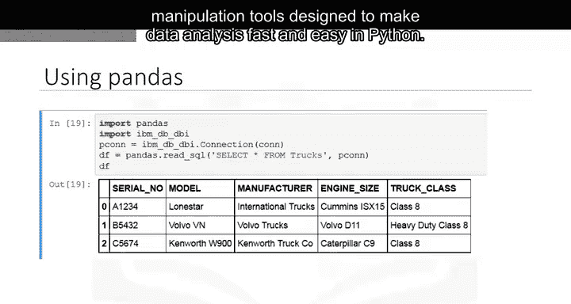

---

## 📝 总结

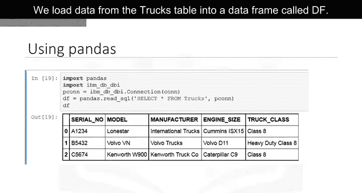


在本节课中，我们一起学习了使用Python操作IBM DB2数据库的核心步骤：
1.  使用`ibm_db.connect`建立数据库连接。
2.  使用`ibm_db.exec_immediate`执行`CREATE TABLE`语句来创建表。
3.  使用`ibm_db.exec_immediate`执行`INSERT`语句向表中加载数据。
4.  使用`ibm_db.exec_immediate`执行`SELECT`语句查询数据，并处理返回的结果集。
5.  介绍了如何使用Pandas库的`read_sql`函数，将数据库查询结果直接加载到DataFrame中，以便进行更复杂的数据分析。

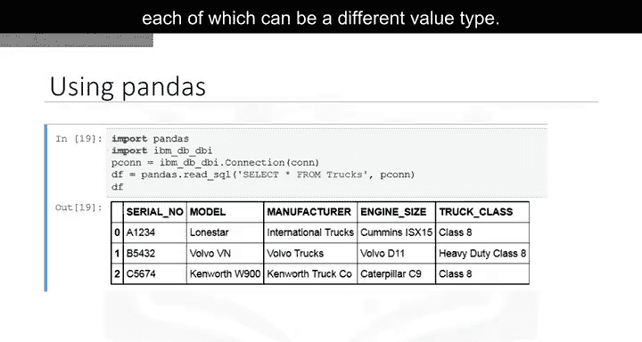

掌握这些基础操作是进行数据科学中数据库管理和数据提取的关键第一步。