# 023：使用Python进行数据分析实践 🐍📊

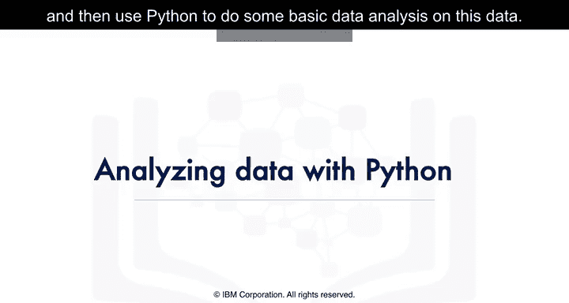

在本节课中，我们将学习如何使用Python对数据进行基础的探索性分析。我们将以麦当劳菜单营养数据为例，演示如何将数据存储到IBM DB2云数据库中，并使用Python进行初步的数据分析。


## 数据准备与加载

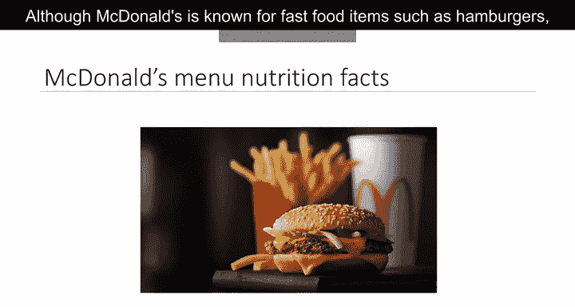

上一节我们介绍了课程目标，本节中我们来看看如何准备和加载数据。我们将使用麦当劳菜单的营养成分数据集。

麦当劳是一家美国快餐公司，也是全球收入最高的连锁餐厅。其菜单不仅包括汉堡、薯条、软饮、奶昔和甜点等快餐，也增加了沙拉、鱼肉、冰沙和水果等选项。麦当劳提供了其菜单项目的营养分析，以帮助消费者平衡饮食。

我们需要在DB2数据库中创建一个表来存储将要使用的麦当劳菜单营养数据。以下是加载数据到表中的四个步骤：


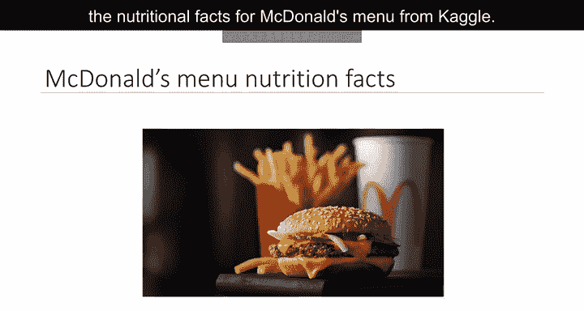


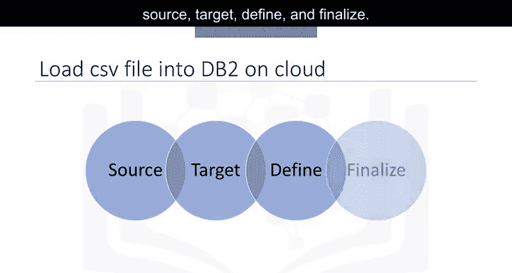

1.  **源**：首先，通过DB2控制台将电子表格数据加载到DB2。
2.  **目标**：选择目标模式。
3.  **定义**：系统会提供选项，可以选择将数据加载到现有表或创建新表。如果选择创建新表，可以指定表名并预览数据，同时定义列和数据类型。
4.  **完成**：检查设置并开始加载。加载完成后，可以查看已加载数据的统计信息，并进一步浏览表。

DB2允许使用数据库内分析API、R或Python来分析数据。

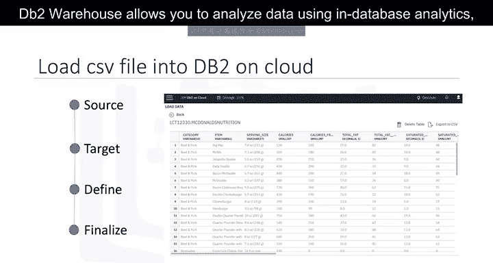

## 使用Python连接数据库并获取数据

数据已加载到关系数据库中。现在，我们可以运行Python脚本来从DB2数据库检索数据。这些脚本是强大的数据分析工具，例如，可以基于数据库中的数据生成统计模型并绘制结果。

在本课程中，我们将在Jupyter Notebook中运行Python脚本。首先，使用`ibm_db`库的`connect`方法连接到数据库以获取连接资源。然后，使用SQL `SELECT`查询来验证已加载到所创建表中的行数。输出显示为260行，这与DB2控制台中显示的行数一致。

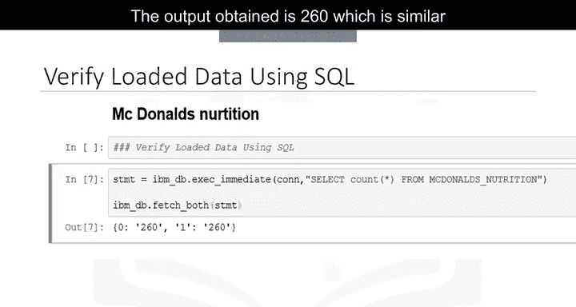

接下来，我们看看如何使用pandas从数据库表中检索数据。我们使用`read_sql`方法将数据从`mcdonalds_nutrition`表加载到名为`df`的DataFrame中。`read_sql`方法需要传入SQL `SELECT`查询语句和连接对象作为参数。我们可以使用`head`方法查看创建的DataFrame `df`的前几行。

## 初步数据探索

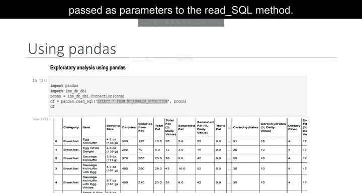

现在开始了解数据。Pandas提供了一系列常见的数学和统计方法。我们使用`describe`方法来查看DataFrame中数据的汇总统计信息。

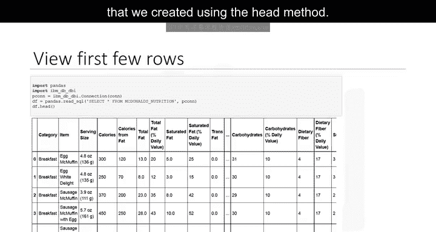

以下是`describe`方法输出的关键信息：
*   数据框中有260个观测值（即食品项目）。
*   食品项目共有9个独特的类别。
*   我们还可以看到不同变量下这260个食品项目的汇总统计信息，如频数、均值、中位数、标准差等。例如，总脂肪的最大值为118。

## 深入分析：钠含量调查

让我们进一步调查数据。我们尝试了解食品中的一种营养素：钠。钠的主要来源是食盐。过量摄入钠可能导致血压升高和体液潴留等问题。饮食中限制钠的常见目标是每天摄入少于2000毫克。

现在，使用麦当劳的营养数据集，我们进行一些基础数据分析来回答这个问题：**哪种食品的钠含量最高？**

我们首先使用`seaborn`包提供的`swarmplot`方法，通过可视化来探索食品的钠含量。我们创建一个分类散点图，将类别放在X轴，钠含量放在Y轴，数据则是包含麦当劳营养数据集的DataFrame `df`。散点图显示了不同类别食品的钠含量值，其中可以注意到一个约3600的高钠值。

接下来，我们使用Python进行基础数据分析，找出菜单中钠含量最高的食品项目。

**代码1：查看钠含量的汇总统计**
```python
df[‘Sodium’].describe()
```
`describe`方法用于了解与钠相关的汇总统计信息。注意，钠的最大值为3600。

**代码2：查找最大钠值对应的索引**
```python
df[‘Sodium’].idxmax()
```
我们使用`idxmax`方法来计算DataFrame中钠最大值对应的索引值。输出是82。

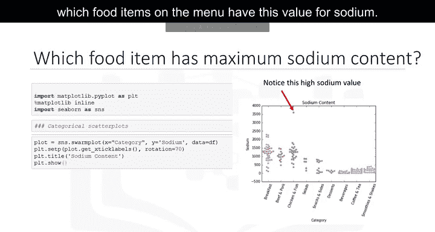

**代码3：根据索引查找食品名称**
```python
df.at[82, ‘Item’]
```
我们使用`at`方法，通过传入索引82和列名`’Item’`，来查找第82行对应的食品名称。

最终，我们发现菜单中钠含量最高的食品是**40块装麦乐鸡**。

## 数据可视化分析

可视化对于初步的数据探索非常有用，可以帮助我们理解数据中的关系、模式和异常值。

**散点图与相关性分析**
我们首先创建一个以蛋白质为X轴、总脂肪为Y轴的散点图。散点图是流行的可视化工具，通过每个观测值一个点来显示两个变量之间的关系。

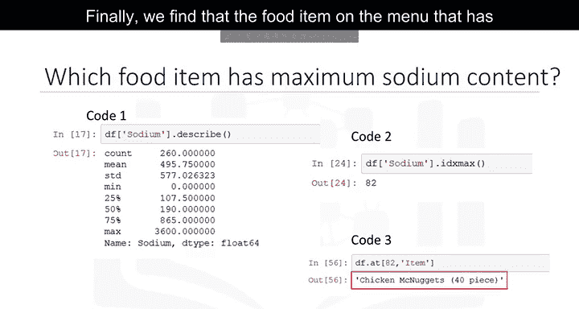

我们可以使用`seaborn`包提供的`jointplot`函数，输入X轴为蛋白质，Y轴为总脂肪，数据为包含麦当劳营养数据集的DataFrame `df`。输出的散点图显示在右侧。

该图展示了两个变量（蛋白质和脂肪）之间的相关性。相关性是衡量两个变量之间关联程度的指标，其值介于-1和+1之间。我们看到散点图上的点更接近一条正向的直线，因此这两个变量之间存在正相关关系。在散点图的右上角，显示了皮尔逊相关系数值为**0.81**，以及用`p`表示的相关性显著性，这是一个很好的值，表明变量之间确实存在相关性。

该图还显示了两个直方图，一个在顶部（蛋白质），一个在右侧（总脂肪）。我们还注意到散点图上有一个点偏离了总体模式，这可能是一个异常值。

**箱线图分析**
箱线图是显示一个或多个变量分布的图表。箱体部分捕获了中间50%的数据，而线条和点则指示了可能的偏态和异常值。

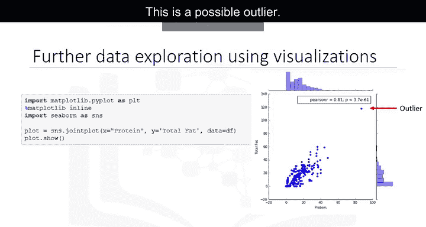

我们为糖含量创建一个箱线图。使用的函数是`seaborn`包中的`boxplot`。我们将名为`’Sugars’`的列作为输入传递给`boxplot`函数。

输出结果显示在右侧，箱线图显示食品项目的平均糖含量约为30克。我们还注意到一些异常值，表明存在糖含量极高的食品项目。数据集中存在糖含量约为128克的食品项目，糖果可能是菜单中这些高糖含量食品之一。

## 总结

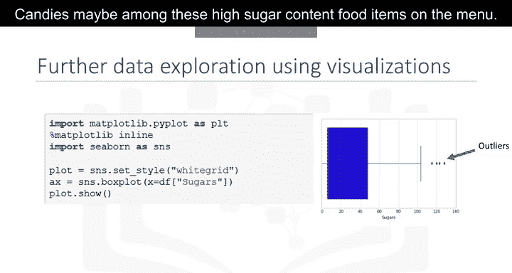


本节课中我们一起学习了如何使用Python进行基础的探索性数据分析。我们从在IBM DB2云数据库中加载麦当劳营养数据开始，然后使用pandas连接数据库、获取数据并进行初步统计描述。接着，我们针对钠含量进行了深入分析，找出了钠含量最高的食品项目。最后，我们利用seaborn库创建了散点图和箱线图，直观地探索了变量间的相关性以及数据的分布和异常值。现在，你已经掌握了使用pandas和可视化工具进行基础数据探索的方法，可以继续在本模块的实验中练习这些概念了。