# 024：真实世界数据集处理指南 🐕📊


在本节课中，我们将学习如何处理真实世界的数据集。我们将重点介绍CSV文件的特性、如何将其加载到数据库中，以及编写SQL查询时需要注意的关键事项，特别是关于列名格式和结果集限制的技巧。

---

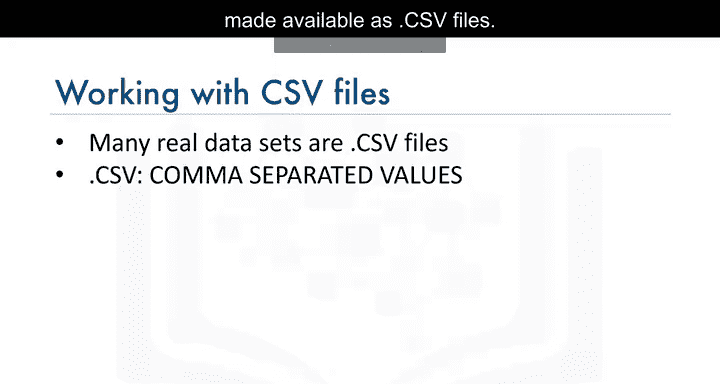

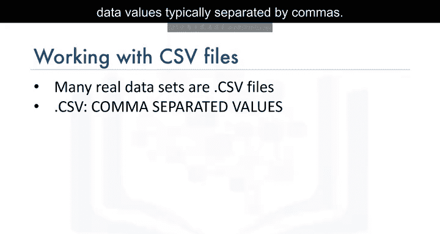

## CSV文件概述

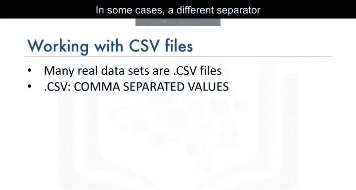

许多真实世界的数据集以`.CSV`文件格式提供。这些是文本文件，其中的数据值通常由逗号分隔。在某些情况下，也可能使用其他分隔符，例如分号。

在本视频中，我们将使用一个名为`Dogs.csv`的虚构文件作为示例。该文件包含狗的名字和品种信息，我们将用它来说明处理真实数据集时需掌握的概念。

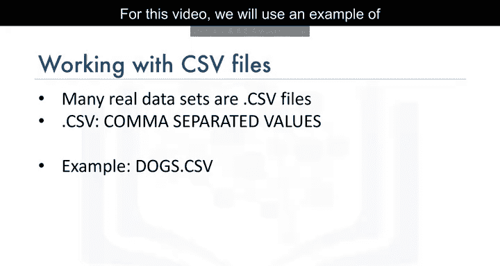

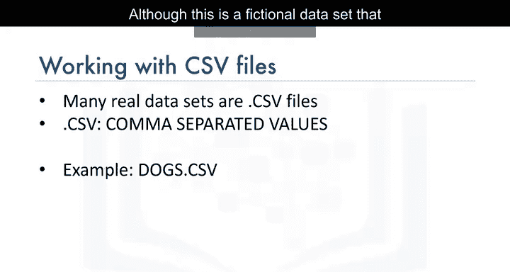

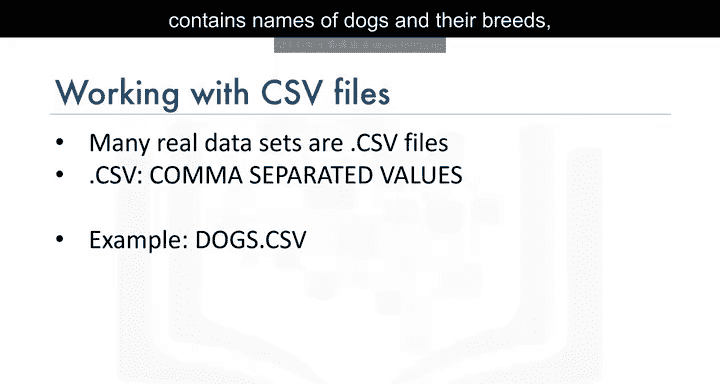

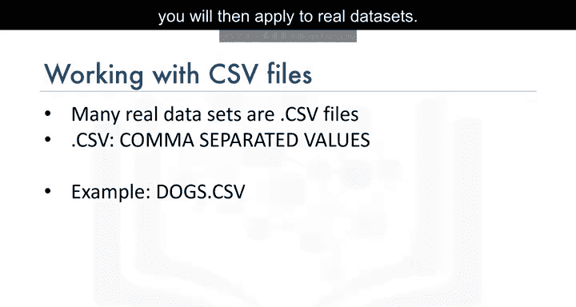

以下是`Dogs.csv`文件的示例内容：

```
ID,Name of dog,Breed (dominant breed if not pure breed)
1,Wolfy,German Shepherd
2,Fluffy,Pomeranian
3,Huggy,Labrador
```

在许多情况下，表格的第一行包含属性标签，这些标签映射到数据库表中的列名。在`Dogs.csv`中，第一行包含三个属性名称：
*   **ID** 是第一个属性，后续行包含其值：1、2、3。
*   **Name of dog** 是第二个属性，其值为：Wolfy、Fluffy、Huggy。
*   **Breed (dominant breed if not pure breed)** 是第三个属性，其值为：German Shepherd、Pomeranian、Labrador。

正如我们所见，CSV文件的第一行通常是包含属性名称的标题行。

---

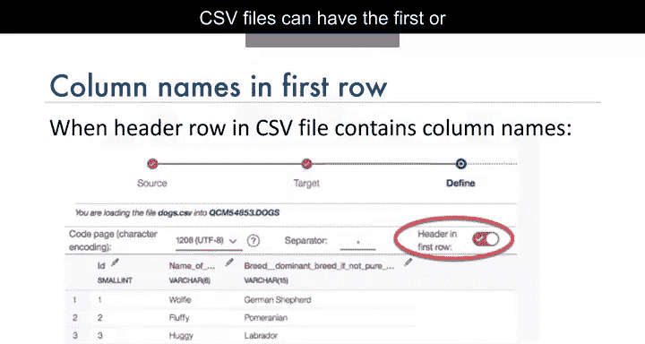

## 加载数据与处理列名

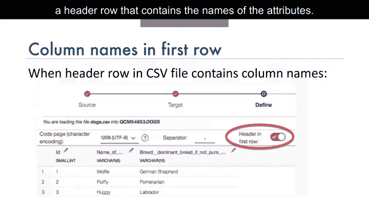

上一节我们了解了CSV文件的结构，本节中我们来看看如何将其加载到数据库并处理列名。

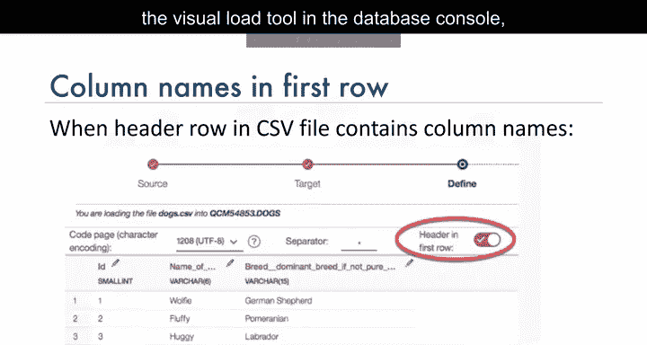

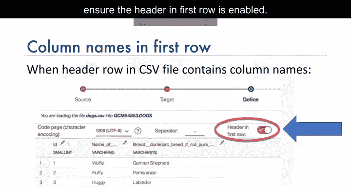

### 启用标题行映射

如果使用数据库控制台中的可视化加载工具将数据加载到数据库，请确保启用“标题在第一行”选项。

这将把CSV文件第一行中的属性名称映射为数据库表中的列名，其余行则映射为表中的数据行。请注意，默认的列名可能并不总是对数据库或查询友好，如果出现这种情况，您可能需要在创建表之前编辑它们。

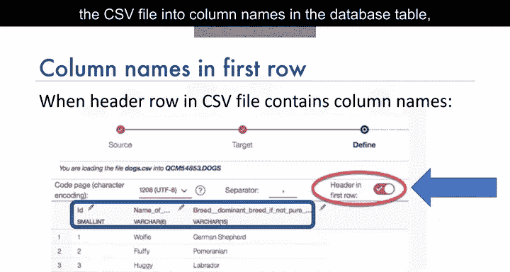

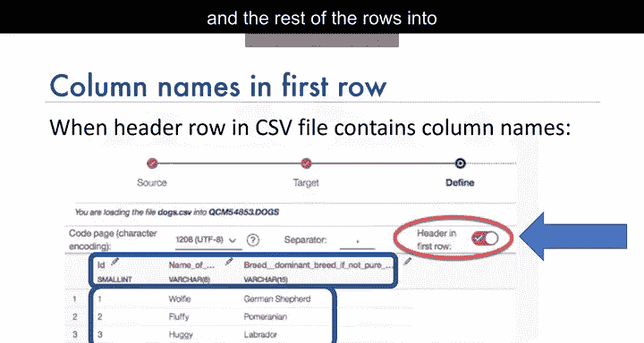


### 查询大小写混合的列名

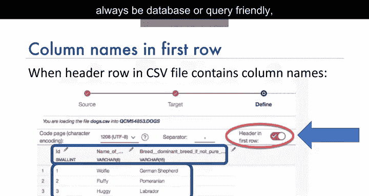

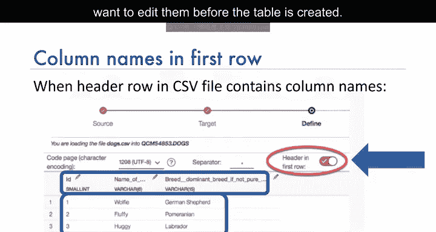

现在，我们来讨论查询那些包含小写或大小写混合（即大写和小写组合）的列名。

假设我们使用CSV中的默认列名加载了`Dogs.csv`文件。如果我们尝试使用查询 `SELECT id FROM dogs;` 来检索`ID`列的内容，可能会收到错误提示，指出`id`无效。

这是因为数据库解析器默认假定名称为大写，而当我们加载CSV文件时，`ID`列名是大小写混合的（即大写`I`和小写`d`）。在这种情况下，要选择具有大小写混合名称的列中的数据，我们需要在双引号内指定正确大小写的列名，如下所示：


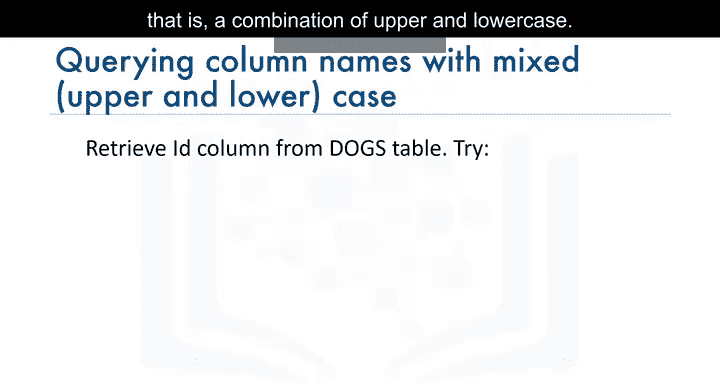

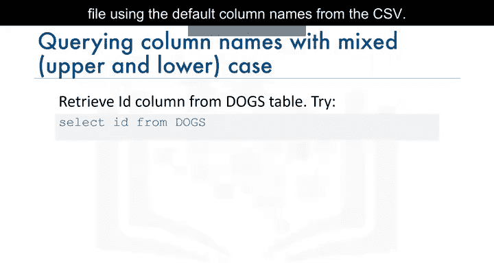

```sql
SELECT "Id" FROM dogs;
```

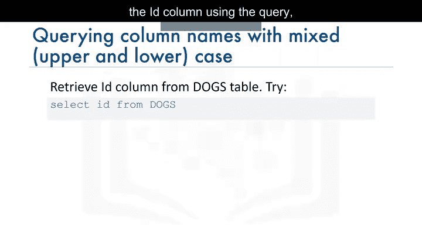

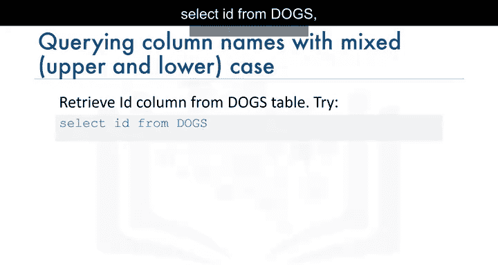

请确保在列名周围使用**双引号**，而不是单引号。

### 查询包含空格和特殊字符的列名

接下来，我们将介绍查询CSV文件中包含空格和其他字符的列名。

如果列名包含空格，数据库默认可能会将它们映射为下划线。例如，列名`Name of dog`中的三个单词之间有空格，数据库可能会将其更改为`name_of_dog`。

其他特殊字符，如括号，也可能被映射为下划线。因此，在编写查询时，请确保在引号内使用正确的大小写格式，并将特殊字符替换为下划线，如下例所示：


```sql
SELECT "ID", "name_of_dog", "breed__dominant_breed_if_not_pure_breed_" FROM dogs;
```

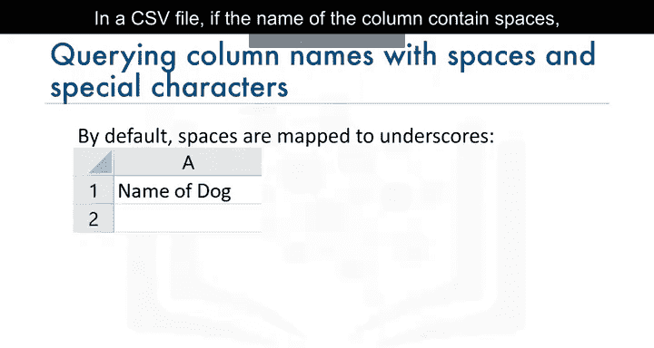

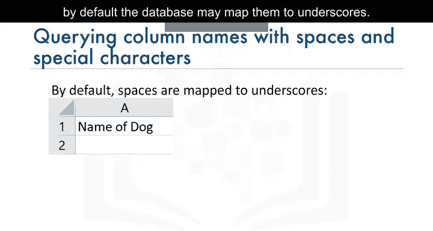

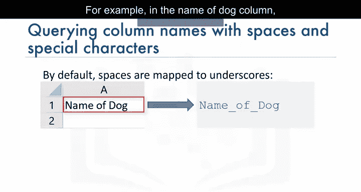

请注意双引号内单词之间用下划线分隔。同时，注意`breed`和`dominant`之间的双下划线。最后，查询末尾`breed`单词后的尾随下划线也很重要，它用于代替原列名中的右括号。

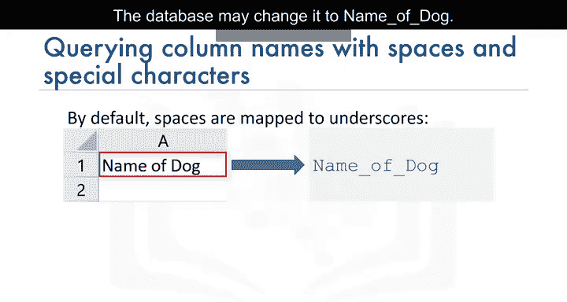

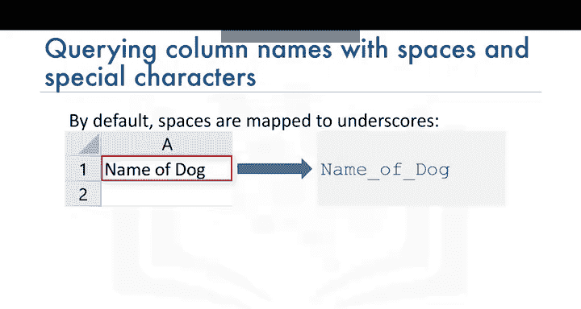

---

## 在Jupyter Notebooks中编写查询

上一节我们讨论了如何处理复杂的列名，本节中我们来看看在Jupyter Notebooks中编写SQL查询时的注意事项。

### 处理引号

在Jupyter Notebooks中使用引号时，您可能首先将查询分配给Python变量，然后在笔记中执行。

在这种情况下，如果您的查询包含双引号（例如，用于指定大小写混合的列名），您可以通过对Python变量使用单引号来包裹整个SQL查询，对列名使用双引号来区分引号。例如：

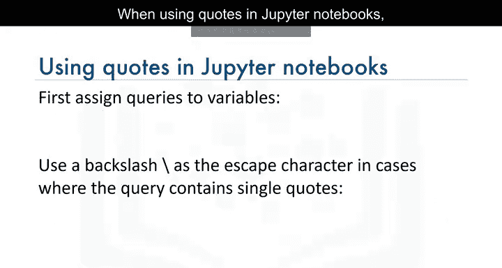

```python
selectQuery = 'SELECT "Id" FROM Dogs'
```

现在，如果您需要在查询中指定单引号（例如，在WHERE子句中指定一个值），该怎么办？在这种情况下，您可以使用反斜杠作为转义字符，如下所示：

```python
selectQuery = 'SELECT * FROM dogs WHERE "name_of_dog" = \'Huggy\''
```

### 编写多行查询以提高可读性

如果您有非常长的查询，例如连接查询或嵌套查询，将查询拆分为多行可以提高可读性。在Python Notebooks中，您可以使用反斜杠字符表示延续到下一行，如下例所示：

```python
%sql SELECT "Id", "name_of_dog" \
FROM dogs \
WHERE "name_of_dog" = 'Huggy'
```

此时，花点时间回顾一下这些特殊字符的用法会很有帮助。请记住，如果在Python Notebook中将查询拆分为多行而没有使用反斜杠，可能会出错。


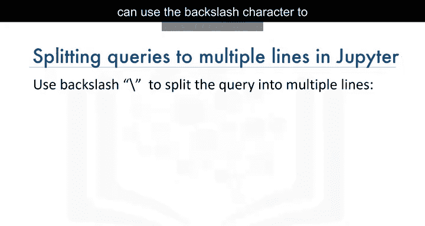

### 使用SQL Magic命令

在Jupyter Notebooks中，您可以在单元格的第一行使用双百分号`%%sql`。这意味着单元格的其余内容将由SQL magic解释。例如：

```sql
%%sql
SELECT "Id", "name_of_dog"
FROM dogs
WHERE "name_of_dog" = 'Huggy'
```

请注意，当使用`%%sql`时，每行末尾不需要反斜杠。

---

## 限制检索的行数

此时，您可能会问，如何限制检索的行数？这是一个很好的问题，因为一个表可能包含数千甚至数百万行，而您可能只想查看一些样本数据或仅查看几行以了解表中包含的数据类型。

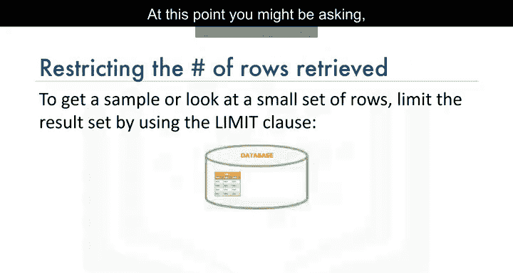

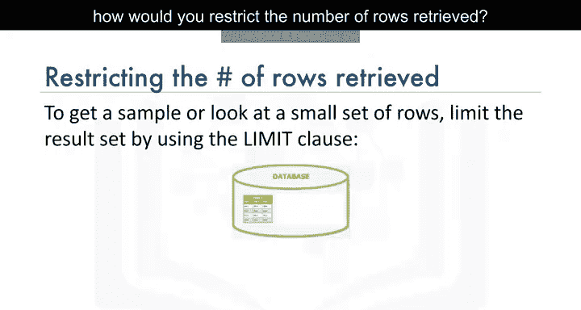

您可能想直接使用 `SELECT * FROM table_name;` 将结果检索到Pandas DataFrame中，然后对其使用`.head()`函数。但这样做可能会导致查询运行很长时间。

相反，您可以使用`LIMIT`子句来限制结果集。例如，使用以下查询仅检索名为`census_data`的表中的前三行：

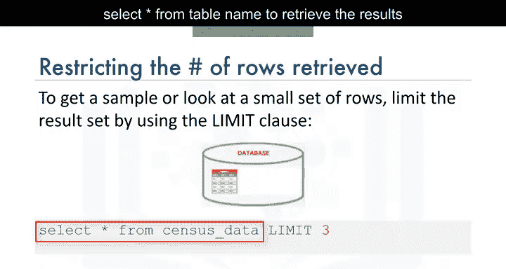

```sql
SELECT * FROM census_data LIMIT 3;
```

---

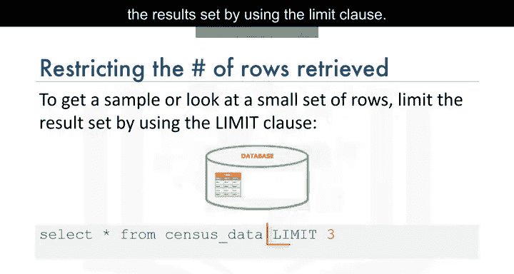

## 总结

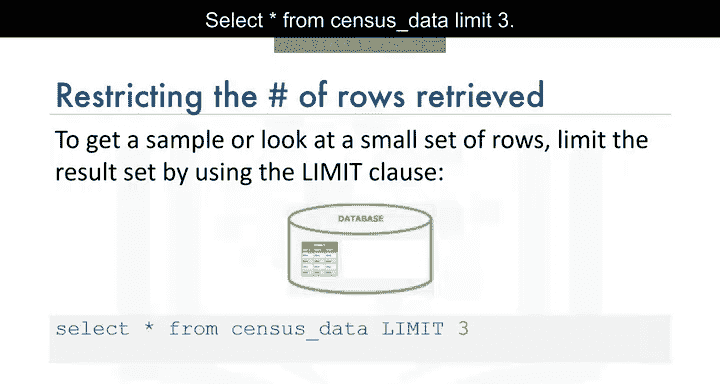

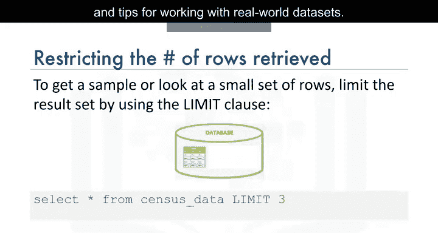

本节课中，我们一起学习了处理真实世界数据集时的一些注意事项和技巧。我们涵盖了CSV文件的结构、如何正确加载数据并处理包含大小写混合、空格和特殊字符的列名。我们还探讨了在Jupyter Notebooks中编写SQL查询的最佳实践，包括引号的使用、多行查询的编写以及如何使用`LIMIT`子句高效地限制查询结果。掌握这些技巧将帮助您更顺利地在数据科学项目中使用SQL处理各种来源的数据。