# 025：获取表结构与列信息 📊

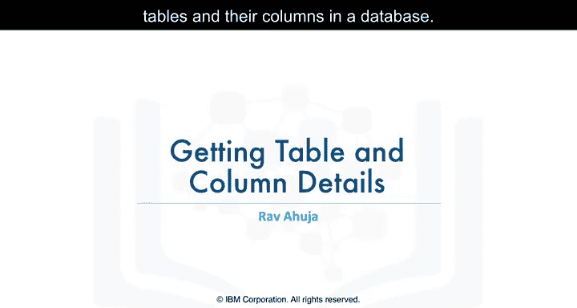

在本节课中，我们将学习如何在数据库中获取表及其列的信息。这对于探索不熟悉的数据库或回忆特定表和列的确切名称至关重要。

## 概述：为何需要获取表信息？ 🤔

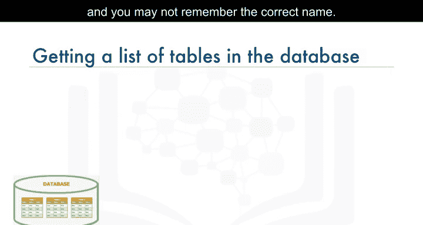

有时，数据库可能包含多个表，您可能无法准确记住所有表的名称。例如，您可能不确定某个表是叫 `dog`、`dogs` 还是 `four_legged_mammals`。数据库系统通常包含系统表或目录表，您可以通过查询这些目录来获取表列表及其属性。

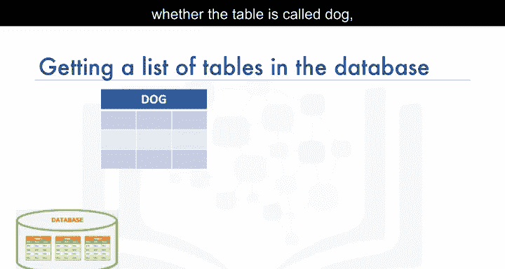

上一节我们介绍了数据库的基本查询操作，本节中我们来看看如何系统地探索数据库的结构。

## 获取数据库中的表列表 📋

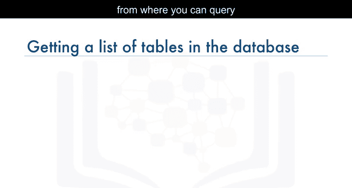

不同的数据库管理系统（DBMS）使用不同的系统目录名称：
*   在 **DB2** 中，目录称为 `SYSCAT.TABLES`。
*   在 **SQL Server** 中，称为 `INFORMATION_SCHEMA.TABLES`。
*   在 **Oracle** 中，称为 `ALL_TABLES` 或 `USER_TABLES`。

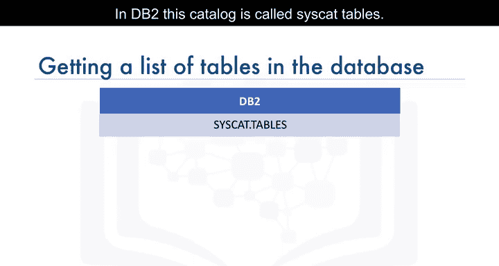

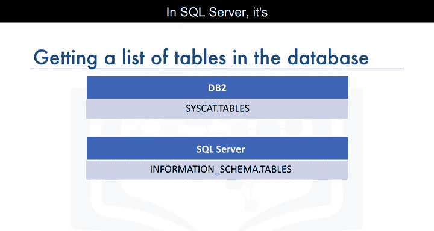

以下是获取表列表的具体方法。

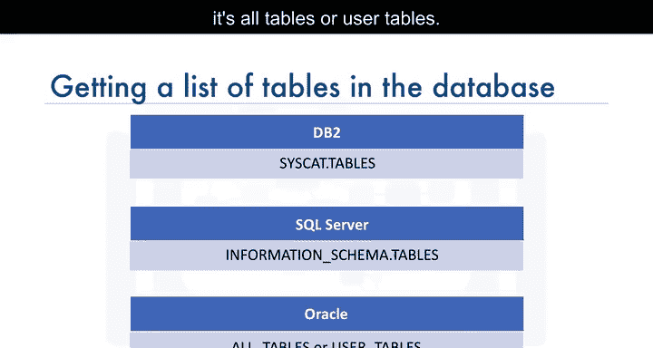

### 在 DB2 中获取所有表

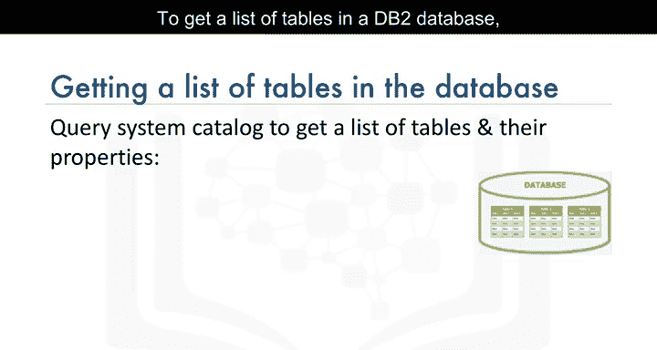

要获取 DB2 数据库中的表列表，可以运行以下查询：
```sql
SELECT * FROM SYSCAT.TABLES;
```
这条 `SELECT` 语句会返回包括系统表在内的所有表。因此，最好对结果进行过滤。

以下是过滤结果的示例，它只返回特定模式下的表及其创建时间：
```sql
SELECT TABSCHEMA, TABNAME, CREATE_TIME
FROM SYSCAT.TABLES
WHERE TABSCHEMA = 'ABC12345';
```
**注意**：请将 `ABC12345` 替换为您自己的 DB2 用户名。

### 应用场景：查找最新创建的表

假设您创建了多个名称相似的表（例如 `dog1`、`dog_test`、`dog_test1`），但想确认其中哪个是最后创建的。

您可以执行如下查询来根据创建时间排序：
```sql
SELECT TABSCHEMA, TABNAME, CREATE_TIME
FROM SYSCAT.TABLES
WHERE TABSCHEMA = 'QCM54853'
ORDER BY CREATE_TIME DESC;
```
输出结果将包含您模式下所有表的模式名、表名和创建时间，并按创建时间降序排列，最新的表会排在最前面。

## 获取表中的列信息 🔍

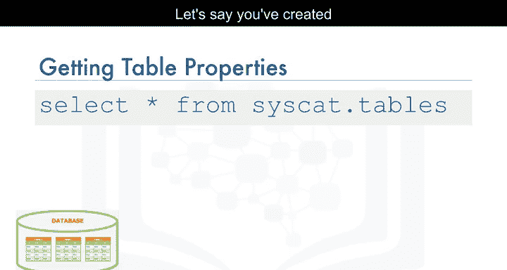

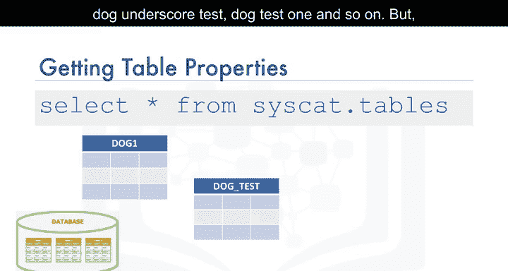

如果您记不清表中某列的确切名称（例如，是否包含小写字符或下划线），可以查询系统目录来获取列信息。

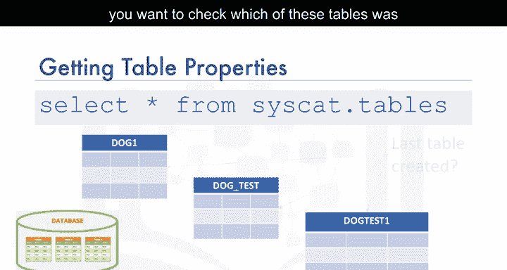

以下是获取列信息的具体步骤。


### 在 DB2 中获取所有列

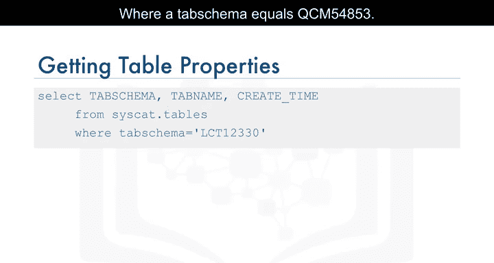

在 DB2 中，您可以运行以下查询来获取指定表的所有列信息：
```sql
SELECT * FROM SYSCAT.COLUMNS WHERE TABNAME = 'dogs';
```

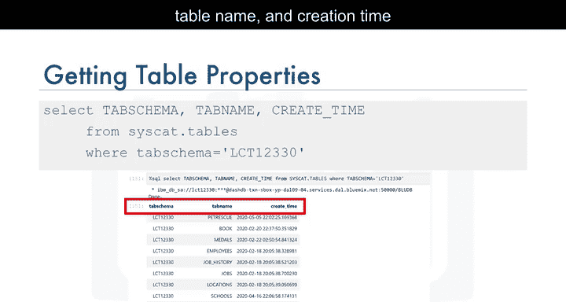

### 在 MySQL 中获取所有列

在 MySQL 中，获取列信息更为简单，可以使用 `SHOW COLUMNS` 命令：
```sql
SHOW COLUMNS FROM dogs;
```

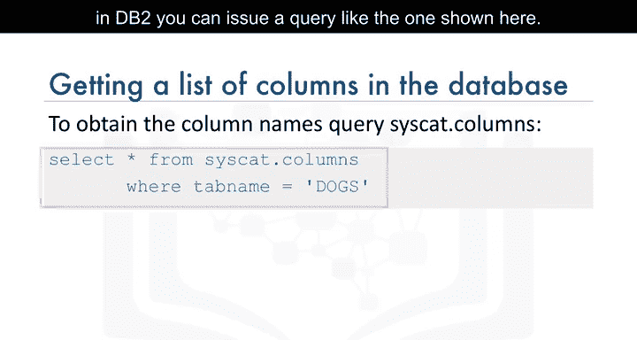

### 获取特定的列属性

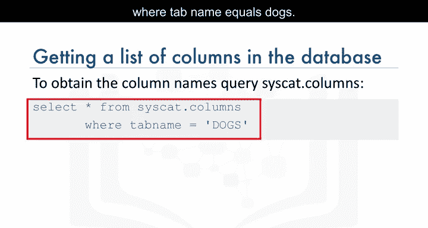

有时，您可能只关心特定的列属性，例如数据类型及其长度。

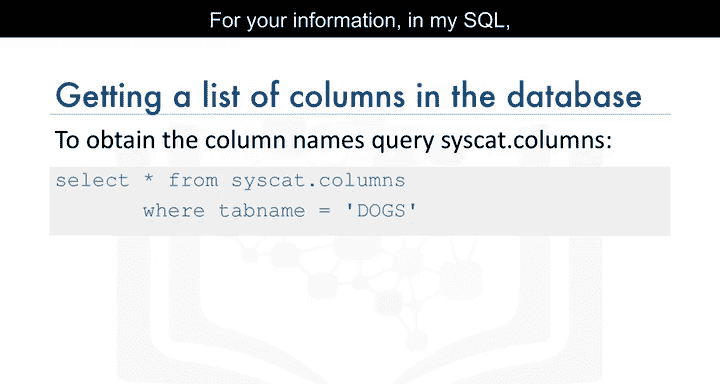

在 DB2 中，可以执行如下语句：
```sql
SELECT COLNAME, TYPENAME, LENGTH
FROM SYSCAT.COLUMNS
WHERE TABNAME = 'dogs';
```

## 注意事项：列名的大小写敏感性 ⚠️

从目录中查询列信息时，需要注意列名的大小写。例如，一个名为 `Arrest` 的列，其首字母 `A` 是大写，其余字母是小写。

在查询中引用此列时，不仅需要用双引号将列名括起来，还必须保持引号内的大小写完全正确：
```sql
-- 正确的引用方式
SELECT "Arrest" FROM crime_data;

-- 错误的引用方式（可能导致错误）
SELECT "arrest" FROM crime_data;
SELECT Arrest FROM crime_data; -- 在某些DBMS中，未加引号可能被转为大写
```

## 总结 📝

本节课中我们一起学习了如何获取数据库的表和列信息。我们了解到：
1.  可以通过查询系统目录（如 `SYSCAT.TABLES`、`INFORMATION_SCHEMA.TABLES`）来获取数据库中的表列表。
2.  可以查询 `SYSCAT.COLUMNS` 或使用 `SHOW COLUMNS` 命令来获取指定表的列详细信息。
3.  在处理列名时，必须注意数据库的大小写敏感性规则，正确使用引号并保持大小写一致。

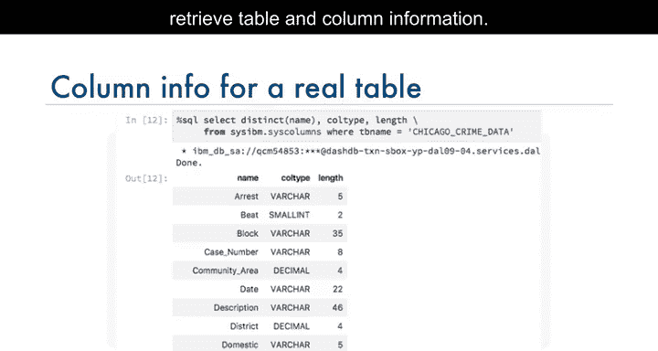

掌握这些技巧将帮助您更有效地探索和理解数据库结构，为后续的数据查询和分析打下坚实基础。