# 026：视图创建 👁️


在本节课中，我们将要学习SQL中的一个重要概念——视图。我们将了解视图的定义、适用场景以及如何创建和使用视图。

## 视图概述

视图是一种表示一个或多个表中现有数据的替代方式。一个视图可以包含来自一个或多个基表或现有视图的全部或部分列。创建视图会生成一个已命名的结果表规范，该规范可以像表一样被查询。

视图的数据实际上存储在基表中，而非视图本身。视图的定义被存储起来，当查询视图时，数据库会动态地执行定义视图的查询语句来获取数据。

## 为何使用视图？

上一节我们介绍了视图的基本概念，本节中我们来看看使用视图的几个主要目的。

以下是使用视图的几个常见场景：

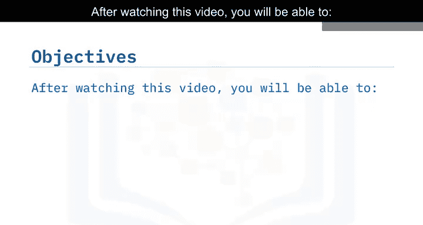

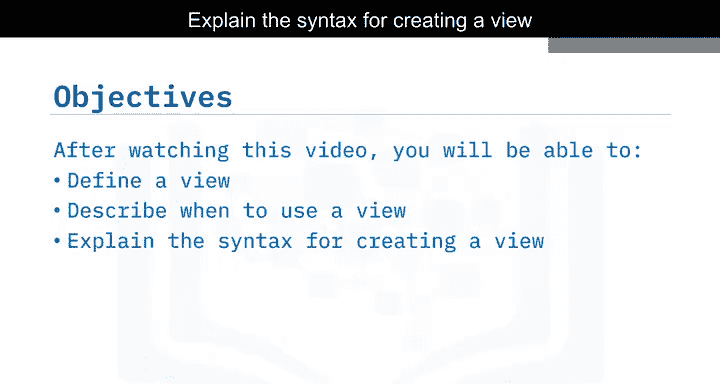

*   **数据安全与简化**：通过授予对视图的访问权限，而非直接访问底层表，可以控制用户能看到的数据。例如，可以创建一个不显示敏感信息（如薪资、出生日期）的员工信息视图。
*   **数据组合**：将两个或多个表中的数据以有意义的方式组合起来，形成一个逻辑上统一的视图。
*   **简化复杂查询**：对于频繁使用的复杂查询，可以将其创建为视图，之后只需查询视图即可，无需重复编写复杂的SQL语句。
*   **数据抽象**：只向特定流程或用户展示与其相关的数据部分，隐藏不必要的数据细节。

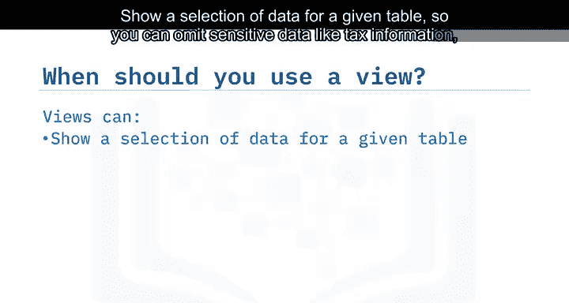

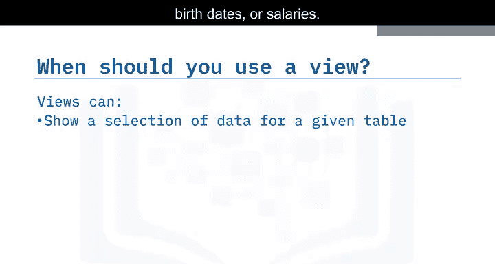

## 创建视图的语法

了解了视图的用途后，我们来看看如何创建视图。创建视图使用 `CREATE VIEW` 语句。

其基本语法结构如下：

```sql
CREATE VIEW view_name [(column1, column2, ...)]
AS
SELECT column1, column2, ...
FROM base_table_name
[WHERE condition];
```

*   **`CREATE VIEW view_name`**：用于定义视图，并为其指定一个名称（最多128个字符）。
*   **`[(column1, column2, ...)]`**：可选部分，用于为视图中的列指定别名。如果省略，视图列将使用SELECT语句中的列名。
*   **`AS SELECT ...`**：这是视图的核心，用于指定视图包含哪些列和数据。其后的SELECT语句与普通查询语句类似。
*   **`FROM base_table_name`**：指定视图数据来源的基表。
*   **`[WHERE condition]`**：可选子句，用于筛选包含在视图中的行。

## 视图创建示例

让我们通过一个具体的例子来实践视图的创建。假设我们有一个 `employees` 表，包含员工ID、姓名、地址、职位ID、经理ID、部门ID、薪资和出生日期等列。

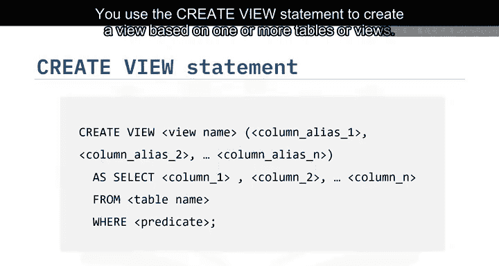

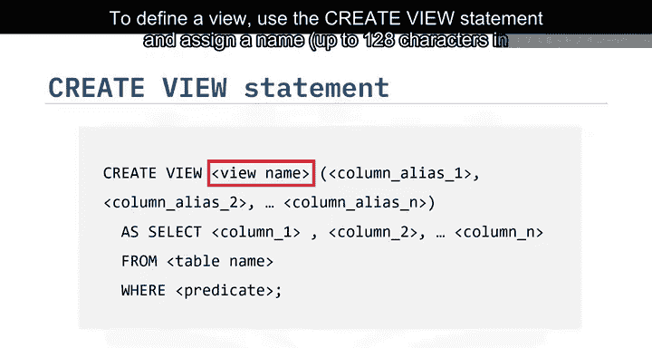

我们希望创建一个名为 `emp_info` 的视图，它仅包含非敏感的员工信息，并且只显示经理ID为 `30002` 的员工记录。

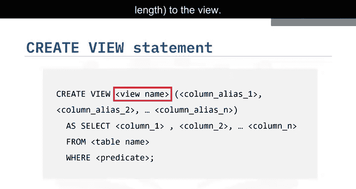

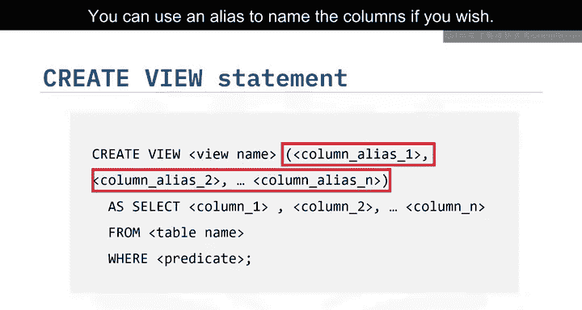

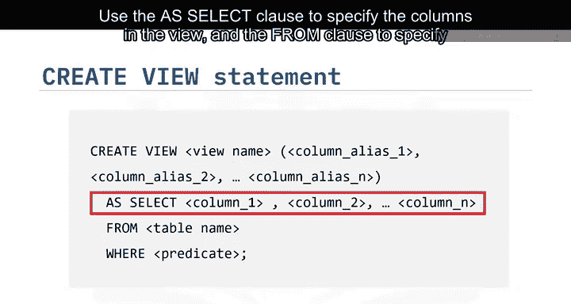

创建该视图的SQL语句如下：

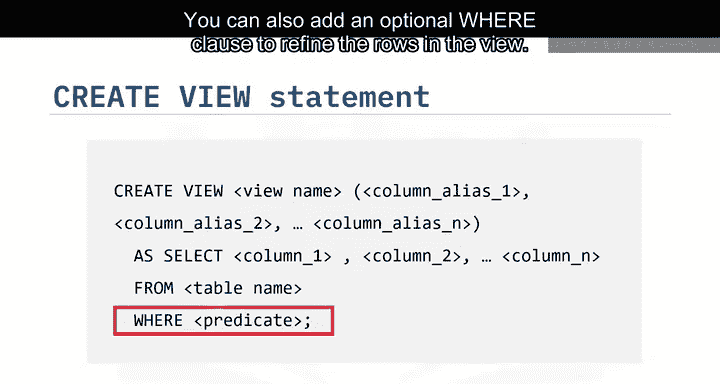

```sql
CREATE VIEW emp_info (emp_id, emp_name, address, job_id, manager_id, dept_id)
AS
SELECT emp_id, emp_name, address, job_id, manager_id, dept_id
FROM employees
WHERE manager_id = 30002;
```

执行此语句后，我们就创建了一个名为 `emp_info` 的视图。它不包含 `salary` 和 `birth_date` 列，并且只包含 `manager_id` 为 `30002` 的行。

## 查询与验证视图

视图创建成功后，可以像查询普通表一样查询它。视图是动态的，其内容由定义它的SELECT语句实时决定。

我们可以使用以下SELECT语句来查看视图的内容，并验证它是否只包含了我们指定的数据：

```sql
SELECT * FROM emp_info;
```

执行此查询将返回一个结果集，其中只包含 `employees` 表中经理ID为30002且不包含敏感字段的行。

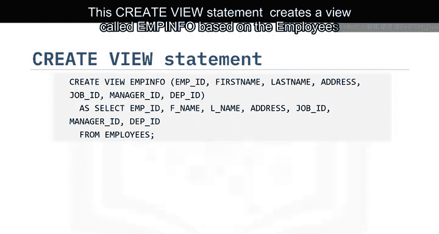

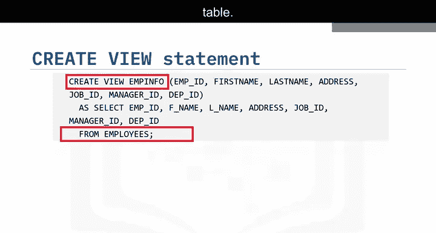

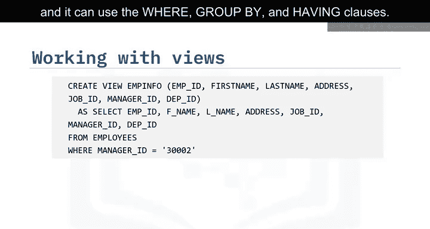

## 删除视图

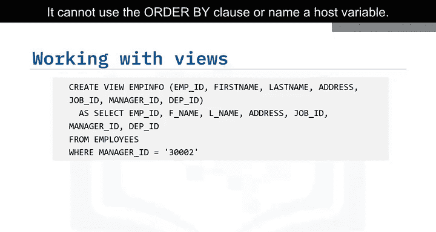

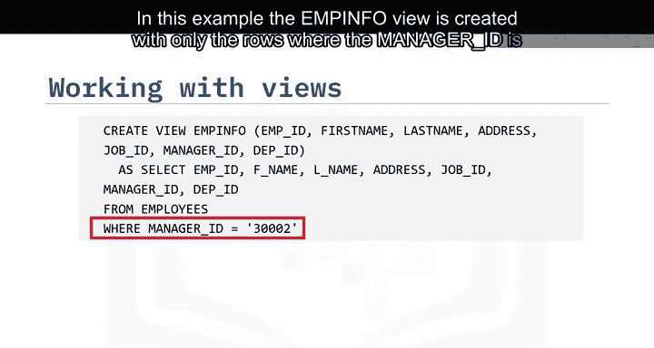

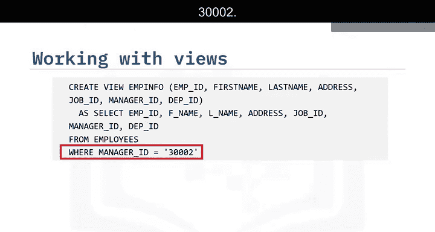

如果不再需要某个视图，可以使用 `DROP VIEW` 语句将其完全删除。

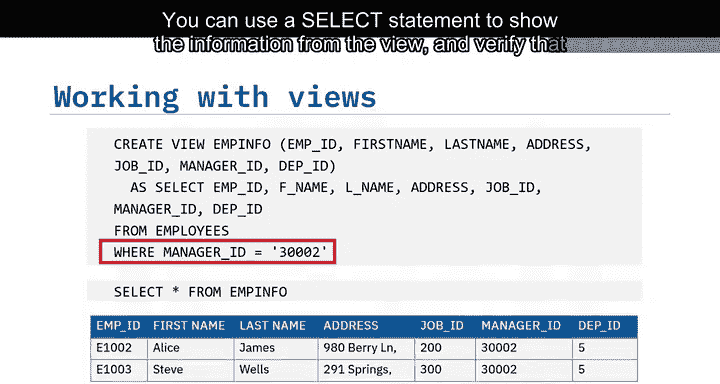

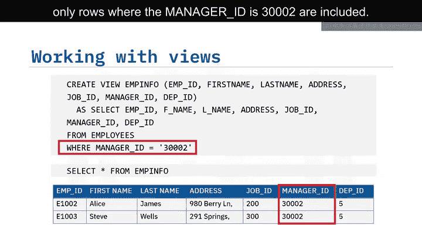

```sql
DROP VIEW view_name;
```

例如，要删除我们刚才创建的 `emp_info` 视图，可以执行：

```sql
DROP VIEW emp_info;
```

## 课程总结

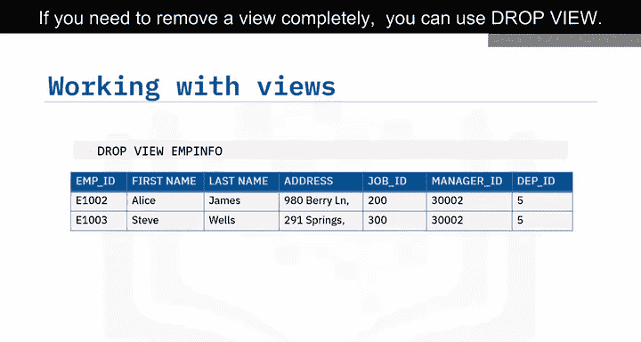

本节课中我们一起学习了SQL视图。

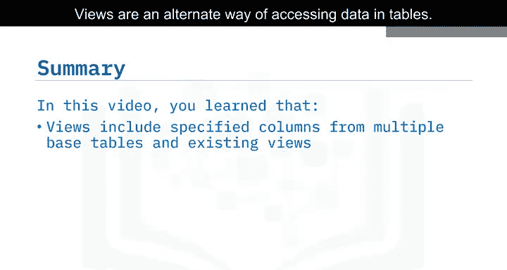

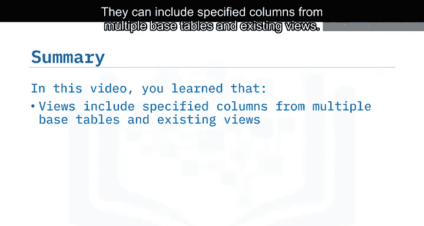

我们了解到，视图是访问表中数据的另一种方式，它可以包含来自多个基表或现有视图的指定列。视图创建后，可以像表一样被查询，并且可以通过视图对基表中的数据进行修改（INSERT, UPDATE, DELETE）。视图是动态的，只有视图的定义被存储，数据则实时来源于基表。我们使用 `CREATE VIEW` 语句基于一个或多个表来创建视图，并使用 `DROP VIEW` 语句来删除视图。视图在数据安全、简化查询和逻辑数据抽象方面是非常有用的工具。