# 027：存储过程使用 📚➡️💾


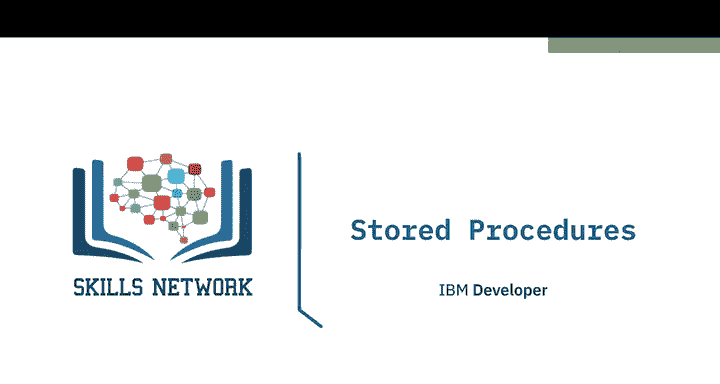

在本节课中，我们将要学习**存储过程**。我们将了解存储过程是什么，使用它的好处，以及如何在DB2数据库中创建和调用存储过程。

## 什么是存储过程？ 🤔

上一节我们介绍了SQL的基本操作，本节中我们来看看如何将一系列操作封装起来。

一个**存储过程**是一组存储在数据库服务器上并执行的SQL语句。因此，你无需从客户端向服务器发送多条SQL语句，而是将它们封装在服务器上的一个存储过程中，然后从客户端发送一条语句来执行它们。

## 存储过程的优势 ✨


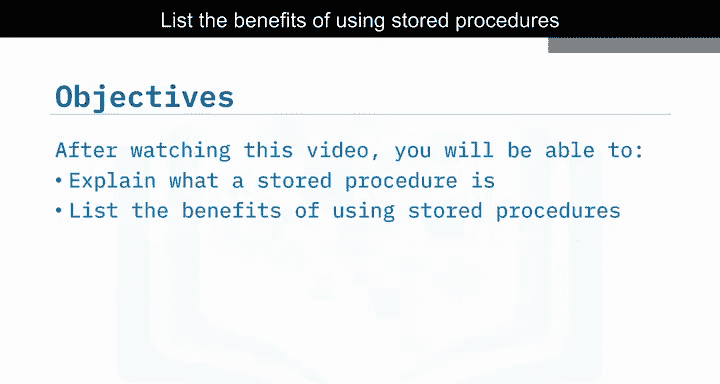

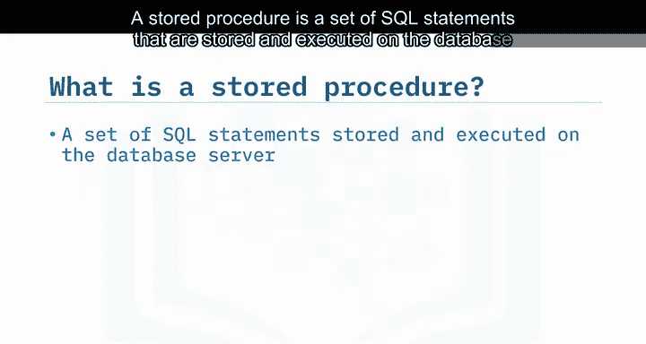

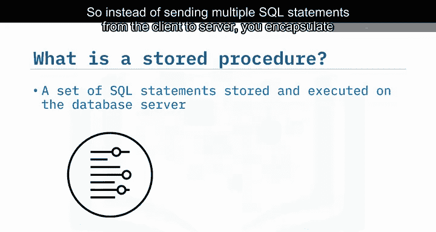

以下是使用存储过程的主要好处：

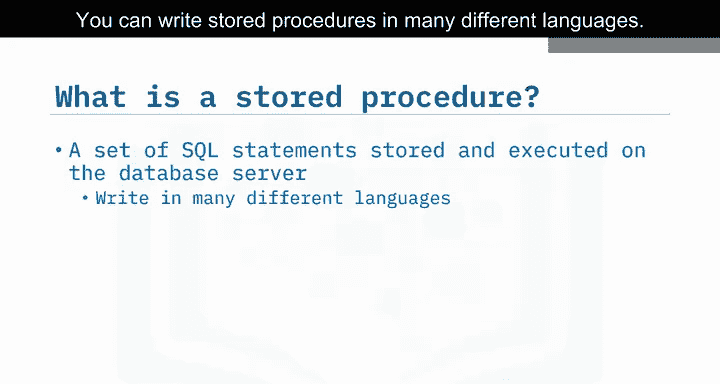

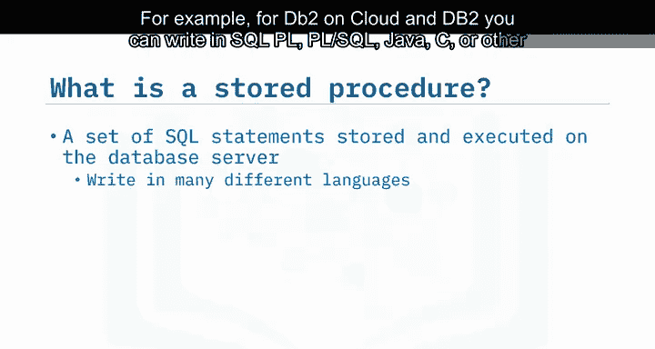

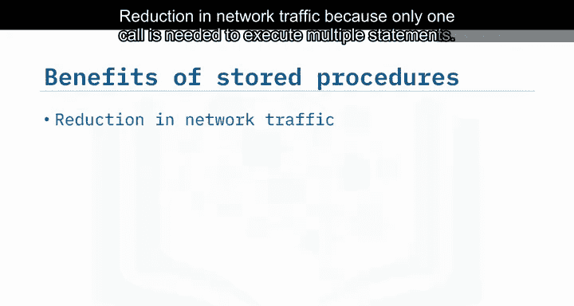

*   **减少网络流量**：因为只需要一次调用即可执行多条语句。
*   **提升性能**：处理过程发生在数据存储的服务器上，只有最终结果传回客户端。
*   **代码复用**：多个应用程序可以为相同的工作使用同一个存储过程。
*   **增强安全性**：
    *   你无需向客户端开发人员暴露所有表和列的信息。
    *   你可以在数据被系统接受之前，使用服务器端逻辑来验证数据。

> **请注意**：SQL并非功能完备的编程语言，因此不应尝试将所有业务逻辑都写在存储过程中。

## 如何创建存储过程？ 🛠️

了解了存储过程的优势后，我们来看看如何在DB2 on Cloud上使用SQL创建一个存储过程。

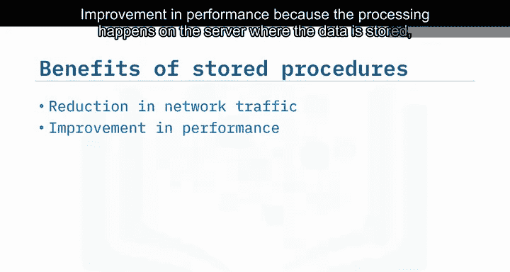

首先，使用 `CREATE PROCEDURE` 语句，指定过程名及其所需的参数。然后声明使用的语言，并将过程逻辑包裹在 `BEGIN` 和 `END` 语句中。

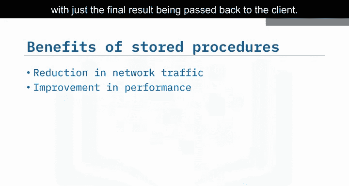

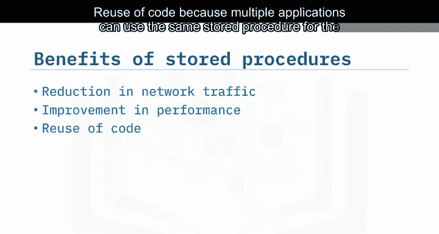

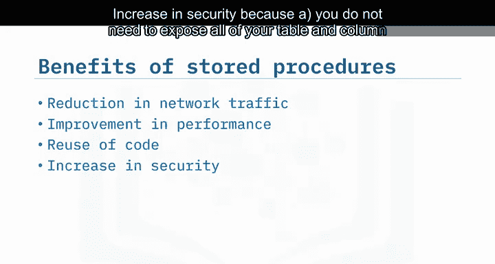

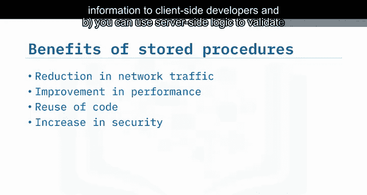

以下是一个示例，创建了一个名为 `UPDATE_SAL` 的存储过程，它接收员工编号和评级作为参数，并根据评级更新员工的薪水：

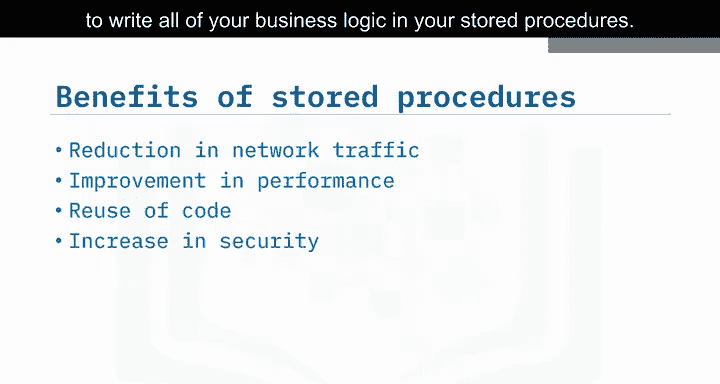

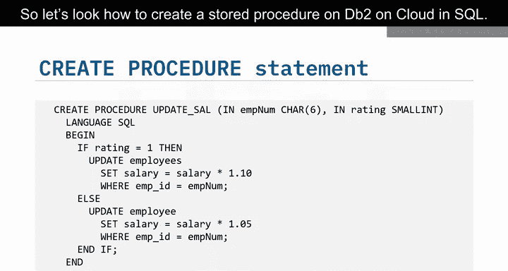

```sql
CREATE PROCEDURE UPDATE_SAL (IN emp_id CHAR(6), IN rating INT)
LANGUAGE SQL
BEGIN
    IF rating = 1 THEN
        UPDATE employee
        SET salary = salary * 1.10
        WHERE empno = emp_id;
    ELSE
        UPDATE employee
        SET salary = salary * 1.05
        WHERE empno = emp_id;
    END IF;
END
```

在这个例子中，`UPDATE_SAL` 过程将根据传入的 `emp_id` 和 `rating` 来更新员工薪水。评级为1的员工获得10%的加薪，其他员工获得5%的加薪。请注意，你可以直接在过程逻辑中使用传递给过程的参数信息。

## 如何调用存储过程？ 📞

创建好存储过程后，就可以从外部应用程序或动态SQL语句中调用它。

要调用我们刚刚创建的 `UPDATE_SAL` 存储过程，可以使用 `CALL` 语句，后跟存储过程的名称并传入所需的参数。

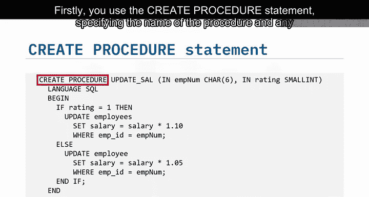

以下是调用示例：

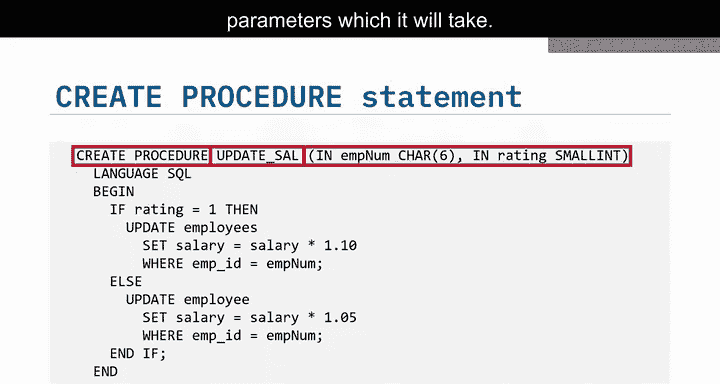

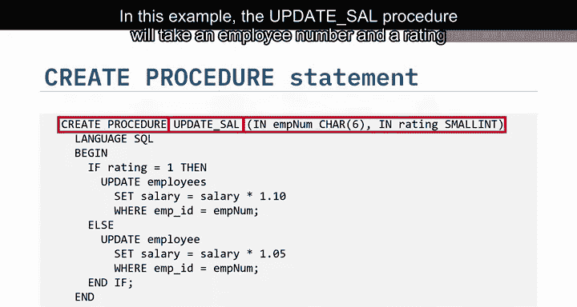

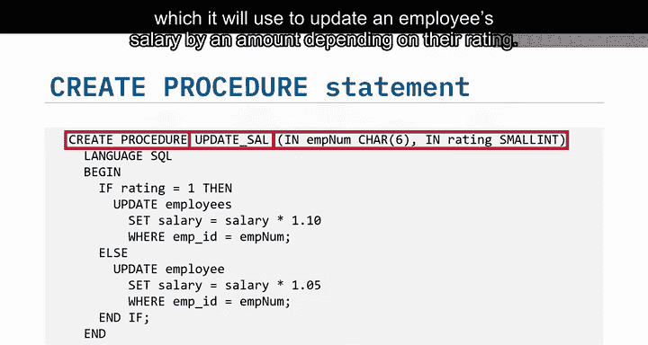

```sql
CALL UPDATE_SAL('000010', 1);
```

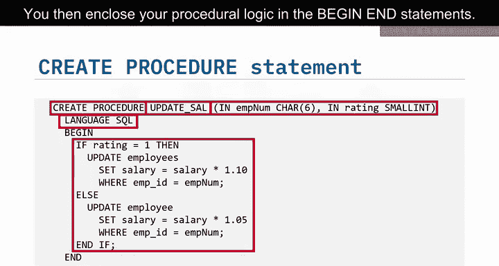

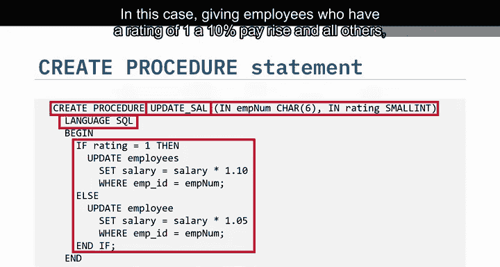

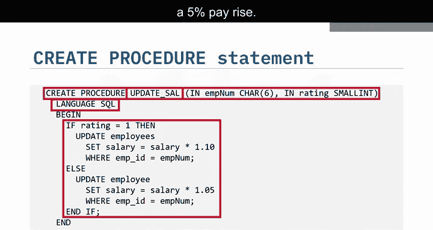

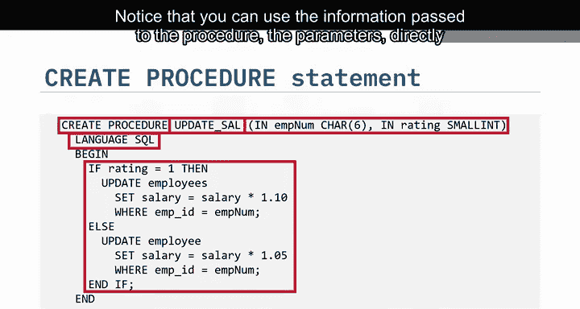

这条语句会调用 `UPDATE_SAL` 过程，为员工ID为 `‘000010’`、评级为 `1` 的员工执行加薪逻辑。

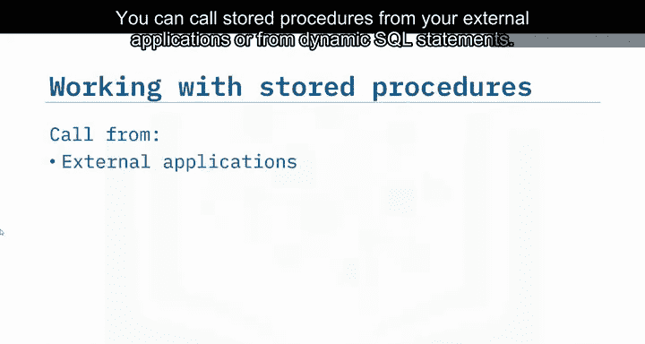

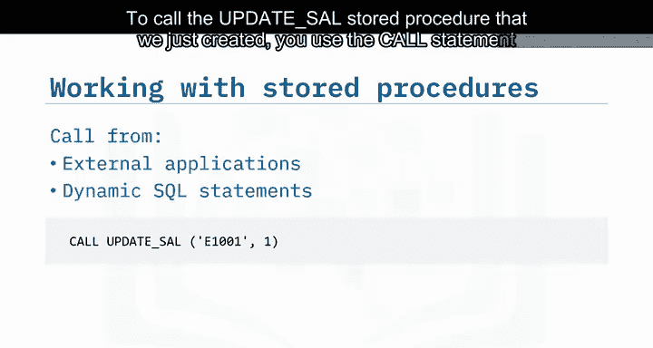

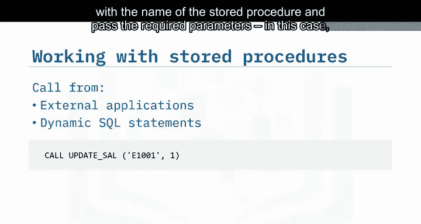

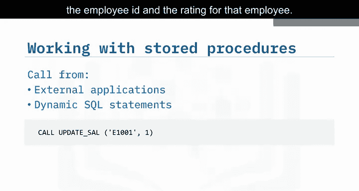

## 总结 📝

本节课中我们一起学习了存储过程的核心知识。

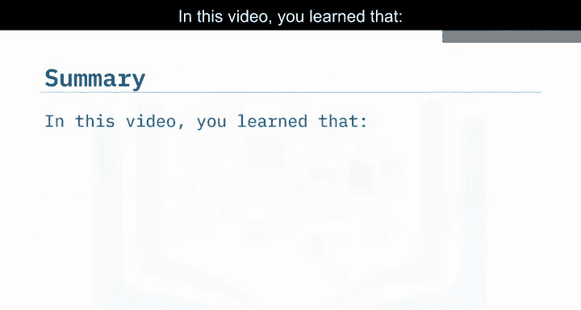

*   你了解到**存储过程**是一组在服务器上执行的SQL语句。
*   存储过程相比向服务器发送单独的SQL语句具有**诸多优势**，包括减少网络流量、提升性能、促进代码复用和增强安全性。
*   你学会了如何在DB2中**创建**一个简单的存储过程，以及如何通过 `CALL` 语句**调用**它，从而在动态SQL语句和外部应用程序中使用存储过程。