# 028：ACID事务特性 🧾

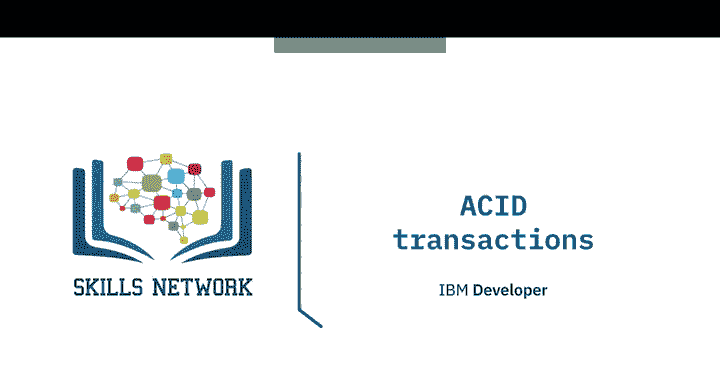

在本节课中，我们将要学习数据库事务的核心概念——ACID特性。我们将了解什么是事务，为什么它对于保证数据一致性至关重要，以及如何使用SQL命令来管理事务。

## 概述

事务是数据库操作中一个不可分割的工作单元。它可以包含一个或多个SQL语句，但为了被视为成功，要么所有这些SQL语句都必须成功完成，使数据库进入一个新的稳定状态；要么一个都不完成，使数据库保持在事务开始前的状态。

## 什么是事务？

一个事务是一个不可分割的工作单元。它可以由一个或多个SQL语句组成，但为了被视为成功，要么所有这些SQL语句都必须成功完成，使数据库进入一个新的稳定状态；要么一个都不完成，使数据库保持在事务开始前的状态。

例如，如果你使用银行卡进行购物，必须发生很多事情：商品必须添加到你的购物车，你的付款必须被处理，你的账户必须扣除正确的金额，商店的账户必须被记入，并且该产品的库存必须根据购买数量减少。

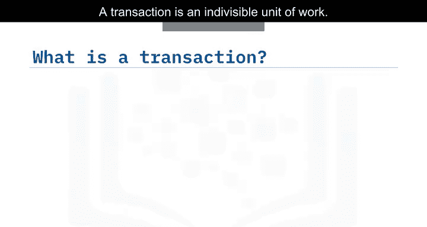

## 深入示例

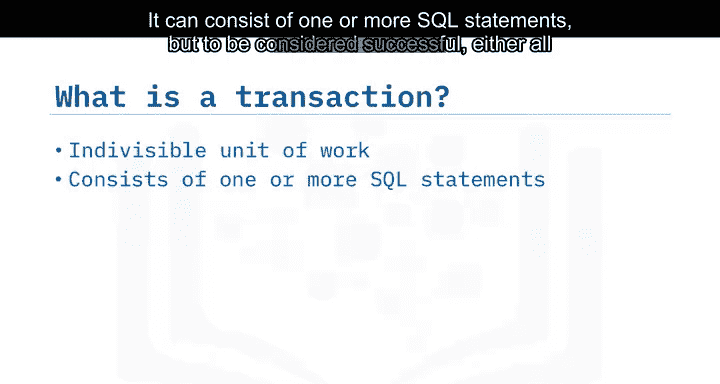

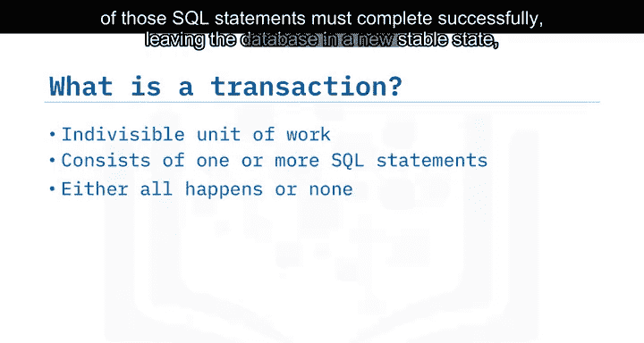

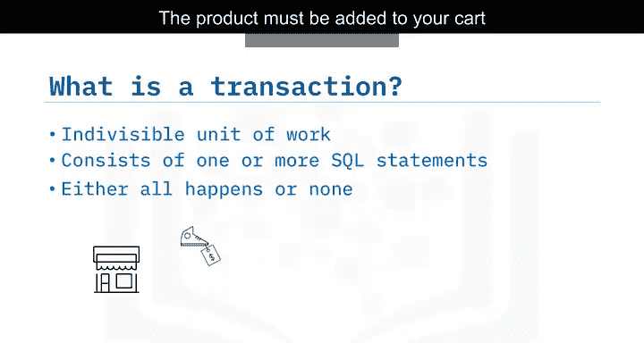

让我们更详细地看一下这个例子。如果Rose购买了一双价值200美元的靴子，那么你可以使用一个UPDATE语句来减少她的账户余额。

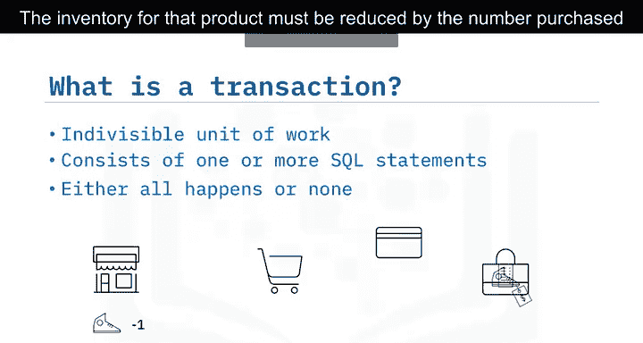

**代码示例：减少账户余额**
```sql
UPDATE accounts SET balance = balance - 200 WHERE account_holder = 'Rose';
```

接着，使用另一个UPDATE语句将200美元添加到鞋店的余额中。

**代码示例：增加商店余额**
```sql
UPDATE shop_accounts SET balance = balance + 200 WHERE shop_name = 'Shoe Shop';
```

最后，使用一个UPDATE语句将鞋店中靴子的库存水平减少一。

**代码示例：减少库存**
```sql
UPDATE inventory SET stock_level = stock_level - 1 WHERE product = 'Boots' AND shop_name = 'Shoe Shop';
```

如果这些UPDATE语句中的任何一个失败，整个事务都应该失败，以保持数据处于一致的状态。

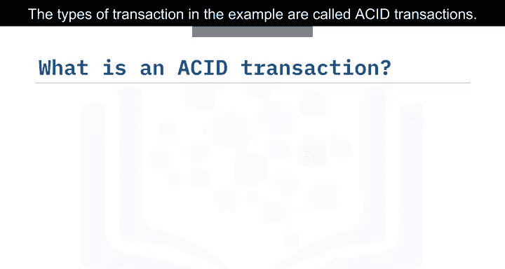

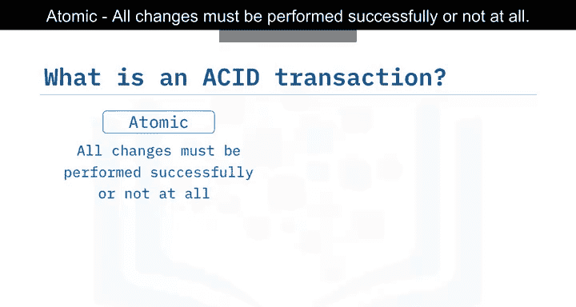

## ACID事务

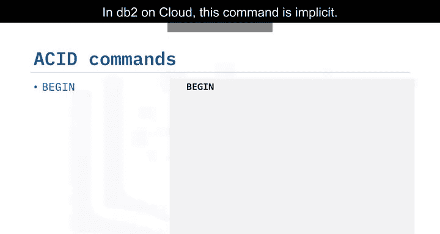

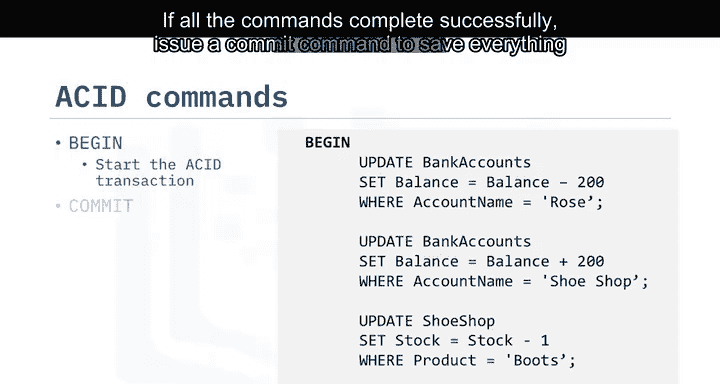

示例中的这类事务被称为ACID事务。ACID代表：

以下是ACID的四个核心特性：

*   **原子性**：所有更改必须全部成功执行，或者全部不执行。
*   **一致性**：数据在事务之前和之后必须处于一致的状态。
*   **隔离性**：在事务运行期间，其他进程不能更改数据。
*   **持久性**：事务所做的更改必须持久保存。

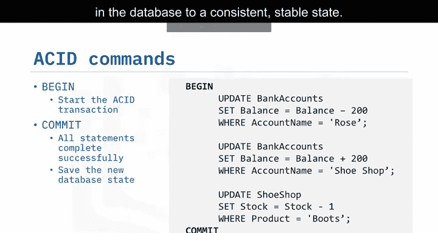

## 管理事务：COMMIT与ROLLBACK

在Db2 on Cloud中，使用`BEGIN`命令来启动一个ACID事务。这个命令是隐式的。在此之后你发出的任何命令都是事务的一部分，直到你发出`COMMIT`或`ROLLBACK`命令。

以下是管理事务的两个关键命令：

*   如果所有命令都成功完成，发出`COMMIT`命令将数据库中的所有内容保存到一个一致的、稳定的状态。
*   如果任何命令失败，例如Rose的账户没有足够的钱来支付，你可以发出`ROLLBACK`命令来撤销所有更改，并使数据库恢复到之前一致的稳定状态。

## 在应用程序中使用事务

SQL语句可以从Java、C、R和Python等语言中调用。这需要使用特定于数据库的访问API，例如用于Java的Java数据库连接（JDBC），或用于Python的特定数据库连接器（如IBMDB）。大多数语言使用完全相同的SQL命令来启动SQL命令，包括`COMMIT`和`ROLLBACK`，正如你在这个例子中看到的那样。请记住，`BEGIN`是隐式的，你不需要显式地调用它。

将SQL命令合并到你的应用程序代码中，使你能够创建错误检查例程，这些例程反过来控制事务是提交还是回滚。

## 总结

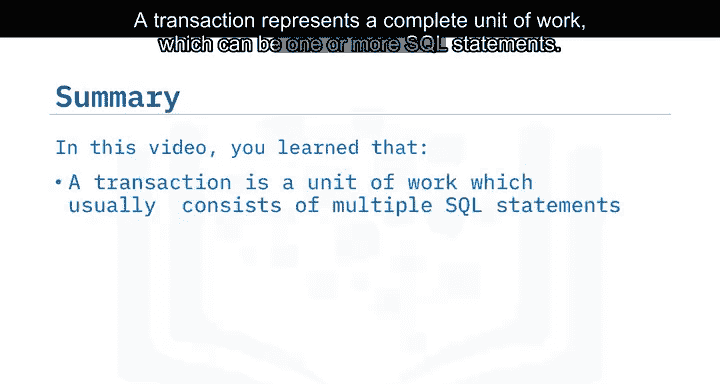

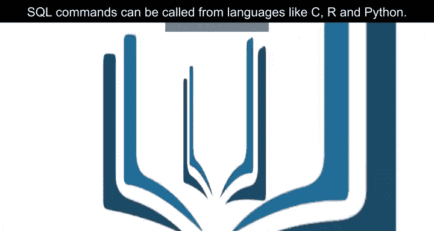

本节课中我们一起学习了事务的概念。我们了解到，事务代表一个完整的工作单元，可以是一个或多个SQL语句。ACID事务是指所有SQL语句必须全部成功完成，或者一个都不完成的事务。这确保了数据库始终处于一致的状态。ACID代表原子性、一致性、隔离性、持久性。SQL命令`BEGIN`、`COMMIT`和`ROLLBACK`用于管理ACID事务，并且SQL命令可以从C、R和Python等语言中调用。