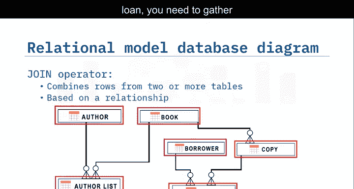
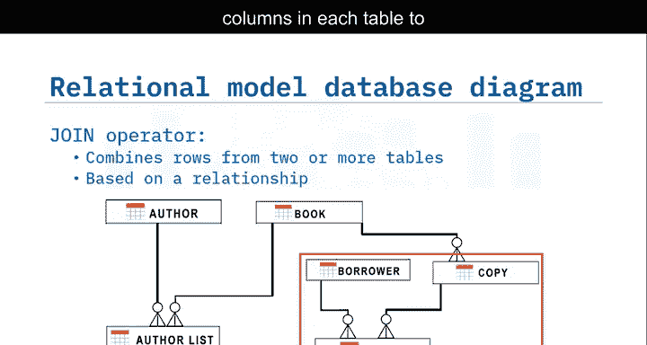
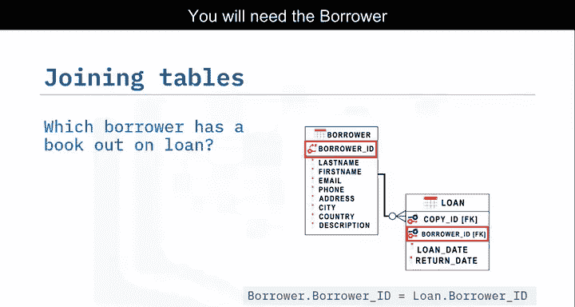
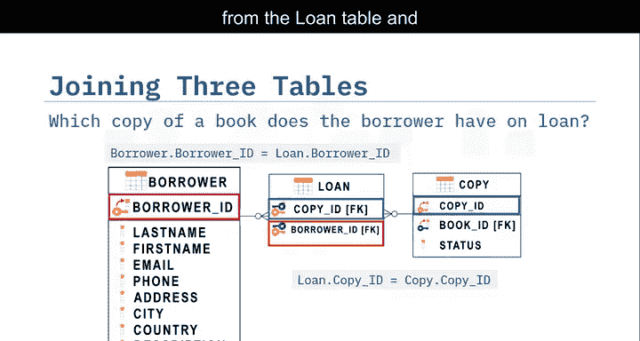
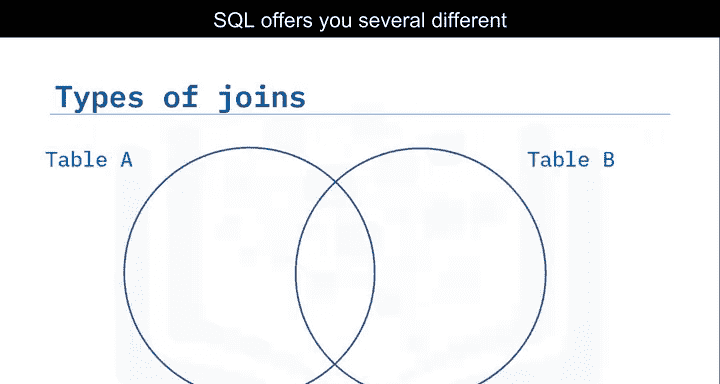
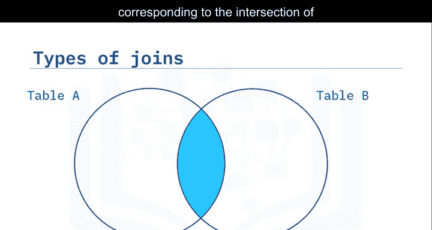
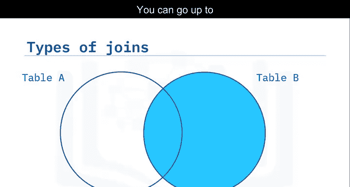
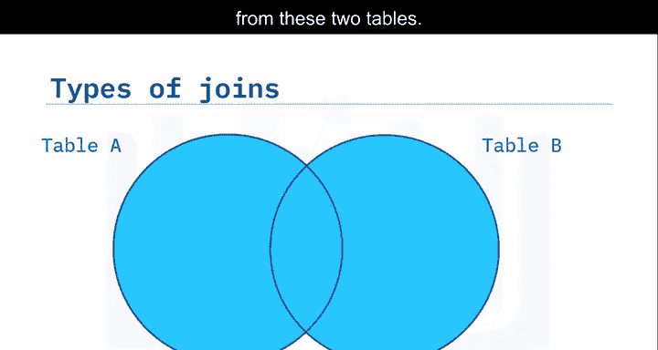
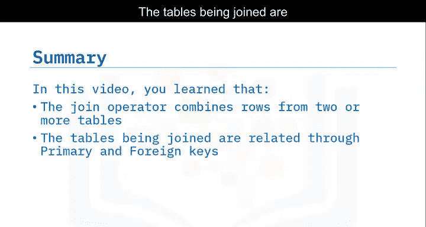

# 029：连接操作概述 🔗

在本节课中，我们将要学习SQL中的连接操作。你将了解连接操作符的定义，理解主键和外键在连接中的作用，并认识不同类型的连接操作符。

---

一个简单的`SELECT`语句可以从单个表的一个或多个列中检索数据。更复杂的情况是从两个或更多表中检索数据，这导致了生成结果集的多种可能性。

为了组合两个表中的数据，你需要使用连接操作符。**连接**基于这些表中某些列之间的关系，将两个或更多表的行组合起来。

在简化的图书馆数据库示例中，作者和书籍是实体。实体关系图代表了作者、书籍以及其他实体（如借阅者、借阅记录、副本和作者列表）的关系数据模型。信息被拆分到不同的表中。

如果你想了解哪位借阅者借出了哪本书的哪个副本，你需要从三个表中收集数据：借阅者表、借阅记录表和副本表。这时就需要使用连接操作符。

首先，你需要识别这些表之间的关系，即每个表中用于链接表的列。

在这个实体关系图中，请注意`author_id`、`book_id`、`borrower_id`和`copy_id`旁边有主键图标。**主键**唯一标识表中的每一行。

同时注意屏幕下半部分的实体，某些属性旁边标有`(FK)`。这标识了一个**外键**，它是一组引用另一个实体主键的列。例如，借阅记录实体有一个标有`(FK)`的`borrower_id`属性。在这个例子中，`borrower_id`属性是借阅记录实体中的外键，它引用了借阅者实体的主键。

因此，如果你想知道哪位借阅者借出了书，你需要从借阅者表和借阅记录表中收集数据，并且需要两个表中的`borrower_id`。

到目前为止，你已经看到了组合两个表的例子。但如果你需要组合三个或更多不同表中的数据呢？你只需在连接中添加新的表即可。

例如，如果你想知道哪些借阅者借了书，以及他们借的是哪本书的哪个副本，首先通过匹配`borrower_id`来连接借阅者表和借阅记录表的信息，然后通过匹配`copy_id`来连接借阅记录表和副本表的信息。

SQL提供了几种不同类型的连接。你可以提取与两个表交集相对应的数据，也可以选择更大的数据集，甚至可以选择这两个表所有数据的组合。

最常见的连接类型是**内连接**，它只显示两个表中在公共列上具有匹配值的行，这通常是第一个表的主键，并作为第二个表的外键存在。

还有**外连接**，它返回匹配的行，甚至返回一个或另一个表中不匹配的行。你可以使用多种外连接来优化你的结果集。

---

在本节课中，我们一起学习了可以使用连接操作符来组合两个或更多表中的行。被连接的表通过一个公共列相关联，这通常是一个表的主键，并作为另一个表的外键出现。连接有两种主要类型：内连接和外连接。