# 030：内连接操作 🔗


在本节课中，我们将要学习SQL中的**内连接**操作。我们将了解什么是内连接、何时使用它，并掌握其基本语法。


---

## 概述：什么是连接操作？

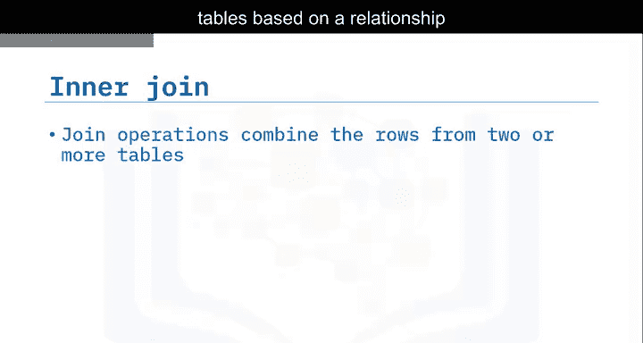

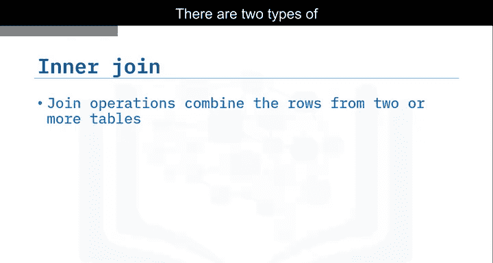

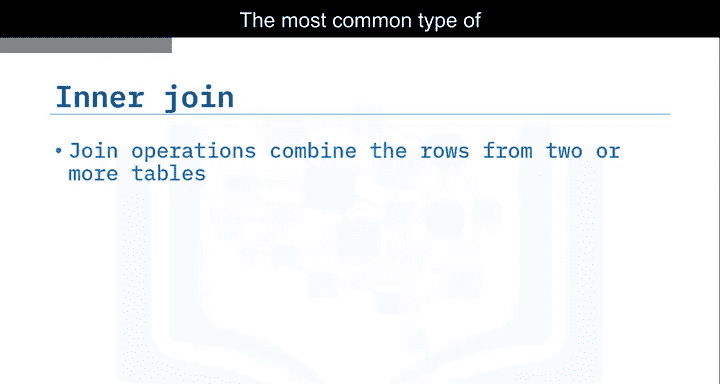

连接操作基于两个或多个表之间某些列的关系，将这些表中的行组合起来。表连接主要有两种类型：**内连接**和**外连接**。

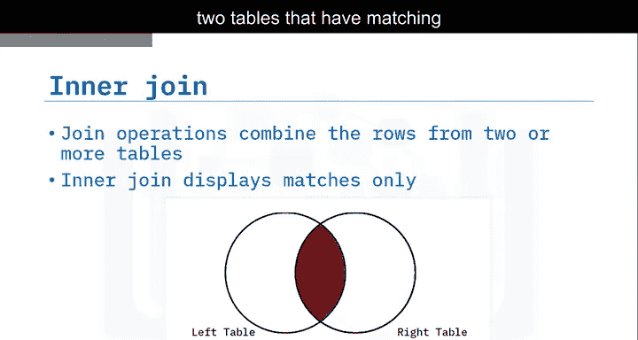


最常见的连接类型是**内连接**。它只显示两个表中在公共列上具有匹配值的行。这个公共列通常是一个表的主键，同时也是另一个表的外键。

---

## 内连接语法详解

上一节我们介绍了连接操作的基本概念，本节中我们来看看内连接的具体语法。

以下是内连接`SELECT`语句的一个示例语法结构：

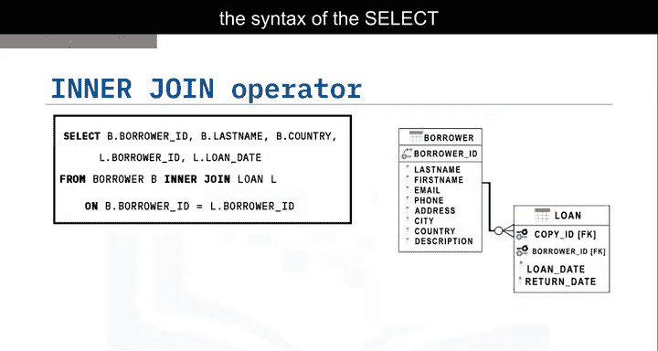

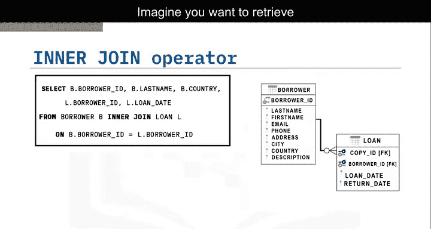

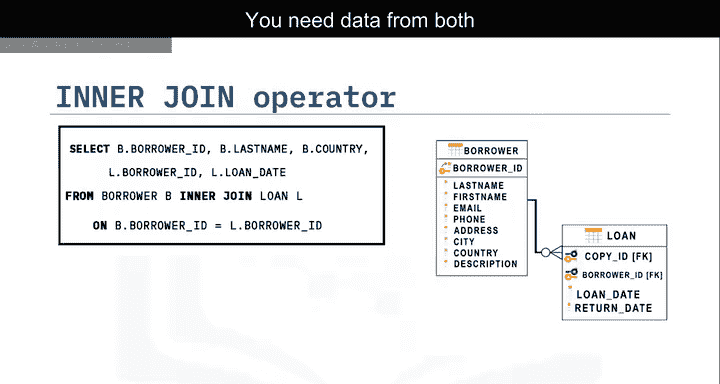

```sql
SELECT B.borrower_id, B.last_name, B.country, L.borrower_id, L.loan_date
FROM borrower AS B
INNER JOIN loan AS L
ON B.borrower_id = L.borrower_id;
```

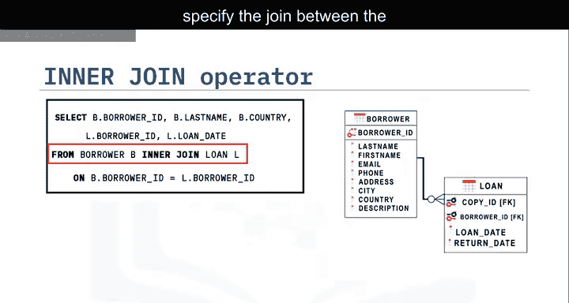

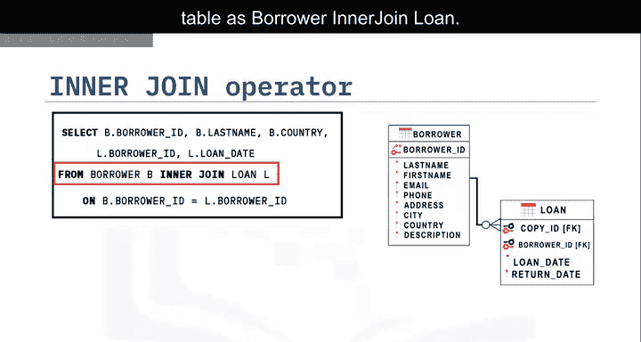

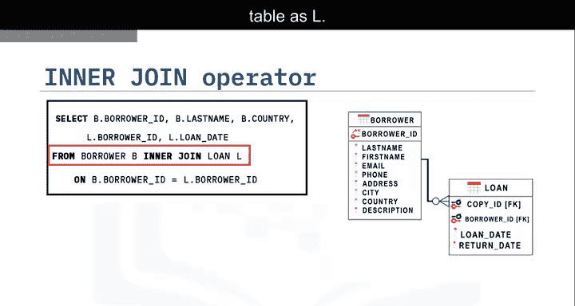

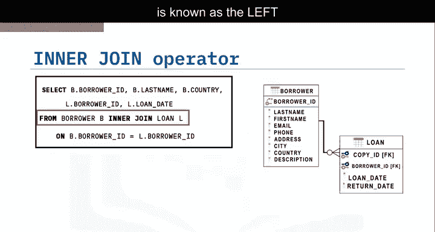

让我们分解这个例子。假设你想检索所有借书人及其借书日期的列表。你需要`borrower`表和`loan`表中的数据。

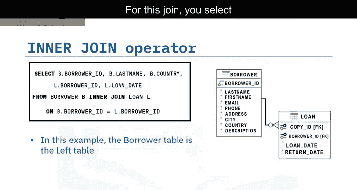

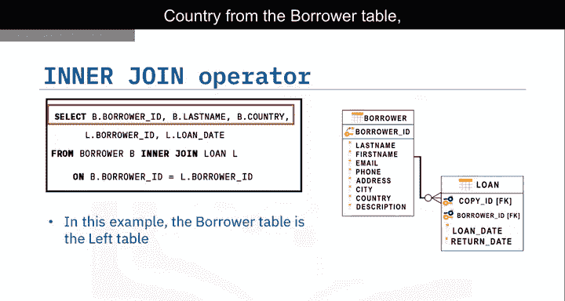

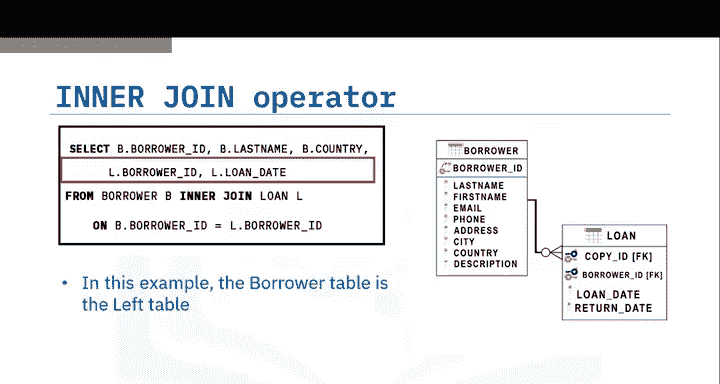

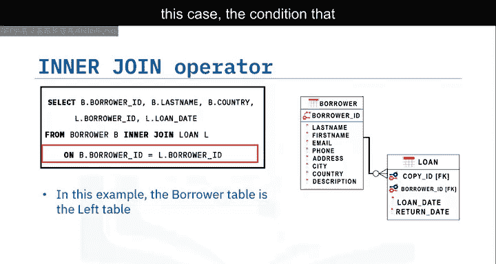

1.  **`FROM`与`JOIN`子句**：在`FROM`子句中，我们指定了`borrower`表，并使用`INNER JOIN`将其与`loan`表连接。
2.  **使用别名**：我们为`borrower`表指定了别名`B`，为`loan`表指定了别名`L`。在SQL中，使用别名比重复书写整个表名要方便得多。在后续的列名前缀中，我们使用了`B`或`L`来指明列所属的表。
3.  **`ON`子句**：在`ON`子句中，我们指定了连接谓词，即连接条件。在本例中，条件是`borrower`表中的`borrower_id`必须等于`loan`表中的`borrower_id`。
4.  **结果集**：结果集将只显示两个表中`borrower_id`匹配的那些行。`borrower_id`、`last_name`和`country`列来自`borrower`表，并与来自`loan`表的`borrower_id`和`loan_date`列连接在一起。

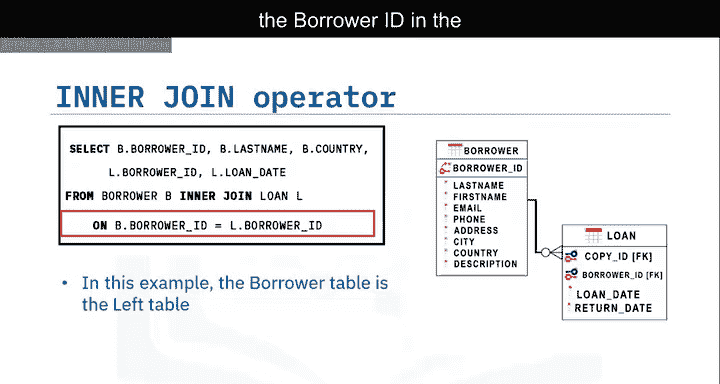

在`JOIN`子句左侧指定的表被称为**左表**。在本例中，`borrower`表是左表。

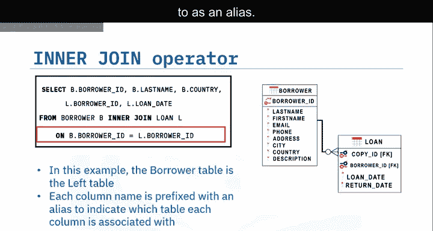

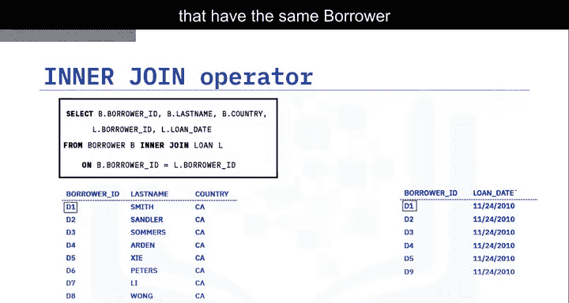

---

## 内连接的核心特点总结

本节课中我们一起学习了SQL内连接操作的核心要点：

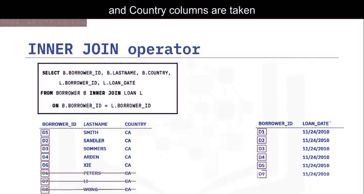

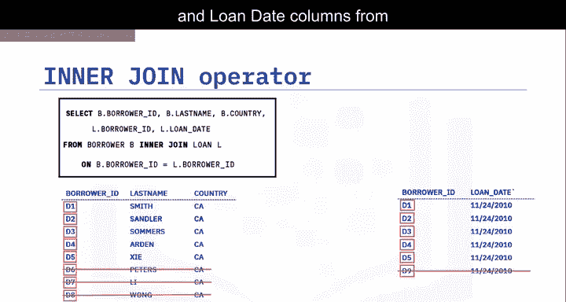

*   **内连接**只返回两个表中在公共列上具有匹配值的行。
*   这个公共列通常是一个表的主键，同时是另一个表的外键。
*   连接表中没有匹配值的行**不会**出现在结果集中。

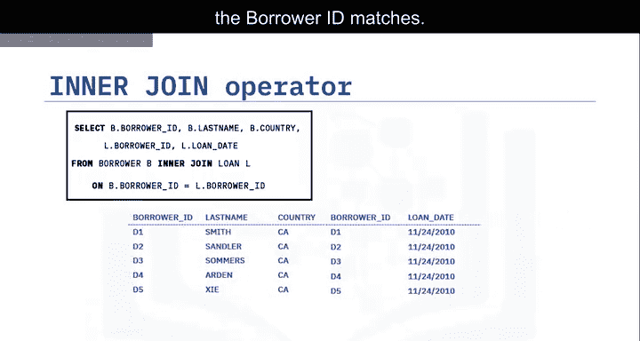

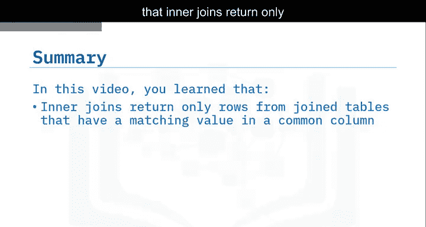

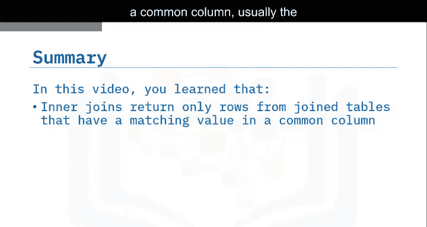

通过掌握内连接，你可以有效地从多个相关的数据库表中组合和提取所需的信息。