# 031：外连接操作 🔄

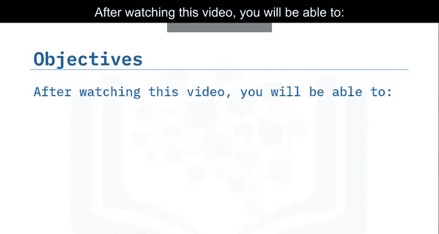

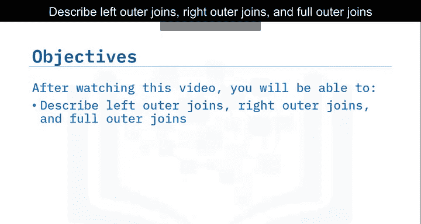

在本节课中，我们将要学习SQL中的外连接操作。与内连接不同，外连接不仅返回两个表中匹配的行，还会返回其中一个或两个表中不匹配的行。我们将详细探讨左外连接、右外连接和全外连接的概念、使用场景及语法。

## 概述

外连接是SQL中用于组合两个或多个表数据的重要工具。它允许我们在结果集中包含那些在连接条件上不完全匹配的行，这对于数据分析和完整性检查非常有用。

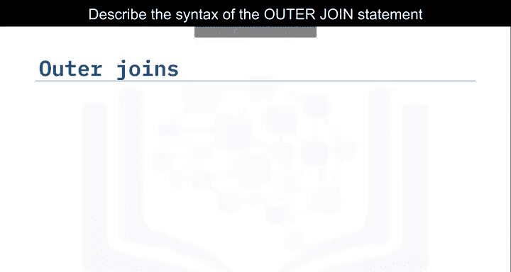


## 外连接与内连接的区别


上一节我们介绍了内连接，它只返回两个表中连接列值匹配的行。本节中我们来看看外连接。

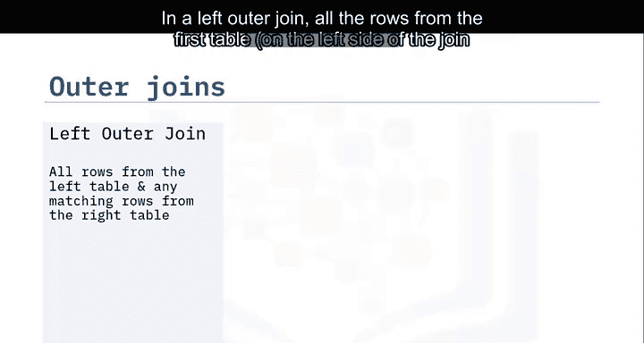

与内连接不同，外连接不仅返回每个表中连接列具有匹配值的行，还会返回表之间不匹配的行。

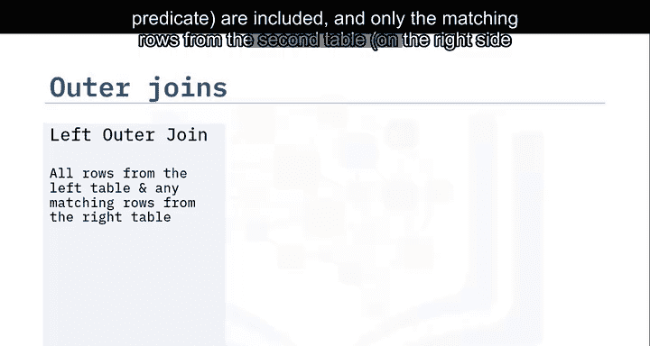

SQL提供了三种类型的外连接：
*   左外连接
*   右外连接
*   全外连接

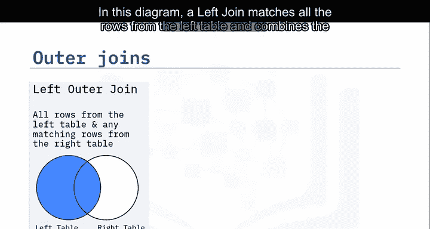

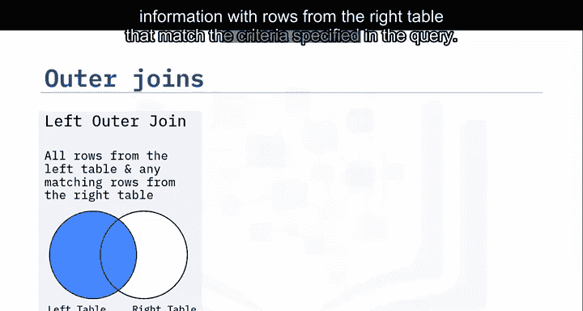

## 左外连接（LEFT OUTER JOIN）

在左外连接中，连接谓词左侧第一个表的所有行都会被包含，而只包含连接谓词右侧第二个表中匹配的行。

以下是一个左外连接的示意图：


在此图中，左连接匹配左表的所有行，并将信息与右表中符合查询指定条件的行相结合。


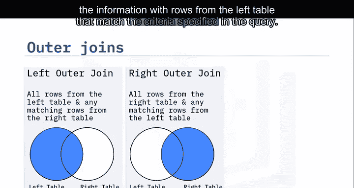

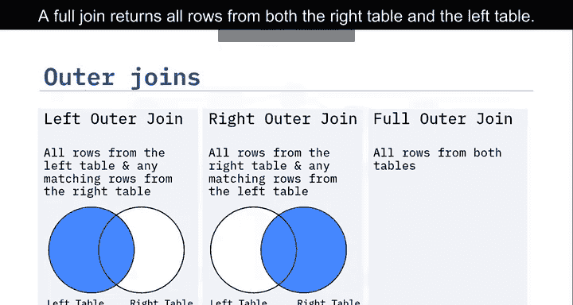

### 左外连接语法示例

以下是左连接SELECT语句的语法示例：

```sql
SELECT columns
FROM table1
LEFT JOIN table2
ON table1.column = table2.column;
```

在此示例中，`borrower`表是SELECT语句FROM子句中指定的第一个表。因此，`borrower`表是左表，`loan`表是右表。在FROM子句中，`borrower`列在连接运算符的左侧。因此，您将选择`borrower`表中的所有行，并根据查询中指定的条件（在本例中是`borrower ID`列）与`loan`表的内容相结合。

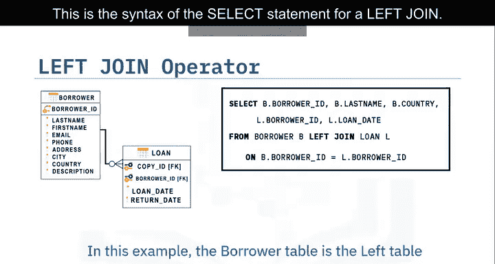

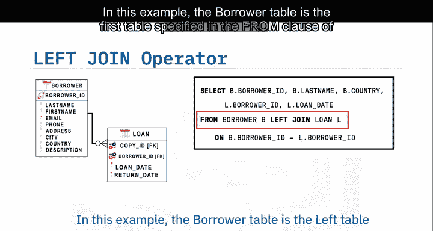


对于左外连接（通常简称为左连接），您将从`borrower`表中选择以下列：`Ber ID`、`last name`和`country`，同时从`loan`表中选择以下列：`borrower ID`和`loan date`。左连接选择`borrower`表中的每个`borrower ID`，并显示`loan`表中的`loan date`。

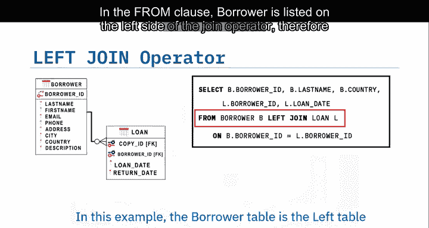

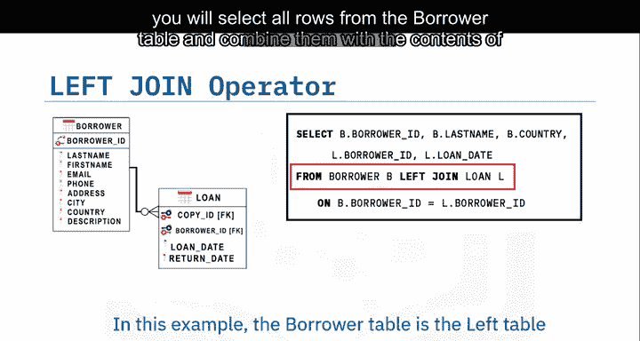

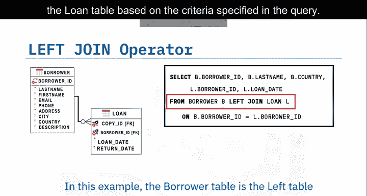

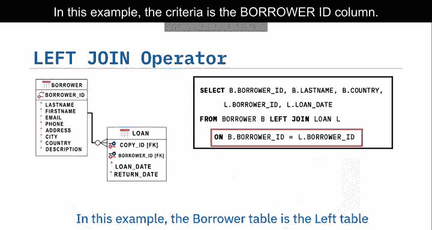

结果集显示`borrower`表中的每个`borrower ID`以及该借阅者的`loan date`。最后三行没有`loan date`，因此`borrower ID`和`loan date`显示为`NULL`值。

## 右外连接（RIGHT OUTER JOIN）

上一节我们介绍了左外连接，本节中我们来看看右外连接。

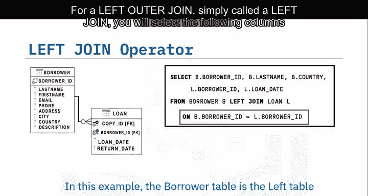

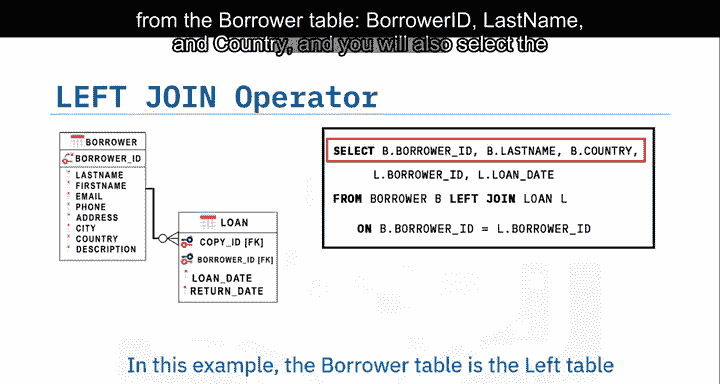

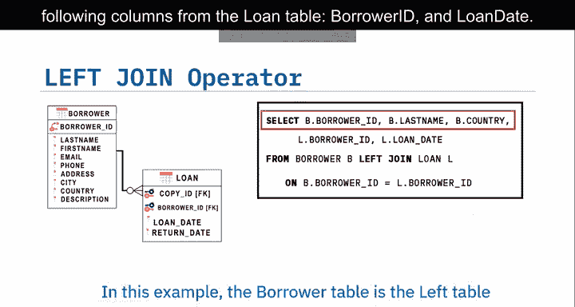

在右外连接中，连接谓词右侧第二个表的所有行都会被包含，而只包含连接谓词左侧第一个表中匹配的行。

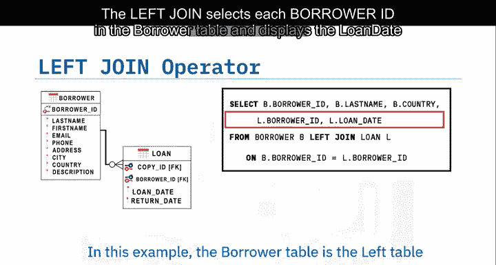

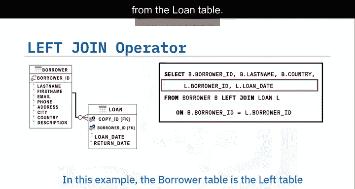

以下是一个右外连接的示意图：


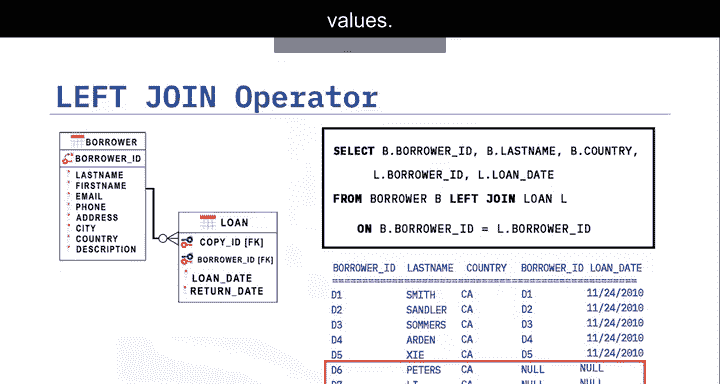

在此图中，右连接匹配右表的所有行，并将信息与左表中符合查询指定条件的行相结合。

### 右外连接语法示例

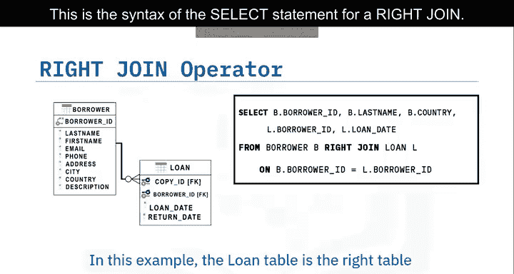

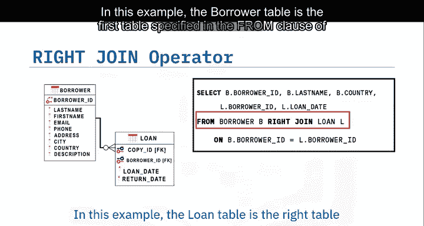

以下是右连接SELECT语句的语法示例：

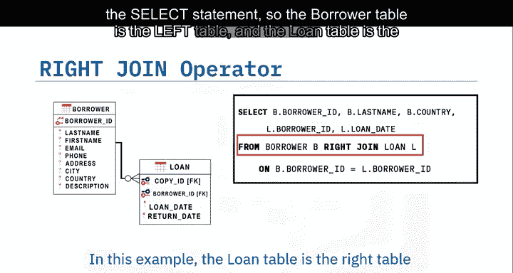

```sql
SELECT columns
FROM table1
RIGHT JOIN table2
ON table1.column = table2.column;
```

在此示例中，`borrower`表是SELECT语句FROM子句中指定的第一个表。因此，`borrower`表是左表，`loan`表是右表。在FROM子句中，`loan`表列在连接运算符的右侧。因此，您将选择`loan`表中的所有行，并根据查询中指定的条件（在本例中是`borrower ID`列）与`borrower`表的内容相结合。


对于右连接，您将从`loan`表中选择以下列：`Ber ID`和`loan date`，同时从`borrower`表中选择以下列：`borrower ID`、`last name`和`country`，条件是`loan`表中的`borrower ID`与`borrower`表中的`borrower ID`匹配。

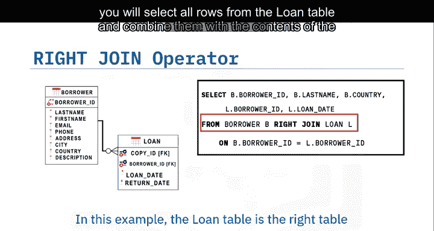

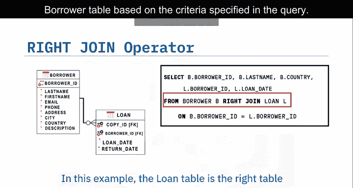

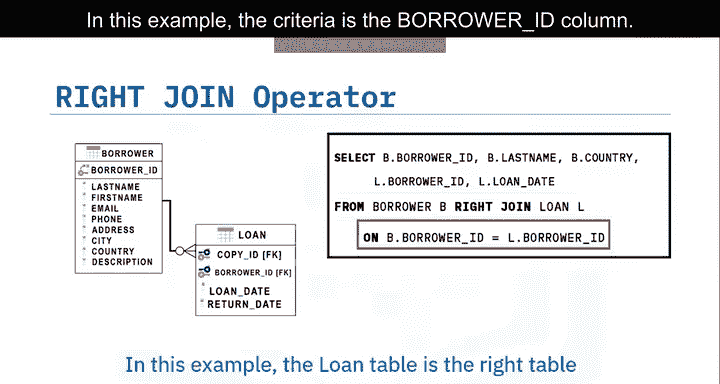

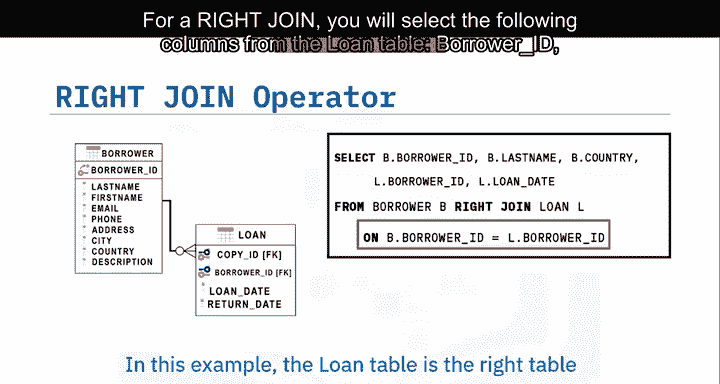

结果集显示`loan`表中的每个`borrower ID`以及该借阅者的`loan date`，条件是`loan`表中的`borrower ID`也存在于`borrower`表中。对于最后一行，`borrower`表中没有匹配的行。因此，`borrower ID`、`last name`和`country`显示为`NULL`值。这可能表明图书馆存在一个问题，即有一本书借给了一个未知的人。

## 全外连接（FULL OUTER JOIN）

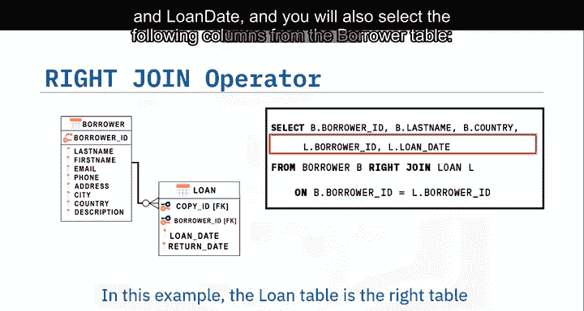

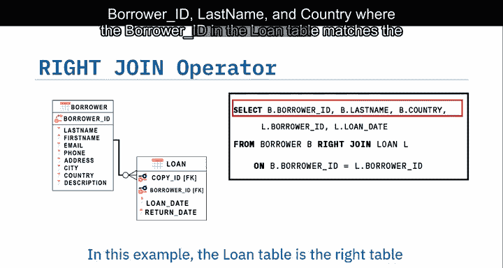

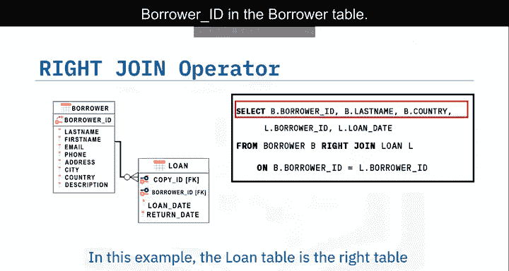

全连接返回右表和左表的所有行。因此，全连接可能返回一个非常大的结果集。

以下是一个全外连接的示意图：


在此图中，全连接的结果集是符合查询指定条件的两个表的所有行，加上右表中所有不匹配的行。

### 全外连接语法示例

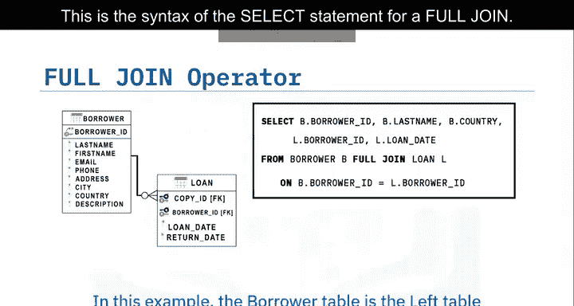

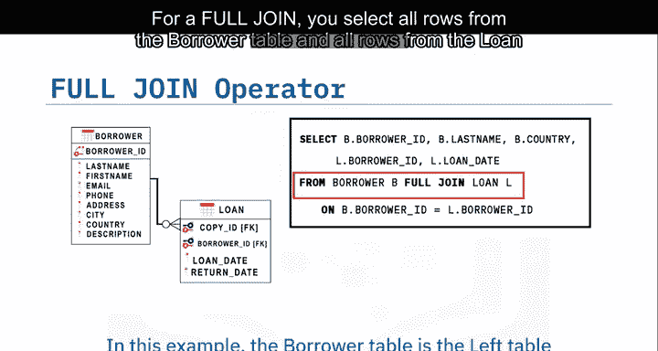

以下是全连接SELECT语句的语法：

```sql
SELECT columns
FROM table1
FULL JOIN table2
ON table1.column = table2.column;
```

对于全连接，您选择`borrower`表的所有行和`loan`表的所有行。

结果集显示`borrower`表中列出的所有八条记录，以及`loan`表中的相应数据。再次地，有三行返回`NULL`值，因为借阅者Peters、Lee和Wang从未借过书。最后一行返回`loan`表中的`borrower Id`和`loan date`值，但从`borrower`表返回`NULL`。在这种情况下，`borrower`表中没有匹配项。这本书的借阅者是未知的。

## 总结

本节课中我们一起学习了外连接操作。

您了解到可以使用多种外连接来优化结果集：
*   **左外连接**返回左表的所有行，以及右表中与内连接会返回的匹配行，再加上左表中在右表没有匹配项的所有行。
*   **右外连接**返回内连接会返回的所有行，以及右表中在左表没有匹配项的所有行。
*   **全外连接**返回两个表中所有匹配的行，以及两个表中所有没有匹配项的行。


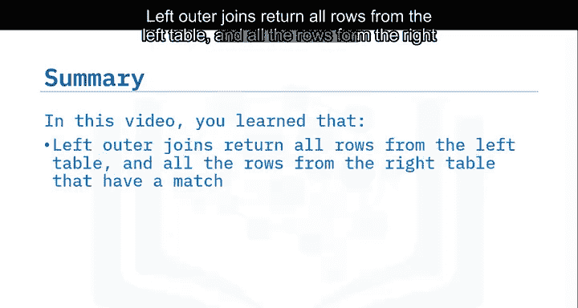

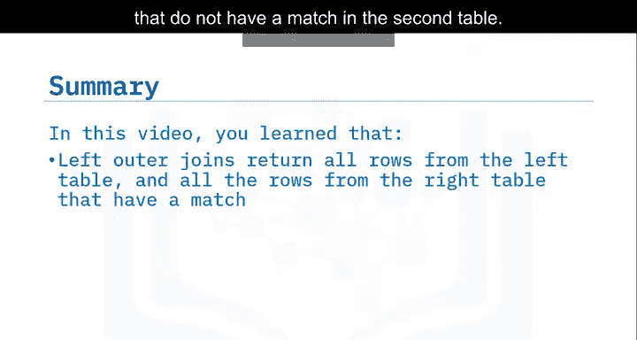

掌握这些连接类型将帮助您更灵活地处理和分析数据库中的关系数据。