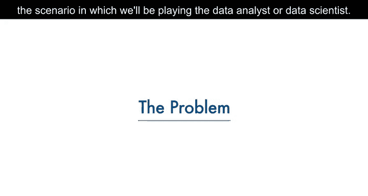
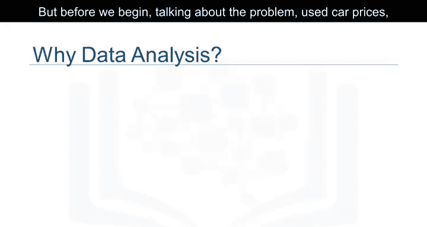
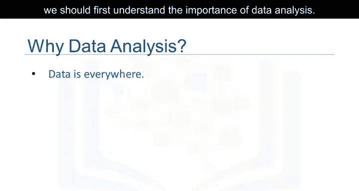
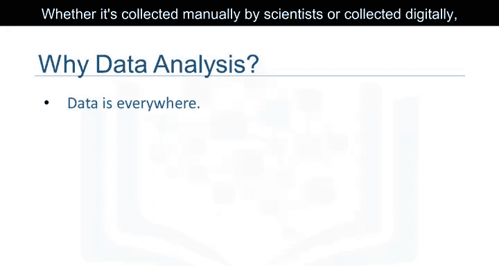
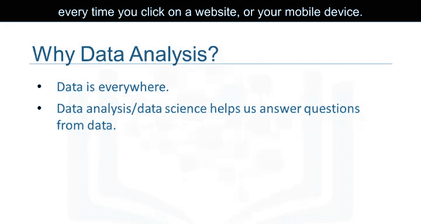
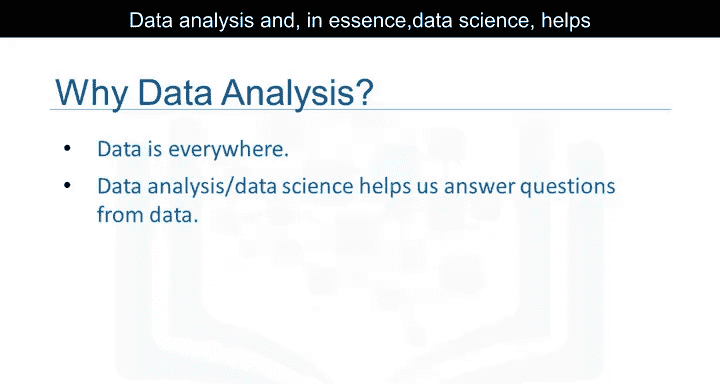
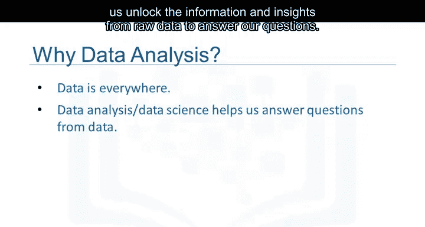
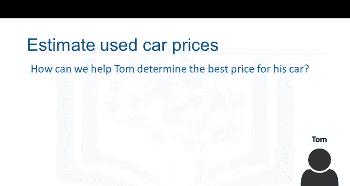
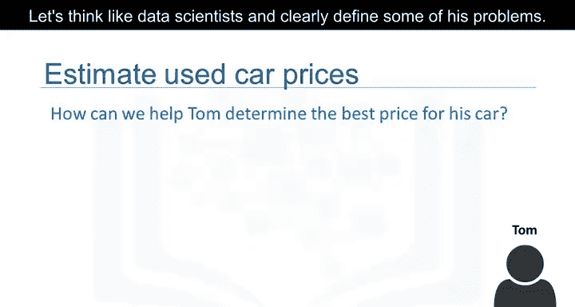

# 001：问题定义

在本节课中，我们将学习数据分析的基本概念，并通过一个具体场景——帮助朋友汤姆确定其二手车的合理售价——来理解如何定义数据分析问题。

---

## 数据分析的重要性

在我们开始讨论具体问题之前，首先需要理解数据分析的重要性。

数据在我们周围无处不在。无论是科学家手动收集的数据，还是每次点击网站或移动设备时自动生成的数字数据，我们都被数据包围。

但数据本身并不等同于信息。数据分析，乃至数据科学的核心，正是帮助我们从原始数据中解锁信息和洞察，从而回答我们的问题。

因此，数据分析扮演着至关重要的角色。它帮助我们：
*   从数据中发现有用信息。
*   回答问题。
*   甚至预测未来或未知的事物。

---

## 问题场景引入

现在，让我们从一个具体场景开始。

假设我们有一个名叫汤姆的朋友。汤姆想要卖掉他的汽车。但问题是，他不知道应该为他的车定价多少。

汤姆希望尽可能以高价卖出他的车。但同时，他也希望设定一个合理的价格，以便有人愿意购买。因此，他设定的价格应该能够反映这辆车的价值。

那么，我们如何帮助汤姆确定他汽车的最佳售价呢？

---

## 像数据科学家一样思考

让我们像数据科学家一样思考，并清晰地定义他面临的问题。

以下是我们可以开始思考的一些关键问题：
*   是否存在关于其他汽车价格及其特征的数据？
*   汽车的哪些特征会影响其价格？是颜色、品牌吗？
*   马力是否也会影响售价？或者还有其他因素？

作为一名数据分析师或数据科学家，这些都是我们可以着手探索的问题。

为了回答这些问题，我们将需要一些数据。在接下来的视频中，我们将深入探讨如何理解数据、如何将其导入Python，以及如何开始从数据中获取一些基本洞察。

---

## 本节总结

本节课中，我们一起学习了数据分析的目的与重要性，并通过“帮助汤姆为二手车定价”的实际案例，初步体验了如何像数据科学家一样定义问题、提出关键疑问，为后续的数据收集与分析工作奠定了基础。