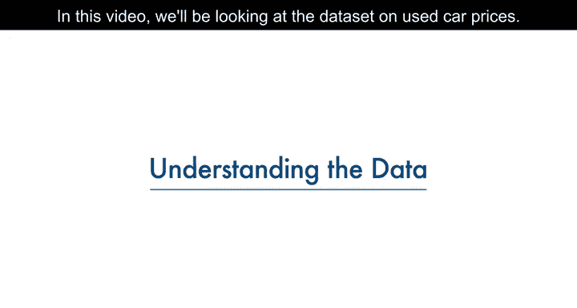

# 002：数据理解 🚗

在本节课中，我们将学习如何理解一个用于数据分析的数据集。我们将以二手车价格数据集为例，介绍数据集的基本结构、各列的含义，并明确数据分析的目标。

---

## 数据集概览

本节课使用的数据集是Jeffrey C. Schlimmer提供的一个开放数据集。该数据集采用CSV格式，其特点是用逗号分隔每个值，这使得它能够轻松导入到大多数工具或应用程序中。

每一行代表数据集中的一个数据记录。在本模块的实践练习中，你将能够下载并使用这个CSV文件。

## 数据格式与结构

你注意到第一行有什么不同吗？有时，第一行是标题行，包含26列中每一列的列名。但在本例中，第一行只是另一行数据。

以下是关于26列中每一列含义的文档说明。列的数量很多，我将只介绍其中几个列名，你也可以查看幻灯片底部的链接以自行查阅详细描述。

以下是数据集中的部分关键属性及其含义：

*   **symboling**：对应车辆的保险风险等级。车辆最初会根据其价格被分配一个风险系数符号。如果一辆车的风险更高，这个符号会通过向上调整等级来修正。值为+3表示该汽车风险很高，-3则表示可能非常安全。
*   **normalized-losses**：指每辆受保车辆每年的相对平均损失赔付额。该值针对特定尺寸分类（如双门小型旅行车、运动型专用车等）内的所有汽车进行了标准化，代表每辆车每年的平均损失。其值范围在65到256之间。
*   其他属性相对容易理解。如果你想查看更多详细信息，请参考幻灯片底部的链接。

## 分析目标：预测价格

在我们理解了每个特征的含义之后，我们会注意到第26个属性是**price**（价格）。这是我们的目标值或标签。

换句话说，这意味着价格是我们希望从数据集中预测的值，而预测因子应该是列出的所有其他变量，如symboling、normalized-losses、make（品牌）等等。

因此，本项目的目标是根据其他汽车特征来预测价格。

需要快速说明的是，这个数据集实际上来自1985年，因此其中车型的价格可能看起来有点低。但请记住，本练习的目标是学习如何分析数据。

---

在本节课中，我们一起学习了二手车价格数据集的基本情况，包括其CSV格式、数据结构、关键列的含义，并明确了数据分析的核心目标是利用其他特征来预测汽车价格。理解数据是进行有效分析的第一步。