# 003：Python数据科学核心包介绍

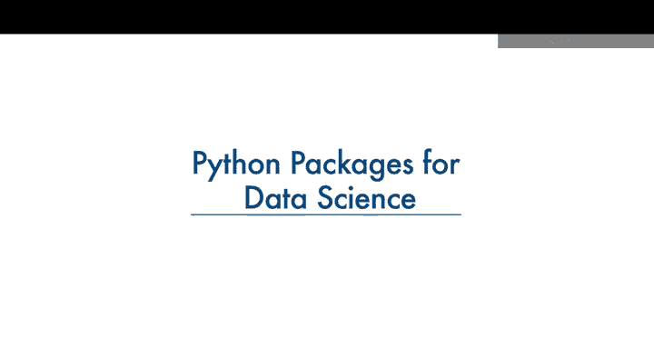

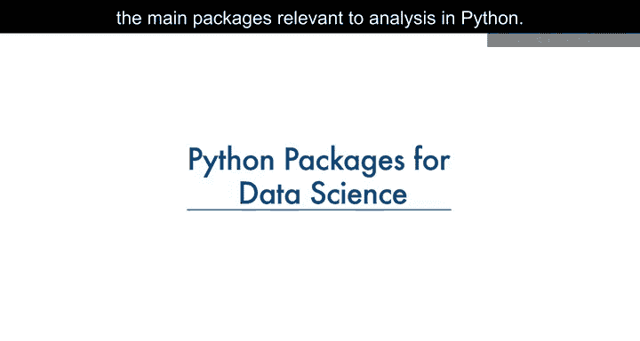

在本节课中，我们将学习使用Python进行数据分析时所需的核心库。这些库提供了强大的工具和函数，使我们能够高效地处理、分析和可视化数据，而无需从零开始编写大量代码。

---

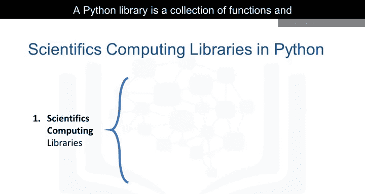

## 🧩 Python库是什么？

一个Python库是函数和方法的集合，它允许你执行许多操作而无需编写任何代码。

库通常包含内置模块，提供可以直接使用的不同功能。此外，还有功能广泛的库，提供广泛的服务。

我们将Python数据分析库分为三组。

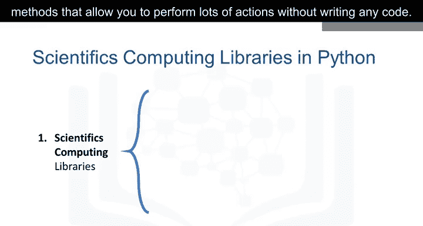

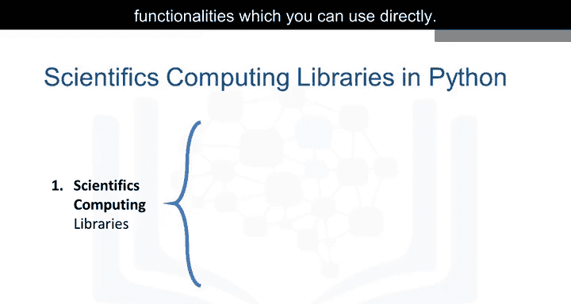

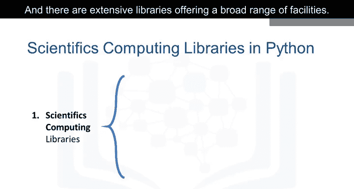

---

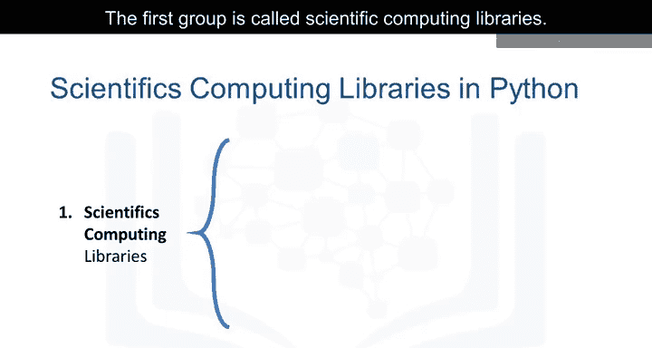

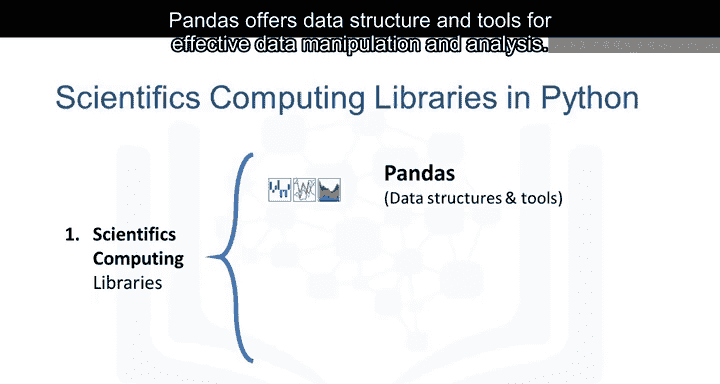

## 🔬 第一组：科学计算库

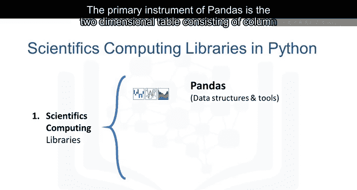

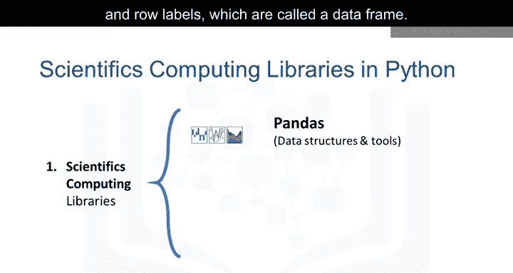

上一部分我们了解了库的基本概念，本节中我们来看看第一组核心库——科学计算库。它们为数据处理和数值计算提供了基础。

以下是主要的科学计算库：

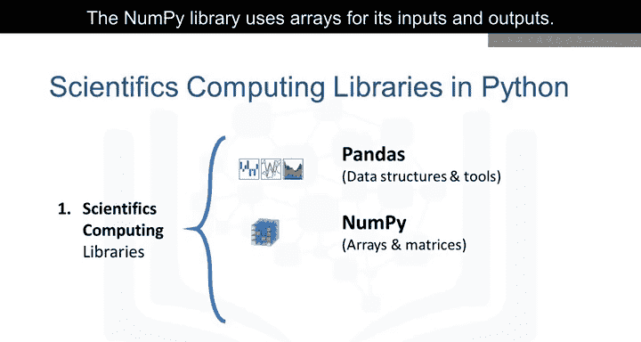

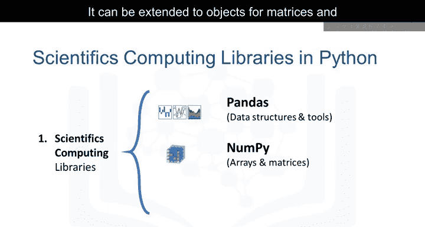

*   **Pandas**：提供用于高效数据操作和分析的数据结构和工具。它提供了对结构化数据的便捷访问。Pandas的主要工具是一个由列和行标签组成的二维表，称为 **DataFrame**。它旨在提供简单的索引功能。
*   **NumPy**：该库使用数组作为其输入和输出。它可以扩展到矩阵对象，开发者只需进行少量代码修改即可执行快速的数组处理。
*   **SciPy**：包含用于解决一些高级数学问题的函数（如本幻灯片所列），以及数据可视化功能。

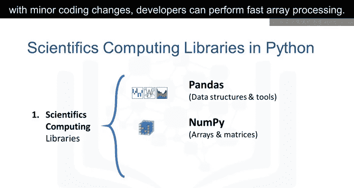

---

## 🎨 第二组：数据可视化库

使用数据可视化方法是与他人交流、展示分析有意义结果的最佳方式。这些库使你能够创建图表和地图。

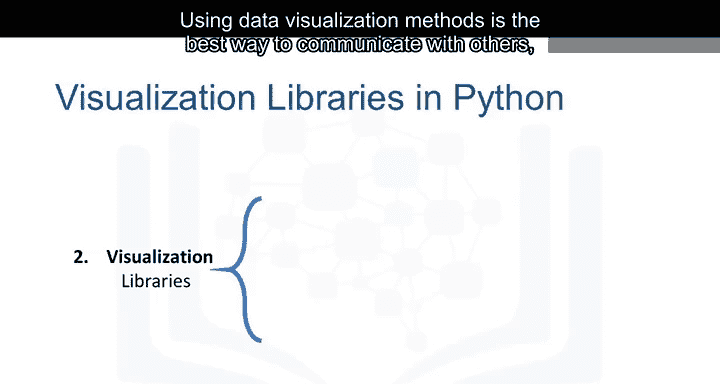

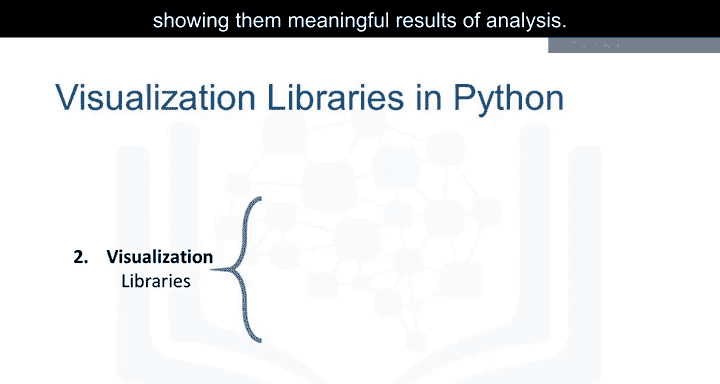

以下是主要的数据可视化库：

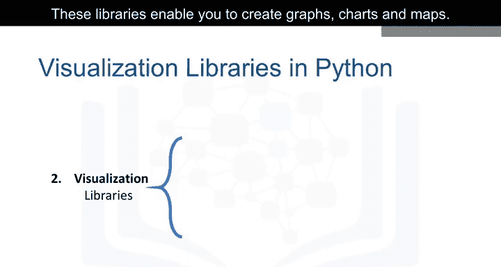

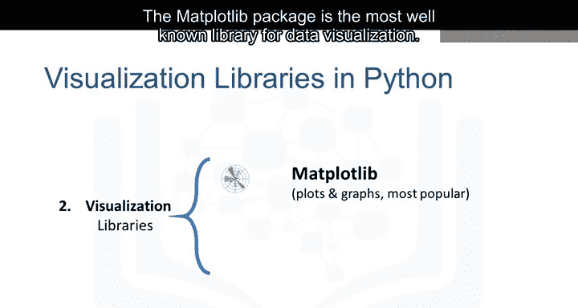

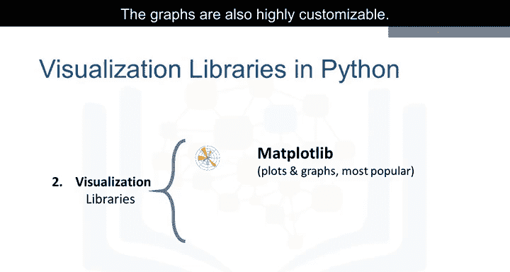

*   **Matplotlib**：这是最著名的数据可视化库包。它非常适合制作图形和图表，并且图表具有高度可定制性。
*   **Seaborn**：这是另一个高级可视化库，它基于Matplotlib。它可以非常轻松地生成各种图表，例如热力图、时间序列图和小提琴图。

---

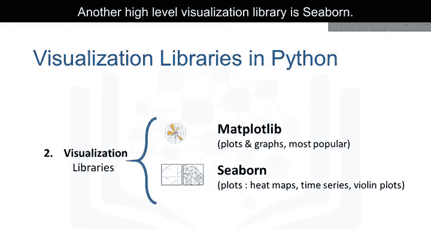

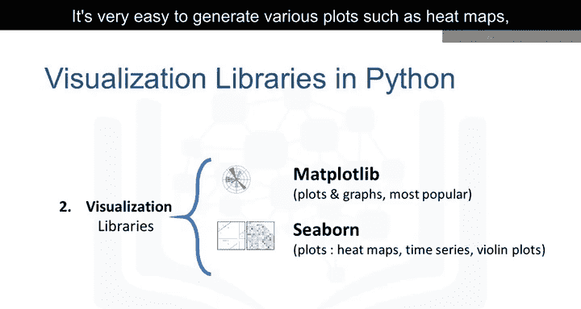

## 🤖 第三组：机器学习算法库

通过机器学习算法，我们能够使用数据集开发模型并获得预测。算法库处理从基础到复杂的机器学习任务。

以下是两个重要的机器学习库：

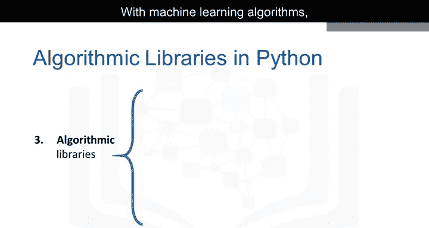

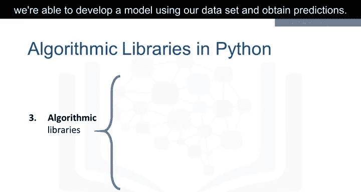

*   **Scikit-learn**：该库包含统计建模工具，包括回归、分类、聚类等。这个库建立在NumPy、SciPy和Matplotlib之上。
*   **Statsmodels**：这也是一个Python模块，允许用户探索数据、估计统计模型和执行统计检验。

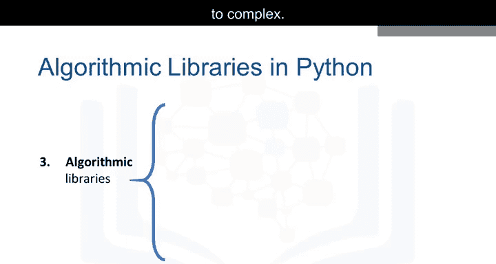

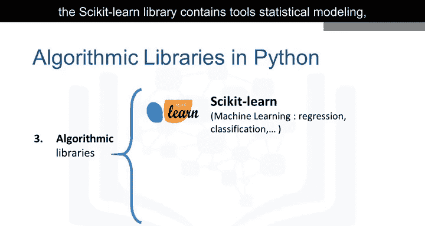

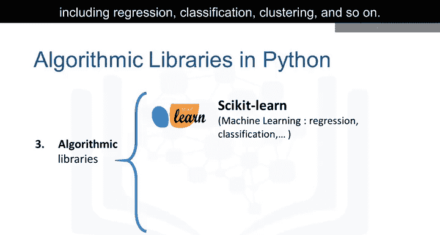

---

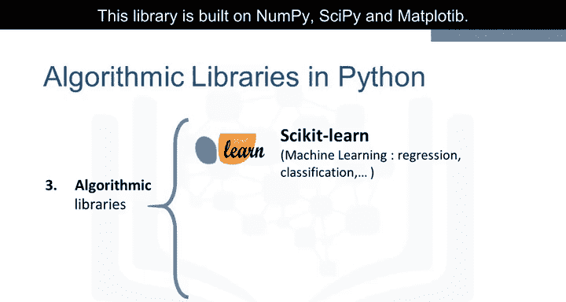

## 📝 总结

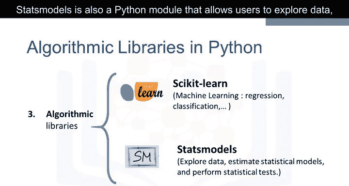

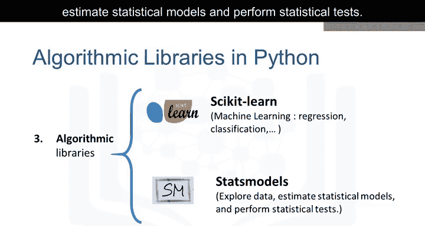

本节课中，我们一起学习了Python数据分析的三大类核心库：**科学计算库**（如Pandas, NumPy, SciPy）、**数据可视化库**（如Matplotlib, Seaborn）以及**机器学习算法库**（如Scikit-learn, Statsmodels）。理解这些库的用途是开始高效数据分析的第一步。