# 004：Python数据导入导出


在本节课中，我们将学习如何使用Python的pandas包来读取和写入数据。数据获取是数据分析的第一步，掌握如何高效地将数据加载到Python环境中至关重要。我们将从理解数据格式和文件路径开始，逐步学习如何读取CSV文件、查看数据、修改列名，以及如何将处理后的数据导出保存。

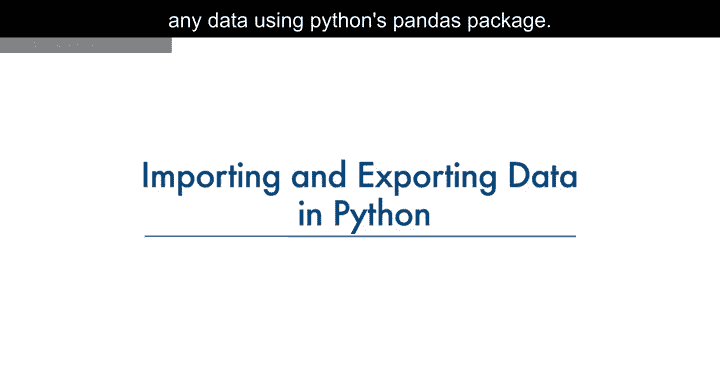

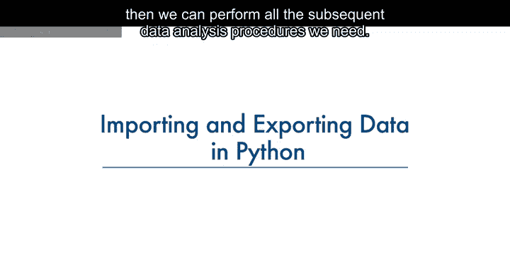

## 数据获取概述

数据获取是一个从各种来源加载和读取数据到笔记本的过程。使用Python的pandas包读取数据时，需要考虑两个重要因素：**格式**和**文件路径**。

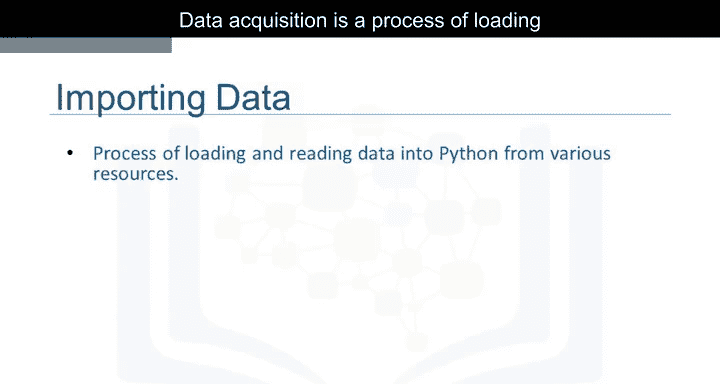

## 理解数据格式与路径

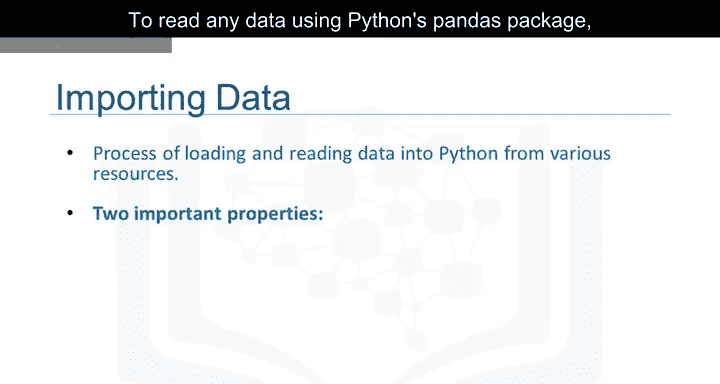

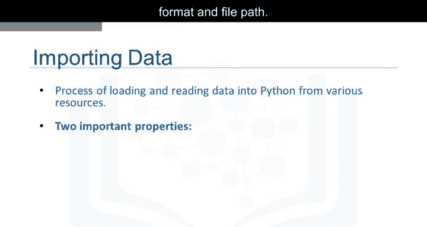

上一节我们介绍了数据获取的基本概念，本节中我们来看看决定数据读取的两个关键因素。

**格式**指的是数据的编码方式。我们通常可以通过查看文件名的后缀来识别不同的编码方案。

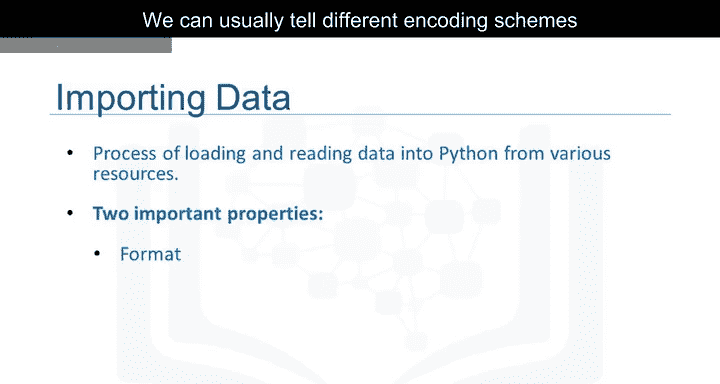

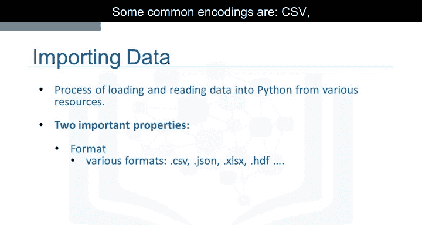


以下是一些常见的编码格式：
*   CSV
*   JSON
*   XLSX
*   HDF

**路径**则告诉我们数据存储的位置。数据通常存储在我们正在使用的计算机本地，或者存储在互联网上。

在我们的案例中，我们找到了一个二手车数据集，它来自幻灯片上显示的网址。

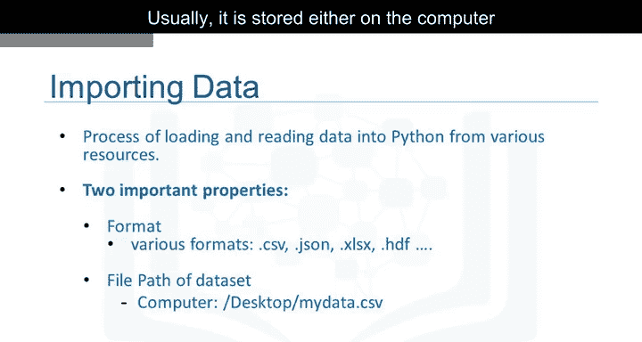

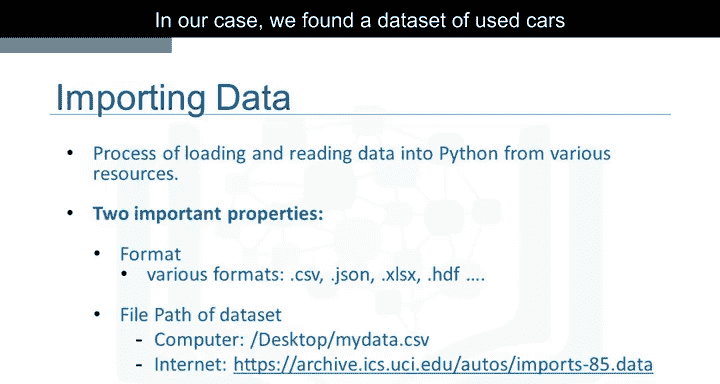

## 读取CSV格式数据

当我们访问该网址时，会看到类似这样的数据。每一行代表一个数据点，每个数据点关联着大量属性。由于属性之间用逗号分隔，我们可以推断数据格式是**CSV**，即逗号分隔值。

此时，这些数据对人类来说只是一串数字，意义不大。但一旦我们读入这些数据，就可以尝试理解它。在pandas中，`read_csv`方法可以将以逗号分隔列的文件读入一个pandas数据框。

使用pandas读取数据可以快速通过三行代码完成。


首先，导入pandas库：
```python
import pandas as pd
```


然后，定义一个包含文件路径的变量：
```python
path = “https://archive.ics.uci.edu/ml/machine-learning-databases/autos/imports-85.data”
```

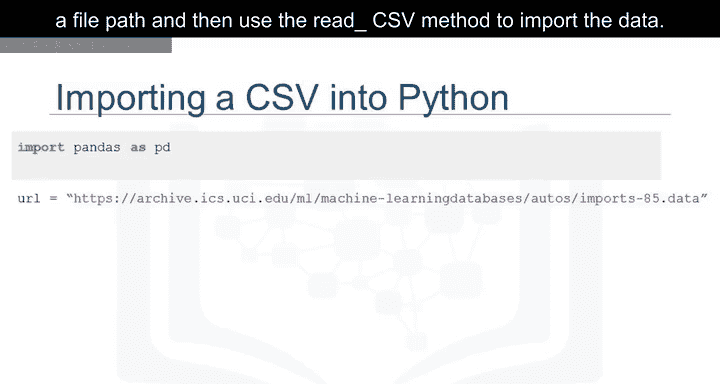

接着，使用`read_csv`方法导入数据：
```python
df = pd.read_csv(path)
```

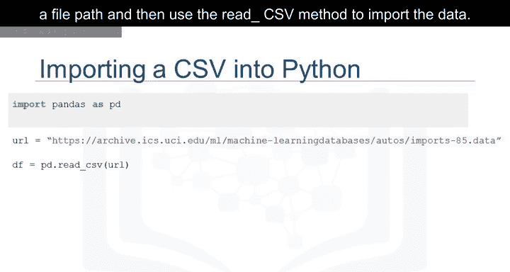

## 处理无表头数据及数据预览


然而，`read_csv`方法默认假设数据包含表头。我们的二手车数据没有列标题，因此需要通过设置`header=None`来指定`read_csv`不分配表头。
```python
df = pd.read_csv(path, header=None)
```

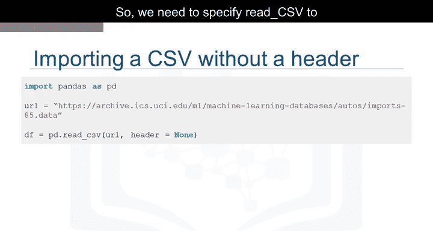

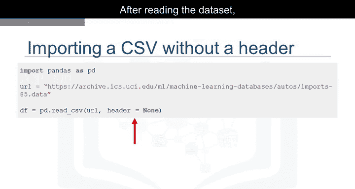

读取数据集后，最好查看一下数据框，以获得更直观的感受，并确保一切按预期进行。

由于打印整个数据集可能耗费太多时间和资源，为了节省时间，我们可以使用`dataframe.head()`来显示数据框的前N行。
```python
df.head(5)
```


类似地，`dataframe.tail()`显示数据框的底部N行。
```python
df.tail(5)
```

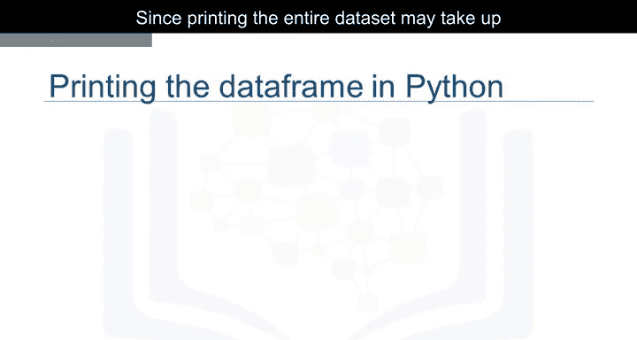

这里我们打印出了前五行数据。看起来数据集读取成功。我们可以看到，pandas自动将列标题设置为整数列表，因为我们在读取数据时设置了`header=None`。

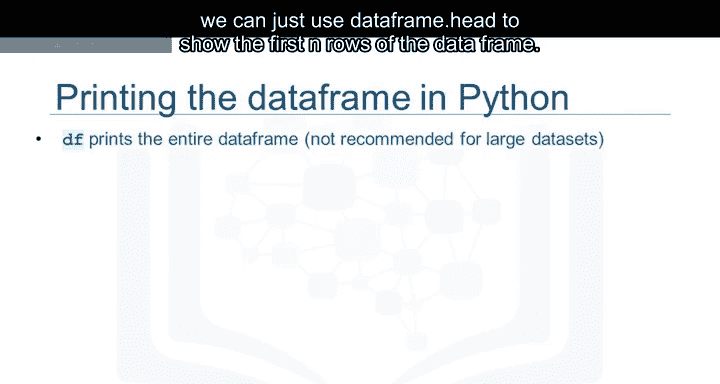

## 为数据框添加列名

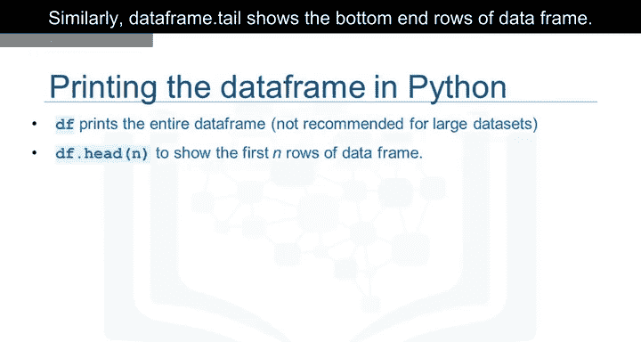

没有有意义的列名，处理数据框会很困难。不过，我们可以在pandas中分配列名。

在我们的案例中，我们发现列名存储在一个单独的在线文件中。我们首先将列名放入一个名为`headers`的列表中。
```python
headers = [“symboling”, “normalized-losses”, “make”, “fuel-type”, ...] # 此处应为完整的列名列表
```

然后，我们设置`df.columns = headers`，用这个列表替换默认的整数标题。
```python
df.columns = headers
```

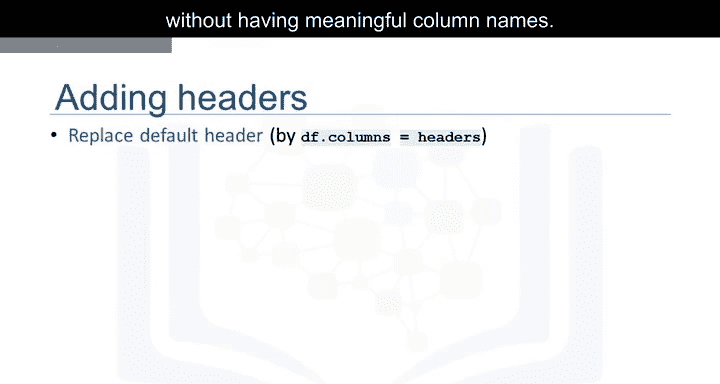

如果我们使用上一节介绍的`head`方法来检查数据集，会看到正确的标题已插入每列的顶部。

## 导出数据到CSV文件

在某个时间点，当你对数据框完成操作后，可能希望将pandas数据框导出到一个新的CSV文件。

你可以使用`to_csv`方法来实现。为此，需要指定文件路径，其中包含你想要写入的文件名。

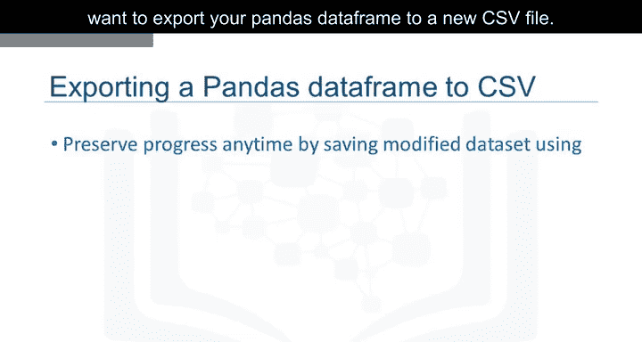

例如，如果你想将数据框`df`保存为`automobile.csv`到你的电脑上，可以使用以下语法：
```python
df.to_csv(“automobile.csv”)
```

## 支持的其他数据格式

本课程我们只涉及读取和保存CSV文件。然而，pandas也支持导入和导出大多数具有不同数据集格式的数据文件类型。

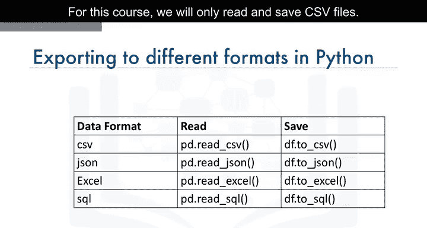

读取和保存其他数据格式的代码语法与读取或保存CSV文件非常相似。

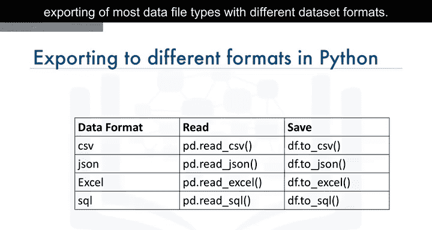

以下列表展示了针对不同格式的读写方法：
*   **读取JSON**: `pd.read_json()`
*   **保存为JSON**: `df.to_json()`
*   **读取Excel**: `pd.read_excel()`
*   **保存为Excel**: `df.to_excel()`
*   **读取HDF5**: `pd.read_hdf()`
*   **保存为HDF5**: `df.to_hdf()`

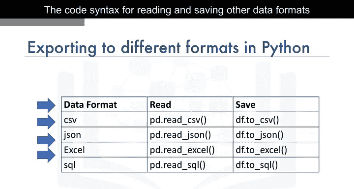

## 课程总结

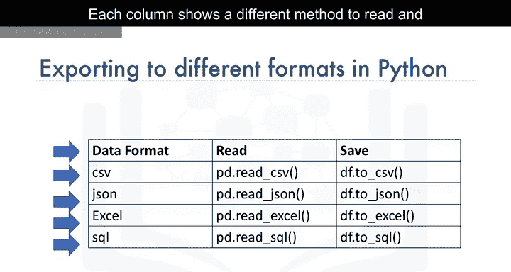

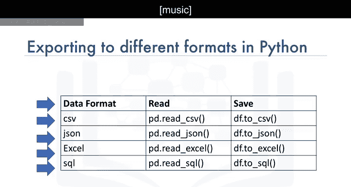

本节课中我们一起学习了使用Python的pandas库进行数据导入和导出的核心技能。我们从理解数据格式和路径开始，详细演练了如何读取无表头的CSV文件、预览数据、为数据框添加有意义的列名，以及如何将处理后的数据保存为新文件。最后，我们还了解到pandas支持多种数据格式，其操作方法大同小异。掌握这些基础操作是进行后续数据分析的坚实第一步。