# 005：Python数据科学核心包

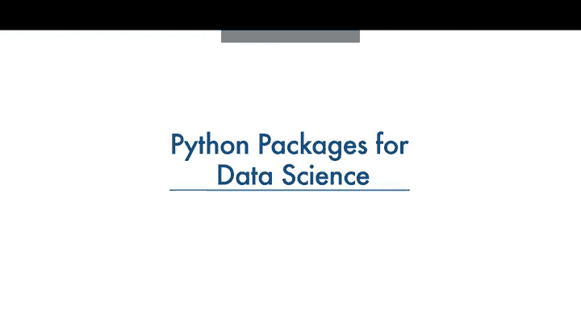

在本节课中，我们将要学习使用Python进行数据分析时所需的核心库。这些库提供了强大的工具和功能，使我们能够高效地处理、分析和可视化数据，而无需从零开始编写大量代码。

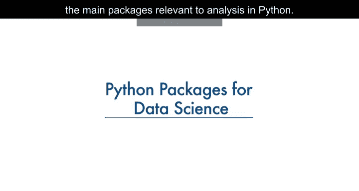

## 什么是Python库？

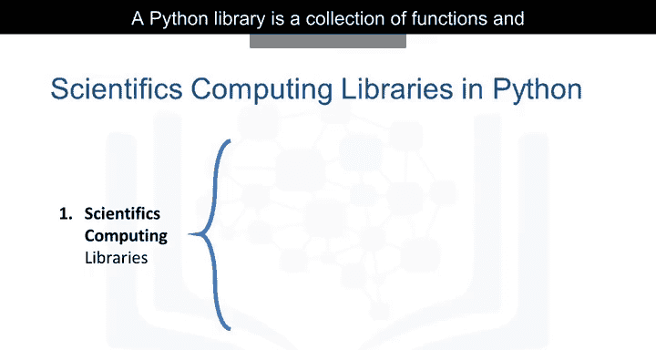

一个Python库是一个函数和方法的集合，它允许你在不编写任何代码的情况下执行大量操作。

库通常包含内置模块，提供不同的功能，你可以直接使用。此外，还有功能广泛的库，提供广泛的服务。

我们将Python数据分析库分为三组。

## 第一组：科学计算库

上一节我们介绍了Python库的基本概念，本节中我们来看看第一组核心库——科学计算库。这些库是数据处理和分析的基础。

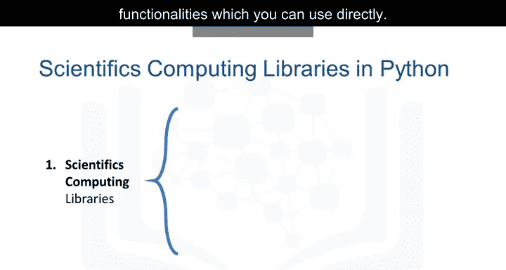

### Pandas 🐼

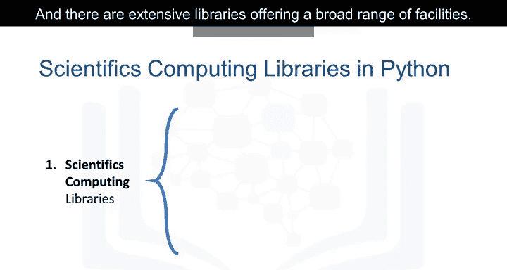

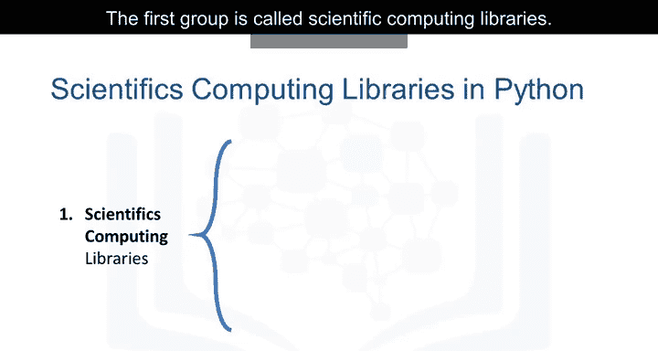

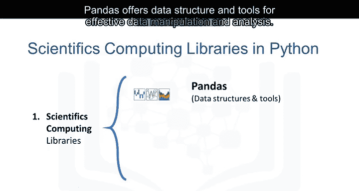

Pandas提供了用于高效数据操作和分析的数据结构和工具。它提供了对结构化数据的快速访问。Pandas的主要工具是一个由列和行标签组成的二维表，称为**DataFrame**。

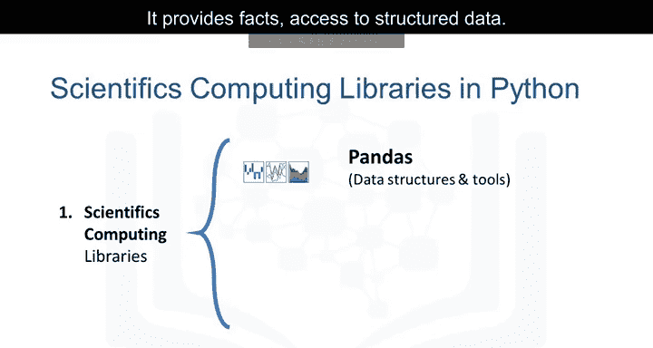

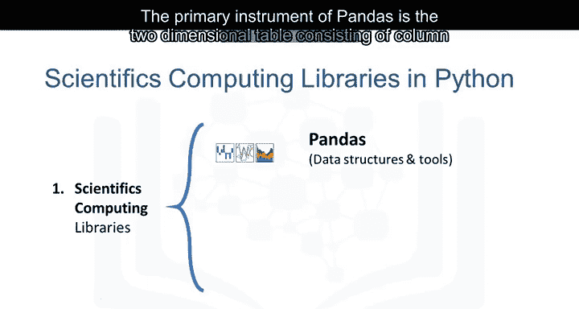

它旨在提供简单的索引功能。

### NumPy 🔢

NumPy库使用数组作为其输入和输出。它可以扩展到矩阵对象，并且通过少量的代码更改，开发人员可以执行快速的数组处理。

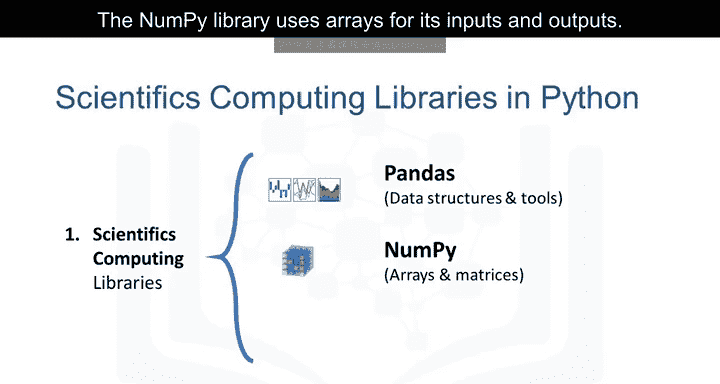

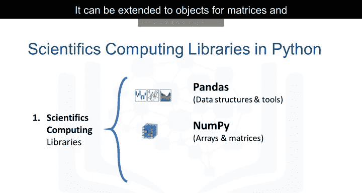

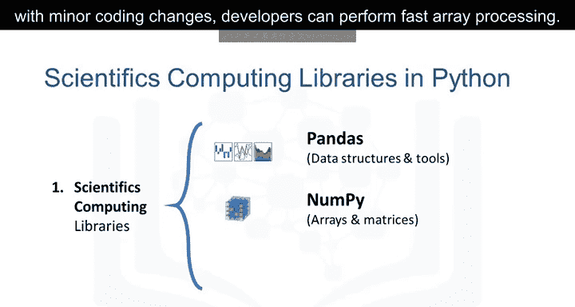

### SciPy 🔬

SciPy包含用于处理一些高级数学问题的函数，以及数据可视化功能。

## 第二组：数据可视化库

使用数据可视化方法是与他人沟通、展示分析有意义结果的最佳方式。这些库使你能够创建图形、图表和地图。

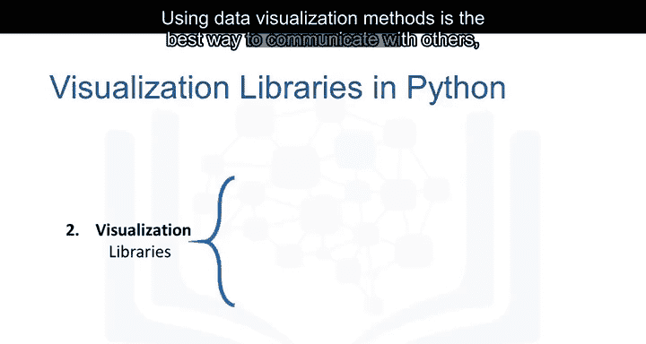

### Matplotlib 📈

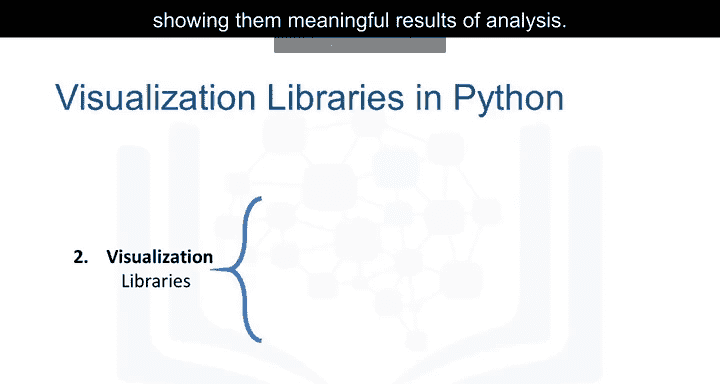

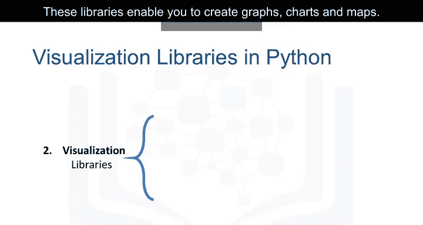

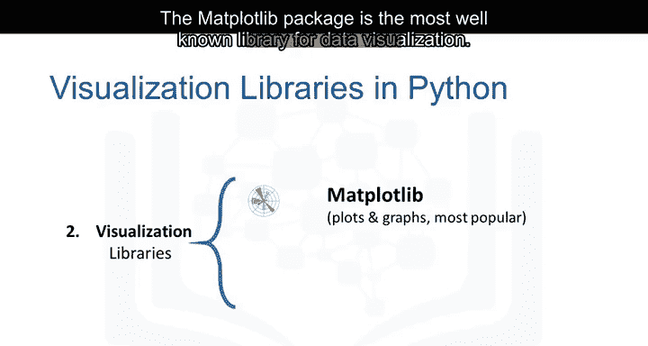

Matplotlib包是最著名的数据可视化库。它非常适合制作图形和图表。这些图表也具有高度可定制性。

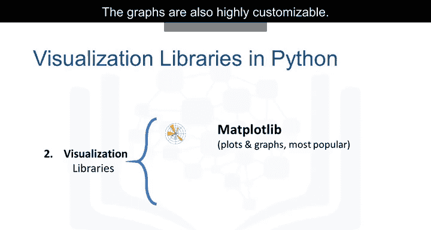

### Seaborn 🎨

另一个高级可视化库是Seaborn。它基于Matplotlib。它可以非常轻松地生成各种图表，例如热图、时间序列图和小提琴图。

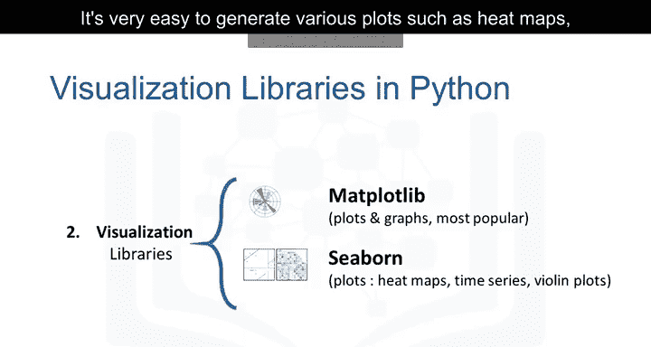

## 第三组：机器学习算法库

通过机器学习算法，我们能够使用数据集开发模型并获得预测。算法库处理从基础到复杂的机器学习任务。以下是两个重要的包。

### Scikit-learn 🤖

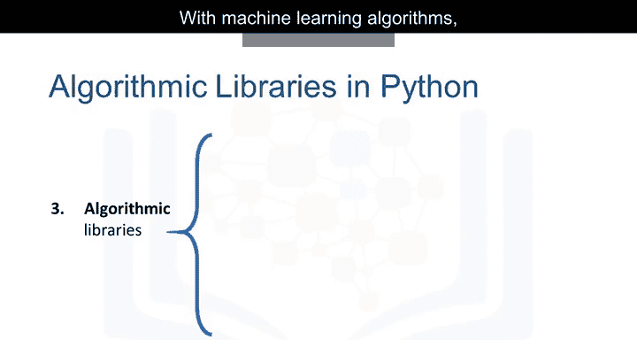

Scikit-learn库包含统计建模工具，包括回归、分类、聚类等。这个库建立在NumPy、SciPy和Matplotlib之上。

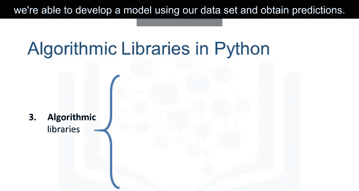

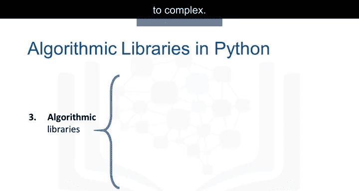

### Statsmodels 📊

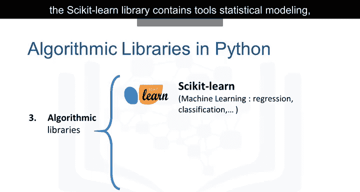

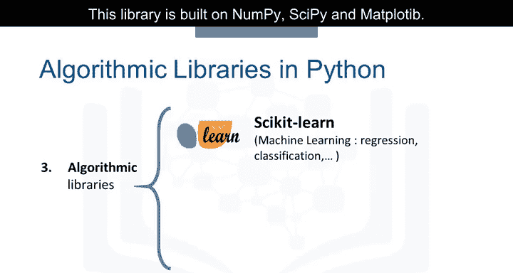

Statsmodels也是一个Python模块，允许用户探索数据、估计统计模型和执行统计检验。

---

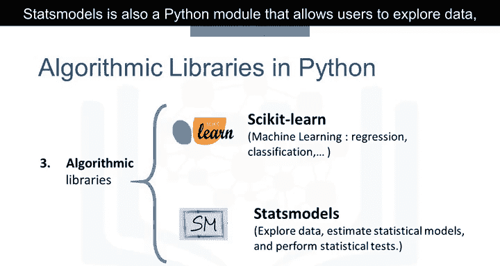

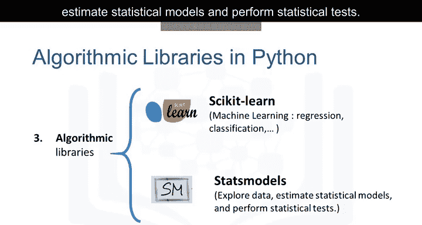

本节课中我们一起学习了Python数据分析的三大核心库组：科学计算库（Pandas, NumPy, SciPy）、数据可视化库（Matplotlib, Seaborn）以及机器学习算法库（Scikit-learn, Statsmodels）。理解这些库的功能和用途是高效进行数据分析的关键第一步。