# 006：Pandas数据分析入门 🔍

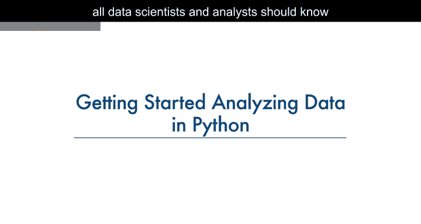

在本节课中，我们将学习一些简单的Pandas方法，这些方法是所有数据科学家和分析师在使用Python进行数据分析时必须掌握的。我们将重点介绍如何检查数据类型、查看数据分布以及识别潜在的数据问题。

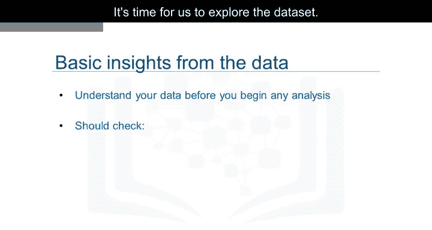

---

## 数据探索：检查数据类型

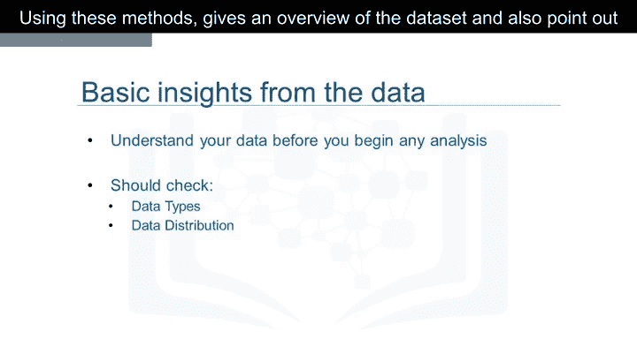

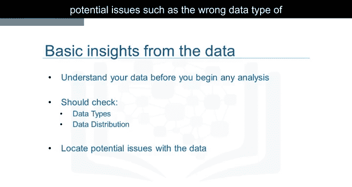

上一节我们介绍了数据加载的基本步骤。本节中，我们来看看如何探索数据集。

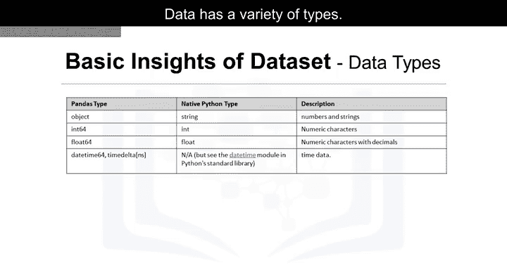

Pandas内置了多种方法，可用于理解特征的数据类型或查看数据在数据集中的分布情况。使用这些方法可以快速获得数据集的概览，并指出潜在问题，例如特征的数据类型错误，这些问题可能需要在后续步骤中解决。

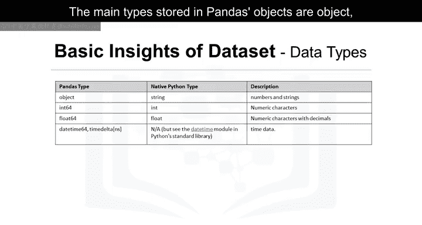

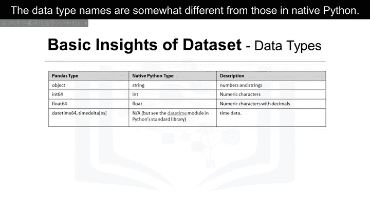

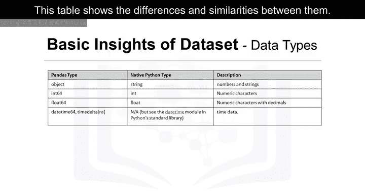

数据有多种类型。Pandas中存储的主要类型是`object`、`float`、`int`和`datetime`。这些数据类型名称与原生Python中的类型名称略有不同。

以下是Pandas数据类型与Python原生数据类型的对比：

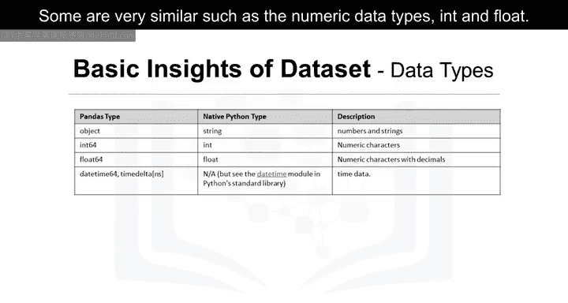

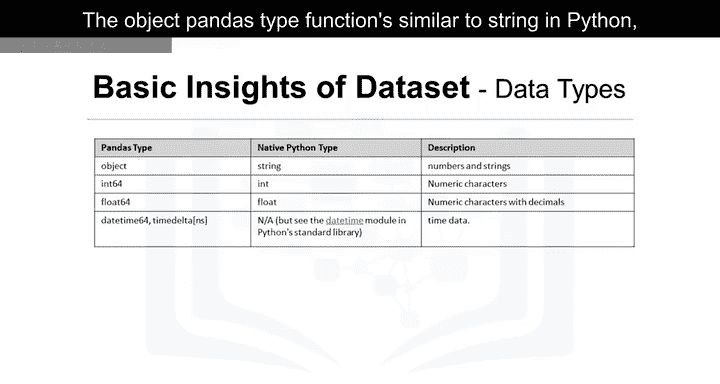

| Pandas 类型 | Python 原生类型 | 描述 |
| :--- | :--- | :--- |
| `object` | `str` | 文本或混合类型 |
| `int64` | `int` | 整数 |
| `float64` | `float` | 浮点数 |
| `datetime64` | `datetime` | 日期和时间 |

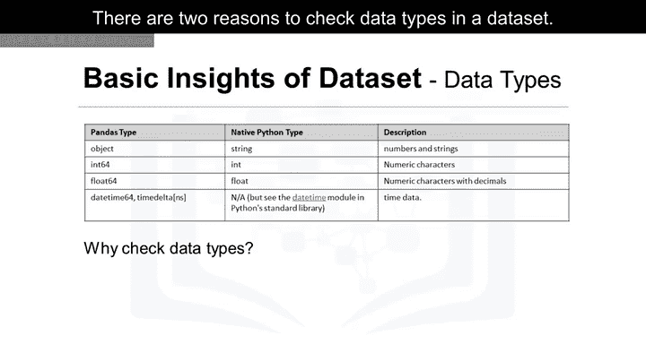

一些类型非常相似，例如数值数据类型`int`和`float`。Pandas的`object`类型功能类似于Python中的`string`，只是名称不同。而`datetime`类型对于处理时间序列数据非常有用。

检查数据集中的数据类型主要有两个原因。

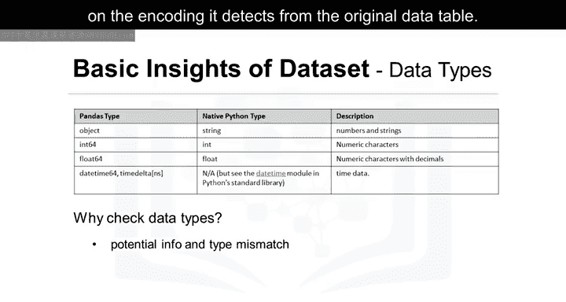

首先，Pandas会根据从原始数据表读取的编码自动分配类型。由于多种原因，这种分配可能不正确。例如，如果汽车价格列（我们预期它包含连续的数值）被分配了`object`数据类型，这就会很棘手。更自然的情况是它应该具有`float`类型。因此，我们可能需要手动将数据类型更改为`float`。

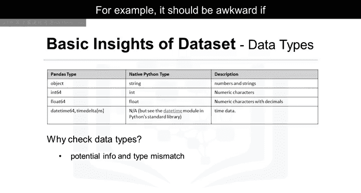

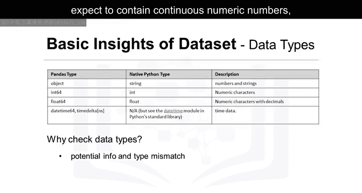

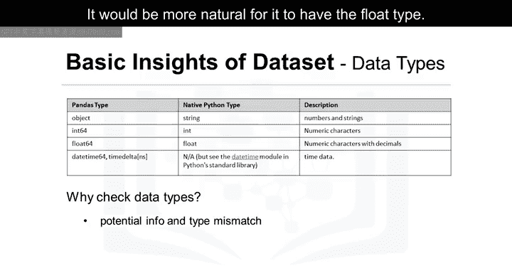

第二个原因是，它让有经验的数据科学家能够了解哪些Python函数可以应用于特定列。例如，一些数学函数只能应用于数值数据。如果将这些函数应用于非数值数据，可能会导致错误。

当对数据集应用`.dtypes`方法时，会返回一个包含每列数据类型的Series。一个优秀数据科学家的直觉会告诉我们，大多数数据类型是合理的。

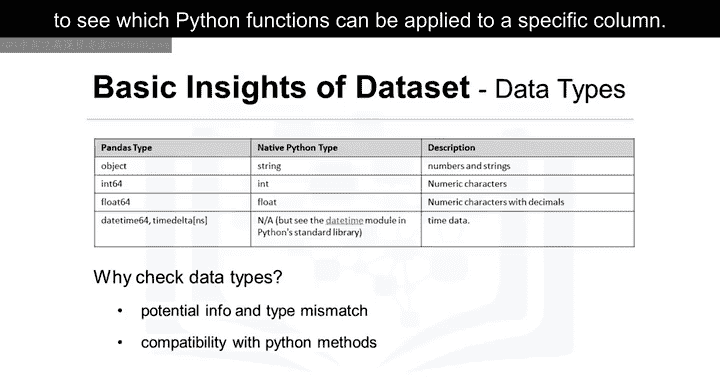

例如，汽车的品牌是名称，因此此信息应为`object`类型。

列表中的最后一行可能存在问题。由于“bore”是发动机的一个尺寸维度，我们应期望使用数值数据类型。然而，这里却使用了`object`类型。在后面的章节中，我们将需要纠正这些类型不匹配的问题。

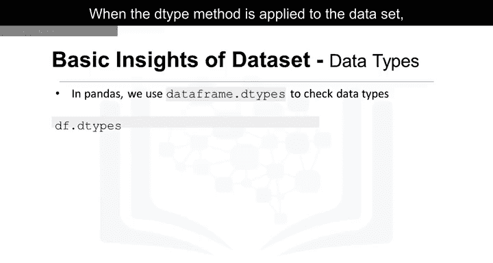

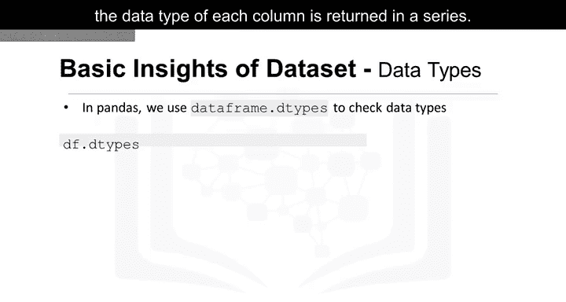

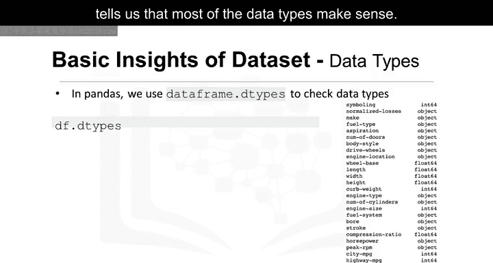

---

## 数据探索：查看统计摘要

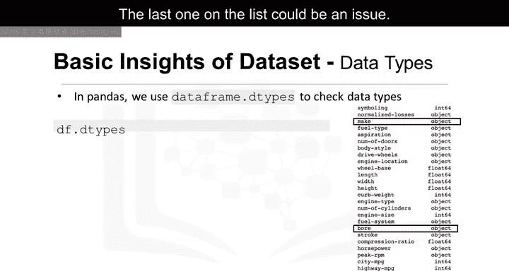

现在，我们想检查每列的统计摘要，以了解每列数据的分布情况。统计指标可以告诉数据科学家是否存在数学问题，例如极端异常值和大的偏差。数据科学家可能需要在后续处理这些问题。

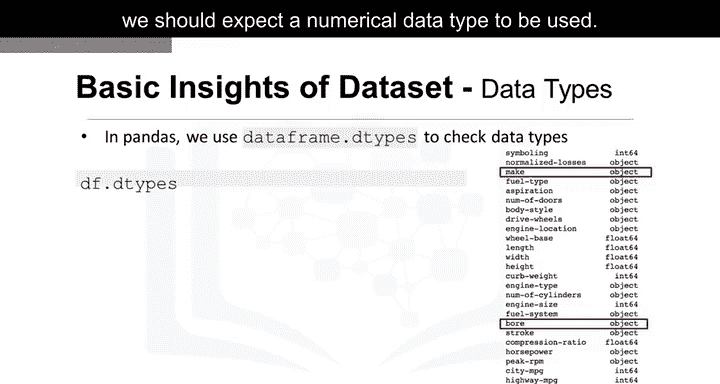

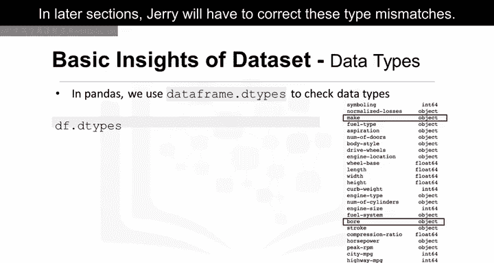

要获取快速统计数据，我们使用`.describe()`方法。它返回列中的条目数（`count`）、列值的平均值（`mean`）、列标准差（`std`）、最大值、最小值以及每个四分位数的边界。

默认情况下，`DataFrame.describe()`函数会跳过不包含数字的行和列。也可以让`describe`方法适用于`object`类型的列。为了启用对所有列的摘要，我们可以在`describe`函数括号内添加参数`include='all'`。

现在，结果显示了对所有26列的摘要，包括对象类型的属性。我们看到，对于`object`类型列，评估了一组不同的统计信息，如`unique`、`top`和`freq`。

以下是这些统计量的含义：
*   **`unique`**：列中不同对象的数量。
*   **`top`**：出现频率最高的对象。
*   **`freq`**：`top`对象在列中出现的次数。

表中的一些值显示为`NaN`，代表“Not a Number”。这是因为无法针对该特定列的数据类型计算该特定统计指标。

您可以使用的另一个检查数据集的方法是`DataFrame.info()`函数。此函数显示数据帧的前30行和后30行。

---

## 总结

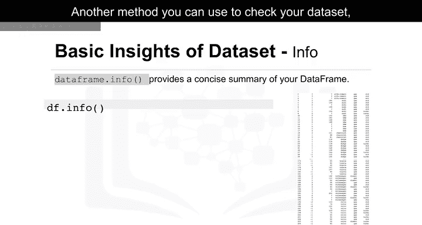

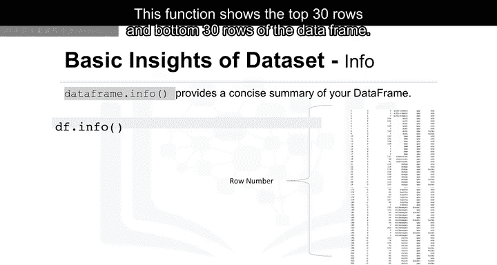

本节课中，我们一起学习了Pandas数据分析的入门知识。我们介绍了如何检查数据集的数据类型，理解了Pandas与Python原生类型的区别，并探讨了检查数据类型的两个主要原因。我们还学习了如何使用`.describe()`方法获取数据的统计摘要，包括数值列和对象类型列的不同统计信息。这些方法是数据探索的基础，能帮助我们快速了解数据概况并发现潜在问题，为后续的数据清洗和分析做好准备。