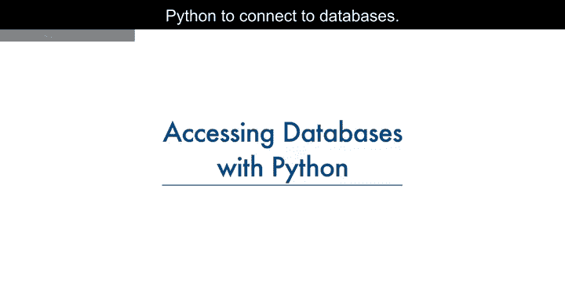
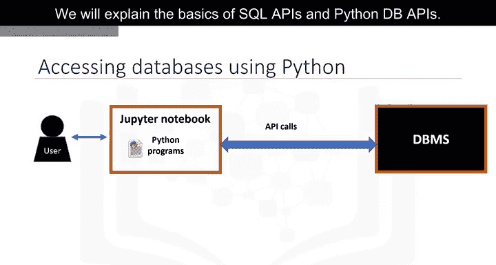
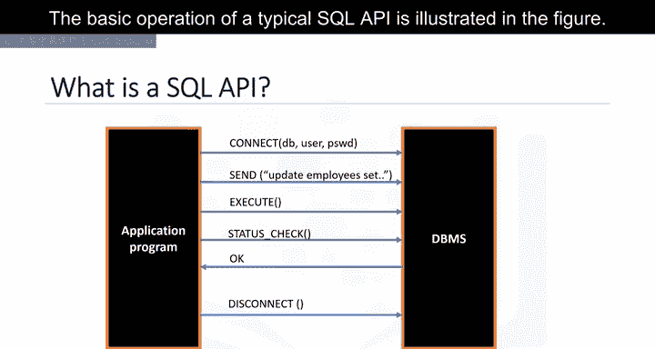
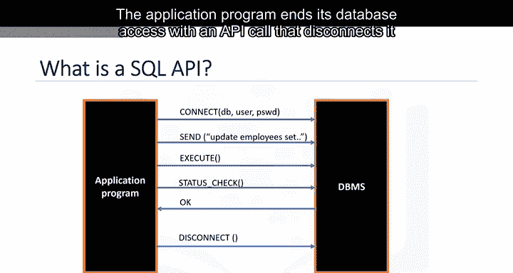
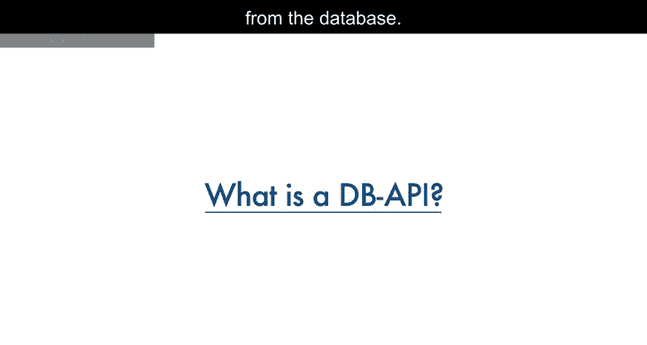
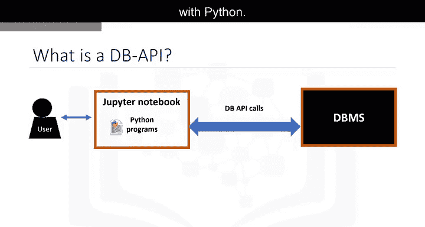
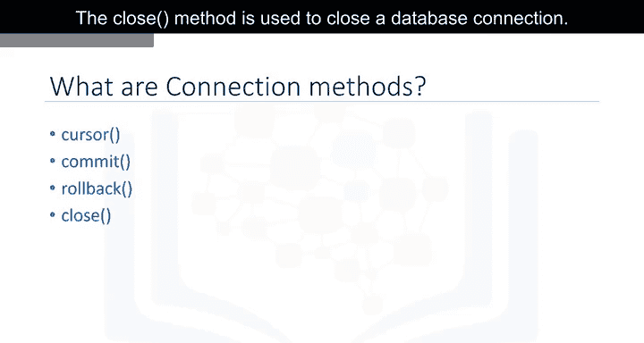
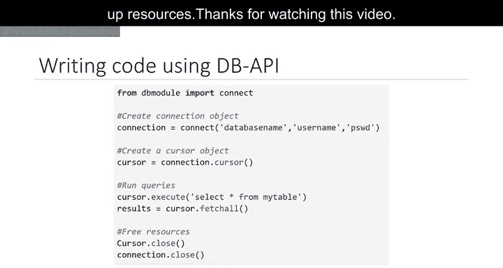

# 007：Python数据库访问

在本节课中，我们将学习如何使用Python访问数据库。数据库是数据科学家的重要工具。完成本模块后，你将能够解释使用Python连接数据库的基本概念。

## 🔗 数据库访问概述

上一节我们介绍了数据分析的背景，本节中我们来看看如何使用Python与数据库进行交互。

一个典型的用户通过编写在Jupyter Notebook（一种基于网页的编辑器）中的Python代码来访问数据库。Python程序通过一种机制与数据库管理系统（DBMS）进行通信。Python代码使用API调用来连接数据库。





我们将解释SQL API和Python DB API的基础知识。

## 🛠️ SQL API 基础

应用程序编程接口（API）是一组你可以调用的函数，用于访问某种类型的服务。SQL API由库函数调用组成，作为DBMS的应用程序编程接口，用于将SQL语句传递给DBMS。应用程序调用API中的函数，并调用其他函数从DBMS检索查询结果和状态信息。

下图展示了一个典型SQL API的基本操作流程：




应用程序通过一个或多个API调用来开始其数据库访问，这些调用将程序连接到DBMS。为了向DBMS发送SQL语句，程序在缓冲区中将语句构建为文本字符串，然后进行API调用以将缓冲区内容传递给DBMS。

应用程序进行API调用来检查其DBMS请求的状态并处理错误。

应用程序通过一个断开与数据库连接的API调用来结束其数据库访问。



## 🐍 Python DB API 简介



Python DB API是用于访问关系型数据库的Python标准API。它是一个标准，允许你编写一个适用于多种关系型数据库的单一程序，而无需为每种数据库编写单独的程序。因此，如果你学会了DB API函数，就可以将这些知识应用于使用Python连接任何数据库。

Python DB API中的两个主要概念是**连接对象**和**游标对象**。

*   **连接对象**：用于连接到数据库并管理事务。
*   **游标对象**：用于运行查询。你打开一个游标对象，然后运行查询。游标的工作方式类似于文本处理系统中的光标，你可以在结果集中向下滚动并将数据获取到应用程序中。游标用于遍历数据库的结果。



以下是连接对象常用的方法：

*   `cursor()`：使用连接返回一个新的游标对象。
*   `commit()`：用于将任何挂起的事务提交到数据库。
*   `rollback()`：使数据库回滚到任何挂起事务的开始状态。
*   `close()`：用于关闭数据库连接。

## 💻 实践：使用DB API查询数据库

让我们通过一个Python应用程序来实践如何使用DB API查询数据库。

以下是操作步骤：

1.  **导入数据库模块并建立连接**：首先，从相应的数据库模块导入`connect` API，并使用该函数打开与数据库的连接。你需要传入数据库名称、用户名和密码等参数。`connect`函数返回一个连接对象。
    ```python
    import sqlite3  # 示例：导入SQLite模块
    conn = sqlite3.connect('example.db')  # 建立连接
    ```



2.  **创建游标对象**：在连接对象上创建一个游标对象。游标用于运行查询和获取结果。
    ```python
    cursor = conn.cursor()
    ```

3.  **执行查询并获取结果**：使用游标运行SQL查询，然后使用游标获取查询结果。
    ```python
    cursor.execute('SELECT * FROM my_table')
    results = cursor.fetchall()
    for row in results:
        print(row)
    ```

4.  **关闭连接**：当系统完成查询后，通过关闭连接来释放所有资源。
    ```python
    conn.close()
    ```

请记住，始终关闭连接以避免未使用的连接占用资源，这一点非常重要。

## 📝 课程总结

本节课中，我们一起学习了使用Python访问数据库的核心知识。我们介绍了SQL API的基本概念和工作流程，重点讲解了Python DB API标准及其两个核心对象：连接对象和游标对象。最后，我们通过一个简单的代码示例，实践了连接数据库、执行查询和关闭连接的完整流程。掌握这些基础是使用Python进行高效数据操作的关键一步。

感谢观看本视频。



