# 008：Python数据导入与导出

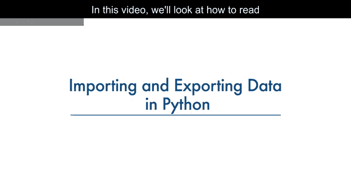

在本节课中，我们将学习如何使用Python的pandas包来读取和导出数据。掌握数据导入是进行后续所有数据分析步骤的基础。

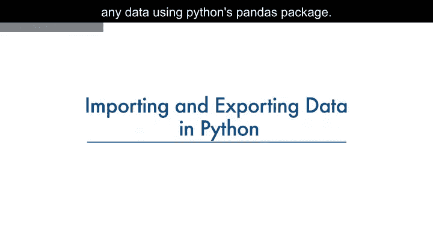

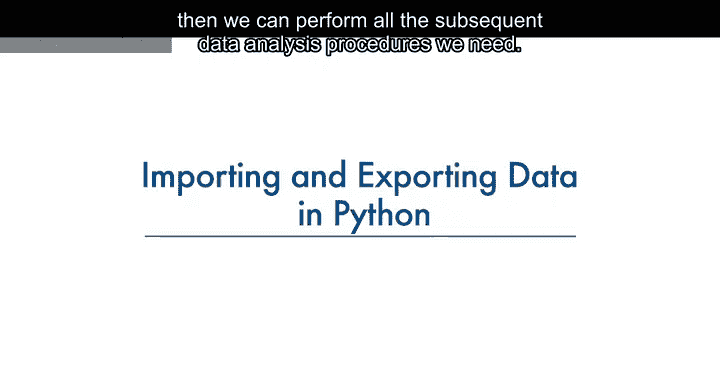

## 数据获取概述

数据获取是一个从各种来源加载和读取数据到笔记本的过程。使用Python的pandas包读取数据时，需要考虑两个重要因素：**数据格式**和**文件路径**。

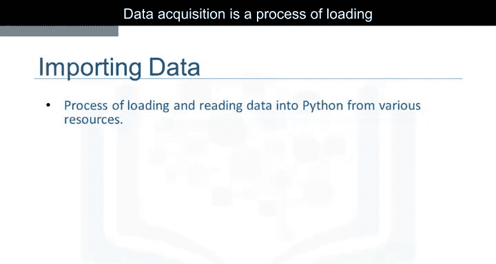

## 理解数据格式与路径

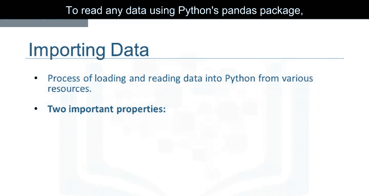

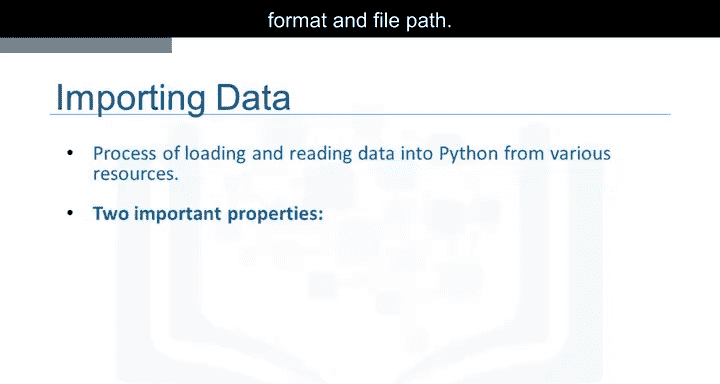

上一节我们介绍了数据获取的基本概念，本节中我们来看看格式和路径的具体含义。

**格式**指的是数据的编码方式。我们通常可以通过查看文件名的后缀来识别不同的编码方案。

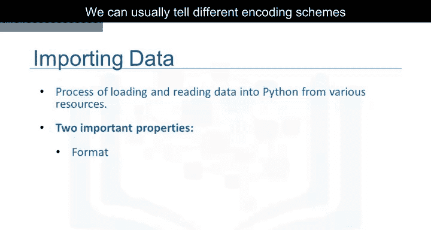

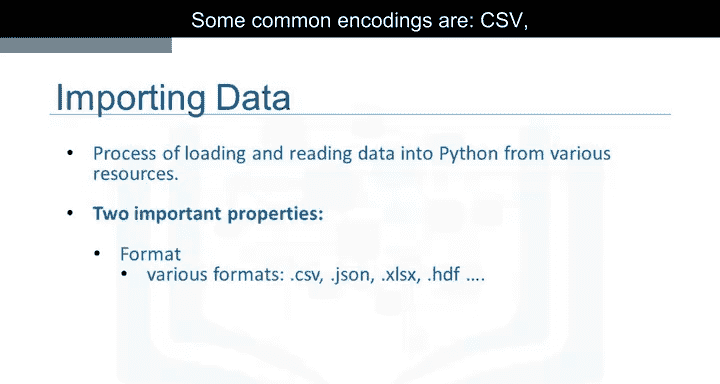

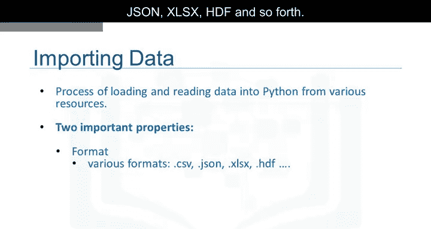

以下是一些常见的编码格式：
*   CSV
*   JSON
*   XLSX
*   HDF

**路径**则告诉我们数据存储的位置。数据通常存储在我们正在使用的计算机上，或者存储在互联网上。

在我们的案例中，我们找到了一个二手车数据集，它来自幻灯片上显示的网址。当Jerry在网页浏览器中输入该网址时，他看到了类似这样的内容。每一行代表一个数据点，每个数据点都关联着大量属性。由于属性之间用逗号分隔，我们可以推测数据格式是CSV，即“逗号分隔值”。目前，这些只是数字，对人类来说意义不大。但一旦我们读入这些数据，就可以尝试理解它。

在pandas中，`read_csv`方法可以将以逗号分隔列的文件读入一个pandas DataFrame。

## 使用Pandas读取CSV数据

了解了数据的基本信息后，我们来看看如何用代码实现数据读取。

在pandas中，读取数据可以快速通过三行代码完成。

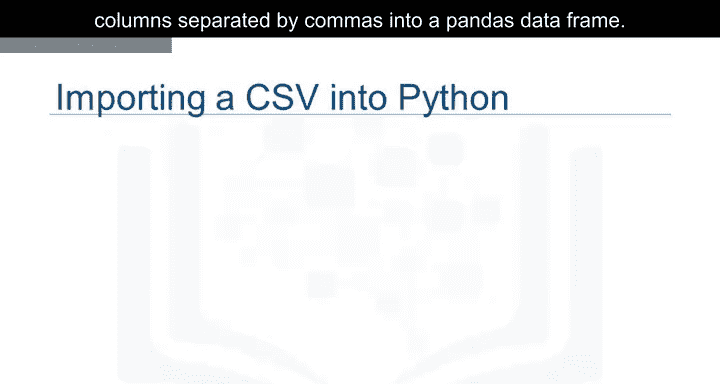

以下是读取数据的基本步骤：
1.  首先，导入pandas库。
    ```python
    import pandas as pd
    ```
2.  然后，定义一个包含文件路径的变量。
    ```python
    file_path = “path/to/your/data.csv”
    ```
3.  接着，使用`read_csv`方法导入数据。
    ```python
    df = pd.read_csv(file_path)
    ```


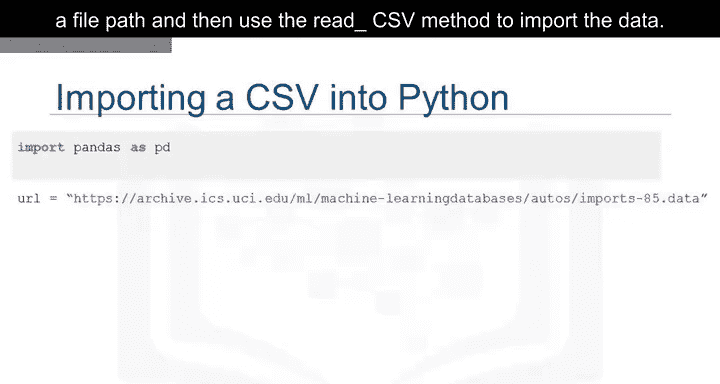

然而，`read_csv`方法默认假设数据包含表头（即列名）。我们的二手车数据没有列标题，因此需要通过设置`header=None`来指定`read_csv`不分配表头。
```python
df = pd.read_csv(file_path, header=None)
```

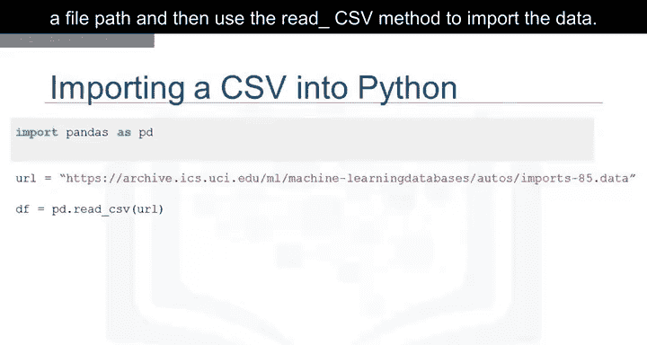

## 查看与检查数据

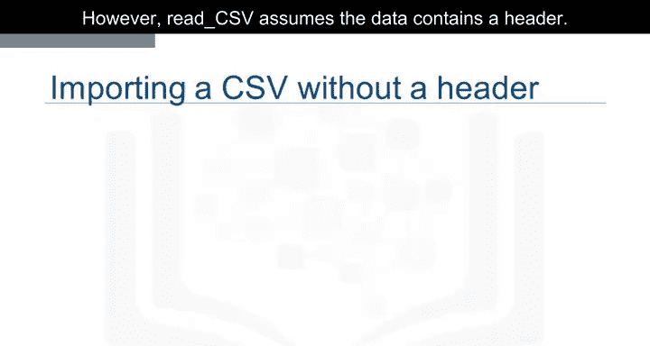

成功读取数据集后，最好查看一下DataFrame，以获得更直观的感受，并确保一切按预期进行。

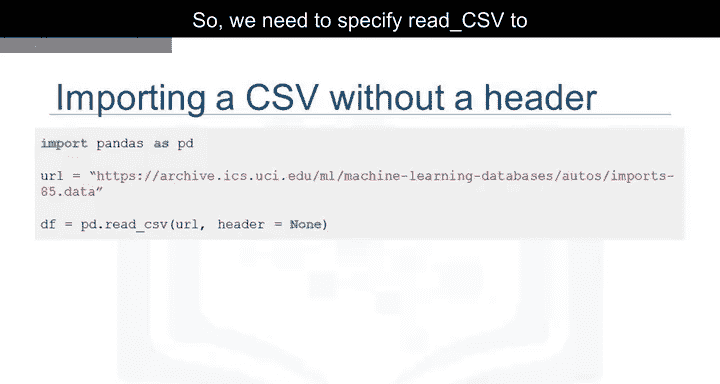

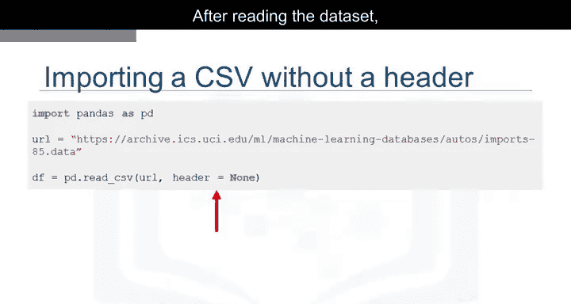

由于打印整个数据集可能耗费太多时间和资源，为了节省时间，我们可以使用`DataFrame.head()`方法来显示DataFrame的前N行。
```python
df.head(5) # 显示前5行
```

类似地，`DataFrame.tail()`方法显示DataFrame的底部N行。
```python
df.tail(5) # 显示后5行
```

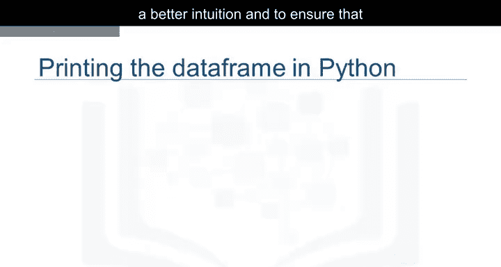

这里我们打印出了前五行数据。看起来数据集读取成功。我们可以看到，由于我们在读取数据时设置了`header=None`，pandas自动将列标题设置为整数列表。

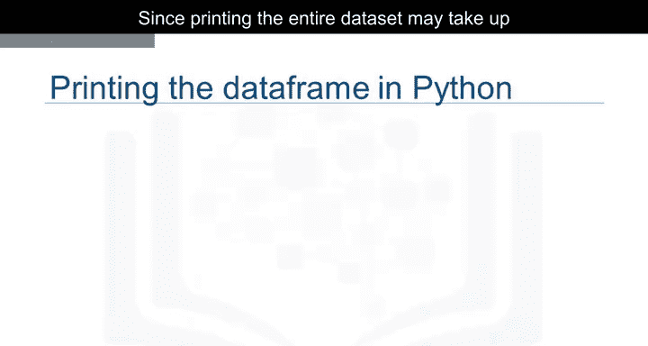

## 为数据添加列名

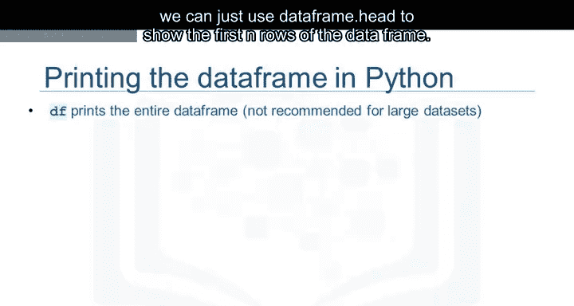

没有有意义的列名，处理DataFrame会很困难。不过，我们可以在pandas中分配列名。

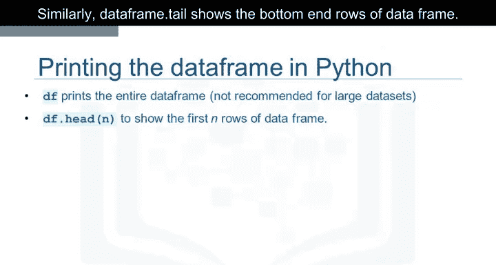

在我们当前的案例中，我们发现列名存储在一个单独的在线文件中。

我们首先将列名放入一个名为`headers`的列表中。
```python
headers = [“column1”, “column2”, “column3”, …] # 替换为实际的列名列表
```

然后，我们设置`df.columns = headers`，用这个列表替换默认的整数标题。
```python
df.columns = headers
```

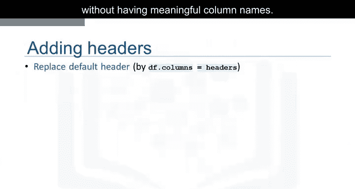

如果我们使用上一节介绍的`head`方法来检查数据集，会看到正确的标题已插入每列的顶部。

## 导出数据到CSV文件

在某些时候，在对DataFrame进行操作之后，您可能希望将pandas DataFrame导出到一个新的CSV文件中。

您可以使用`to_csv`方法来实现。为此，需要指定文件路径，其中包含您要写入的文件名。

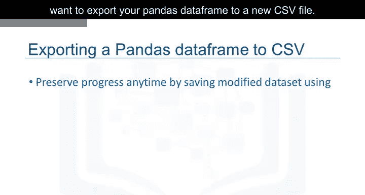

例如，如果您想将DataFrame `df`保存为`automobile.csv`到您的计算机上，可以使用以下语法：
```python
df.to_csv(“automobile.csv”)
```

## 支持的其他数据格式

本课程我们只涉及读取和保存CSV文件；然而，pandas也支持导入和导出大多数具有不同数据集格式的数据文件类型。

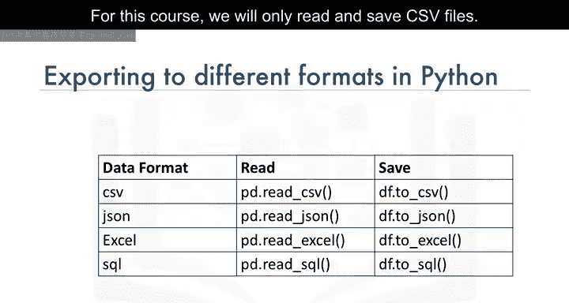

读取和保存其他数据格式的代码语法与读取或保存CSV文件非常相似。

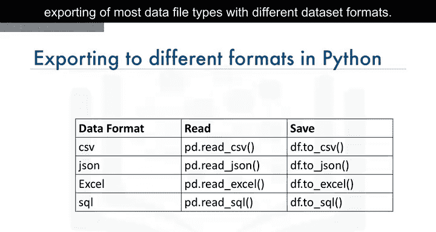

以下列表展示了针对不同格式的读写方法：
*   **JSON**: `pd.read_json()` 和 `df.to_json()`
*   **Excel**: `pd.read_excel()` 和 `df.to_excel()`
*   **HDF5**: `pd.read_hdf()` 和 `df.to_hdf()`

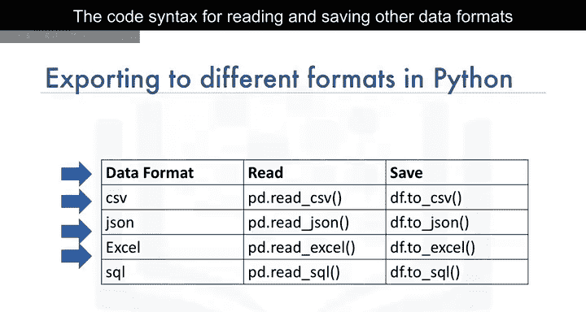

## 课程总结

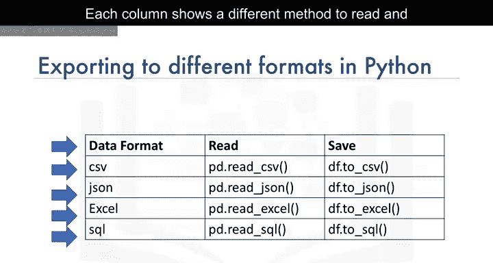

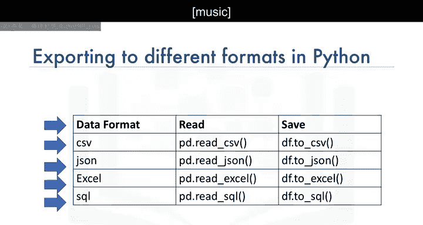

本节课中，我们一起学习了使用Python的pandas库进行数据导入与导出的核心操作。我们了解了数据格式和路径的重要性，掌握了使用`read_csv`读取CSV文件（包括处理无表头数据）的方法，学会了使用`head`和`tail`查看数据，以及如何为DataFrame添加有意义的列名。最后，我们还学习了使用`to_csv`导出数据，并了解到pandas支持多种其他数据格式的读写。这些技能是进行有效数据分析的第一步。