# 009：Pandas数据探索基础方法

在本节课中，我们将学习使用Pandas库进行数据分析时，数据科学家和分析师必须掌握的几个基础方法。这些方法能帮助我们快速理解数据集的结构、数据类型以及数据分布，为后续的数据清洗和分析工作打下基础。

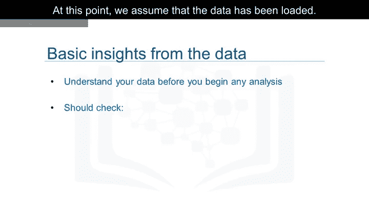

---

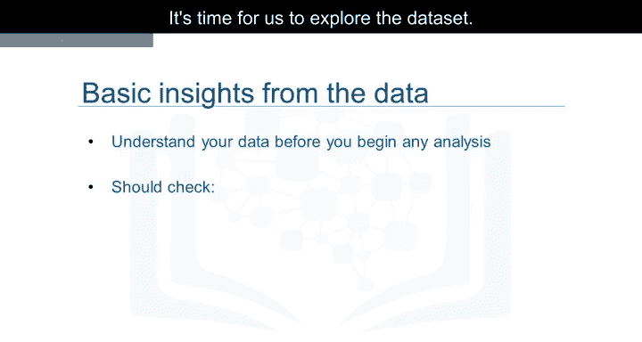

## 🔍 数据探索的重要性

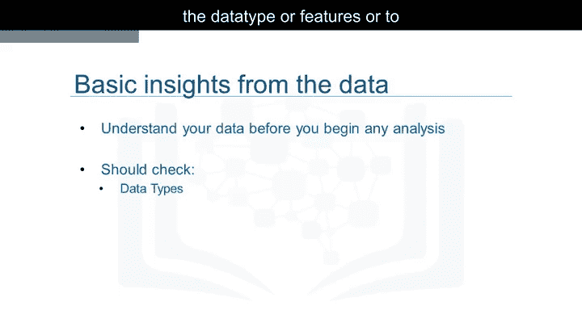

上一节我们介绍了如何加载数据。本节中，我们来看看如何对已加载的数据集进行初步探索。

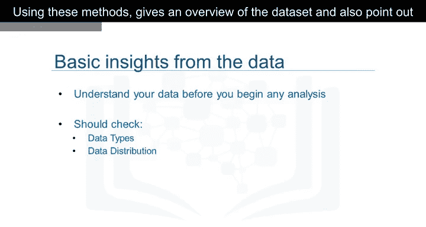

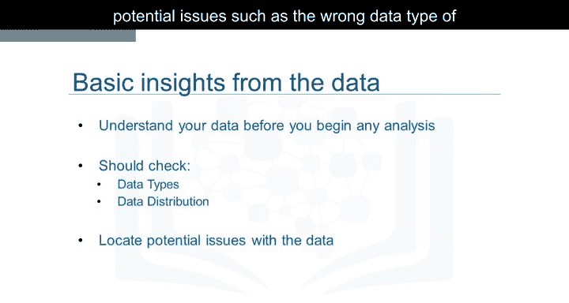

Pandas内置了多种方法，可用于理解特征的数据类型或查看数据集中的数据分布。使用这些方法可以获得数据集的概览，并指出潜在问题，例如特征的数据类型错误，这些问题可能需要在后续步骤中解决。

---

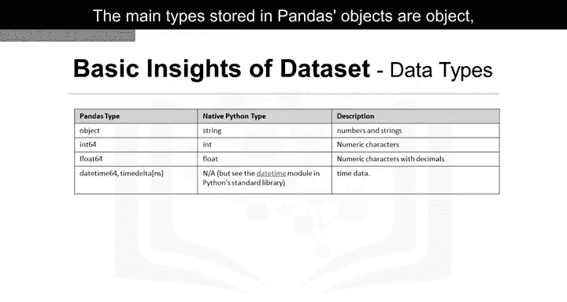

## 📝 数据类型概述

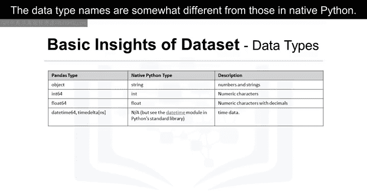

数据有多种类型。Pandas中存储的主要类型是`object`、`float`、`int`和`datetime`。这些数据类型的名称与原生Python中的类型名称略有不同。

下表展示了它们之间的差异与相似之处：

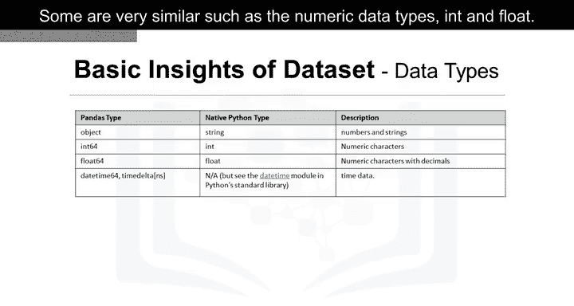

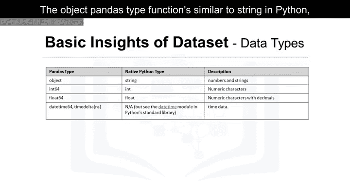

| Pandas 类型 | 类似 Python 类型 | 描述 |
| :--- | :--- | :--- |
| `object` | `str` | 文本或混合类型 |
| `int64` | `int` | 整数 |
| `float64` | `float` | 浮点数 |
| `datetime64` | `datetime` | 日期时间 |

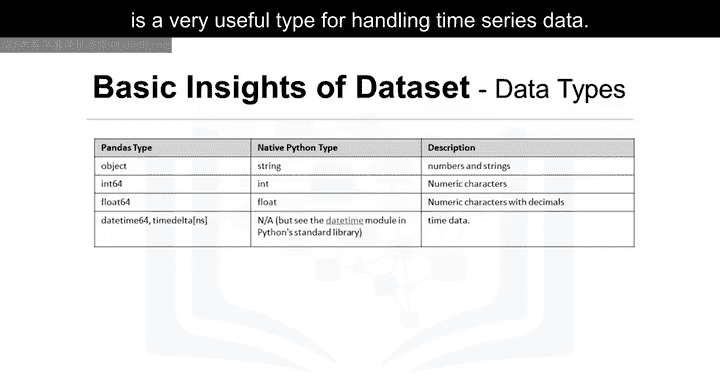

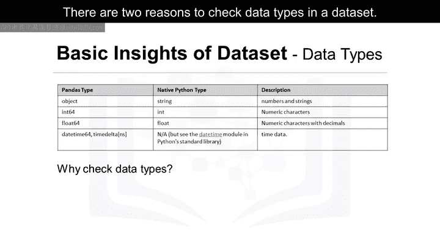

有些类型非常相似，例如数值数据类型`int`和`float`。Pandas的`object`类型功能类似于Python中的`string`，只是名称不同。而`datetime`类型对于处理时间序列数据非常有用。

---

## ✅ 检查数据类型的两个原因

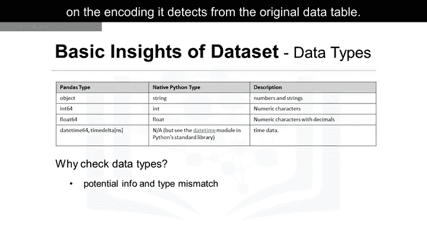

检查数据集中的数据类型主要有两个原因。

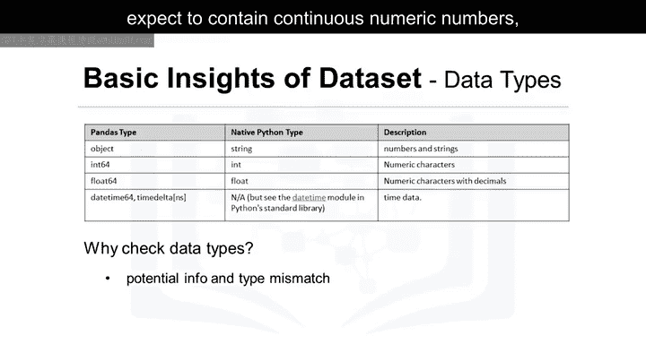

**第一个原因是数据类型的自动分配可能不正确。** Pandas会根据从原始数据表读取的编码自动分配类型。由于多种原因，这种分配可能出错。例如，我们期望包含连续数值的“汽车价格”列，如果被分配为`object`类型就会很奇怪。将其设为`float`类型更为自然。因此，我们可能需要手动将数据类型更改为`float`。

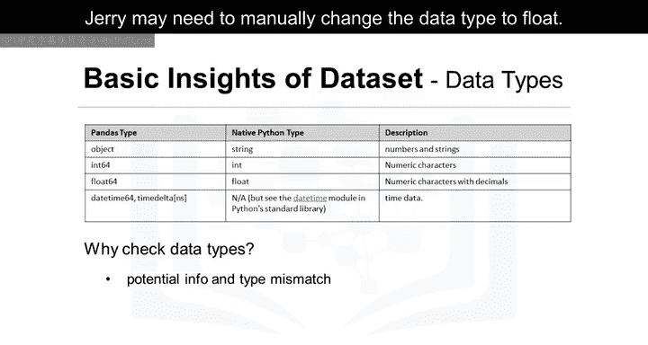

**第二个原因是它让有经验的数据科学家了解可以对特定列应用哪些Python函数。** 例如，某些数学函数只能应用于数值数据。如果将这些函数应用于非数值数据，可能会导致错误。

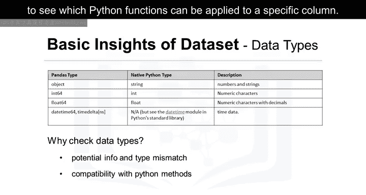

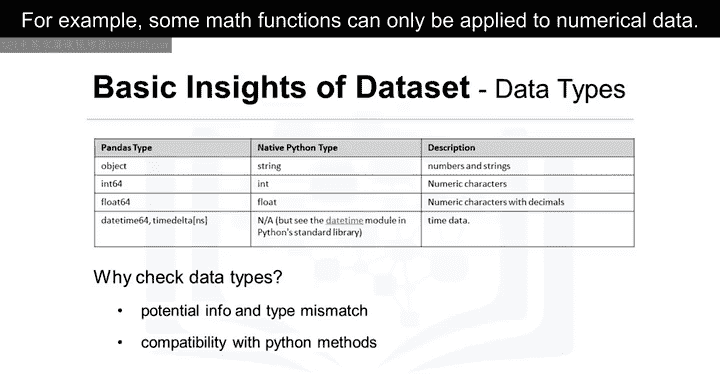

---

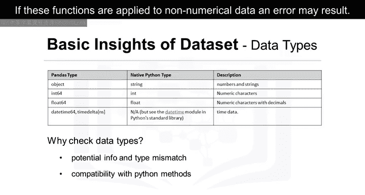

## 🛠️ 使用`.dtypes`方法

当对数据集应用`.dtypes`方法时，会返回一个包含每列数据类型的Series。优秀数据科学家的直觉告诉我们，大多数数据类型应该是合理的。

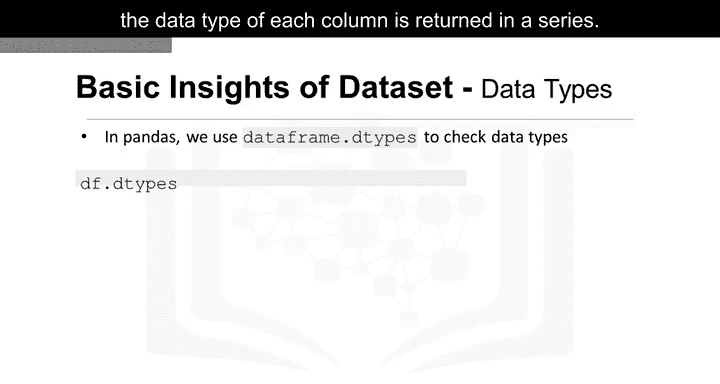

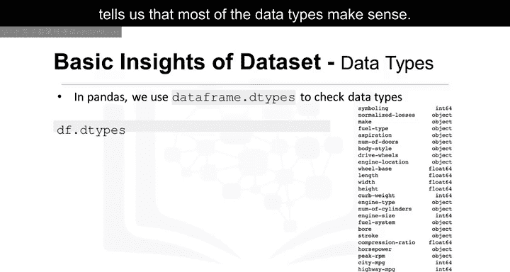

例如，汽车的品牌（Make）是名称，因此该信息应为`object`类型。

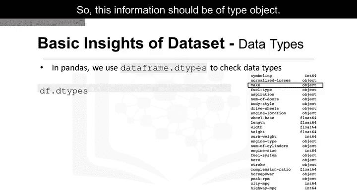

列表中的最后一行（bore）可能有问题。由于bore是发动机的一个尺寸维度，我们应期望使用数值数据类型。然而，这里却使用了`object`类型。在后面的章节中，我们需要纠正这些类型不匹配的问题。

---

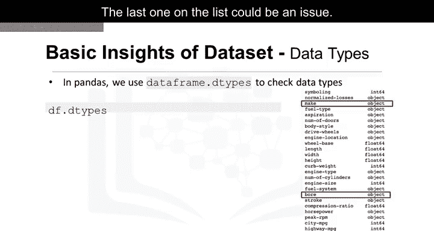

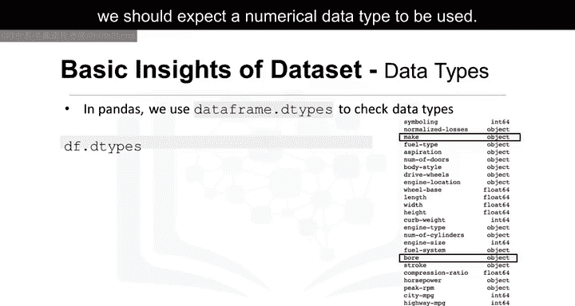

## 📊 使用`.describe()`方法检查统计摘要

现在，我们想检查每列的统计摘要，以了解每列的数据分布情况。统计指标可以告诉数据科学家是否存在数学问题，例如极端异常值和大的偏差。数据科学家可能需要在后续处理这些问题。

要获取快速统计数据，我们使用`.describe()`方法。它默认返回数值列的以下统计信息：
*   `count`：列中非空值的数量
*   `mean`：列的平均值
*   `std`：列的标准差
*   `min`：最小值
*   `25%`：第一四分位数
*   `50%`：中位数
*   `75%`：第三四分位数
*   `max`：最大值

默认情况下，`DataFrame.describe()`函数会跳过不包含数字的行和列。也可以让`describe`方法对`object`类型的列起作用。为了启用对所有列的摘要，我们可以在`describe()`函数括号内添加参数`include='all'`。

现在，结果显示所有26列的摘要，包括对象类型的属性。我们看到，对于`object`类型的列，评估的是一组不同的统计信息，如`unique`、`top`和`freq`。
*   `unique`：列中不同对象的数量。
*   `top`：出现频率最高的对象。
*   `freq`：最高频对象在列中出现的次数。

表中的某些值显示为`NaN`，代表“Not a Number”。这是因为该特定的统计指标无法针对该特定列的数据类型进行计算。

---

## ℹ️ 使用`.info()`方法

您可以使用的另一个检查数据集的方法是`DataFrame.info()`函数。此函数显示数据帧的前30行和后30行，并提供每列的非空值数量及数据类型等概览信息。

---

## 🎯 总结

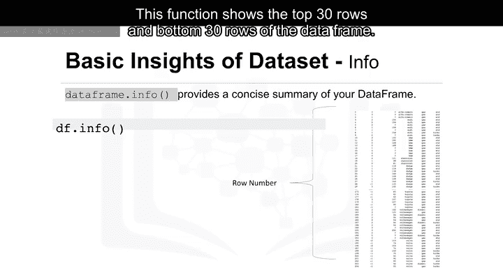

本节课中，我们一起学习了使用Pandas进行数据探索的基础方法。我们了解了检查数据类型的重要性，学会了使用`.dtypes`查看类型，使用`.describe()`获取统计摘要，以及使用`.info()`快速浏览数据框结构。这些步骤是任何数据分析项目的起点，能帮助我们快速识别数据中的潜在问题，为后续的数据清洗和建模做好准备。