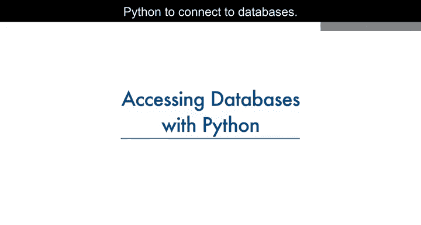
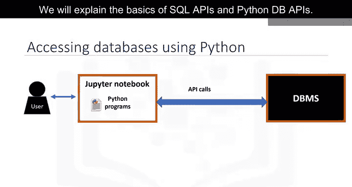
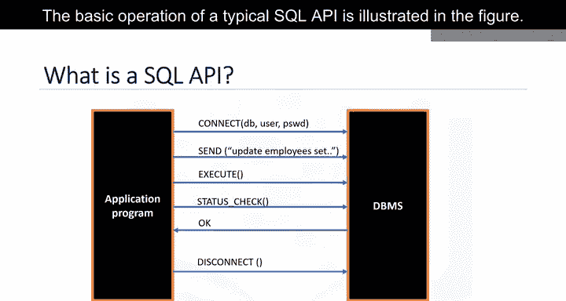
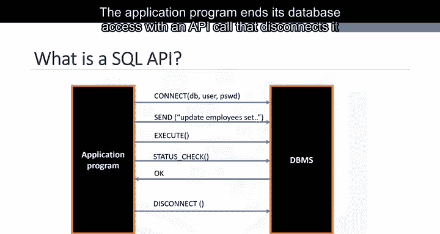
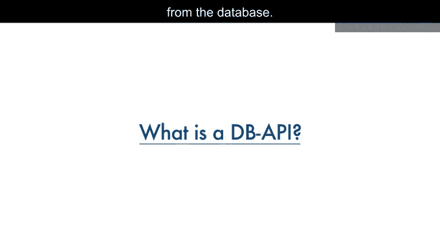
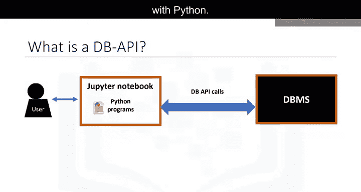
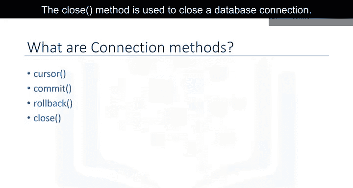
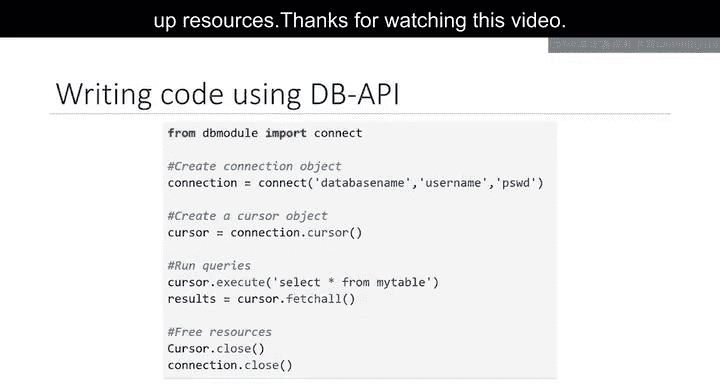

# 010：使用Python访问数据库 🗄️

在本节课中，我们将学习如何使用Python连接和操作数据库。数据库是数据科学家的重要工具，掌握Python访问数据库的方法能让你更高效地处理和分析数据。

## 概述：Python与数据库的交互

上一节我们介绍了数据分析的基础工具，本节中我们来看看如何让Python与数据库系统进行通信。





一个典型的用户通过编写在Jupyter Notebook（一种基于网页的编辑器）中的Python代码来访问数据库。Python程序通过一种机制与数据库管理系统（DBMS）进行通信。具体来说，Python代码通过API调用来连接数据库。

我们将解释SQL API和Python DB API的基础知识。

## SQL API 基础



应用程序编程接口（API）是一组函数，你可以调用它们来获取某种服务。SQL API由库函数调用组成，作为DBMS的应用程序编程接口，用于将SQL语句传递给DBMS。应用程序调用API中的函数，并调用其他函数从DBMS检索查询结果和状态信息。

下图展示了一个典型SQL API的基本操作流程：

1.  **连接数据库**：应用程序通过一个或多个API调用来开始其数据库访问，这些调用将程序连接到DBMS。
2.  **发送SQL语句**：为了向DBMS发送SQL语句，程序在缓冲区中将语句构建为文本字符串，然后进行API调用以将缓冲区内容传递给DBMS。
3.  **检查状态与处理错误**：应用程序进行API调用来检查其DBMS请求的状态并处理错误。
4.  **断开连接**：应用程序通过一个API调用结束其数据库访问，该调用使其与数据库断开连接。

## Python DB API 简介





Python DB API是Python用于访问关系型数据库的标准API。它是一个标准，允许你编写一个适用于多种关系型数据库的单一程序，而无需为每种数据库编写单独的程序。因此，如果你学会了DB API函数，就可以将这些知识应用于使用Python连接任何数据库。

Python DB API中两个核心概念是**连接对象**和**游标对象**。



*   **连接对象**：用于连接到数据库并管理事务。
*   **游标对象**：用于执行查询。你打开一个游标对象，然后运行查询。游标的工作方式类似于文本处理系统中的光标，你可以在结果集中向下滚动并将数据获取到应用程序中。游标用于扫描数据库的结果。

以下是连接对象常用的方法：

*   `cursor()`：返回一个使用该连接的新游标对象。
*   `commit()`：用于将任何挂起的事务提交到数据库。
*   `rollback()`：使数据库回滚到任何挂起事务的开始状态。
*   `close()`：用于关闭数据库连接。

## 实战演练：使用DB API查询数据库

上一节我们了解了核心概念，现在让我们通过一个Python应用程序示例，一步步学习如何使用DB API查询数据库。

以下是操作的基本步骤：



1.  **导入数据库模块并建立连接**
    首先，从相应的数据库模块中导入`connect` API，并使用它来打开一个到数据库的连接。你需要调用`connect()`函数并传入参数（通常是数据库名称、用户名和密码）。该函数返回一个连接对象。
    ```python
    import sqlite3  # 示例使用sqlite3模块
    conn = sqlite3.connect('example.db')  # 连接到一个SQLite数据库文件
    ```

2.  **创建游标并执行查询**
    接着，在连接对象上创建一个游标对象。游标用于运行查询和获取结果。
    ```python
    cursor = conn.cursor()
    cursor.execute("SELECT * FROM some_table")
    ```

3.  **获取查询结果**
    使用游标来获取查询的结果。
    ```python
    results = cursor.fetchall()  # 获取所有结果行
    for row in results:
        print(row)
    ```

4.  **关闭连接**
    当系统完成查询后，通过关闭连接来释放所有资源。记住，始终关闭连接以避免未使用的连接占用资源，这一点非常重要。
    ```python
    conn.close()
    ```

## 总结



本节课中我们一起学习了使用Python访问数据库的核心知识。我们首先了解了Python程序通过API与数据库通信的基本机制，然后介绍了SQL API和Python标准DB API的作用。我们重点学习了Python DB API的两个核心对象：**连接对象**（用于建立和管理连接）和**游标对象**（用于执行查询和获取结果）。最后，我们通过一个简单的代码示例，完整演练了连接数据库、执行查询、获取结果和关闭连接的整个流程。掌握这些基础将为你使用Python进行更复杂的数据操作和分析打下坚实的基础。