# 011：Python数据预处理 📊

在本节课中，我们将学习数据预处理技术。数据预处理是数据分析的必要步骤，它将原始数据转换为适合进一步分析的格式。这个过程也常被称为数据清洗或数据整理。我们将介绍几个核心主题，包括缺失值处理、数据格式标准化、数据归一化、数据分箱以及分类变量转换。

## 概述 📋

数据预处理是将原始数据映射或转换为另一种格式的过程，目的是为后续分析做好准备。在Python中，我们通常使用pandas库沿数据列进行操作，每一行代表一个样本，例如数据库中的一辆二手车。

## 识别与处理缺失值 🔍

上一节我们介绍了数据预处理的基本概念。本节中，我们来看看如何处理数据中的缺失值。缺失值是指数据条目为空的情况。

以下是处理缺失值的常用方法：

*   **识别缺失值**：使用 `df.isnull()` 或 `df.isna()` 来检查数据框中的缺失值。
*   **删除缺失值**：使用 `df.dropna()` 删除包含缺失值的行或列。
*   **填充缺失值**：使用 `df.fillna(value)` 用特定值（如均值、中位数或众数）填充缺失值。

## 数据格式标准化 🔧

处理完缺失值后，数据可能仍存在格式不统一的问题。本节我们将学习如何标准化数据格式。数据可能来自不同源头，具有不同的格式、单位或约定。

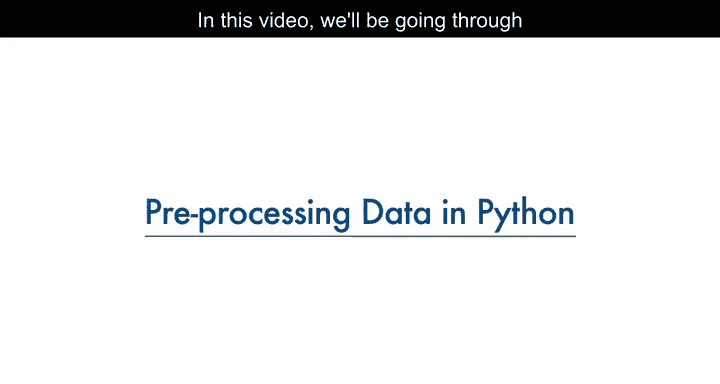

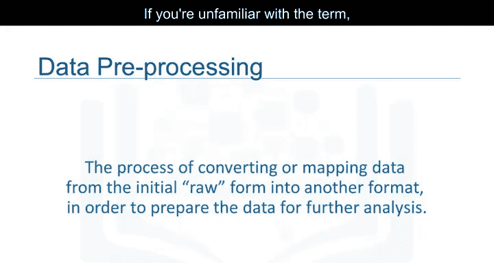

Python pandas提供了一些方法来将值标准化为相同的格式、单位或约定。

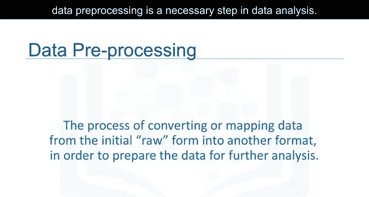

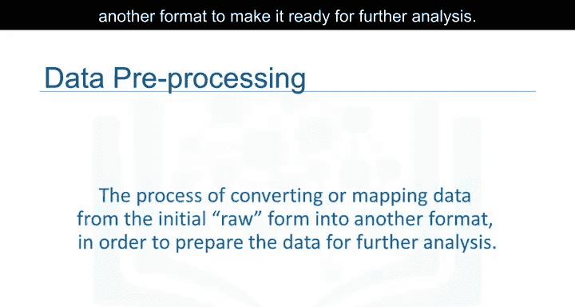

以下是数据格式标准化的常见操作：

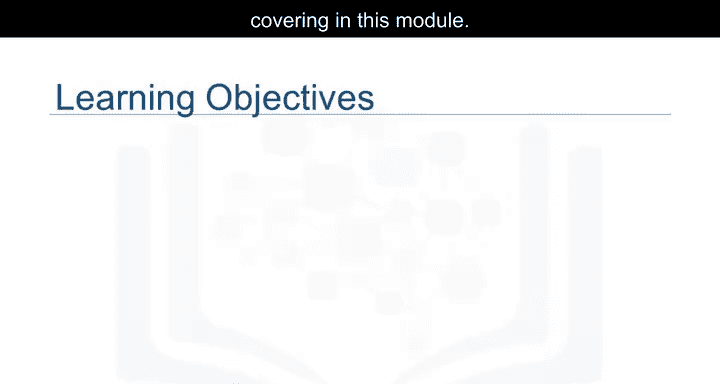

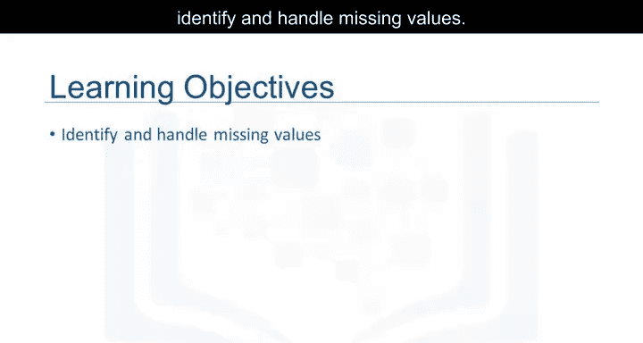

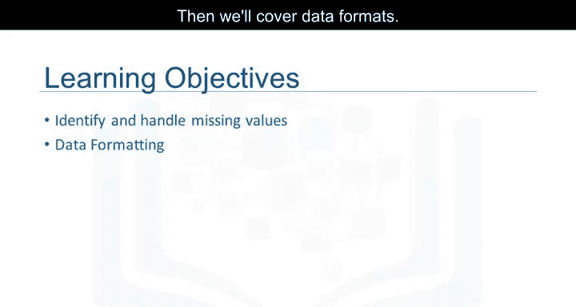

*   **数据类型转换**：使用 `df[‘column’].astype(‘type’)` 转换列的数据类型，例如将字符串转换为数值。
*   **字符串操作**：使用 `.str` 访问器进行大小写转换、去除空格等操作，例如 `df[‘column’].str.lower()`。
*   **单位转换**：通过数学运算统一单位，例如将英里转换为公里。

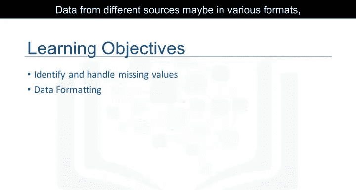

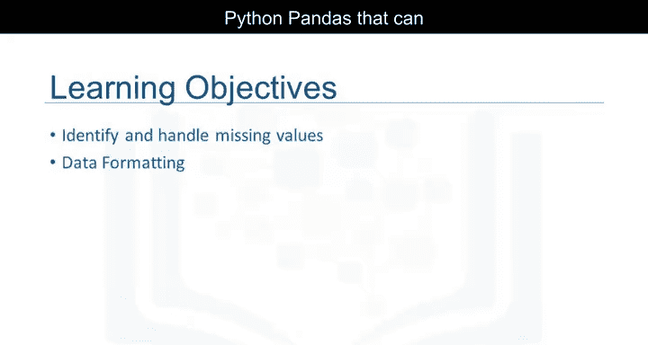

## 数据归一化（中心化与缩放） ⚖️

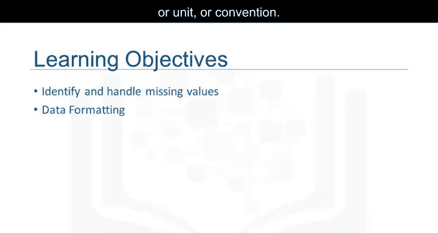

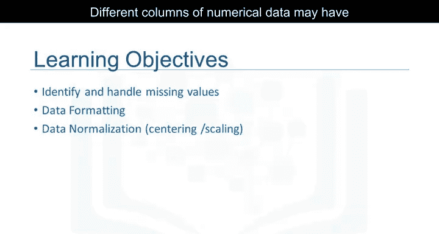

数据格式统一后，不同数值型数据列的范围可能差异很大，直接比较通常没有意义。数据归一化是一种将所有数据带入相似范围的方法，以便进行更有意义的比较。

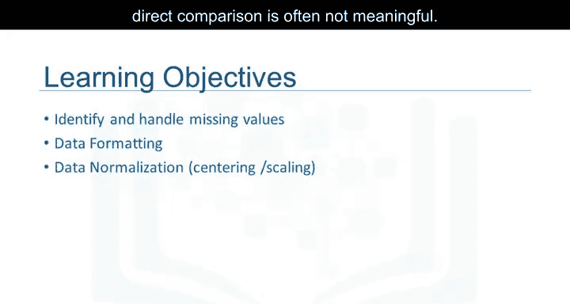

具体来说，我们将重点介绍中心化和缩放技术。

以下是两种常见的归一化方法：

*   **简单缩放（Simple Feature Scaling）**：将每个值除以该列的最大值。公式为：**X_new = X_old / X_max**
*   **最小-最大缩放（Min-Max Scaling）**：将数据缩放到一个固定的范围，通常是[0, 1]。公式为：**X_new = (X_old - X_min) / (X_max - X_min)**
*   **Z分数标准化（Z-score Standardization）**：使数据符合标准正态分布（均值为0，标准差为1）。公式为：**X_new = (X_old - μ) / σ**，其中μ是均值，σ是标准差。

## 数据分箱 📦

归一化有助于比较不同尺度的数据。接下来，我们学习数据分箱技术。分箱将一组数值划分为更大的类别，它对于数据组之间的比较特别有用。

以下是数据分箱的基本步骤：

*   **等宽分箱**：将数据范围划分为N个等宽的区间。可以使用pandas的 `pd.cut` 函数。
*   **等频分箱**：将数据划分为N个组，每个组包含大致相同数量的样本。可以使用pandas的 `pd.qcut` 函数。
*   **自定义分箱**：根据业务逻辑或知识定义分箱边界。

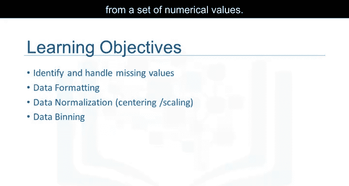

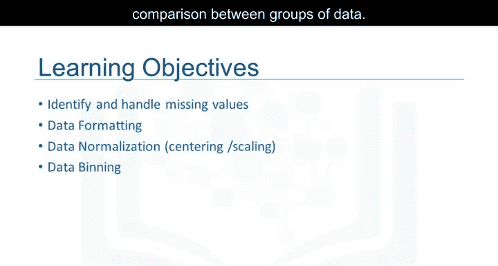

## 分类变量转换 🔠

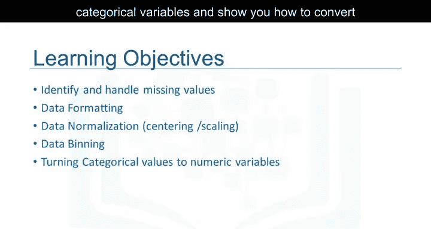

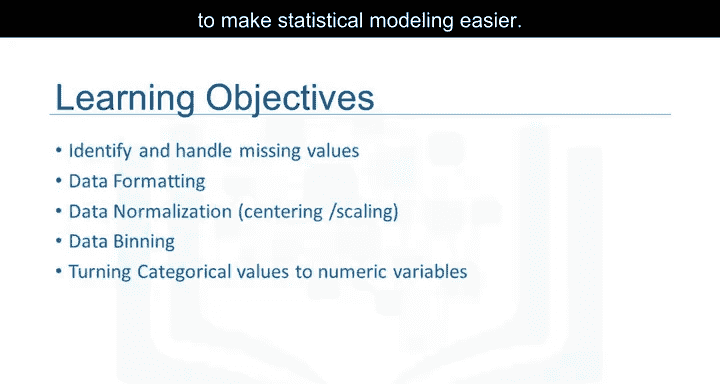

最后，我们将讨论分类变量，并展示如何将分类值转换为数值变量，以便于进行统计建模。

在Python中，我们通常使用以下方法：

*   **标签编码（Label Encoding）**：为每个类别分配一个唯一的整数。可以使用 `sklearn.preprocessing.LabelEncoder`。
*   **独热编码（One-Hot Encoding）**：为每个类别创建一个新的二进制列（0或1）。可以使用pandas的 `pd.get_dummies(df)`。

## 总结 🎯

本节课中，我们一起学习了数据预处理的五个核心步骤：识别与处理缺失值、标准化数据格式、通过中心化与缩放进行数据归一化、数据分箱以及分类变量转换。掌握这些技术是进行有效数据分析的基础，它们能帮助我们将杂乱的原始数据转化为干净、一致且适合建模的格式。记住，在Python的pandas库中，操作通常是沿着数据列进行的。