# 013：Python数据格式化

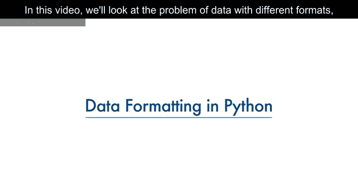

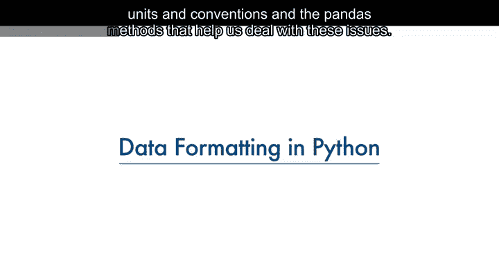

在本节课中，我们将学习如何处理不同格式、单位和表示方式的数据，并介绍pandas库中帮助我们解决这些问题的相关方法。

数据通常由不同的人从不同的地方收集，可能以不同的格式存储。数据格式化是指将数据转换为一种通用的表达标准，使用户能够进行有意义的比较。作为数据集清洗的一部分，数据格式化确保数据一致且易于理解。

例如，人们可能使用不同的表达方式来代表纽约市，例如“NYC”、“New York”、“N.Y.”等。有时，这种不干净的数据是有用的。例如，如果你想观察人们倾向于如何书写“纽约”，那么这正是你所需的数据。或者，如果你在寻找检测欺诈的方法，也许“N.Y.”这种写法比完整拼写“New York”更可能预示着异常。但更多时候，我们只是希望将它们视为相同的实体或格式，以便后续进行统计分析。

## 🔄 数据格式转换示例：油耗单位转换

参考我们的二手车数据集，其中有一个名为“City Miles per gallon”的特征，指的是汽车每加仑燃油消耗的英里数。

然而，你可能生活在使用公制单位的国家。因此，你可能希望将这些值转换为公制版本，即“升每100公里”。

要将“英里每加仑”转换为“升每100公里”，我们需要用235除以“City Miles per gallon”列中的每个值。

在Python中，这可以轻松地用一行代码完成。你取该列并将其设置为等于235除以整个列的值。在第二行代码中，使用数据框的`rename`方法将列名从“City Miles per gallon”重命名为“City lit per 100 km”。

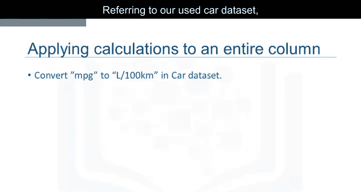

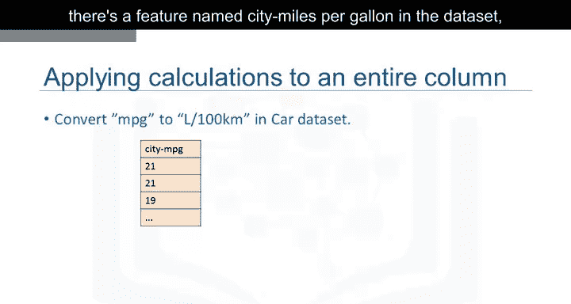

以下是转换和重命名的代码示例：

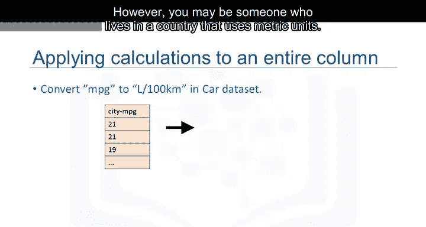

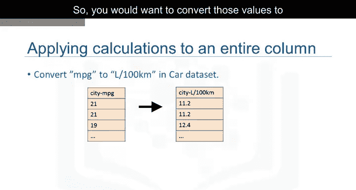

```python
df['City lit per 100 km'] = 235 / df['City Miles per gallon']
df.rename(columns={'City Miles per gallon': 'City lit per 100 km'}, inplace=True)
```

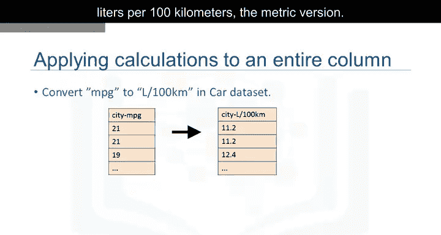

## 📝 数据类型识别与转换


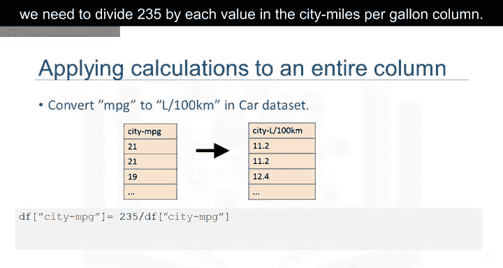

由于多种原因，包括将数据集导入Python时，数据类型可能被错误地设置。例如，这里我们注意到“price”特征的数据类型被指定为“object”，尽管预期的数据类型应该是整数或浮点数类型。

对于后续分析来说，探索特征的数据类型并将其转换为正确的数据类型非常重要。否则，后续开发的模型可能会表现异常，完全有效的数据最终可能被当作缺失数据处理。

pandas中有许多数据类型。“object”可以是字母或单词，“int64”是整数，“float”是实数。还有许多其他类型，我们在此不讨论。

要在Python中识别特征的数据类型，我们可以使用数据框的`dtypes`方法，并检查数据框中每个变量的数据类型。

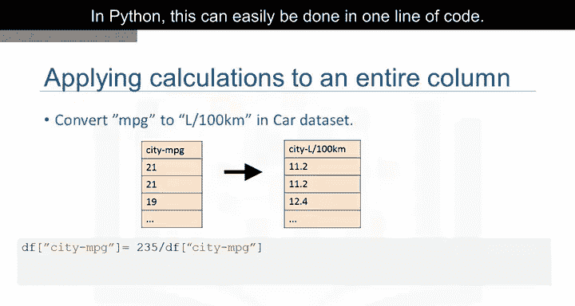

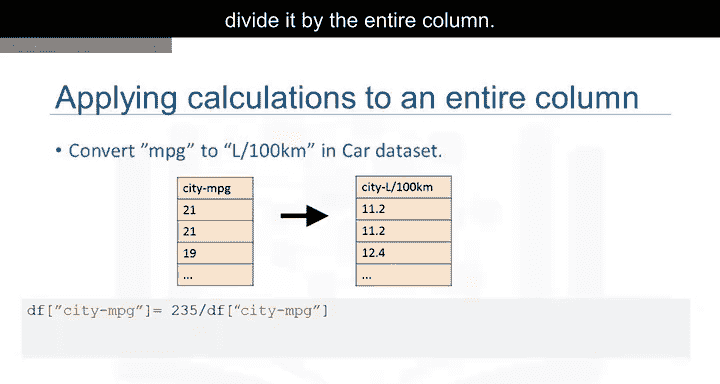

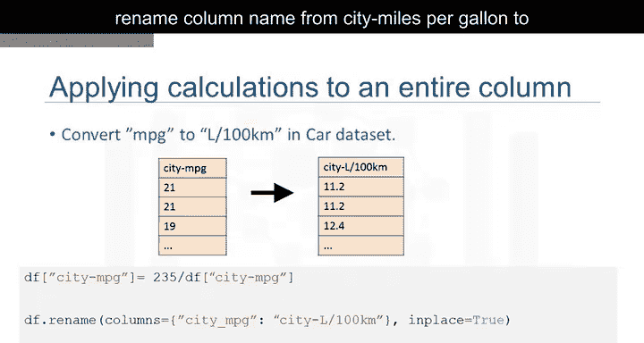

在数据类型错误的情况下，可以使用`dataframe.astype()`方法将数据类型从一种格式转换为另一种格式。

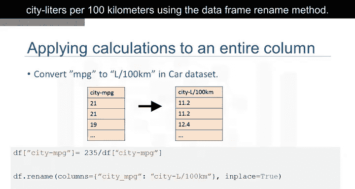

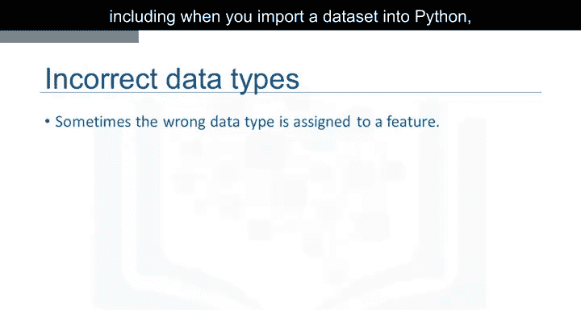

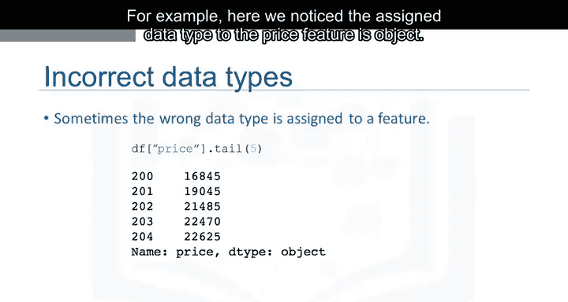

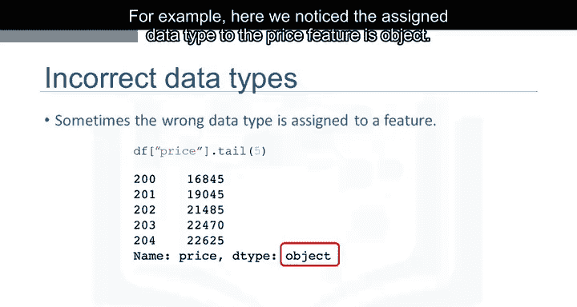

例如，对“price”列使用`astype('int')`，你可以将“object”列转换为整数类型变量。

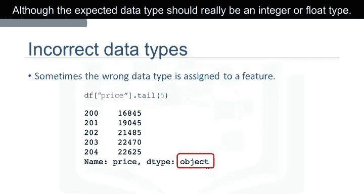

以下是数据类型检查和转换的代码示例：

```python
# 检查数据类型
print(df.dtypes)

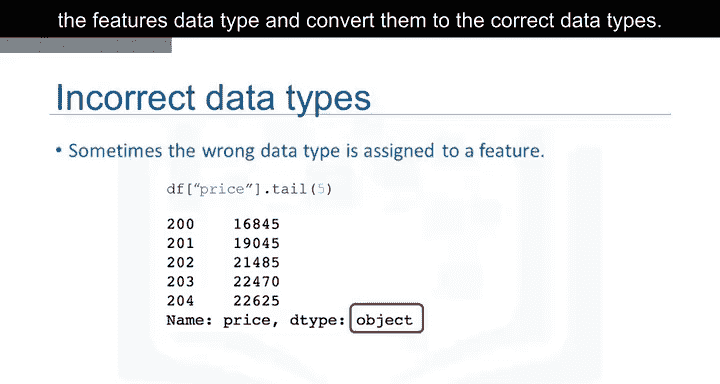

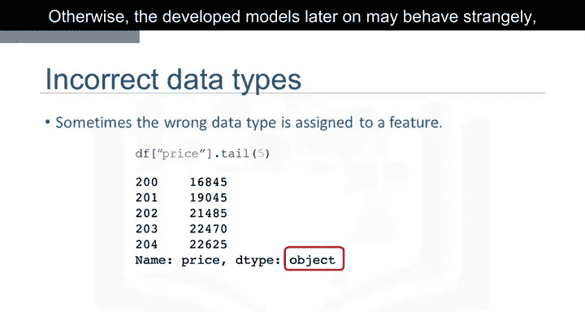

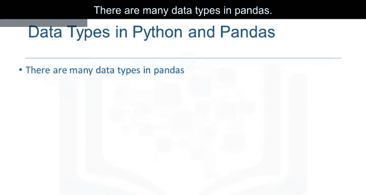

# 转换数据类型
df['price'] = df['price'].astype('int')
```

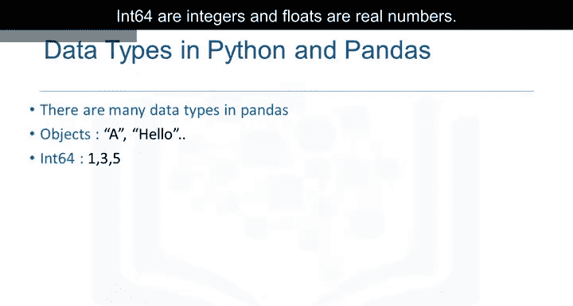

## 📋 核心方法总结


以下是本节课介绍的核心pandas方法：

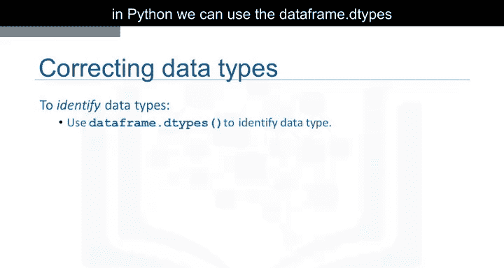

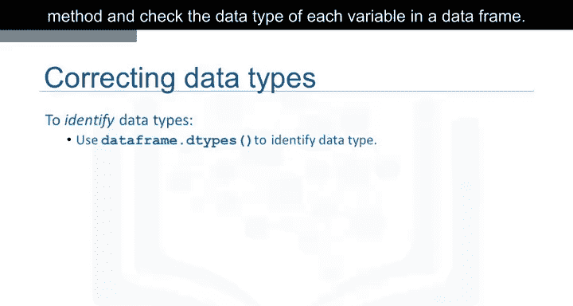

*   **`df.dtypes`**：用于检查数据框中各列的数据类型。
*   **`df.rename()`**：用于重命名数据框的列。
*   **`df.astype()`**：用于将数据列转换为指定的数据类型。

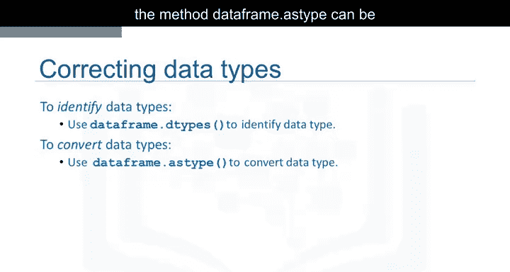

## 🎯 课程总结

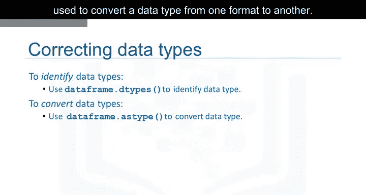

在本节课中，我们一起学习了数据格式化的重要性，它有助于确保数据的一致性和可比性。我们通过一个具体的例子，演示了如何将油耗单位从“英里每加仑”转换为“升每100公里”。我们还探讨了识别和纠正错误数据类型的方法，这是数据清洗和预处理中的关键步骤，能够为后续的数据分析和建模打下坚实的基础。