# 014：Python数据格式化 📊

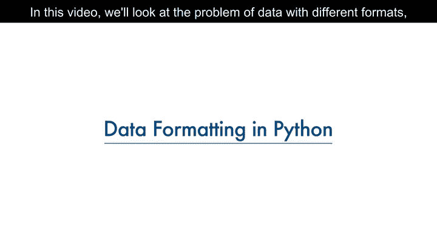

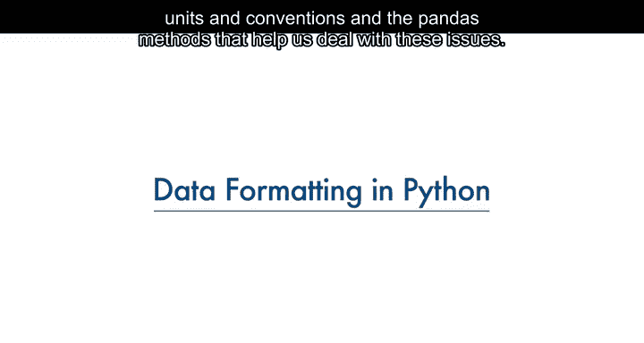

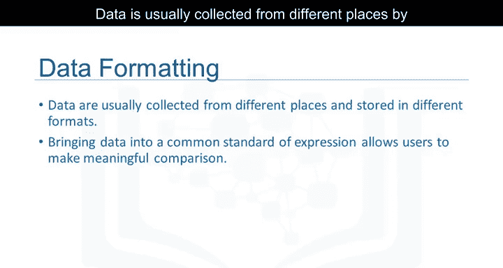

在本节课中，我们将要学习如何处理具有不同格式、单位和约定的数据，以及如何使用pandas库中的方法来应对这些问题。

数据通常由不同的人从不同的地方收集，可能以不同的格式存储。数据格式化意味着将数据带入一个通用的表达标准，使用户能够进行有意义的比较。

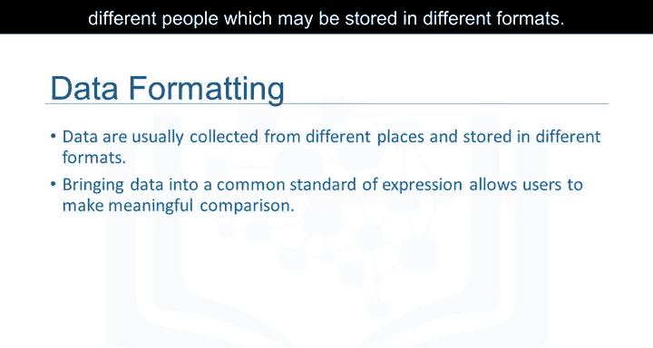

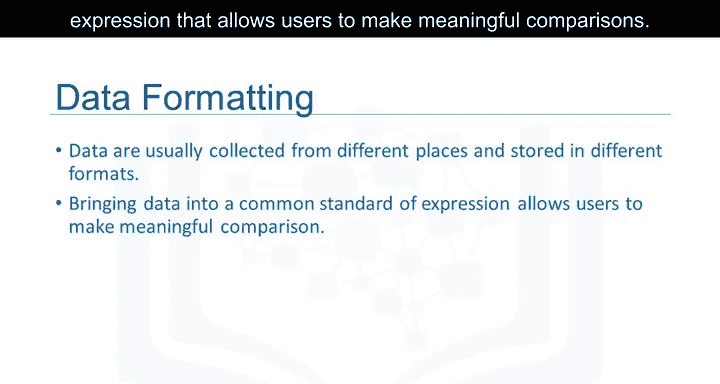

作为数据集清洗的一部分，数据格式化确保数据保持一致且易于理解。

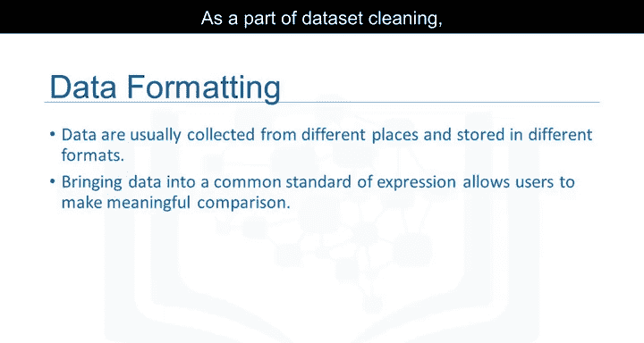

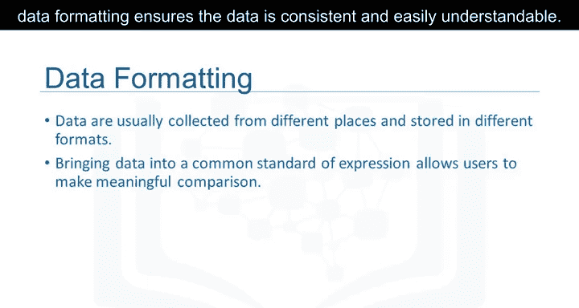

## 数据格式化的必要性 🔍

上一节我们介绍了数据格式化的基本概念，本节中我们来看看为什么需要它。

例如，人们可能使用不同的表达方式来代表纽约市，例如“NYC”、“N.Y.C.”或“New York”。有时，这种不干净的数据是有用的。例如，如果你想研究人们倾向于如何书写“纽约”，那么这正是你想要的数据。或者，如果你想寻找发现欺诈的方法，也许“N.Y.”比完整写出“New York”更可能预示着异常。但更多时候，我们只是希望将它们都视为相同的实体或格式，以便于后续的统计分析。

## 单位转换示例：油耗计算 ⛽

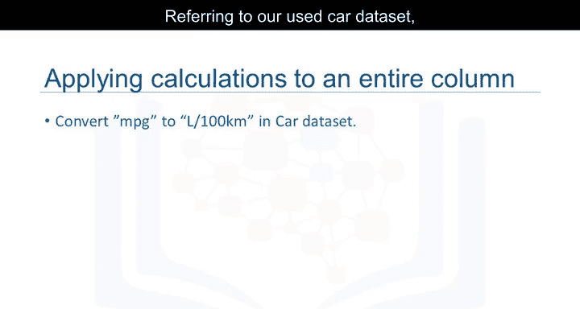

以下是单位转换的一个具体例子。

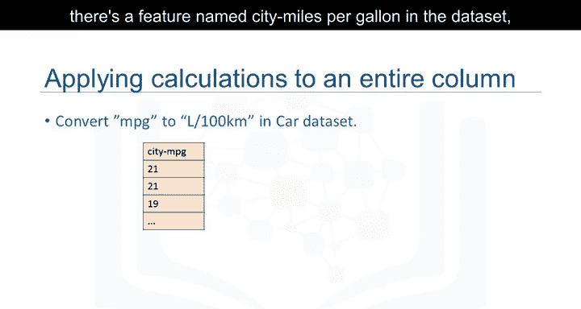

参考我们的二手车数据集，其中有一个名为“City Miles per gallon”的特征，指的是汽车以每加仑英里数为单位的油耗。

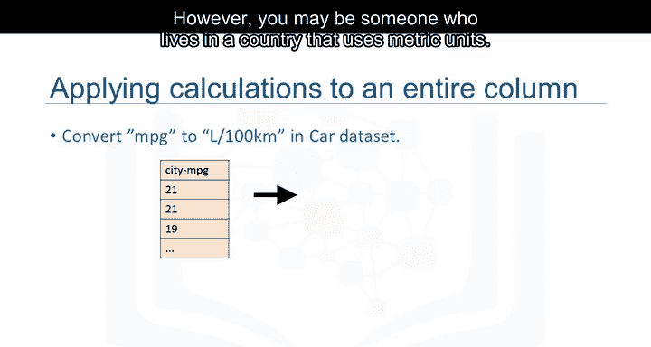

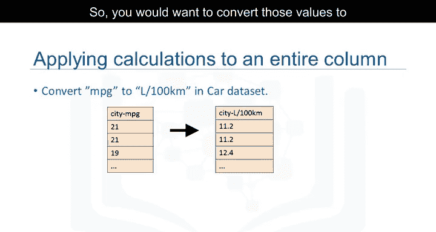

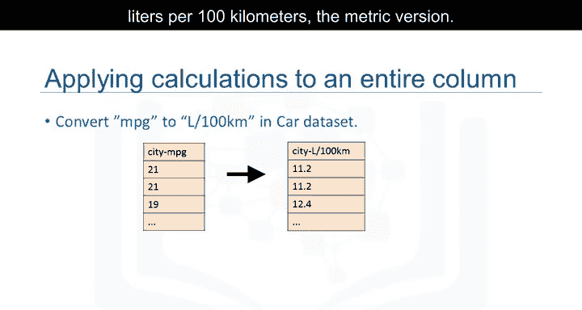

然而，你可能生活在使用公制单位的国家。因此，你可能希望将这些值转换为公制版本，即“升每100公里”。

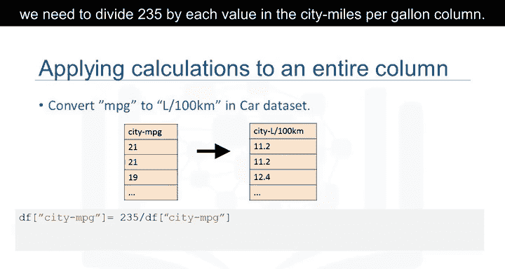

要将每加仑英里数转换为升每100公里，我们需要用235除以“city miles per gallon”列中的每个值。

在Python中，这可以轻松地用一行代码完成。你取该列并将其设置为等于235除以整个列的值。在第二行代码中，使用数据框的`rename`方法将列名从“city miles per gallon”重命名为“city lit per100 km”。

## 数据类型识别与转换 🔧

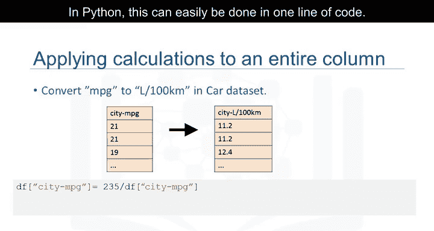

上一节我们处理了单位转换，本节中我们来看看数据类型的处理。

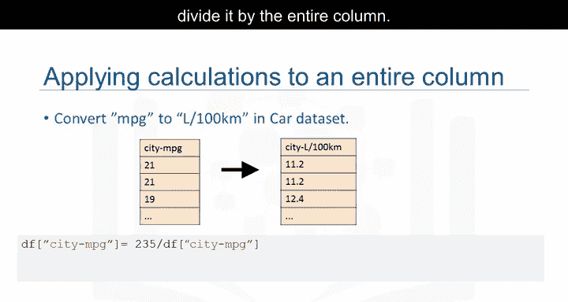

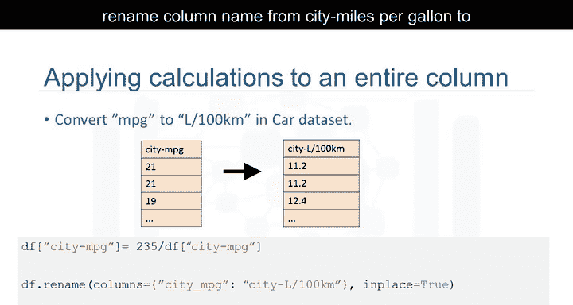

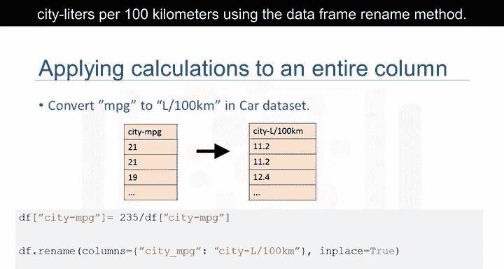

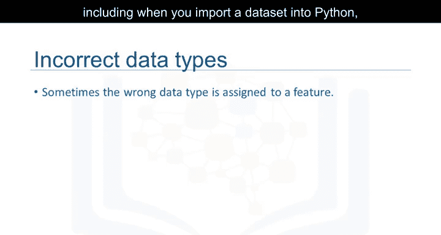

由于多种原因，包括将数据集导入Python时，数据类型可能被错误地设置。例如，这里我们注意到“price”特征被分配的数据类型是`object`，尽管预期的数据类型应该是整数或浮点类型。

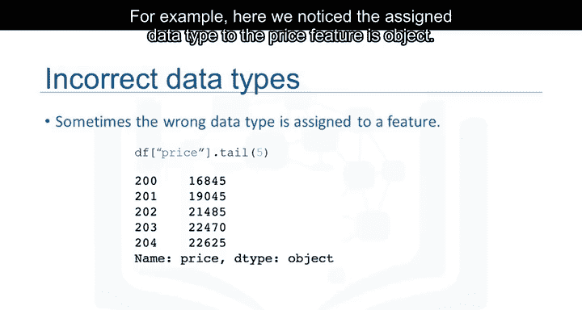

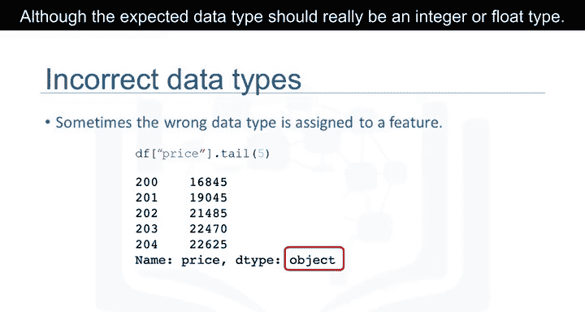

对于后续分析来说，探索特征的数据类型并将其转换为正确的数据类型非常重要。否则，后续开发的模型可能会表现异常，完全有效的数据最终可能被当作缺失数据处理。

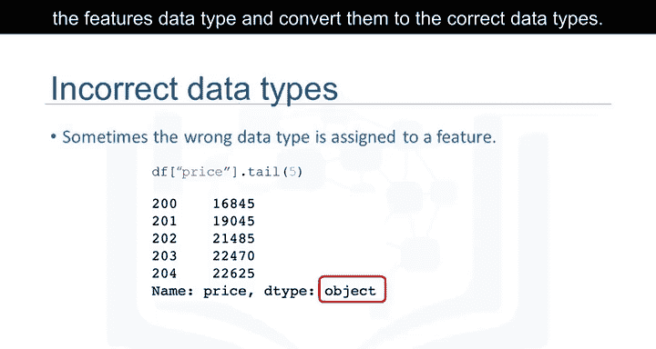

pandas中有许多数据类型。`object`可以是字母或单词。`int64`是整数，`float`是实数。还有许多其他类型，我们在此不讨论。

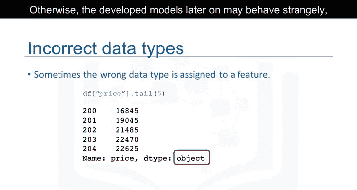

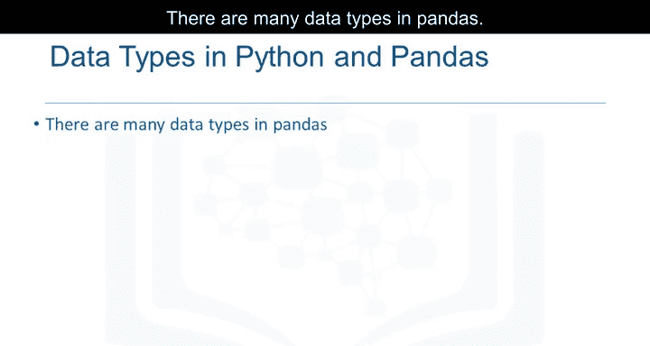

要在Python中识别特征的数据类型，我们可以使用`dataframe.dtypes`方法，并检查数据框中每个变量的数据类型。

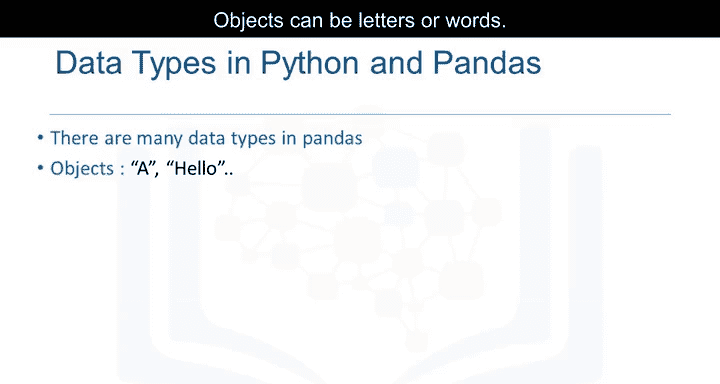

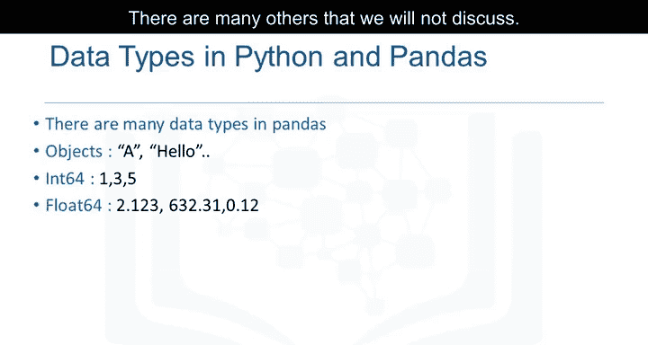

在数据类型错误的情况下，可以使用`dataframe.astype()`方法将数据类型从一种格式转换为另一种格式。

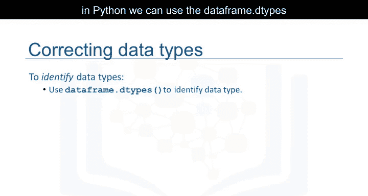

例如，对“price”列使用`astype('int')`，你可以将`object`类型的列转换为整数类型的变量。

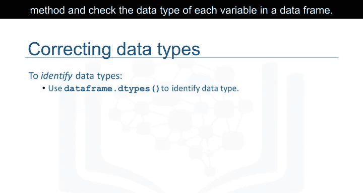

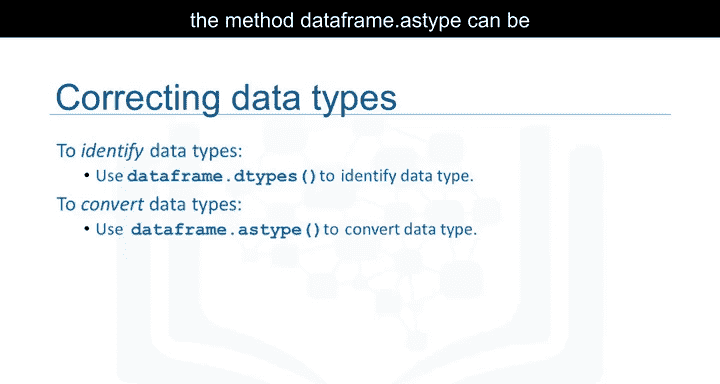

## 总结 📝

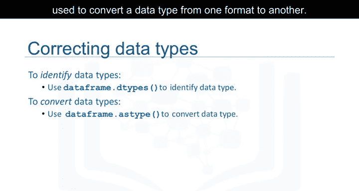

本节课中我们一起学习了数据格式化的概念及其重要性。我们探讨了如何统一不同格式的数据表达，并通过具体示例演示了如何进行单位转换（如油耗计算）和数据类型识别与转换。掌握这些技能是进行有效数据清洗和准备高质量数据集的关键步骤，为后续的数据分析和建模工作打下坚实基础。