# 016：Python数据分箱 📊

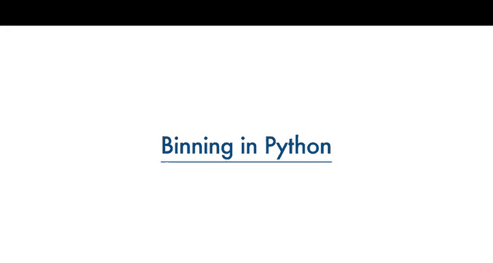

在本节课中，我们将要学习数据分箱这一数据预处理方法。数据分箱能够将数值分组，有时可以提升预测模型的准确性，并帮助我们更好地理解数据分布。

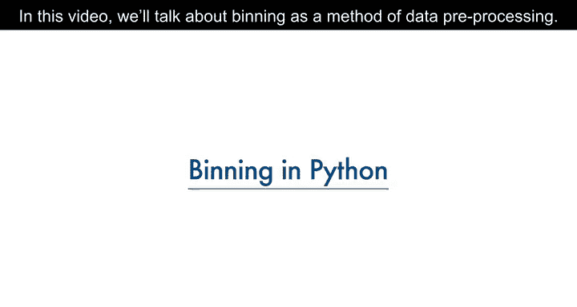

上一节我们介绍了数据预处理的基本概念，本节中我们来看看数据分箱的具体应用。

## 什么是数据分箱？ 📦

数据分箱是指将数值分组到不同的“箱子”中。例如，可以将年龄分为0-5岁、6-10岁、11-15岁等组别。

有时，数据分箱能够提升预测模型的准确性。此外，我们有时会将一组数值分到数量更少的箱子中，以便更好地理解数据分布。

## 数据分箱示例 🚗

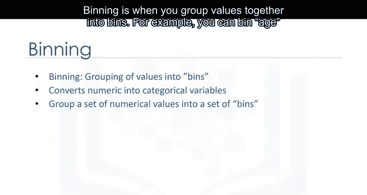

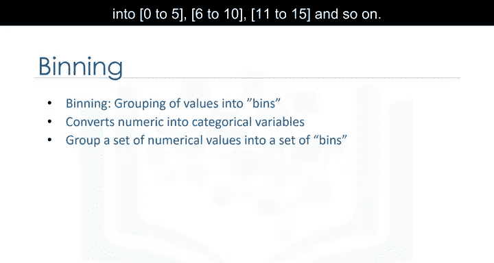

以汽车价格为例，价格是一个属性，范围从5000到45500。

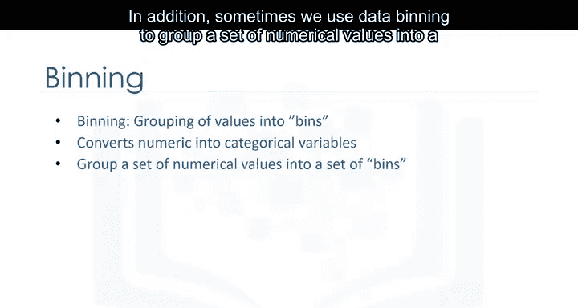

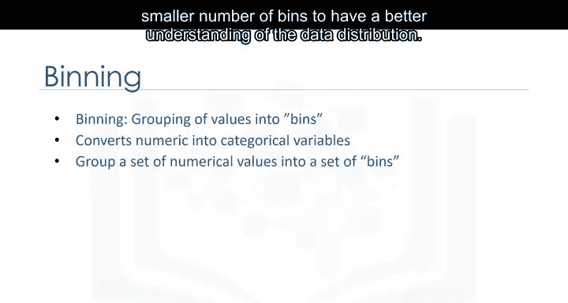

使用分箱方法，我们可以将价格分为三个箱子：低价、中价和高价。

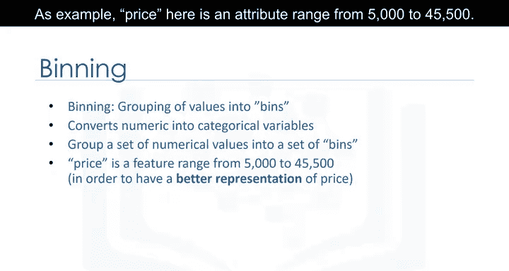

在实际的汽车数据集中，价格是一个数值变量，范围从5188到45400，共有201个不同的值。我们可以将它们分为三个箱子：低价车、中价车和高价车。

## 在Python中实现数据分箱 🐍

在Python中，我们可以轻松实现数据分箱。我们希望创建三个等宽的箱子，因此需要四个等间距的数字作为分隔点。

首先，我们使用NumPy的`linspace`函数来生成一个数组`bins`，该数组包含在指定价格区间内等间距的四个数字。

以下是实现代码：

```python
import numpy as np
import pandas as pd

# 假设 price 是一个包含价格的Pandas Series
# 计算等间距的分箱边界
bins = np.linspace(min(price), max(price), 4)
```


我们创建一个列表`group_names`，其中包含不同的分箱名称。

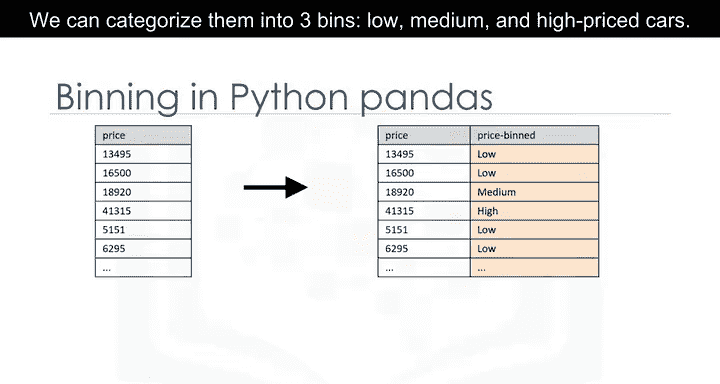

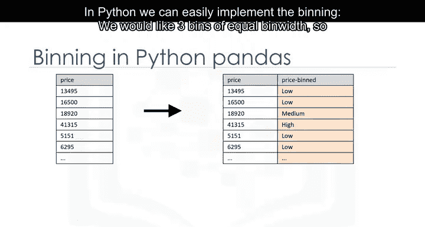

```python
group_names = [‘Low’, ‘Medium’, ‘High’]
```

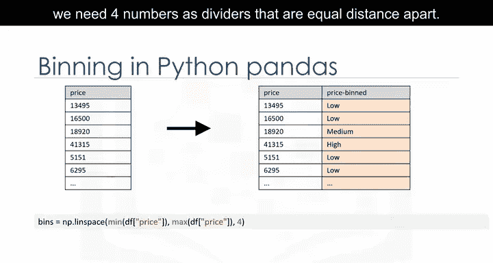

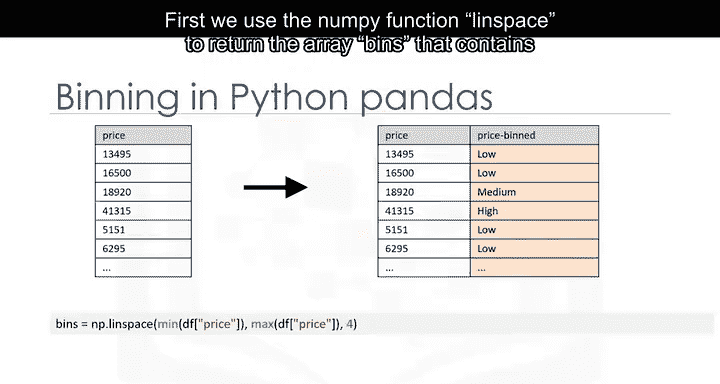

然后，我们使用Pandas的`cut`函数将数据值分段并排序到各个箱子中。

```python
price_binned = pd.cut(price, bins, labels=group_names, include_lowest=True)
```

## 可视化分箱结果 📊

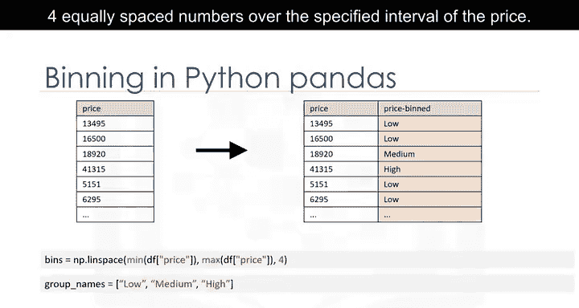

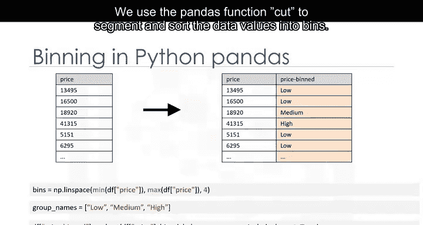

分箱完成后，你可以使用直方图来可视化数据在分箱后的分布。

以下是我们基于价格特征应用分箱后绘制的直方图。从图中可以清楚地看出，大多数汽车属于低价类别，只有很少的汽车属于高价类别。

```python
import matplotlib.pyplot as plt

# 绘制直方图
plt.hist(price_binned, bins=3, edgecolor=‘black’)
plt.xlabel(‘Price Category’)
plt.ylabel(‘Frequency’)
plt.title(‘Distribution of Car Prices After Binning’)
plt.show()
```

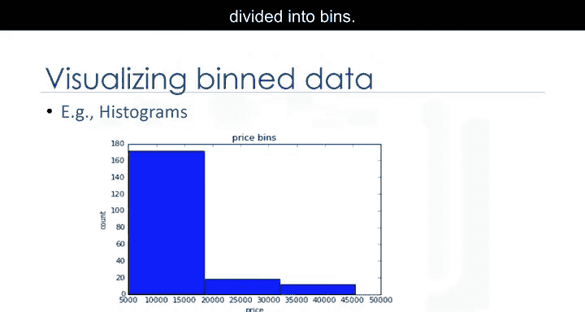

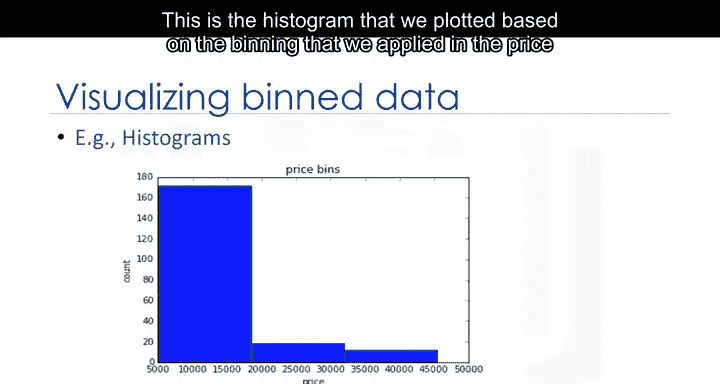

## 总结 📝

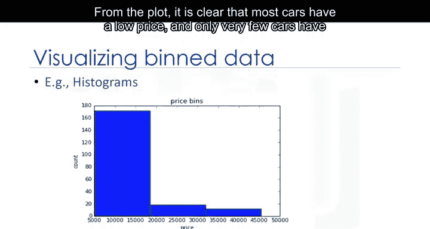

本节课中我们一起学习了数据分箱的概念及其在Python中的实现方法。我们了解到，数据分箱是一种将数值数据分组的技术，有助于提升模型性能并更好地理解数据分布。通过使用NumPy的`linspace`函数和Pandas的`cut`函数，我们可以轻松地对数据进行分箱处理，并通过直方图直观地展示分箱结果。