# 017：数据归一化 📊

在本节课中，我们将要学习数据归一化，这是数据预处理中一项重要的技术。

当我们观察二手车数据集时，会注意到数据中“长度”特征的范围在150到250之间，而“宽度”和“高度”特征的范围则在50到100之间。我们可能希望将这些变量归一化，使它们的取值范围保持一致。这种归一化可以使后续的某些统计分析更加容易。

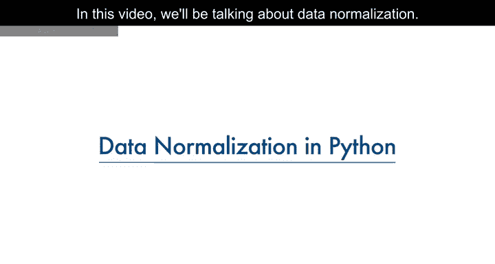

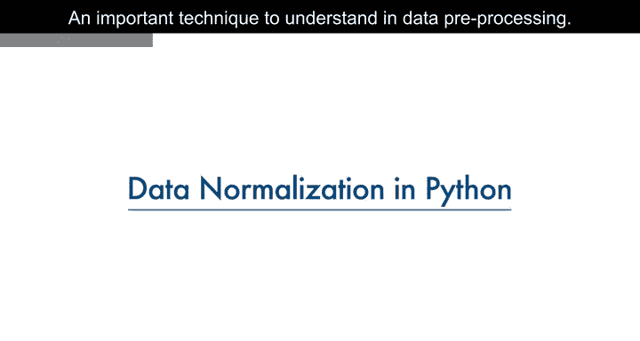

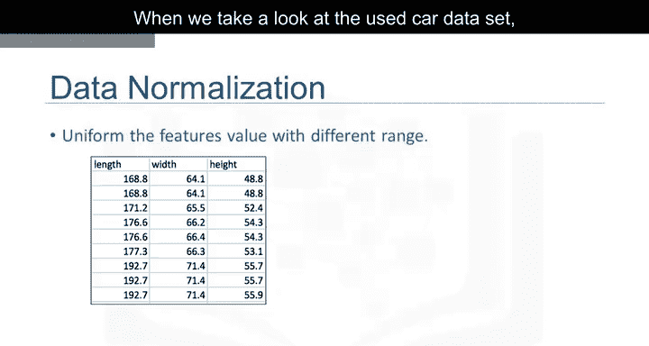

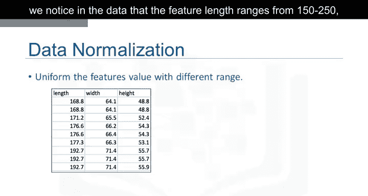

通过使变量间的范围保持一致，归一化能够实现不同特征之间更公平的比较，确保它们具有相同的影响力。这对于计算过程也很重要。

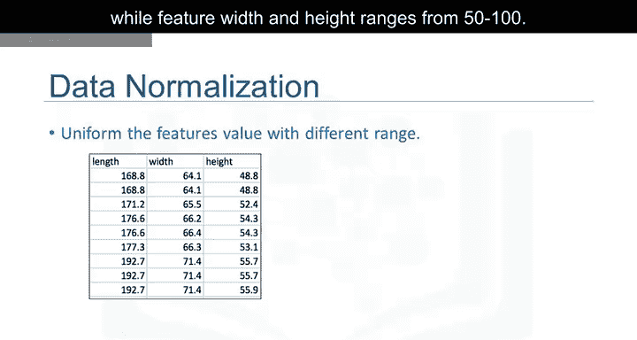

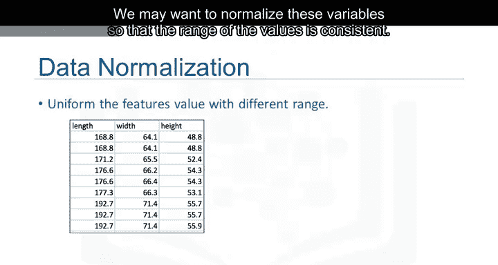

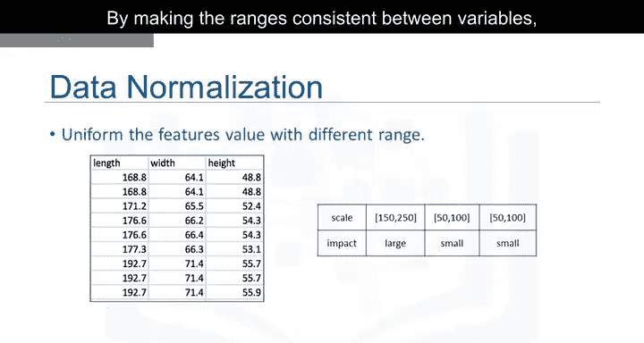

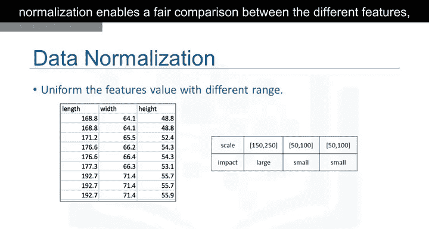

## 为什么需要归一化？🤔

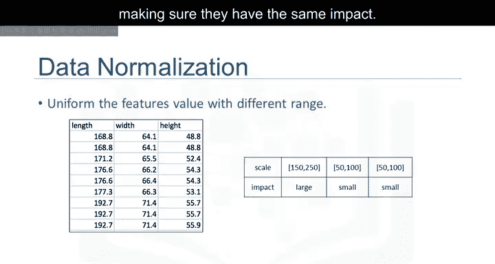

上一节我们提到了数据范围不一致的问题，本节中我们通过一个例子来深入理解为什么归一化如此重要。

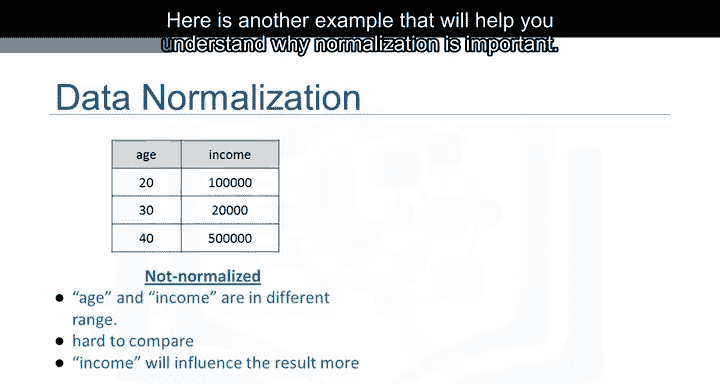

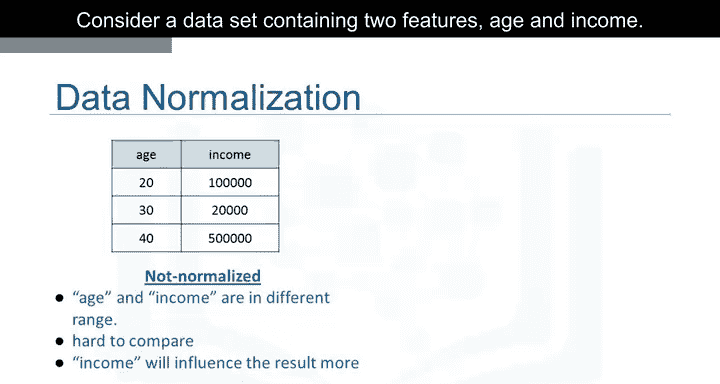

考虑一个包含“年龄”和“收入”两个特征的数据集。其中，年龄的范围是0到100岁，而收入的范围则是0到20，000甚至更高。收入的值大约是年龄的1000倍，其范围可能在20，000到500，000之间。因此，这两个特征处于完全不同的数量级。

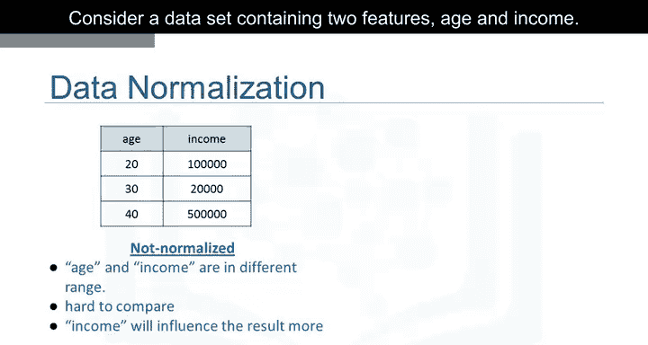

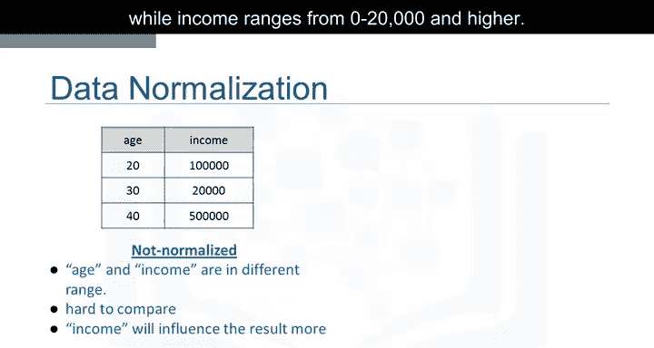

当我们进行进一步分析时，例如线性回归，由于“收入”特征的数值更大，它本质上会对结果产生更大的影响。但这并不一定意味着它作为一个预测因子就更重要。数据的这种特性会使线性回归模型偏向于给予“收入”比“年龄”更重的权重。

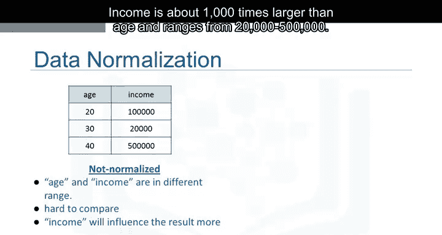

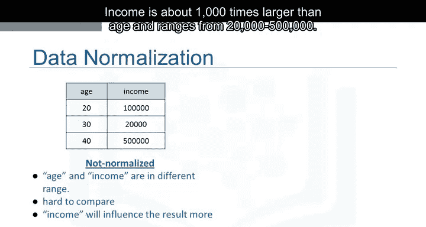

为了避免这种情况，我们可以将这两个变量归一化到0到1的范围内。比较右侧归一化后的两个表格，现在两个变量对我们后续构建的模型具有相似的影响力。

## 数据归一化的方法 🛠️

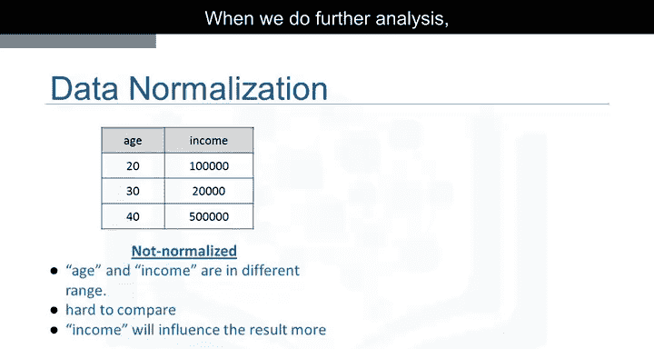

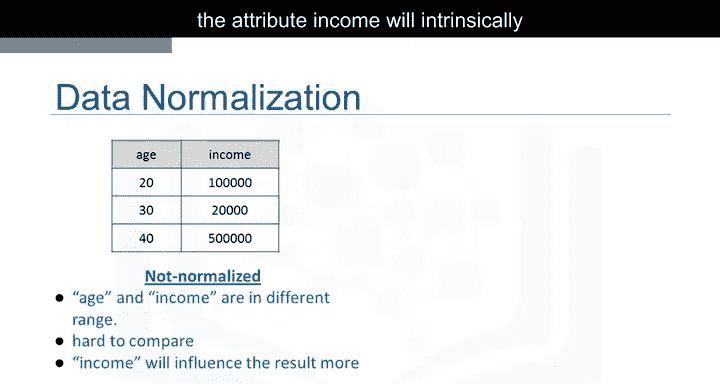

我们已经理解了归一化的必要性，接下来看看如何实现它。以下是三种常见的数据归一化技术。

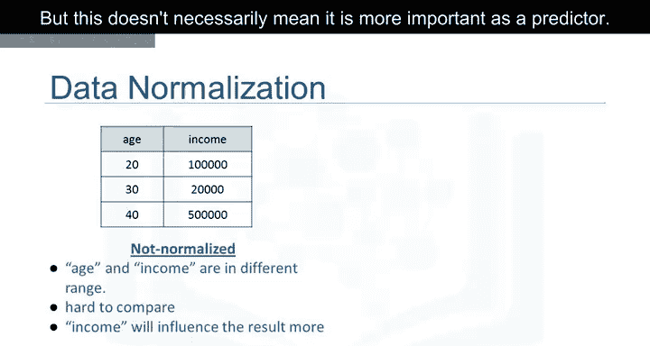

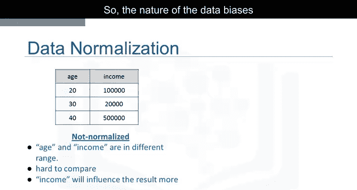

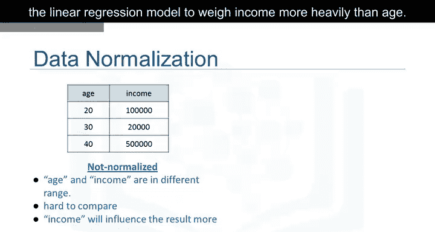

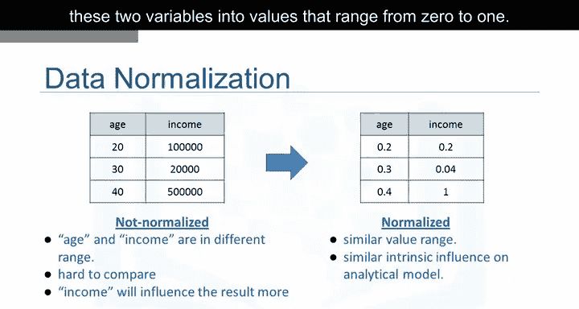

**简单特征缩放**
这种方法将每个值除以该特征的最大值。这使得新值的范围在0到1之间。
公式为：`X_new = X_old / X_max`

**最小-最大归一化**
这种方法从每个值中减去该特征的最小值，然后除以该特征的范围（最大值减最小值）。结果值同样在0到1之间。
公式为：`X_new = (X_old - X_min) / (X_max - X_min)`

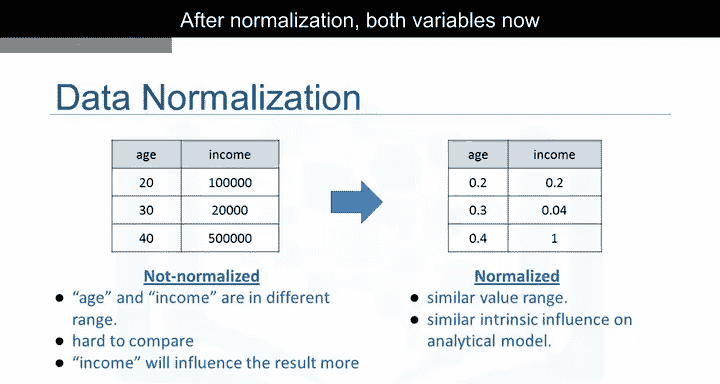

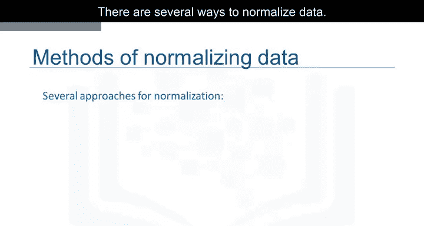

**Z分数标准化**
在这种方法中，对于每个值，先减去该特征的平均值（μ），再除以标准差（σ）。结果值通常围绕0分布，范围大致在-3到+3之间，但也可能更高或更低。
公式为：`X_new = (X_old - μ) / σ`

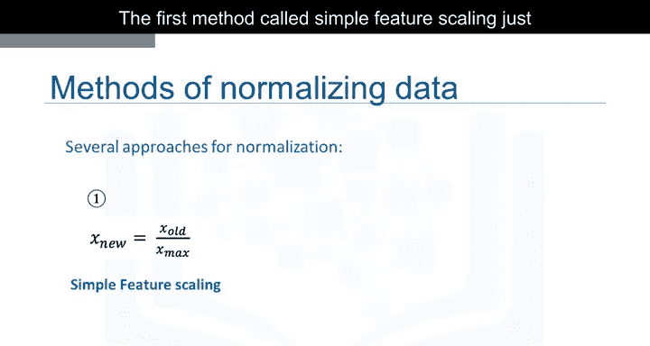

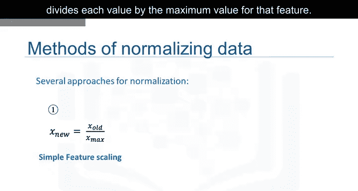

## 在Python中实现归一化 💻

理论介绍完毕，现在让我们动手实践，看看如何在Python中应用这些归一化方法。我们将以数据集中的“长度”特征为例。

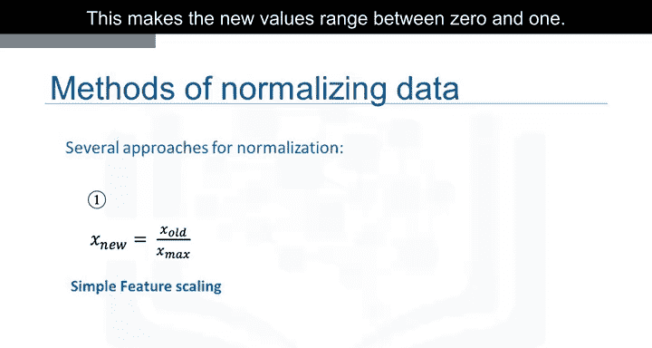


首先，使用简单特征缩放方法，将每个值除以该特征的最大值。使用Pandas的`.max()`方法，只需一行代码即可完成。

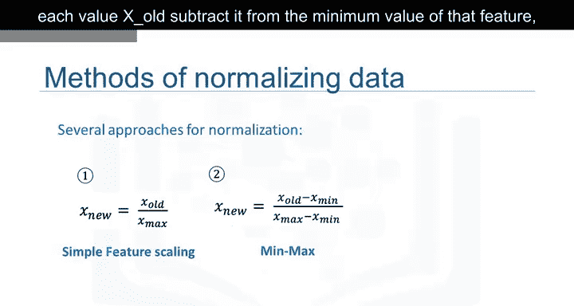

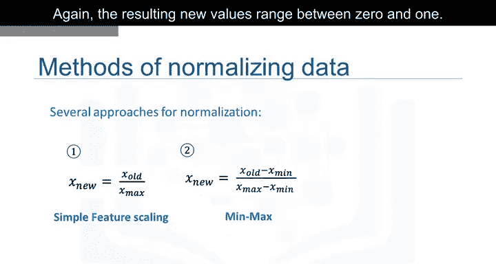

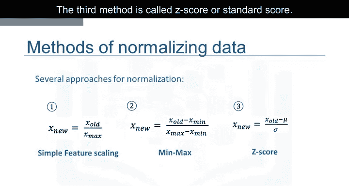

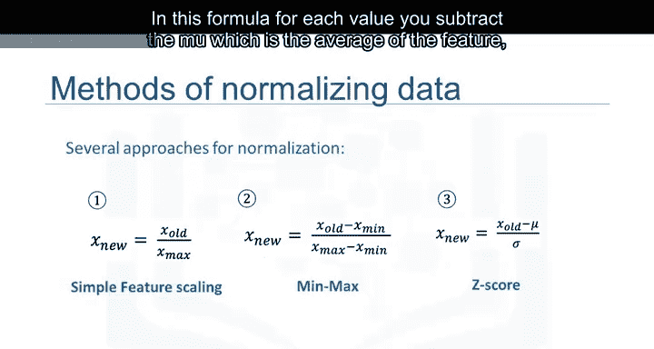

```python
df[‘length’] / df[‘length’].max()
```

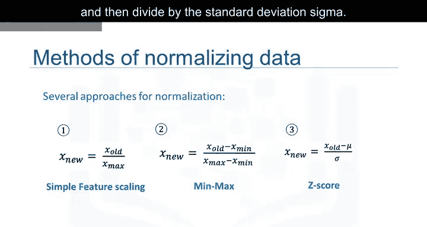

接下来，应用最小-最大方法。从该列的每个值中减去最小值，然后除以该列的范围（最大值减最小值）。

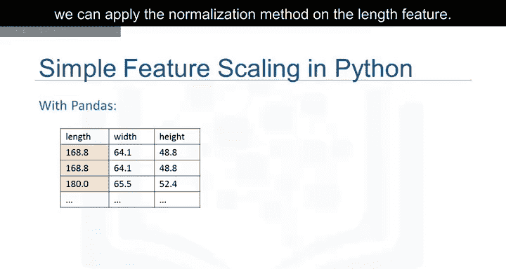

```python
(df[‘length’] - df[‘length’].min()) / (df[‘length’].max() - df[‘length’].min())
```

最后，对长度特征应用Z分数方法进行归一化。这里我们对长度特征应用`.mean()`和`.std()`方法。`.mean()`方法返回数据集中该特征的平均值，`.std()`方法返回数据集中该特征的标准差。

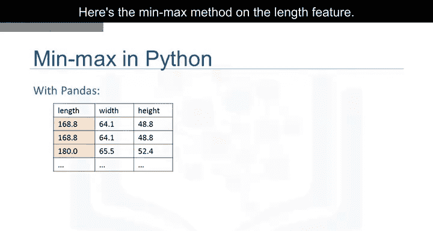

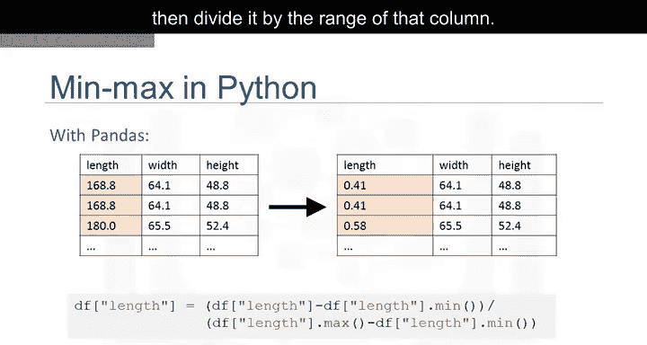

```python
(df[‘length’] - df[‘length’].mean()) / df[‘length’].std()
```

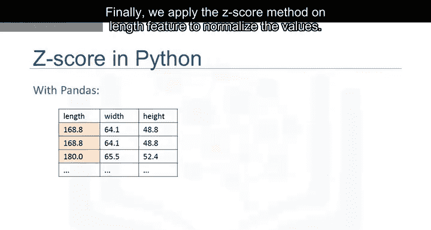


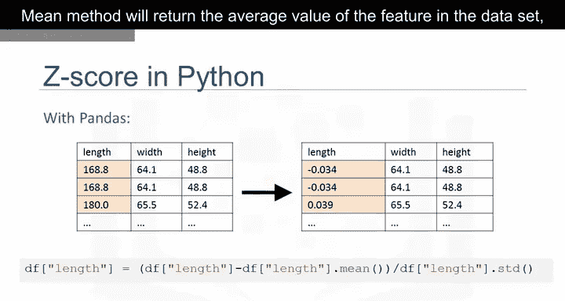

## 总结 📝

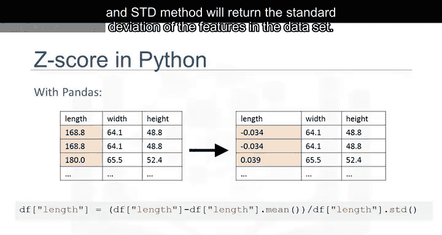

本节课中我们一起学习了数据归一化。我们首先理解了为什么当数据特征处于不同量级时需要进行归一化，以确保模型分析的公平性和准确性。接着，我们介绍了三种核心的归一化技术：简单特征缩放、最小-最大归一化和Z分数标准化，并给出了它们的数学公式。最后，我们使用Python的Pandas库，通过具体的代码示例演示了如何对数据集中的特征实施这些归一化操作。掌握数据归一化是进行有效数据分析和构建稳健机器学习模型的重要一步。