# 018：Python分类变量量化 🔢

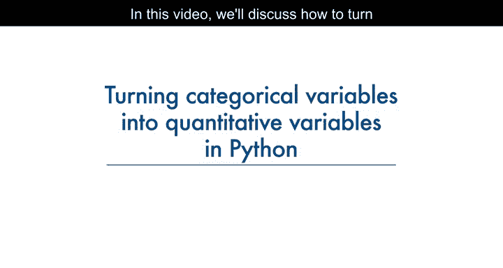


在本节课中，我们将学习如何将数据集中的分类变量（如字符串或对象类型）转换为定量变量（数值类型）。这是数据预处理的关键步骤，因为大多数统计模型和机器学习算法只能处理数值型数据。

## 概述 📋

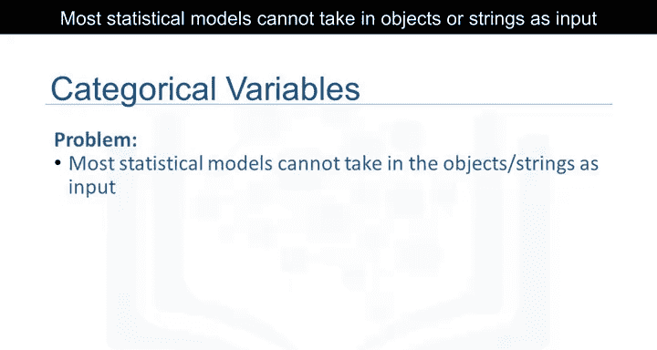

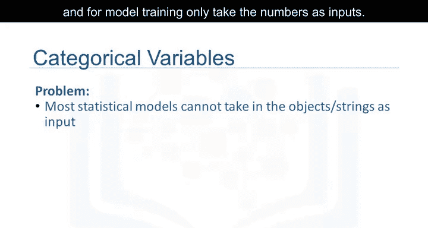

上一节我们介绍了数据清洗的基本概念。本节中我们来看看一个特定的预处理任务：分类变量的量化。分类变量包含非数值的类别信息，例如“汽油”或“柴油”。为了在分析中使用这些信息，我们必须将它们转换为数值形式。

## 为什么需要量化分类变量？ 🤔

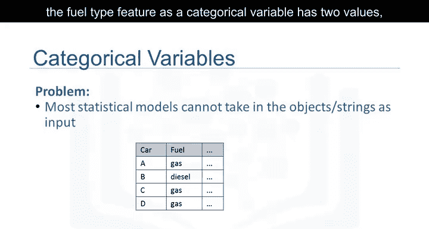


大多数统计模型无法将对象或字符串作为输入。为了进行模型训练，它们只接受数字作为输入。

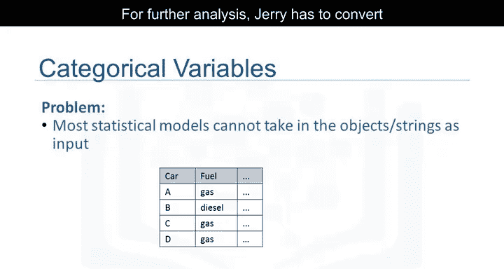

在汽车数据集中，“燃料类型”这个特征是一个分类变量，它有两个值：“汽油”或“柴油”，它们以字符串格式存在。为了进行进一步的分析，我们必须将这些变量转换为某种数字格式。

## 解决方案：独热编码（One-Hot Encoding） ⚙️

我们通过为原始特征中每个唯一的元素添加新的特征来进行编码。以“燃料类型”特征为例，它有两个唯一值：“汽油”和“柴油”。我们创建两个新特征：“gas”和“diesel”。

当某个值出现在原始特征中时，我们在新特征中将对应的值设为1，其余特征设为0。

在燃料示例中：
*   对于汽车B，燃料值是“柴油”。因此，我们将“diesel”特征设为1，“gas”特征设为0。
*   对于汽车D，燃料值是“汽油”。因此，我们将“gas”特征设为1，“diesel”特征设为0。

这种技术通常被称为**独热编码**。


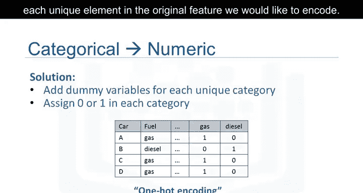

在Pandas中，我们可以使用 `get_dummies()` 方法来将分类变量转换为虚拟变量（哑变量）。


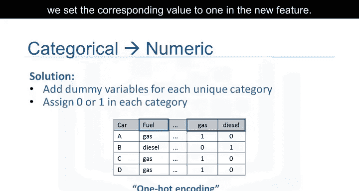

## 在Python中实现独热编码 💻

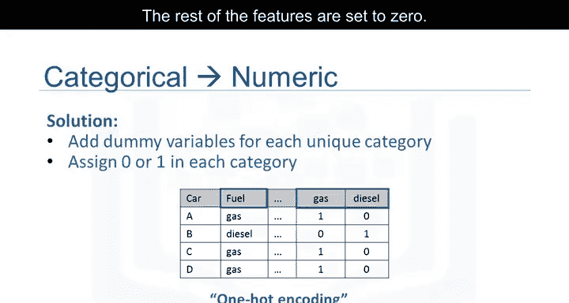

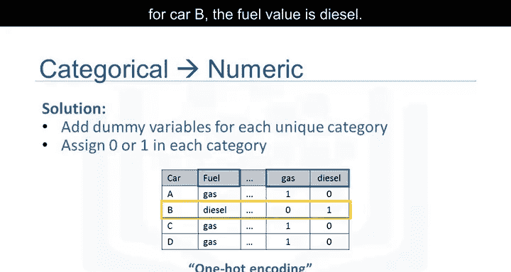

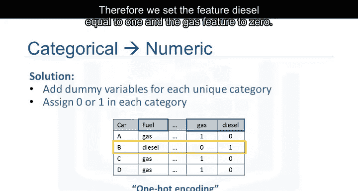

在Python中，将分类变量转换为虚拟变量很简单。遵循示例，`pd.get_dummies()` 方法获取“燃料类型”列并创建数据框 `dummy_variable_1`。

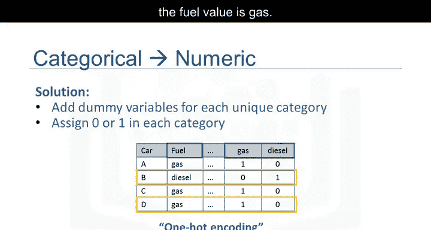

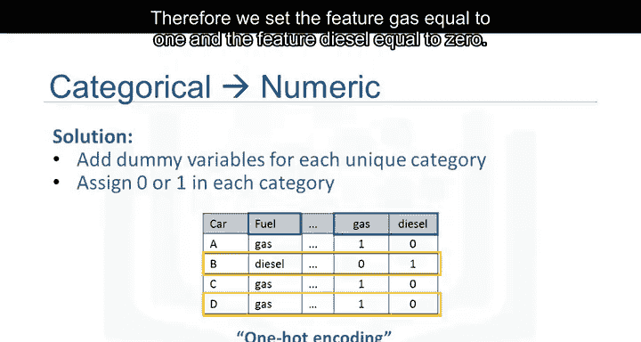

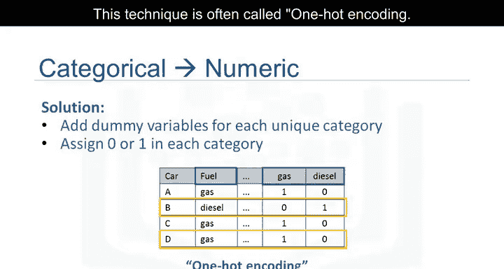

以下是实现此操作的代码：

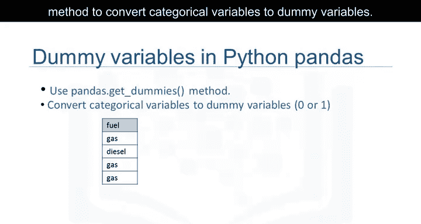

```python
import pandas as pd

# 假设 df 是包含‘fuel-type’列的DataFrame
dummy_variable_1 = pd.get_dummies(df['fuel-type'])
```


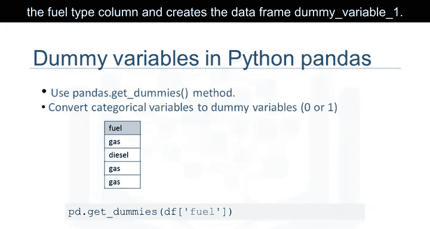

`get_dummies()` 方法会自动生成一个数字列表，每个数字对应变量的一个特定类别。

## 总结 🎯


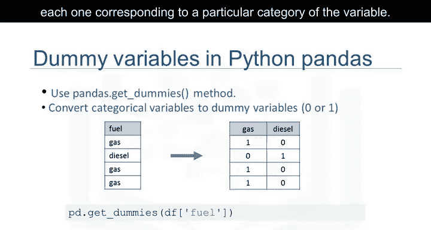

本节课中我们一起学习了分类变量量化的核心方法——独热编码。我们了解到，由于机器学习模型需要数值输入，将字符串类型的分类数据（如“汽油”、“柴油”）转换为数值是必不可少的步骤。通过Pandas库的 `pd.get_dummies()` 函数，我们可以轻松地为每个类别创建一个新的二进制特征（0或1），从而将分类信息有效地转化为模型可以理解的格式。这是构建高效数据管道和成功训练模型的基础技能之一。