# 019：数据分箱


在本节课中，我们将学习数据分箱这一数据预处理方法。数据分箱能够将数值分组到不同的区间中，有时可以提升预测模型的准确性，并帮助我们更好地理解数据分布。

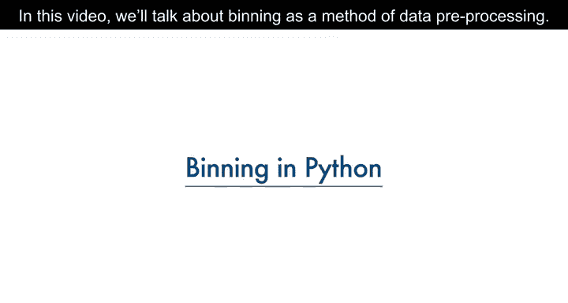

---

## 什么是数据分箱？🧩

数据分箱是指将数值分组到不同的“箱子”中。例如，可以将年龄分为0-5岁、6-10岁、11-15岁等区间。有时，分箱能够提升预测模型的准确性。此外，我们有时会将一组数值分到更少的箱子中，以便更好地理解数据分布。

---

## 数据分箱示例：汽车价格 🚗

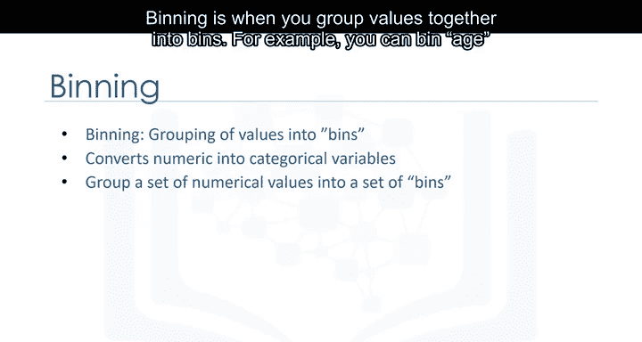

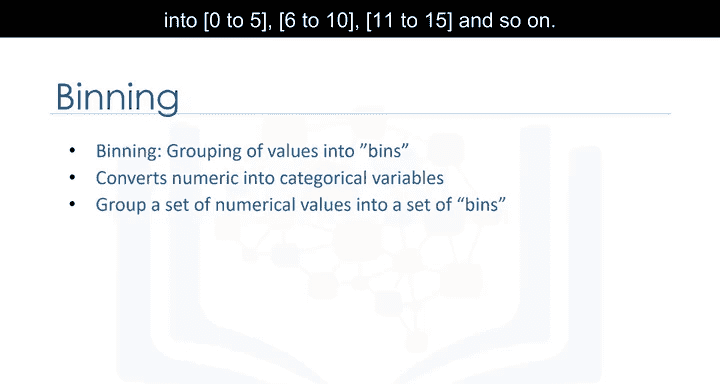

以汽车价格为例，价格属性的范围从5000到45500。

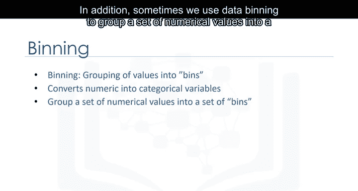

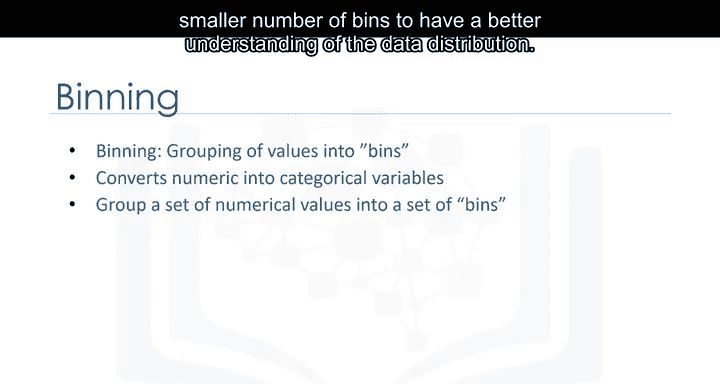

使用分箱方法，我们将价格分为三个区间：低价、中价和高价。

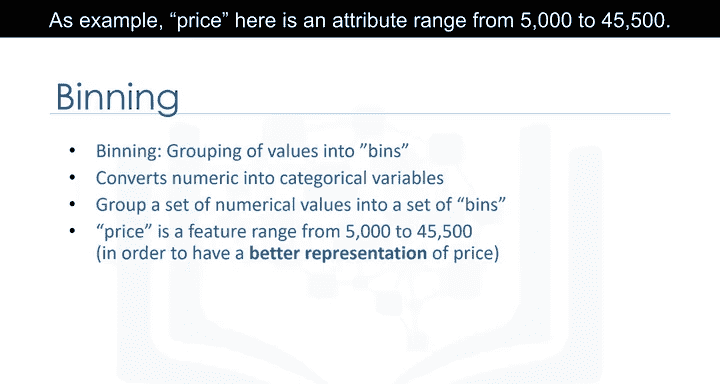

在实际的汽车数据集中，价格是一个数值变量，范围从5188到45400，共有201个不同的值。我们可以将它们分为三个区间：低价车、中价车和高价车。

---

## 在Python中实现等宽分箱 ⚙️

在Python中，我们可以轻松实现分箱。我们希望创建三个等宽的箱子，因此需要四个等间距的数字作为分隔点。

首先，我们使用NumPy的`linspace`函数生成一个数组`bins`，该数组包含在指定价格区间内等间距的四个数字。

```python
import numpy as np
bins = np.linspace(min_price, max_price, 4)
```

接着，我们创建一个列表`group_names`，其中包含不同的箱子名称。

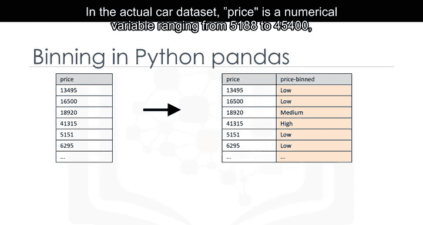

```python
group_names = ['Low', 'Medium', 'High']
```

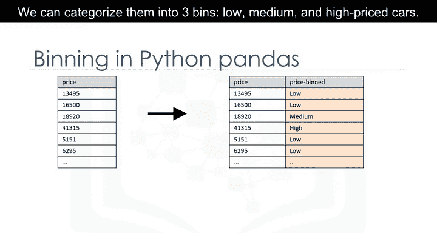


然后，我们使用Pandas的`cut`函数将数据值分段并排序到各个箱子中。

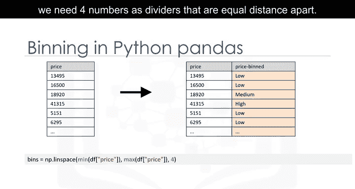

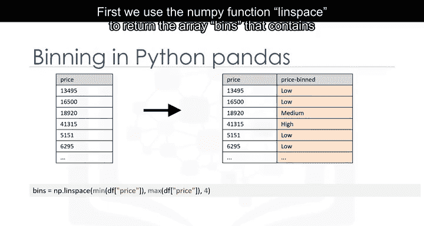

```python
import pandas as pd
df['price-binned'] = pd.cut(df['price'], bins, labels=group_names, include_lowest=True)
```

---

## 可视化分箱后的数据分布 📈

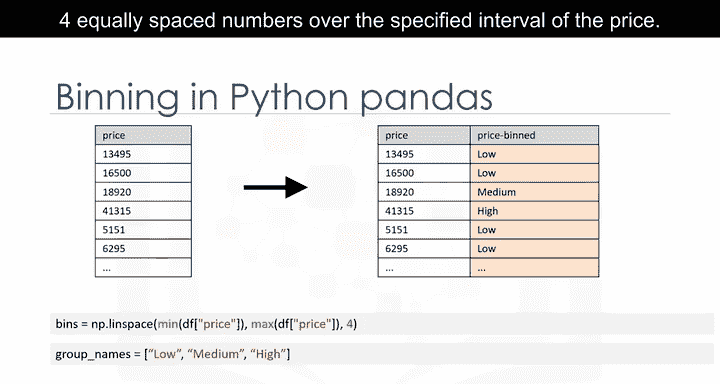

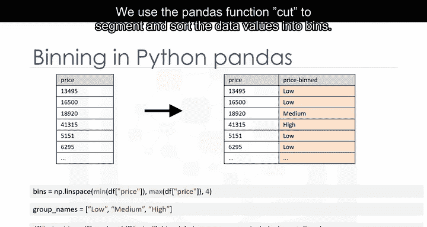

分箱完成后，你可以使用直方图来可视化数据在分箱后的分布情况。

以下是我们根据价格特征应用分箱后绘制的直方图。从图中可以清楚地看出，大多数汽车属于低价区间，只有很少的汽车属于高价区间。

```python
import matplotlib.pyplot as plt
plt.hist(df['price-binned'], bins=3)
plt.xlabel('Price Group')
plt.ylabel('Count')
plt.title('Price Bins')
plt.show()
```

---

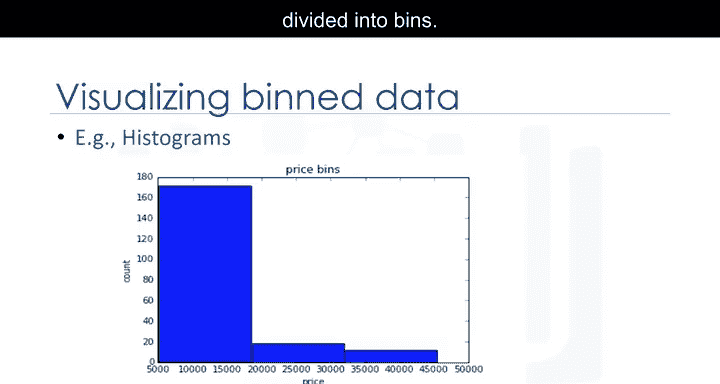

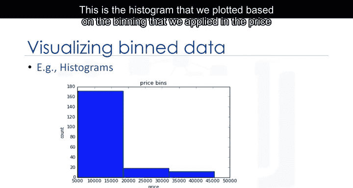

## 总结 🎯

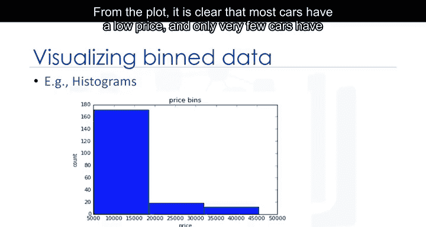

本节课我们一起学习了数据分箱的概念及其在数据预处理中的应用。我们通过一个汽车价格的示例，演示了如何在Python中使用等宽分箱方法，并通过直方图可视化了分箱后的数据分布。掌握数据分箱技术，有助于你更好地理解和处理数值型数据。