# 020：Python分类变量量化 📊


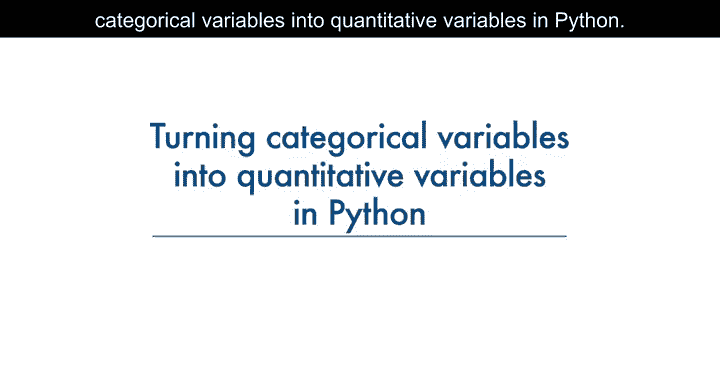

在本节课中，我们将学习如何将分类变量（Categorical Variables）转换为定量变量（Quantitative Variables）。这是数据预处理中的一个关键步骤，因为大多数统计模型和机器学习算法只能处理数值型数据。

## 概述


许多统计模型无法直接处理对象或字符串格式的输入，它们只接受数字作为输入。因此，我们需要将数据集中的分类变量（例如“汽油”或“柴油”）转换为数值格式，以便进行进一步的分析和模型训练。

## 为什么需要量化分类变量？


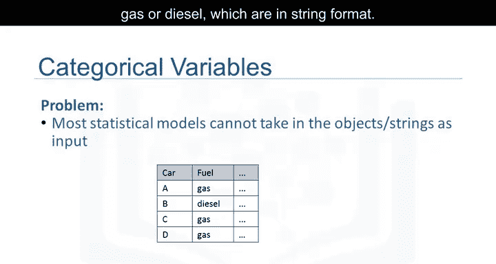


在汽车数据集中，“燃料类型”（fuel type）是一个分类变量，它有两个取值：“汽油”（Gas）和“柴油”（Diesel），这两个值都是字符串格式。为了进行后续分析，我们必须将这些变量转换为某种数值格式。

## 独热编码（One-Hot Encoding）方法

上一节我们了解了转换的必要性，本节中我们来看看最常用的转换方法：**独热编码**。

其原理是：为原始特征中每一个唯一的元素创建一个新的二进制特征（0或1）。以“燃料类型”特征为例，它有两个唯一值：“汽油”和“柴油”。因此，我们创建两个新特征：`gas` 和 `diesel`。

当某个值在原始特征中出现时，我们就在对应的新特征中将其值设为1，其他新特征则设为0。

以下是具体示例：


*   对于汽车B，其燃料值为“柴油”。因此，我们将 `diesel` 特征设为1，`gas` 特征设为0。
*   对于汽车D，其燃料值为“汽油”。因此，我们将 `gas` 特征设为1，`diesel` 特征设为0。

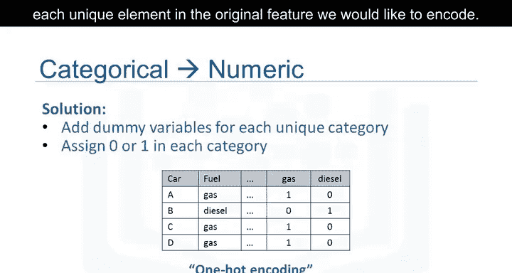


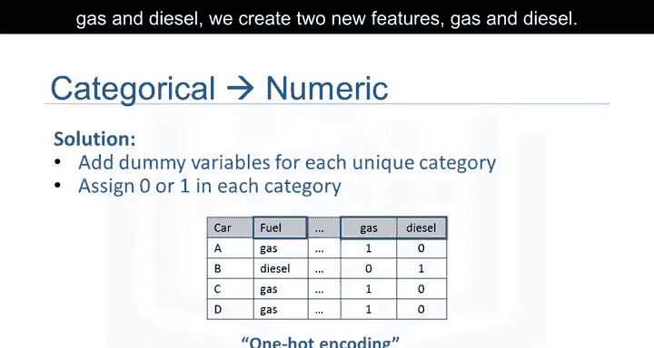

在Pandas库中，我们可以使用 `get_dummies()` 方法轻松实现分类变量到虚拟变量（Dummy Variables）的转换。


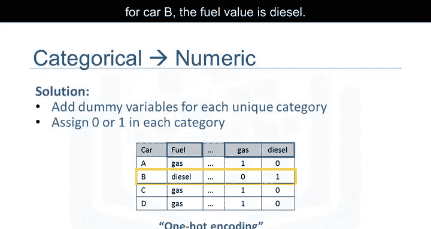

## 在Python中使用Pandas实现

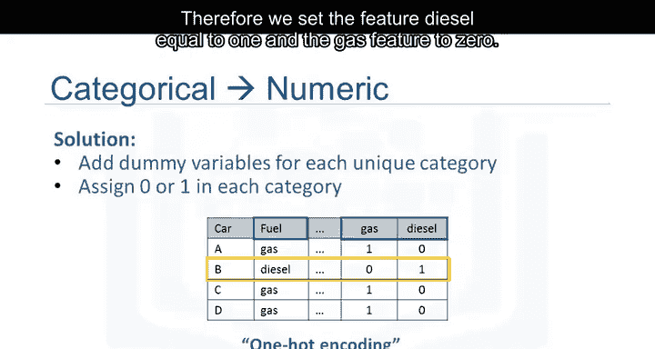


了解了独热编码的原理后，现在让我们看看如何在Python中具体操作。


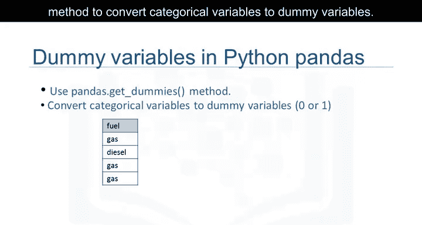

在Python中，使用Pandas转换分类变量非常简单。参考以下示例代码：

```python
dummy_variable_1 = pd.get_dummies(df["fuel-type"])
```

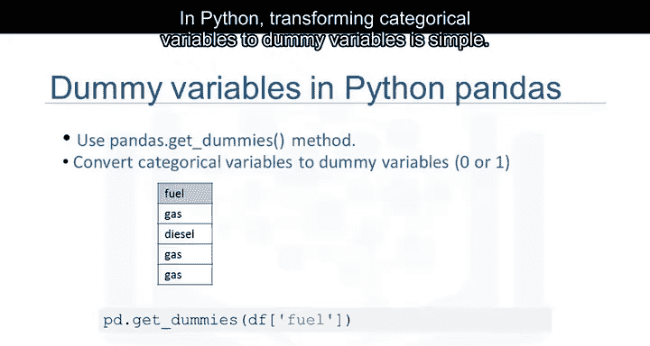

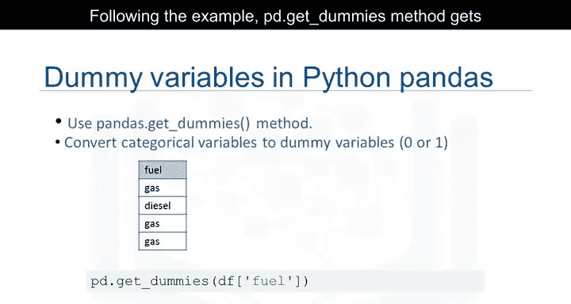

`get_dummies()` 方法会自动为变量的每个特定类别生成一个由0和1组成的列表（即新特征）。

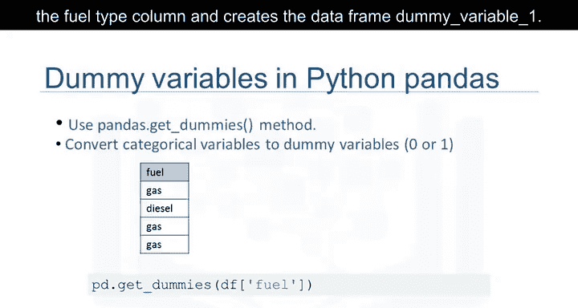

## 总结

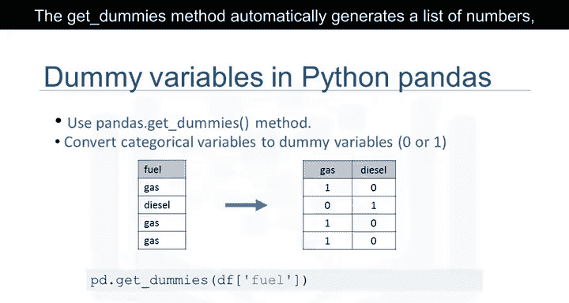


本节课中，我们一起学习了数据预处理中的一个重要技巧：将分类变量量化为数值变量。我们重点介绍了**独热编码**的原理，并演示了如何使用Pandas的 `get_dummies()` 方法在Python中轻松实现这一转换。掌握这个方法，能为后续的数据分析和机器学习模型训练打下坚实的基础。