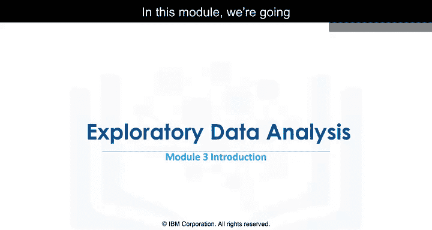
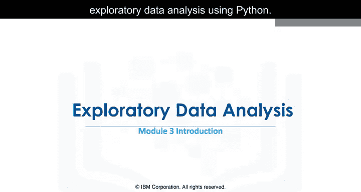
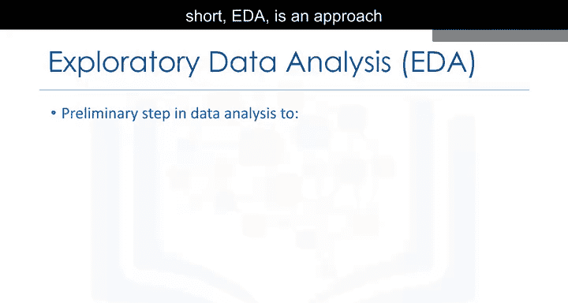
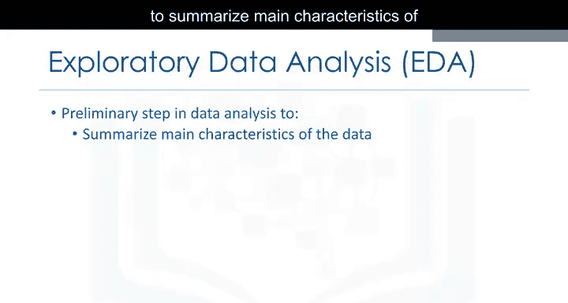
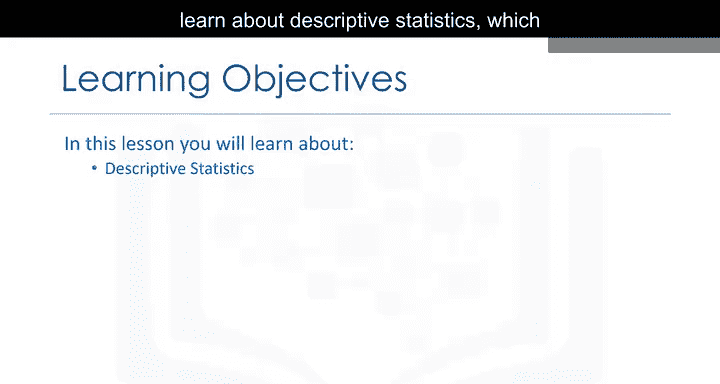
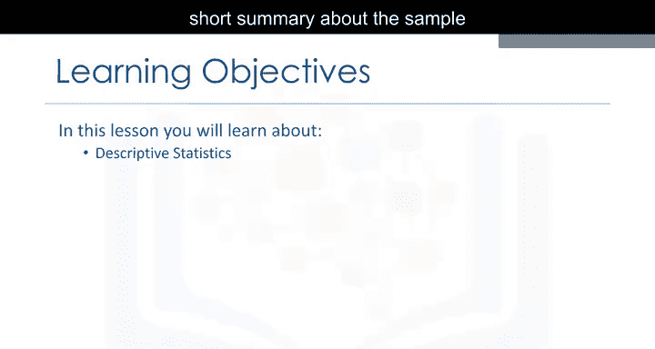
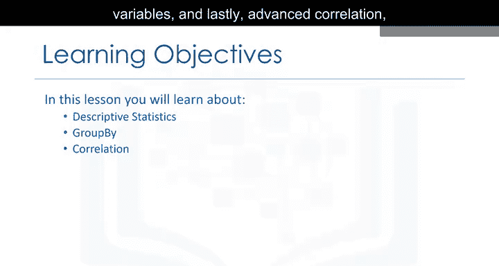
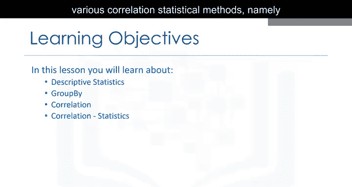
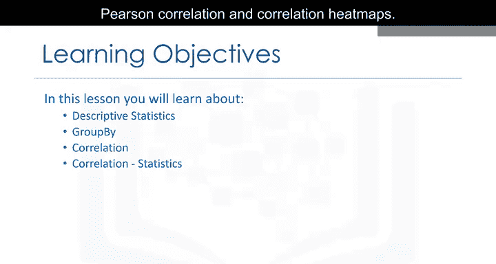

# 021：探索性数据分析

在本节课中，我们将学习如何使用Python进行探索性数据分析的基础知识。探索性数据分析是理解数据集、发现变量间关系以及识别关键特征的重要步骤。

---



## 🎯 什么是探索性数据分析？



探索性数据分析，简称EDA，是一种分析数据的方法，旨在总结数据的主要特征，更好地理解数据集，揭示不同变量之间的关系，并提取对我们试图解决的问题至关重要的变量。

在本模块中，我们试图回答的主要问题是：**哪些特征对汽车价格的影响最大？** 为了回答这个问题，我们将介绍几种有用的探索性数据分析技术。

---

## 📈 描述性统计

上一节我们介绍了探索性数据分析的目标，本节中我们来看看描述性统计。描述性统计用于描述数据集的基本特征，获取样本的简短摘要以及数据的度量。

以下是描述性统计通常包含的内容：
*   **中心趋势度量**：如均值、中位数、众数。
*   **离散程度度量**：如标准差、方差、极差。
*   **数据分布形状**：如偏度、峰度。

在Python中，我们可以使用Pandas库的`describe()`方法快速获取数值型数据的描述性统计摘要：
```python
import pandas as pd
# 假设df是一个DataFrame
summary = df.describe()
print(summary)
```



---



## 🔍 数据分组（Group By）

了解了数据的基本统计特征后，我们来看看如何对数据进行分组。使用`group by`操作是数据分析中的基础技术，它可以帮助我们根据某个或某几个分类变量对数据进行分组，然后对每个组进行聚合计算，从而转换和深入理解数据集。

以下是`group by`操作的基本步骤：
1.  **分割（Splitting）**：根据指定键（一个或多个列）将数据分割成不同的组。
2.  **应用（Applying）**：对每个独立的数据组应用一个函数（如求和、求平均、计数等）。
3.  **合并（Combining）**：将各组的计算结果合并成一个新的数据结构。

例如，我们想按汽车品牌（`brand`）分组，并计算每个品牌的平均价格：
```python
# 按‘brand’列分组，并计算‘price’列的平均值
grouped_data = df.groupby(‘brand’)[‘price’].mean()
print(grouped_data)
```

---

## 📊 变量间的相关性

在通过分组深入了解了数据的子集特征后，一个核心问题是：不同变量之间是否存在关联？相关性分析正是用来衡量两个变量之间线性关系强度和方向的统计方法。

相关性系数（r）的取值范围在**-1到1之间**：
*   **r = 1**：表示完全正相关。
*   **r = -1**：表示完全负相关。
*   **r = 0**：表示没有线性相关性。

在Pandas中，我们可以使用`.corr()`方法轻松计算数据框中所有数值列之间的相关系数矩阵：
```python
# 计算DataFrame中所有数值列的相关性矩阵
correlation_matrix = df.corr()
print(correlation_matrix)
```





---

## 🔥 高级相关性分析：皮尔逊相关与热力图

上一节我们介绍了基本的相关系数计算，本节中我们来看看更高级的相关性分析方法。我们将重点介绍**皮尔逊相关系数**，并学习如何使用**相关性热力图**来直观地展示变量间的关系。

**皮尔逊相关系数**是最常用的相关性度量，它衡量的是两个连续变量之间的线性关系。其公式为：

**r = Σ[(xi - x̄)(yi - ȳ)] / √[Σ(xi - x̄)² Σ(yi - ȳ)²]**

其中，xi和yi是单个样本点，x̄和ȳ是样本均值。

为了更直观地解读庞大的相关系数矩阵，我们可以使用**热力图（Heatmap）**进行可视化。热力图使用颜色深浅来代表相关系数的大小，使得强相关和弱相关的变量对一目了然。我们可以使用Seaborn库来绘制：
```python
import seaborn as sns
import matplotlib.pyplot as plt


# 计算相关性矩阵
corr = df.corr()
# 绘制热力图
plt.figure(figsize=(10, 8))
sns.heatmap(corr, annot=True, cmap=‘coolwarm’, fmt=‘.2f’)
plt.title(‘Correlation Heatmap’)
plt.show()
```



---



## ✅ 总结



本节课中我们一起学习了探索性数据分析的核心内容。我们从理解EDA的目标出发，学习了如何使用描述性统计来概括数据特征，掌握了通过`group by`对数据进行分组和聚合的方法。接着，我们探讨了如何计算和解释变量间的相关性，并最终引入了皮尔逊相关系数和相关性热力图这两种高级工具，以更深入、更直观地揭示数据内部的关系。掌握这些技术是进行有效数据分析和构建数据驱动解决方案的关键基础。