# 022：描述性统计

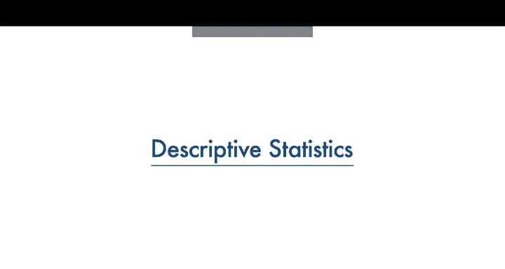

在本节课中，我们将学习描述性统计的基本概念及其在数据分析中的应用。描述性统计是数据探索的第一步，它能帮助我们快速了解数据的基本特征和分布情况。

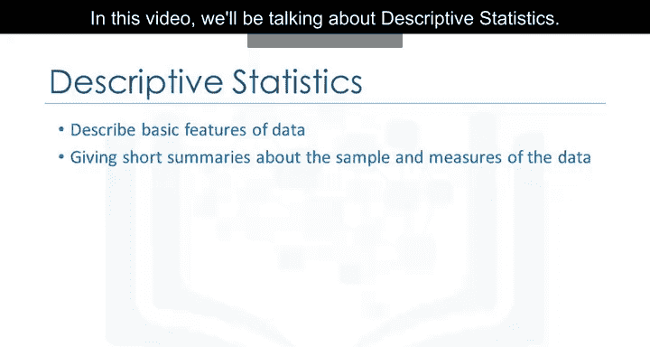

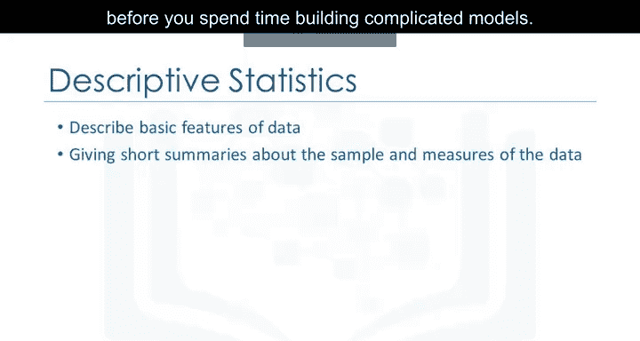

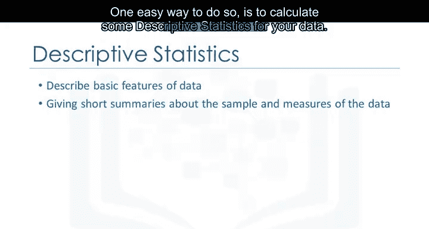

## 概述：为什么需要描述性统计？

开始分析数据之前，首先探索数据非常重要，这比直接构建复杂模型更有效。一种简单的方法是计算数据的描述性统计量。

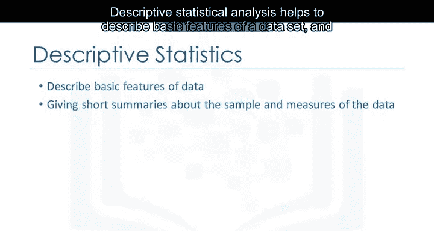

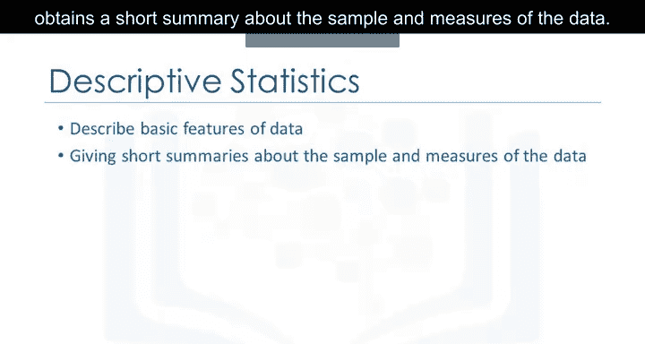

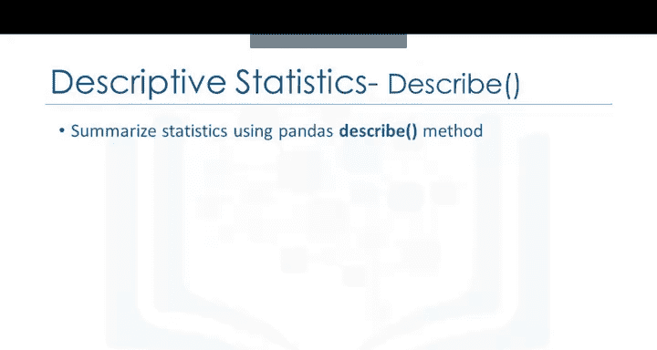

描述性统计分析有助于描述数据集的基本特征，获取样本的简要概括和数据度量。接下来，我们将介绍几种有用的方法。

## 使用Pandas的`describe`函数

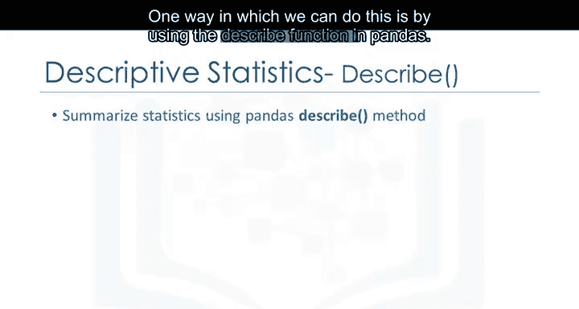

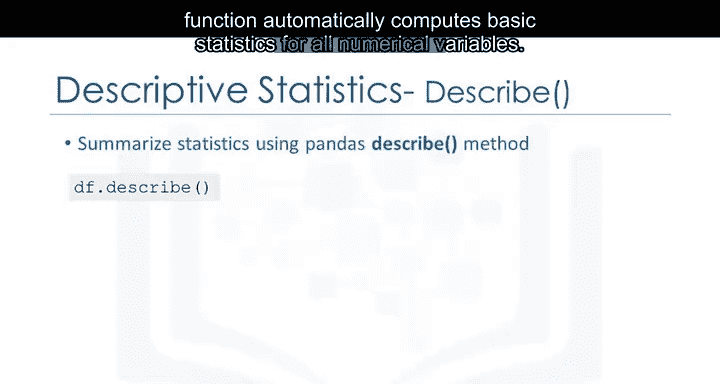

我们可以使用Pandas库中的`describe`函数来实现这一目标。将该函数应用于数据框后，它会自动计算所有数值变量的基本统计量。

以下是`describe`函数输出的关键统计指标：

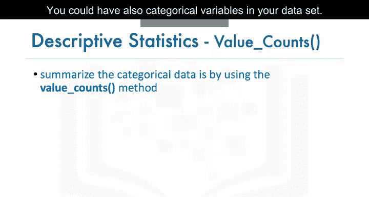

*   **均值（Mean）**：数据的平均值。
*   **数据点总数（Count）**：非空数据点的数量。
*   **标准差（Std）**：数据离散程度的度量。
*   **分位数（Quartiles）**：包括25%（下四分位数）、50%（中位数）和75%（上四分位数）。
*   **极值（Min/Max）**：数据的最小值和最大值。

在这些统计计算中，任何`NaN`（非数字）值都会被自动跳过。这个函数能让你更清楚地了解不同变量的分布情况。

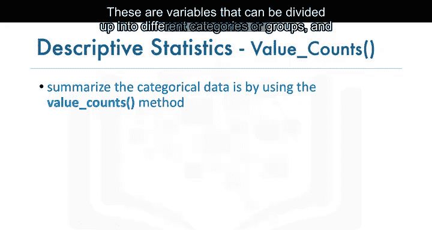

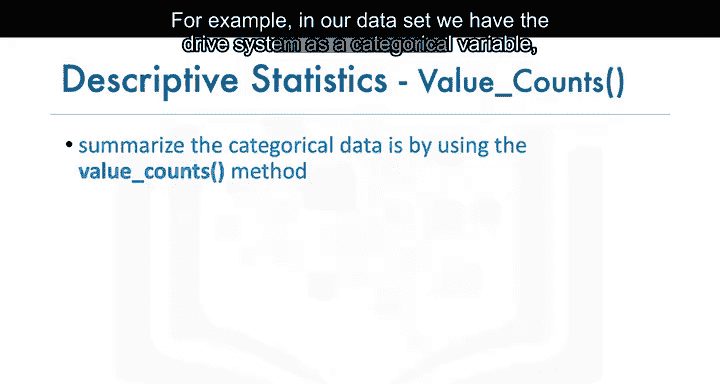

## 处理分类变量

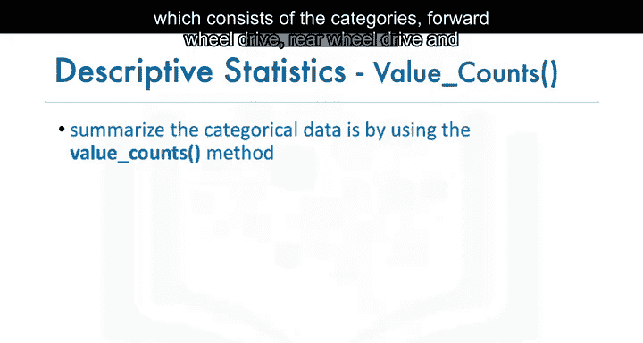

数据集中也可能包含分类变量。这些变量可以被划分为不同的类别或组，并具有离散值。

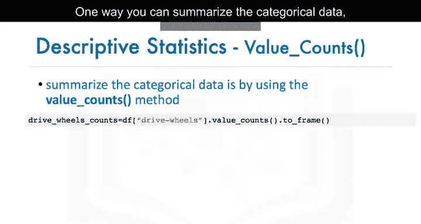

例如，在我们的数据集中，“驱动系统”（drive system）就是一个分类变量，它包含“前轮驱动”、“后轮驱动”和“四轮驱动”等类别。

以下是汇总分类数据的方法：

一种汇总分类数据的方法是使用`value_counts`函数。我们可以更改列名以便于阅读。

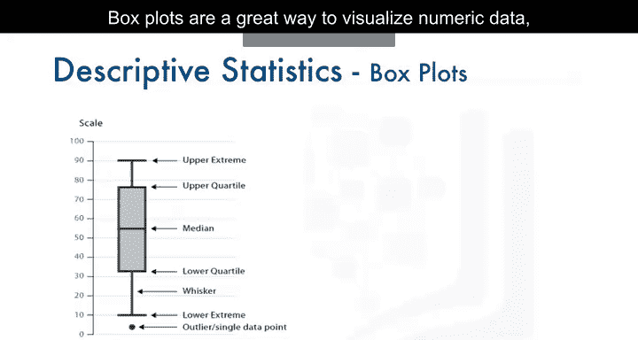

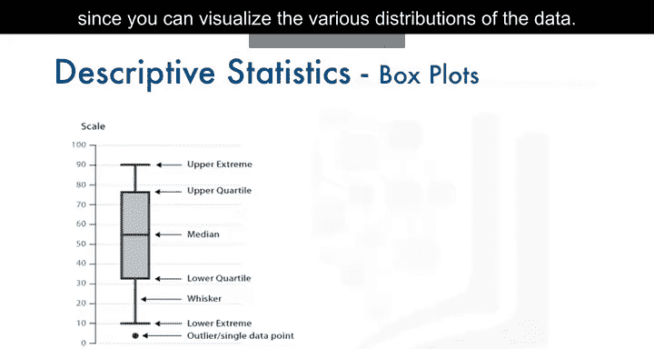

执行后，我们看到：
*   前轮驱动类别有118辆车。
*   后轮驱动类别有75辆车。
*   四轮驱动类别有8辆车。

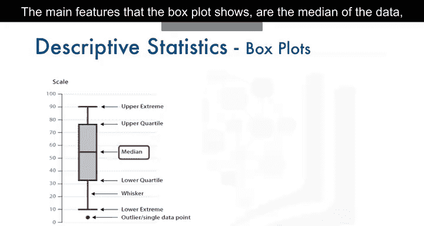

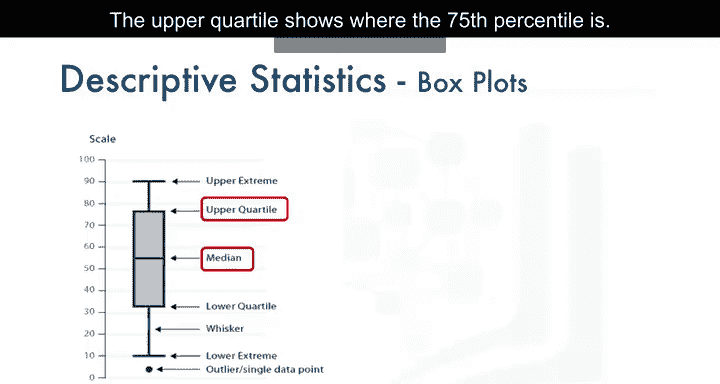

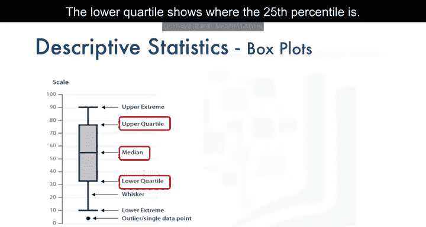

## 使用箱线图可视化数值数据

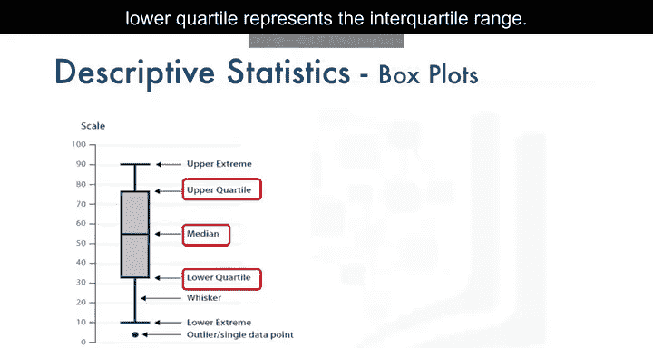

箱线图是可视化数值数据的绝佳方式，因为它可以展示数据的各种分布特征。

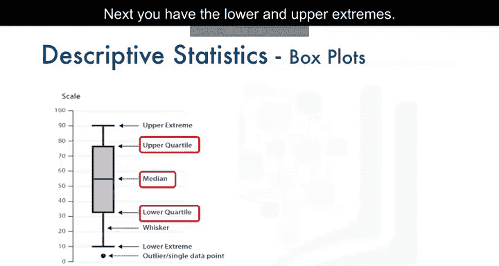

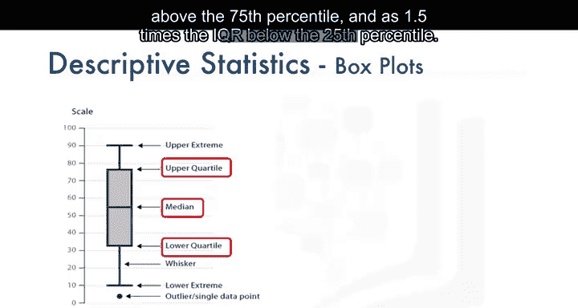

箱线图显示的主要特征包括：
*   **中位数（Median）**：表示中间数据点的位置。
*   **上四分位数（Upper Quartile）**：表示第75百分位数的位置。
*   **下四分位数（Lower Quartile）**：表示第25百分位数的位置。
*   **四分位距（Interquartile Range, IQR）**：上四分位数与下四分位数之间的数据范围。

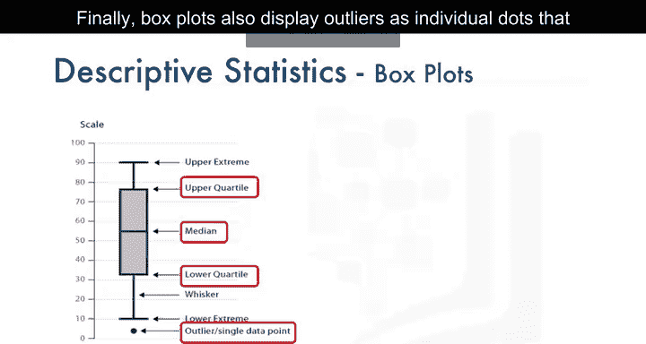

接下来是上下极端值。它们的计算方式如下：
*   **上极端值**：`上四分位数 + 1.5 * IQR`
*   **下极端值**：`下四分位数 - 1.5 * IQR`

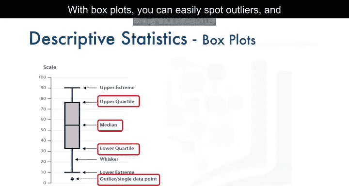

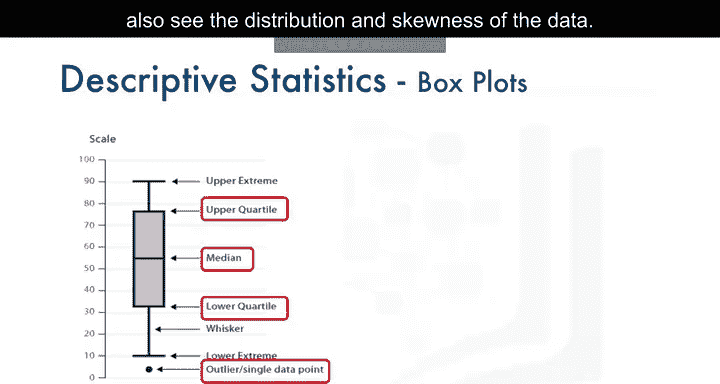

最后，箱线图还将异常值显示为出现在上下极端值之外的独立点。通过箱线图，你可以轻松识别异常值，并观察数据的分布和偏度。

## 箱线图的组间比较

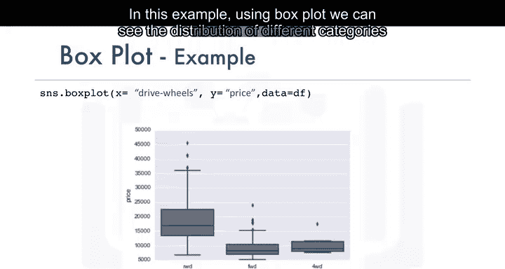

箱线图便于进行组间比较。在这个例子中，使用箱线图，我们可以看到“驱动轮”特征的不同类别在“价格”特征上的分布。

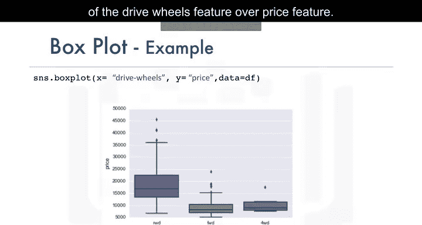

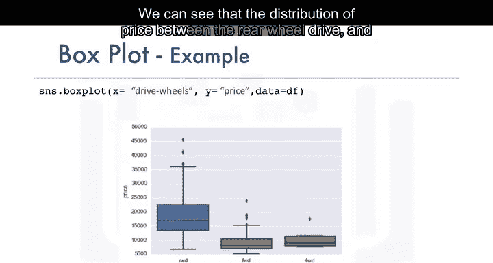

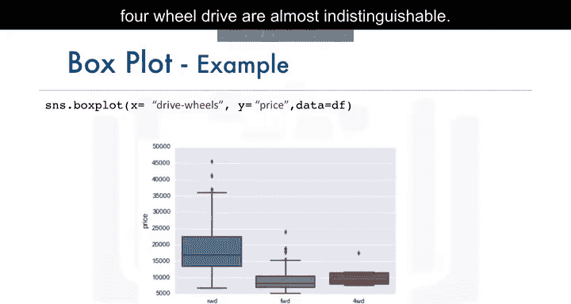

我们发现，后轮驱动与其他类别之间的价格分布有明显区别，但前轮驱动和四轮驱动的价格几乎无法区分。

## 分析连续变量与散点图

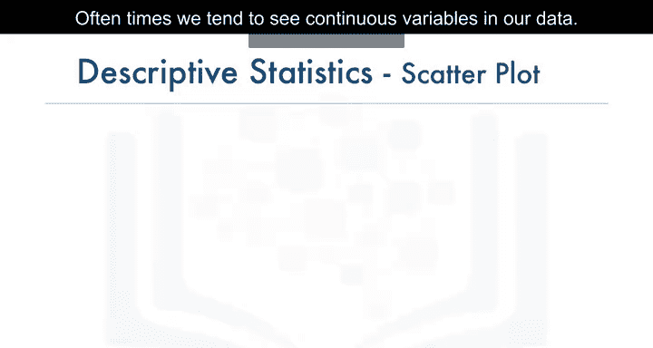

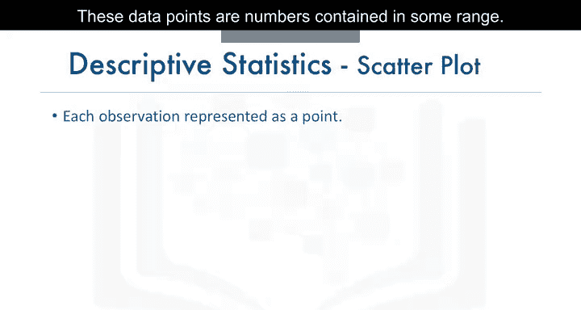

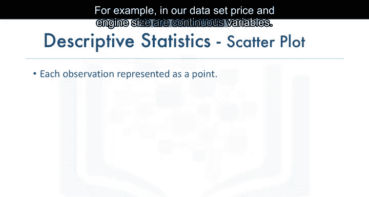

我们的数据中经常会出现连续变量。这些数据点是包含在一定范围内的数字。例如，在我们的数据集中，“价格”和“发动机排量”就是连续变量。

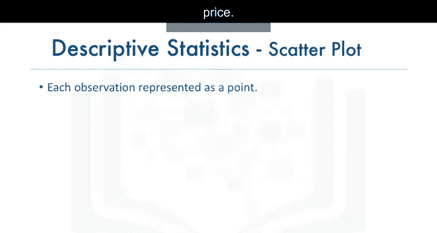

如果我们想理解发动机排量与价格之间的关系呢？发动机排量能否预测汽车的价格？

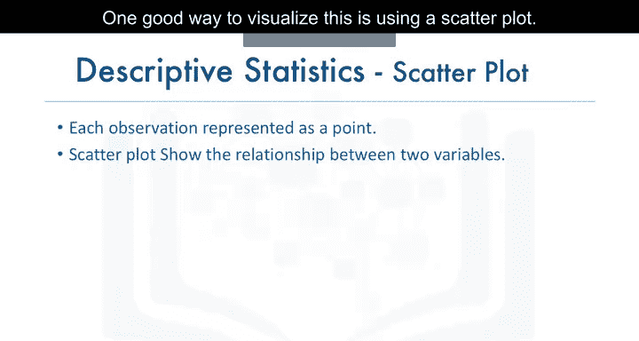

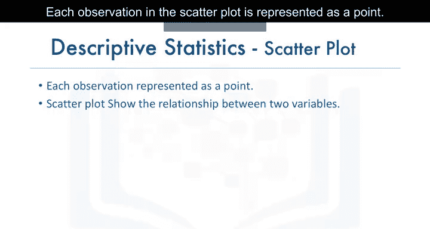

一个好的可视化方法是使用散点图。散点图中的每个观测值都表示为一个点。

这个图表展示的是两个变量之间的关系。
*   **预测变量（Predictor Variable）**：用于预测结果的变量。在本例中，我们的预测变量是发动机排量。
*   **目标变量（Target Variable）**：你试图预测的变量。在本例中，我们的目标变量是价格，因为这将是结果。

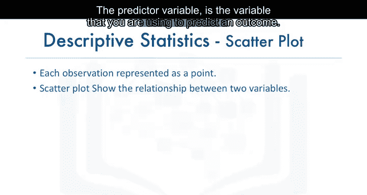

在散点图中，我们通常将预测变量设置在X轴（水平轴），将目标变量设置在Y轴（垂直轴）。因此，在本例中，我们将发动机排量绘制在X轴，将价格绘制在Y轴。

我们在这里使用了Matplotlib库的`scatter`函数，传入X和Y变量。需要注意的是，始终标记坐标轴并编写图表总标题非常重要，这样你才能清楚自己在观察什么。

那么，变量“发动机排量”与“价格”的关系如何？从散点图中我们看到，随着发动机排量上升，汽车价格也上升。

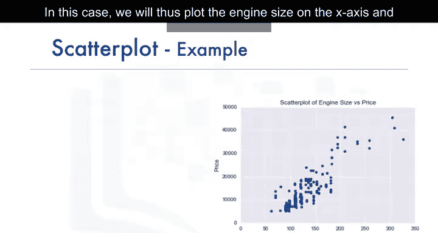

这初步表明这两个变量之间存在正向的线性关系。

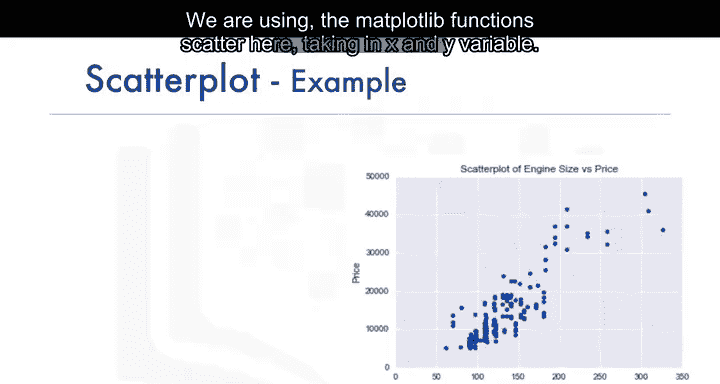

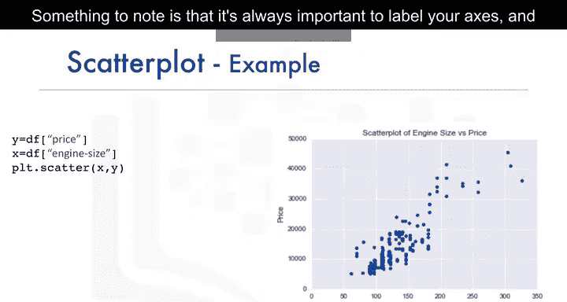

## 总结

本节课我们一起学习了描述性统计的核心概念。我们介绍了如何使用Pandas的`describe`函数快速获取数值数据的统计摘要，以及如何使用`value_counts`处理分类数据。我们还深入探讨了箱线图的构成及其在识别异常值、比较组间差异方面的强大功能。最后，我们学习了如何使用散点图来可视化并初步判断两个连续变量（如发动机排量与价格）之间的关系。掌握这些基础的数据探索技巧，是进行更深入数据分析的关键第一步。