# 023：Python分组操作 📊


在本节课中，我们将要学习如何使用Pandas库进行数据分组操作。分组是数据分析中的一项核心技能，它允许我们根据数据的类别将数据集划分为多个子集，进而对每个子集进行独立的分析和计算。通过分组，我们可以更深入地理解数据中的模式和关系。


## 概述


假设我们想要了解不同类型的驱动系统（前驱、后驱和四驱）与车辆价格之间是否存在任何关系。如果存在关系，哪种驱动系统能为车辆增加最多的价值？为了回答这些问题，我们需要将数据按照驱动系统的类型进行分组，并比较不同组别之间的结果。


在Pandas中，这可以通过使用 `groupby` 方法来实现。


## 分组基础

`groupby` 方法用于处理分类变量。它将数据根据该变量的不同类别划分为多个子集。你可以根据单个变量进行分组，也可以通过传入多个变量名来根据多个变量进行分组。


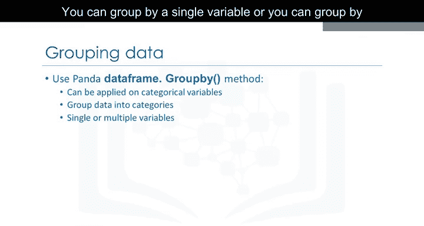

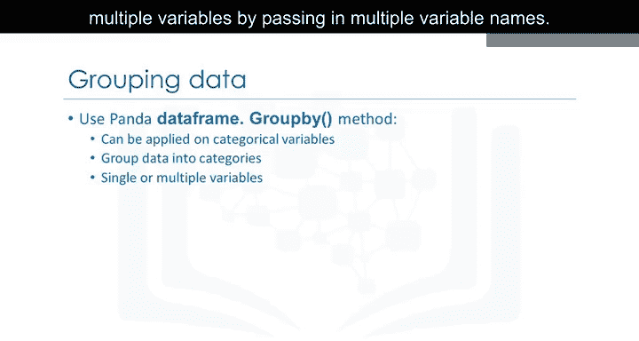

例如，我们想要找出车辆的平均价格，并观察它们在不同车身样式和驱动系统类型之间的差异。以下是实现这一目标的步骤。

首先，我们选取我们感兴趣的三个数据列，这通过代码的第一行完成。


```python
# 选取感兴趣的列
data_subset = df[['drive-wheels', 'body-style', 'price']]
```

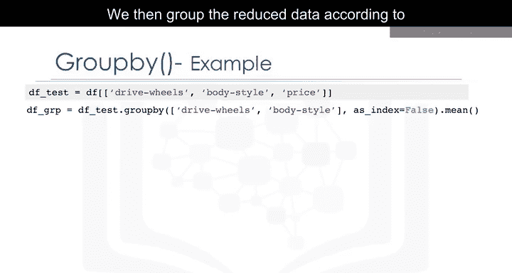

接着，我们根据驱动系统和车身样式对筛选后的数据进行分组，这通过代码的第二行完成。

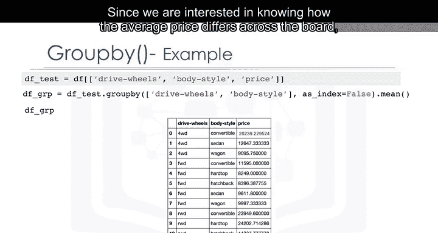

```python
# 根据驱动系统和车身样式分组，并计算平均价格
grouped_data = data_subset.groupby(['drive-wheels', 'body-style']).mean()
```

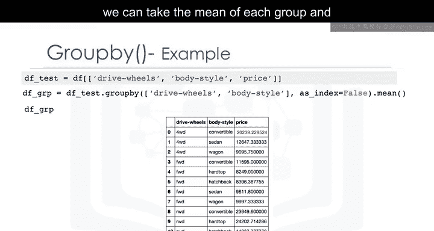

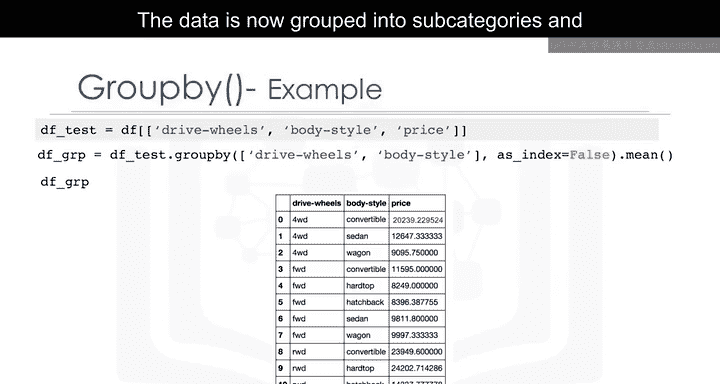

由于我们关注的是平均价格在不同类别间的差异，我们可以在行末添加 `.mean()` 来计算每个组的平均值。

现在，数据被分组到各个子类别中，并且只显示每个子类别的平均价格。

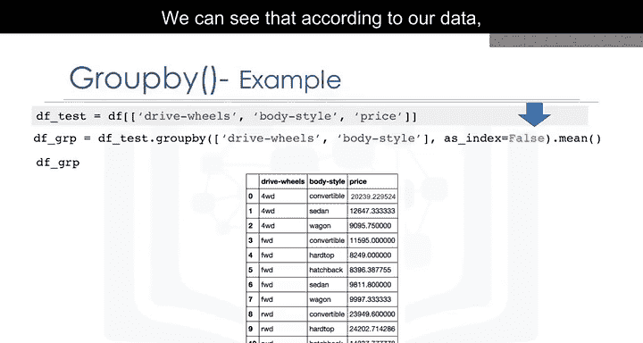


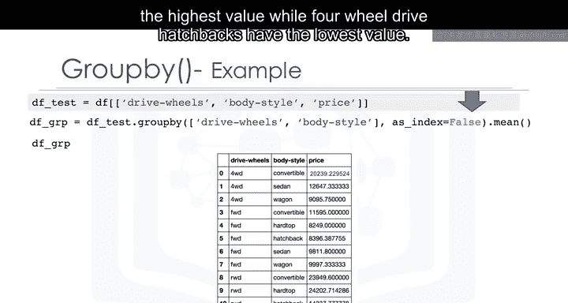

根据我们的数据，我们可以看到后轮驱动的敞篷车和后轮驱动的硬顶车具有最高的价值，而四轮驱动的掀背车价值最低。

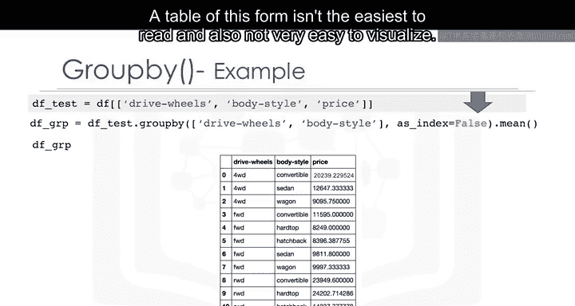

## 数据透视表

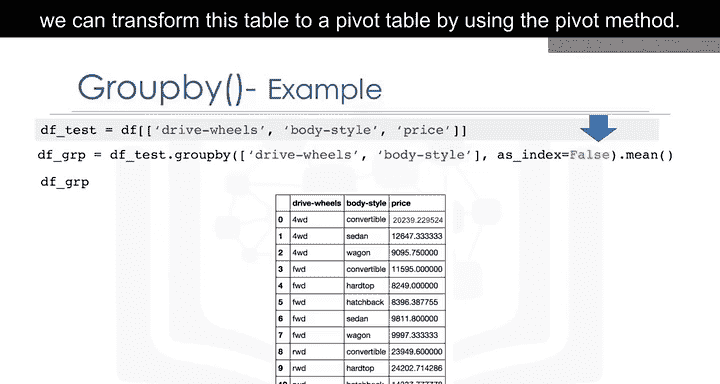

这种形式的表格并不容易阅读，也不易于可视化。为了更容易理解，我们可以使用 `pivot` 方法将这个表格转换为数据透视表。

在上一个表格中，驱动系统和车身样式都列在列中。数据透视表将一个变量显示在列上，另一个变量显示在行上。只需一行代码，并使用Pandas的 `pivot` 方法，我们就可以将车身样式变量旋转到列上，而驱动系统则显示在行上。

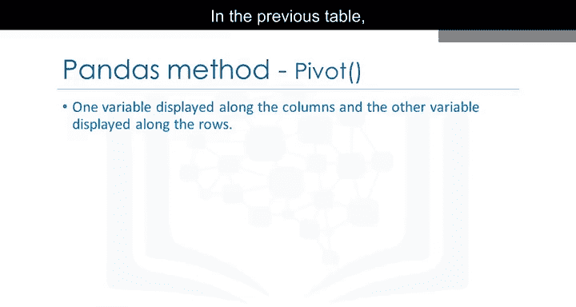

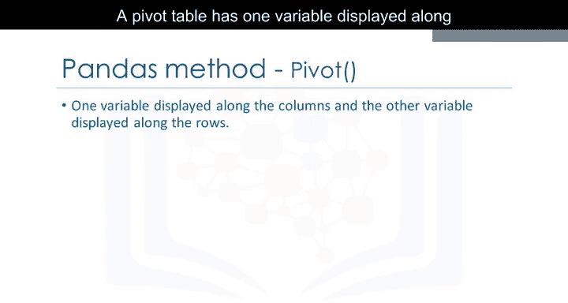

```python
# 将分组数据转换为数据透视表
pivot_table = grouped_data.pivot(index='drive-wheels', columns='body-style')
```

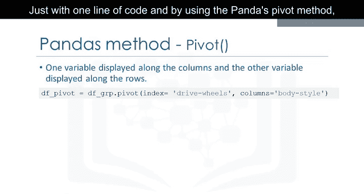

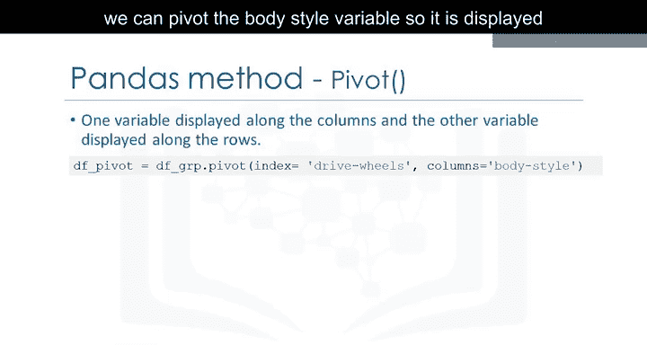

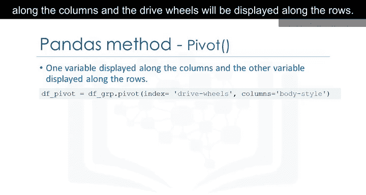

价格数据现在变成了一个矩形网格，更容易进行可视化。这类似于通常在Excel电子表格中完成的操作。

## 热力图

表示数据透视表的另一种方法是使用热力图。热力图接收一个矩形数据网格，并根据网格点上的数据值分配颜色强度。这是一种在多个变量上绘制目标变量的绝佳方式，通过这种方式，我们可以获得这些变量与目标变量之间关系的视觉线索。


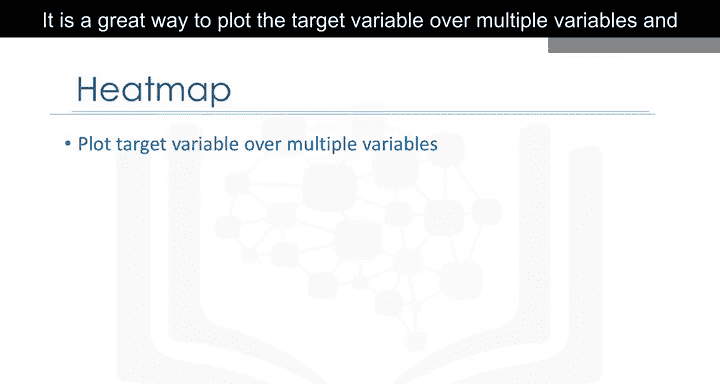

在这个例子中，我们使用Matplotlib的 `pcolor` 方法来绘制热力图，并将之前的数据透视表转换为图形形式。

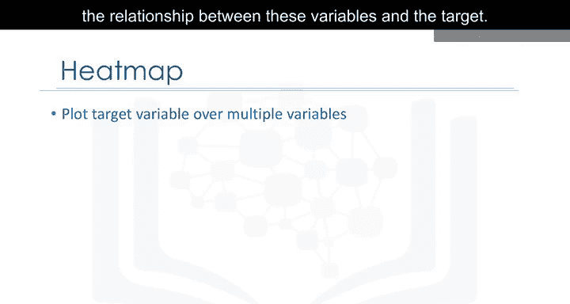

```python
import matplotlib.pyplot as plt

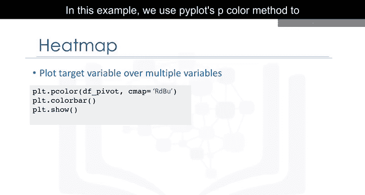

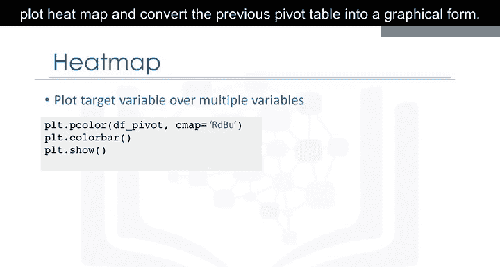

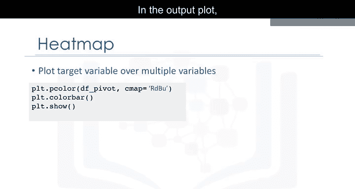

# 绘制热力图
plt.pcolor(pivot_table, cmap='RdBu')
plt.colorbar()
plt.show()
```

我们指定了红蓝配色方案。在输出图中，每种车身样式类型沿X轴编号，每种驱动系统类型沿Y轴编号。平均价格根据其值以不同的颜色绘制。根据颜色条，我们看到热力图的上半部分似乎有更高的价格，而下半部分价格较低。

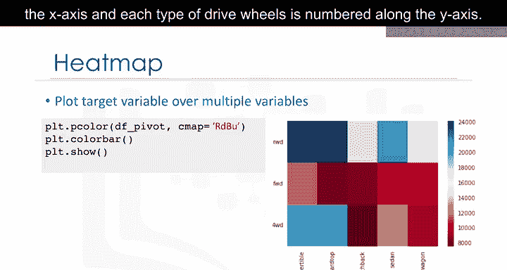

## 总结

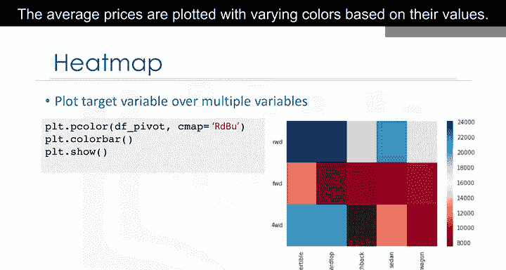

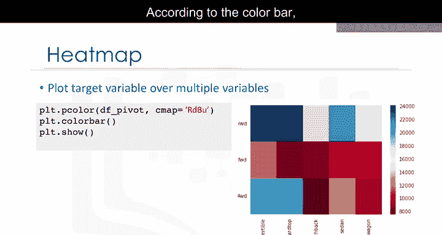

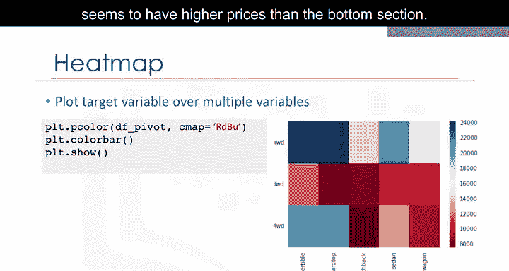

在本节课中，我们一起学习了如何使用Pandas进行数据分组操作。我们首先介绍了 `groupby` 方法的基本概念，它允许我们根据分类变量将数据分成子集。接着，我们通过一个具体示例，展示了如何根据多个变量分组并计算平均值。然后，我们探讨了如何将分组结果转换为更易读的数据透视表，并最终使用热力图进行可视化，以直观地展示变量之间的关系。这些技能对于深入分析和理解复杂数据集至关重要。